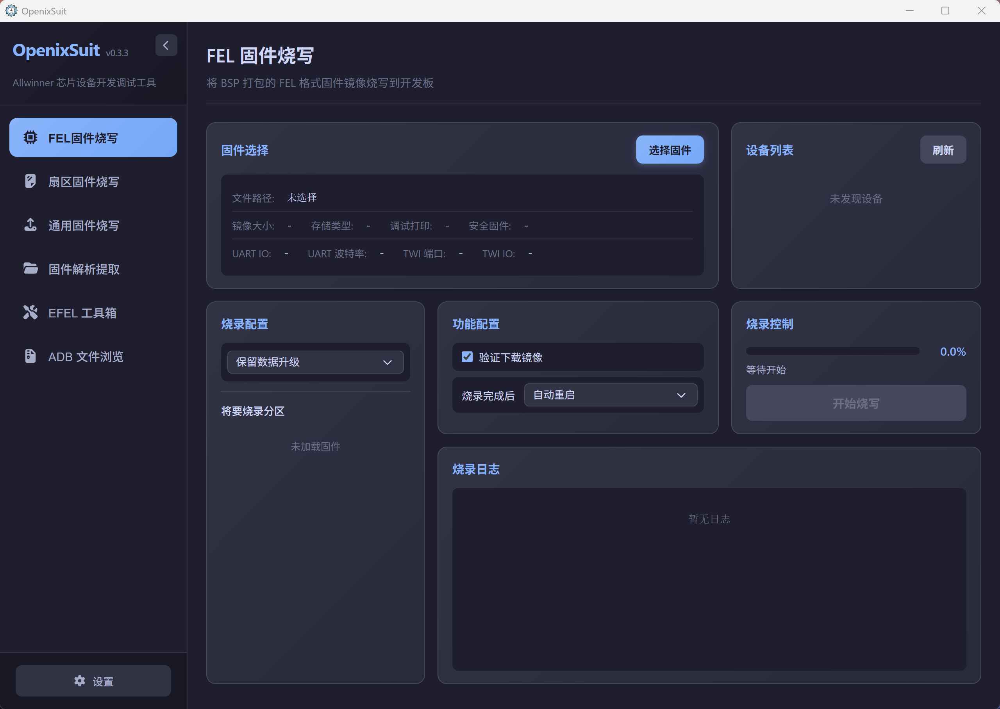
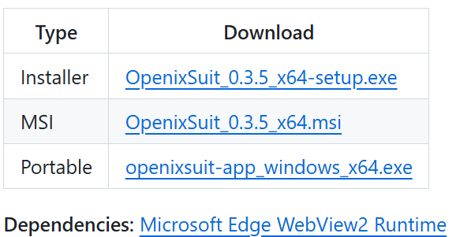
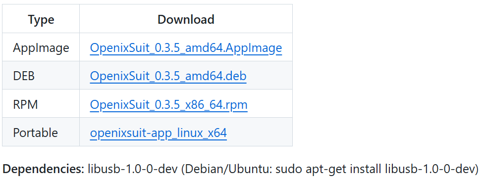
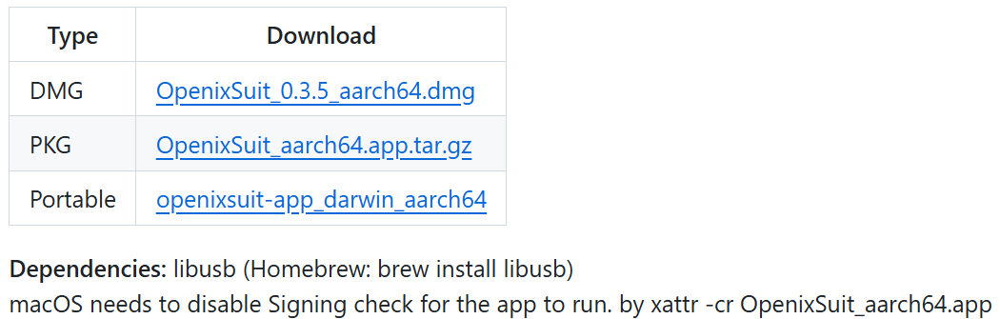
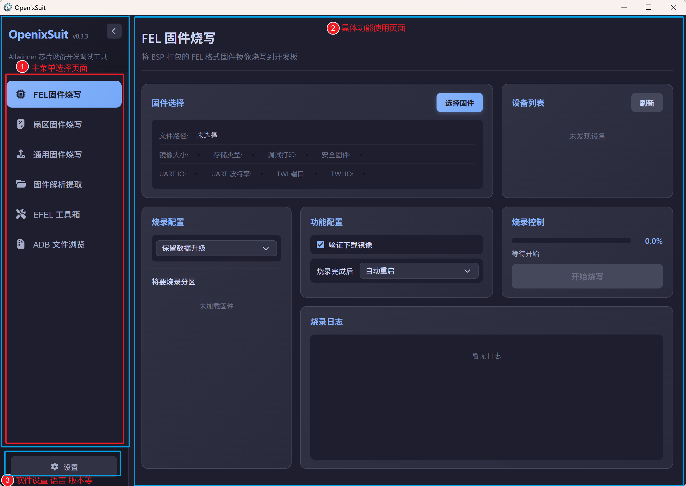

# OpenixSuit全志开源烧写工具
## 软件介绍
OpenixSuit是一款开源支持全志系列芯片的系统固件烧写工具，集成 全志Tina系统固件烧写，指定扇区位置烧写，社区版本通用固件烧写，固件解析解包，EFEL裸机程序测试运行，ADB文件浏览。

目前测试D1 T113 T153 T527 A133 A537 等都没问题。其他全志系列芯片需要自行测试研究。

## 获取工具

参考如下软件下载链接，获取你的电脑系统对应的软件安装包。

- 官方仓库地址： https://github.com/YuzukiTsuru/OpenixSuit/releases
- 百问网镜像地址：https://dl.100ask.net/Tools/OpenixSuit/

| Windows                                                      | Linux                                                        | macOS (Apple Silicon)                                        |
| ------------------------------------------------------------ | ------------------------------------------------------------ | ------------------------------------------------------------ |
|  |  |  |

## 工具介绍

### 

### 

### 

## 烧写系统

### FEL固件烧写

### 通用固件烧写

## 高级用法

### 扇区固件烧写

### EFEL工具箱

## 更多玩法

###  固件解析提取

### ADB文件浏览

## 扩展更新

### 语言设置

### 版本更新

