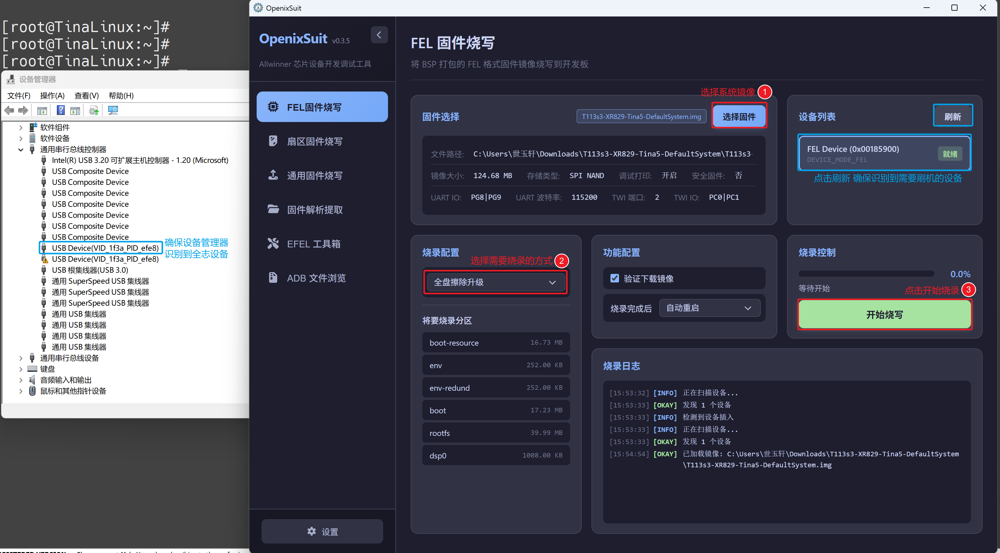
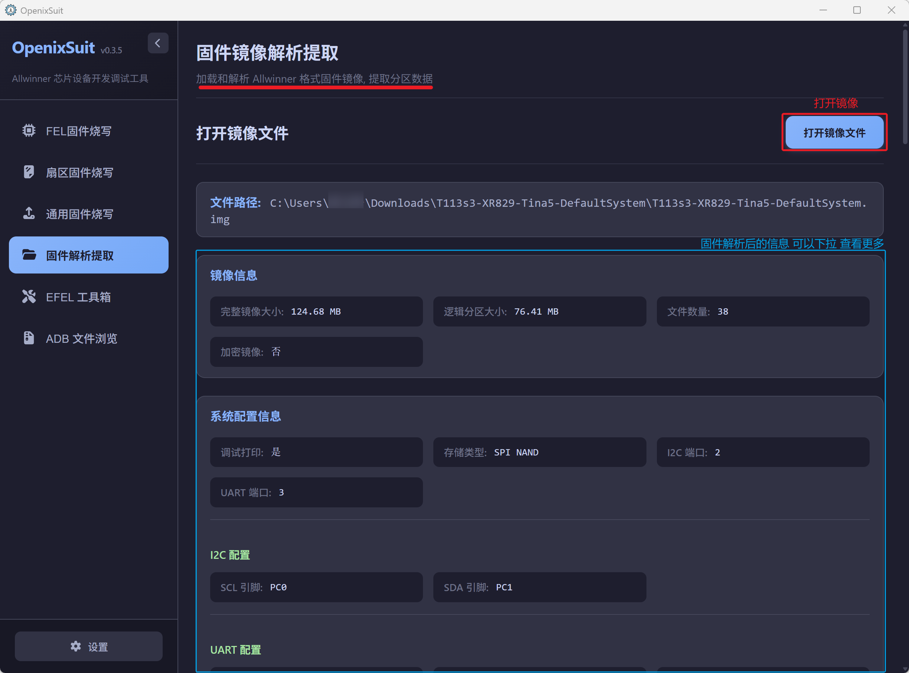
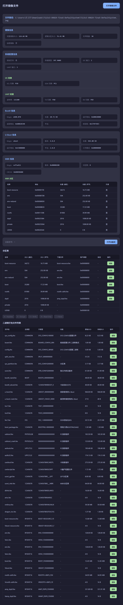
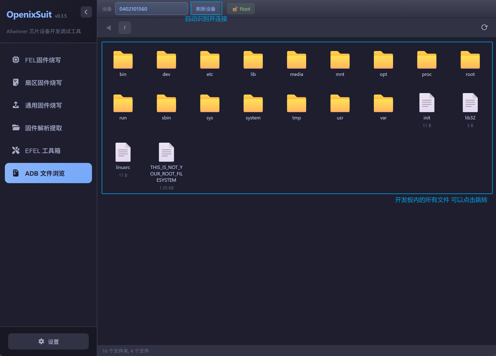
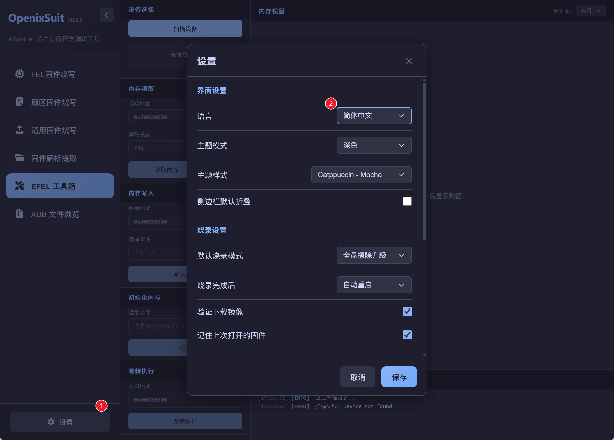
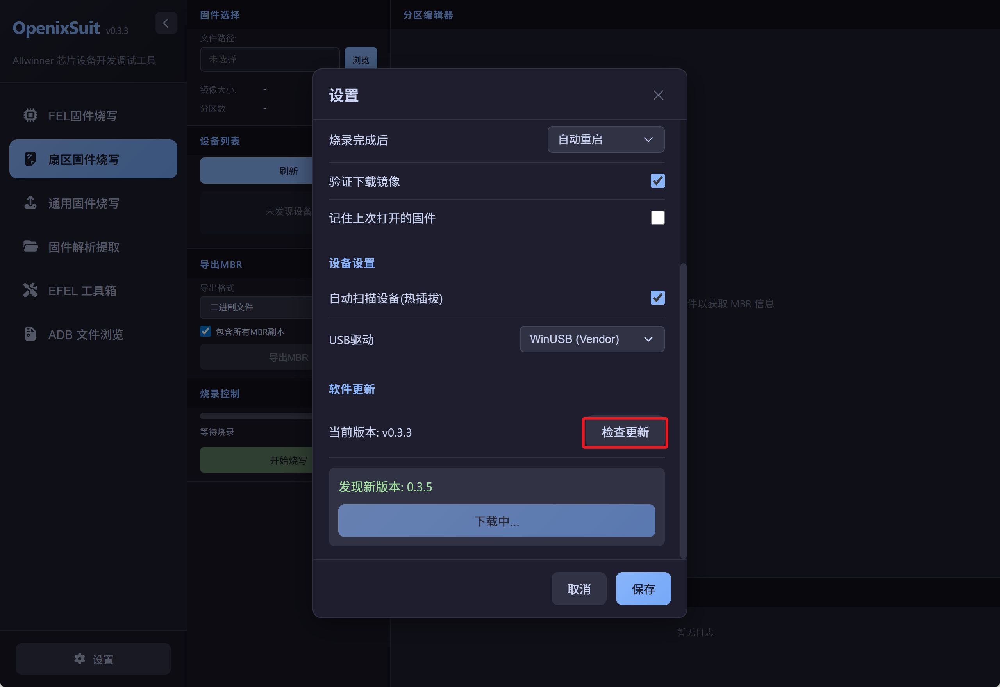

# OpenixSuit全志开源烧写工具
## 软件介绍
OpenixSuit是一款开源支持全志系列芯片的系统固件烧写工具，集成 全志Tina系统固件烧写，指定扇区位置烧写，社区版本通用固件烧写，固件解析解包，EFEL裸机程序测试运行，ADB文件浏览。

目前测试D1 T113 T153 T527 A133 A537 等都没问题。其他全志系列芯片需要自行测试研究。

## 获取工具

参考如下软件下载链接，获取你的电脑系统对应的软件安装包。

- 官方仓库地址： https://github.com/YuzukiTsuru/OpenixSuit/releases
- 百问网镜像地址：https://dl.100ask.net/Tools/OpenixSuit/

| Windows                                                      | Linux                                                        | macOS (Apple Silicon)                                        |
| ------------------------------------------------------------ | ------------------------------------------------------------ | ------------------------------------------------------------ |
|  |  |  |

## 工具介绍

## 烧写系统

### FEL固件烧写

FEL固件主要是指全志Tina系统编译出来的固件镜像，比如Tina4 Tina5 longan 等全志原厂SDK 生成的镜像，原用 PhoenixSuit 所烧写的镜像文件。

如下图所示，烧写T113s3系统，参考如下步骤，但是需要确保你的电脑已经安装过全志的USB烧录驱动，安装驱动方式请参考网页：https://dshanpi.100ask.org/docs/T113s4-SdNand/part1/03-1_FlashSystem 。

- 支持的硬件

| 芯片名称 | 镜像名称 | 镜像描述 |
| -------- | -------- | -------- |
| T113s3   |          |          |
|          |          |          |

### 通用固件烧写

通用固件指的是使用 社区主线Linux内核 编译出来的系统，一般有armbian ubuntu  openwrt等,这里以 Avaota-A1 T527为例演示如何配置烧录。

## 高级用法

### 扇区固件烧写

### EFEL工具箱

## 更多玩法

###  固件解析提取

### ADB文件浏览

## 扩展更新

### 语言设置

支持中英文 两种语言

### 版本更新

