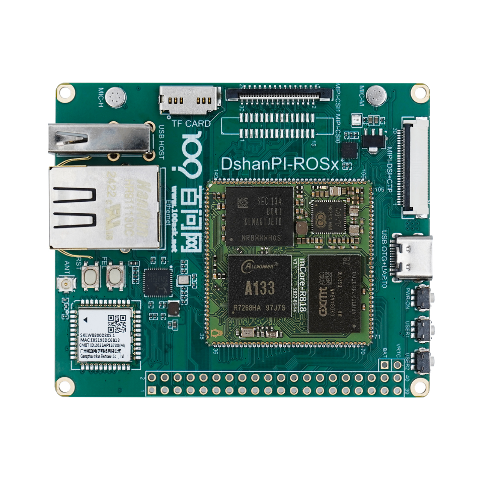
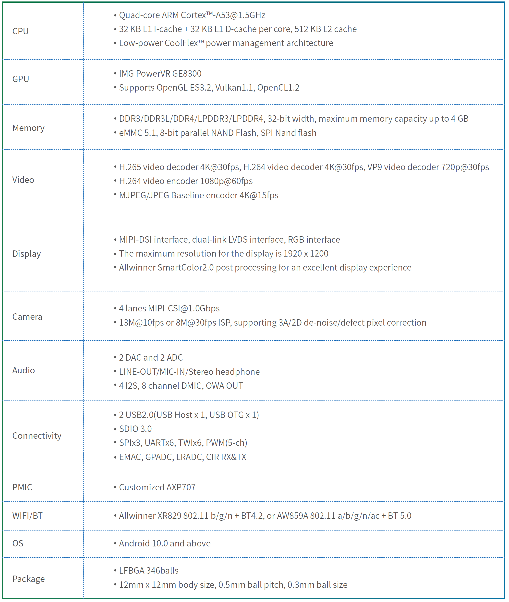
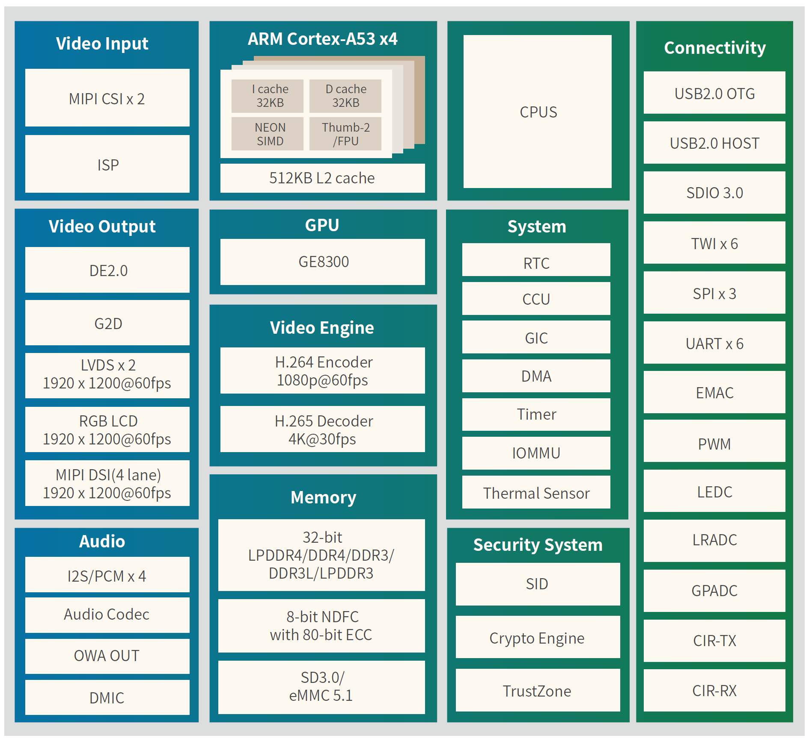
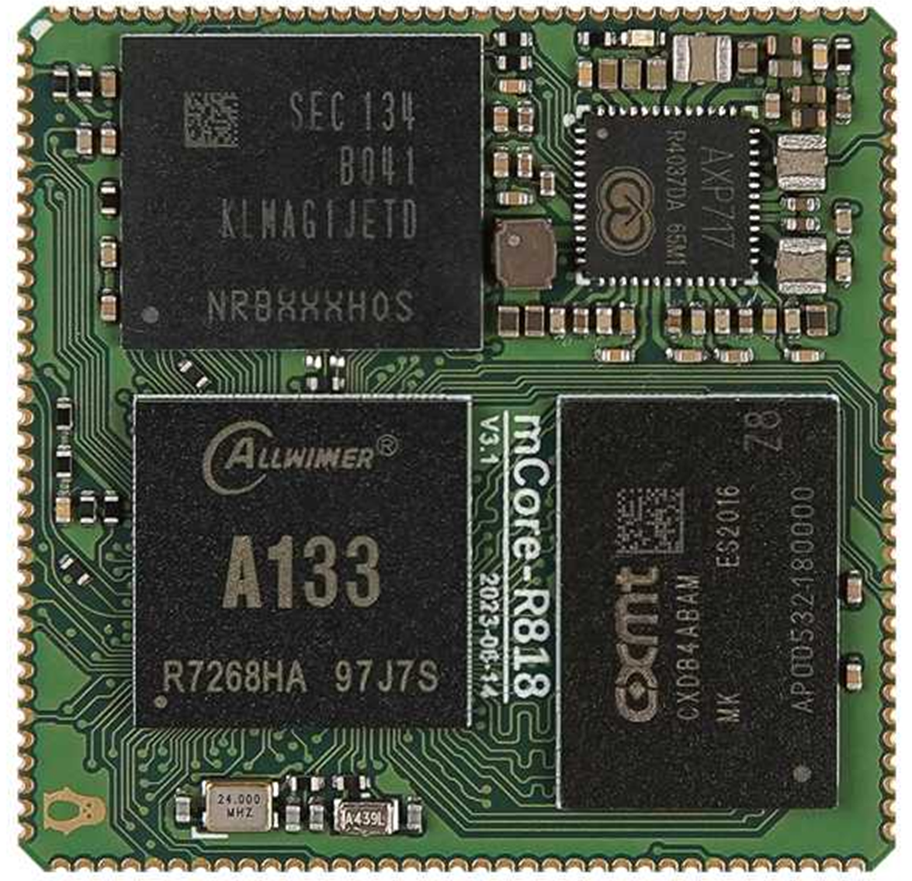

# A133-mCore板

* 此开发板的任何问题都可以在我们的论坛交流讨论 https://forums.100ask.net/c/aw/15 

## 硬件简述

- A133系列芯片集成了4核Arm***\*®\**** Cortex***\*®\****-A53 CPU和Imagination PowerVR GE8300 GPU，具有强大的硬件编解码能力和丰富的屏幕接口，支持USB、SDIO、TWI、SPI、UART、EMAC、PWM、LEDC、LRADC、GPADC、IR等常用接口。芯片广泛应用于平板和泛平板（带屏类平板延伸产品）产品形态。支持最高4K@30fps解码和1080P@60fps编码，支持MIPI、LVDS、RGB等多种屏幕接口。

- 板载 千兆RJ45网口，USB2.0接口，TYPEC+UART二合一独家设计接口，TF卡接口，WIFI6 + UART蓝牙模组支持，MIPI CSI摄像头，双MIC拾音支持，MIPI DSI + 电容触摸接口支持。

-  配套有 MIPI 显示屏，4寸 3.2寸等.摄像头配套支持OV8858。

- 软件支持TinaSDK V2.5 Tina5 SDK longanSDK Android-T（13） ，都有提供对应源码工程，对于Tina系统提供对应的开发教程。

## 芯片参数

## 核心板

提供支持1+8配置2+16配置。

## 商品链接

官方店铺地址： https://detail.tmall.com/item.htm?id=862469519329

