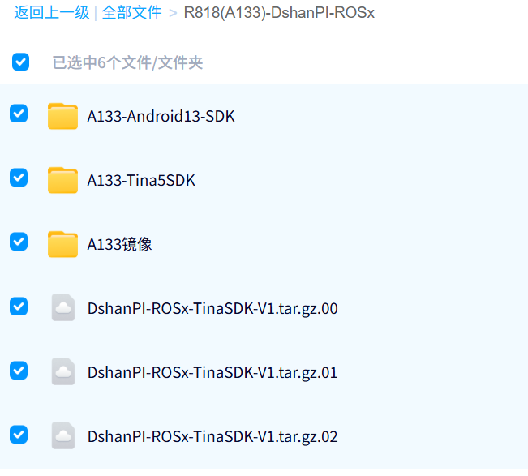

# 源码工具文档手册

## 手册文档工具

> [!NOTE]
>
> 需要注意的是：A133 和R818芯片是PinToPin的，所以资料除了部分手册，其他部分全都是一模一样的。

### 硬件文件

📙R818-DshanPI-ROSx 开发板底板原理图：

    https://dl.100ask.net/Hardware/MPU/R818-DshanPI-ROSx/DshanPI-ROSx-SCH_V1.pdf

📙R818-DshanPI-ROSx 开发板底板位号图：

    https://dl.100ask.net/Hardware/MPU/R818-DshanPI-ROSx/DshanPI-ROSx-SCH_V1-BitMAP.pdf

📙R818-DshanPI-ROSx 开发板核心板原理图：

    https://dl.100ask.net/Hardware/MPU/R818-DshanPI-ROSx/mCore-R818-V3p1-SCH-open.pdf

### 芯片手册

📙A133 芯片规格书：

    https://dl.100ask.net/Hardware/MPU/mCore-A133/A133-brief.pdf

📙A133 芯片数据手册:

    https://dl.100ask.net/Hardware/MPU/R818-DshanPI-ROSx/A133_Datasheet_V1.5.pdf

📙A133 SOC开发手册:

    https://dl.100ask.net/Hardware/MPU/R818-DshanPI-ROSx/A133_User_Manual_V1.6.pdf

📙AXP717 数据手册:

    https://dl.100ask.net/Hardware/MPU/R818-DshanPI-ROSx/AXP717_Datasheet_V1.0_en.pdf

## SDK源码

### Tina5-SDK源码

📙A133-DshanPI-ROSx 开发板扩展补丁: https://github.com/DongshanPI/A133-DshanPI-ROSx_Tina5SDK

📙A133-DshanPI-ROSx SDK网盘链接： https://pan.baidu.com/s/1bgYtl9xvubnn6Y27VBK-XQ 提取码: ss3k 

> 具体SDK源码开发环境搭建 参考后面 TinaSDK开发部分的开发环境搭建章节。

### 安卓13 SDK源码

百度网盘链接： https://pan.baidu.com/s/1bgYtl9xvubnn6Y27VBK-XQ 提取码: ss3k 

编译后的整个虚拟机，使用vmware打开，编译至少需要64G内存 16+核心，存储500G以上。

**虚拟机的默认用户名密码是ubuntu ubuntu**

**虚拟机的默认用户名密码是**ubuntu ubuntu

**虚拟机的默认用户名密码是ubuntu ubuntu**