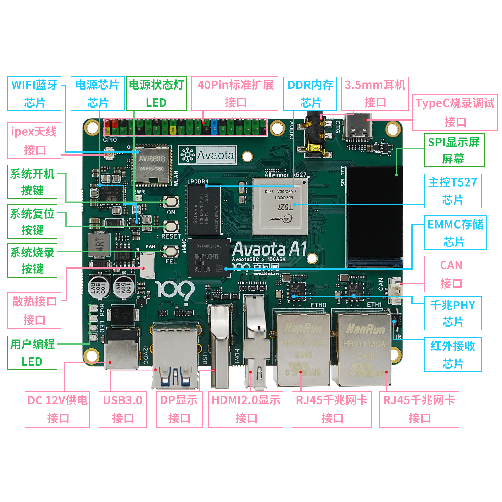
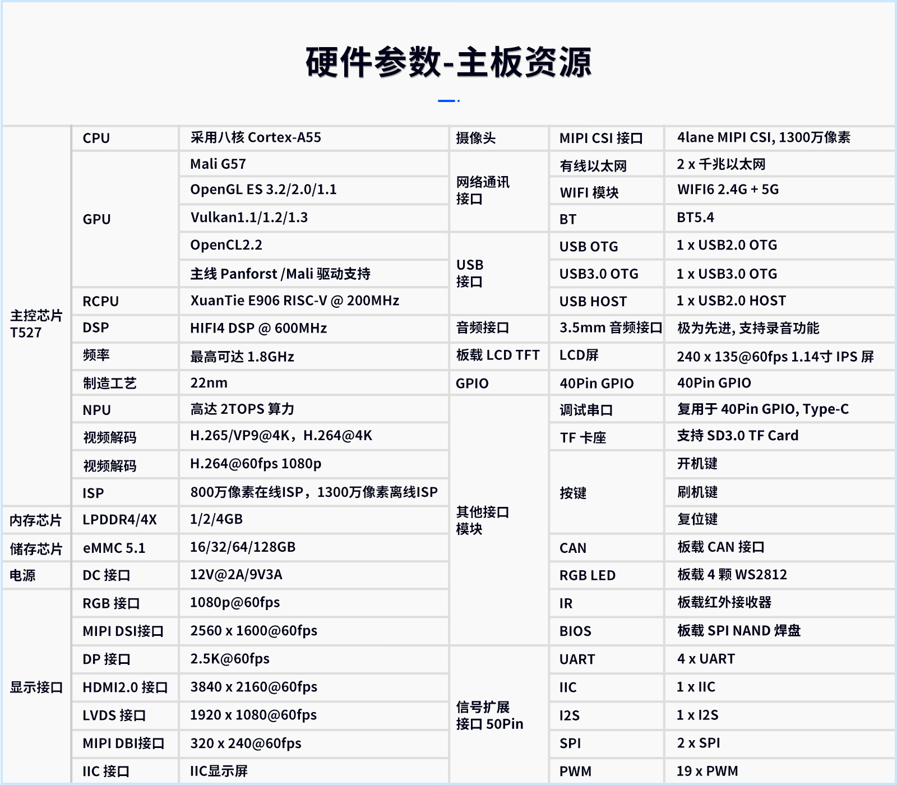

import LearningPathGuide from '@site/src/components/LearningPathGuide';

# T527-AvaotaA1

<LearningPathGuide 
  title="T527-AvaotaA1开发板学习路线"
  sections={[
    {
      id: 'intro',
      title: '01 入门',
      description: '本章节将详细介绍T527-AvaotaA1开发板的基本信息、技术参数，以及如何快速上手使用。',
      items: [
        { name: '产品介绍', url: '/docs/T527-AvaotaA1/BoardIntroduction' },
        { name: '源码与镜像系统', url: '/docs/T527-AvaotaA1/SourceCodeImageSystem' },
      ]
    },
    {
      id: 'quick-start',
      title: '02 快速启动',
      description: '本章节将指导您完成系统烧录和快速启动T527-AvaotaA1开发板。',
      items: [
        { name: '主线系统烧录', url: '/docs/T527-AvaotaA1/part1/part1-1/FlashSystemMianLine' },
        { name: 'TinaSUNXI系统烧录', url: '/docs/T527-AvaotaA1/part1/part1-1/FlashSystemTinaSUNXI' },
        { name: '快速上手', url: '/docs/T527-AvaotaA1/part1/QuickStart' },
        { name: '常见问题', url: '/docs/T527-AvaotaA1/part1/SomeQustion' },
        { name: '学习路径', url: '/docs/T527-AvaotaA1/part1/StudyPath' }
      ]
    },
    {
      id: 'board-functions',
      title: '03 板载功能体验',
      description: '本章节将介绍T527-AvaotaA1开发板的各种板载功能和使用方法。',
      items: [
        { name: 'WiFi联网', url: '/docs/T527-AvaotaA1/part2/WiFiNetworking' },
        { name: 'WiFi联网(版本2)', url: '/docs/T527-AvaotaA1/part2/part2-1/WiFiNetworking' },
        { name: 'WiFi联网(版本3)', url: '/docs/T527-AvaotaA1/part2/part2-2/WiFiNetworking' },
        { name: 'WiFi联网(版本4)', url: '/docs/T527-AvaotaA1/part2/part2-3/WiFiNetworking' },
        { name: 'WiFi联网(版本5)', url: '/docs/T527-AvaotaA1/part2/part2-4/WiFiNetworking' }
      ]
    },
    {
      id: 'dev-env',
      title: '04 开发环境搭建',
      description: '本章节将介绍如何搭建T527-AvaotaA1开发板的开发环境。',
      items: [
        { name: '配置主机环境', url: '/docs/T527-AvaotaA1/part3/ConfigHostEnv' },
        { name: '开发环境搭建', url: '/docs/T527-AvaotaA1/part3/DevelopmentEnvironmentSetup' }
      ]
    },
    {
      id: 'app-dev',
      title: '05 应用开发',
      description: '本章节将介绍如何在T527-AvaotaA1平台上进行应用程序开发。',
      items: [
        { name: 'HelloWorld应用', url: '/docs/T527-AvaotaA1/part4/HelloWorld' },
        { name: 'HelloWorld应用(进阶)', url: '/docs/T527-AvaotaA1/part5/HelloWorld' }
      ]
    }
  ]}
/>

* 此开发板的任何问题都可以在我们的论坛交流讨论 https://forums.100ask.net/c/aw/15 

## AvaotaSBC 命名规则
### Avaota A 系列
Avaota A 系列提供中高端性能 SBC 体验，包括 PCIe、USB3.0、双千兆、HDMI、DP等丰富的接口。

:::tip

 Avaota A 系列硬件设计均采用 [CERN-OHL-S](https://cern-ohl.web.cern.ch/) 开源许可。

 CERN-OHL-S（CERN Open Hardware License - Strongly Reciprocal）是一种由欧洲核子研究组织（CERN）开发的开源硬件许可证。它是CERN-OHL许可证的一个变体，其目的是促进硬件设计的共享和开放，以鼓励创新和合作。与许多其他开源许可证不同，CERN-OHL-S有着更严格的互惠条款，要求在对硬件设计进行修改时必须以相同的许可证方式发布修改后的设计。这意味着对CERN-OHL-S许可的硬件设计进行修改后，必须以相同的许可证方式分享修改后的设计，从而确保了硬件设计的开放性和可持续性。
:::

## 硬件简述
import Tabs from '@theme/Tabs';
import TabItem from '@theme/TabItem';

<Tabs>
  <TabItem value="apple" label="正面功能示意图" default>
    
  </TabItem>
  <TabItem value="orange" label="详细功能参数">
    
  </TabItem>
</Tabs>

### SOC框架

