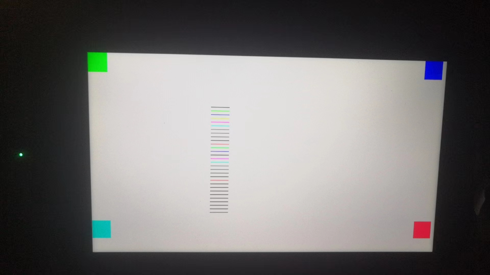
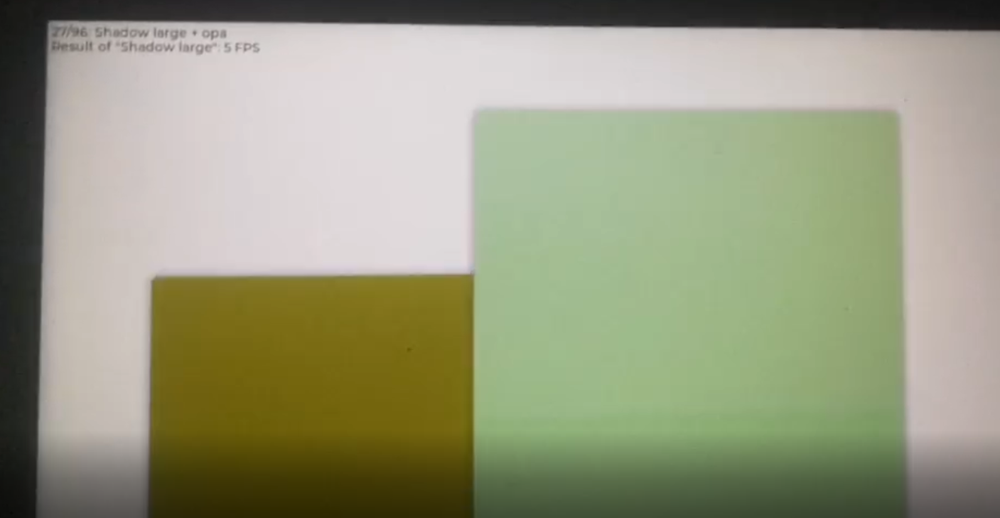
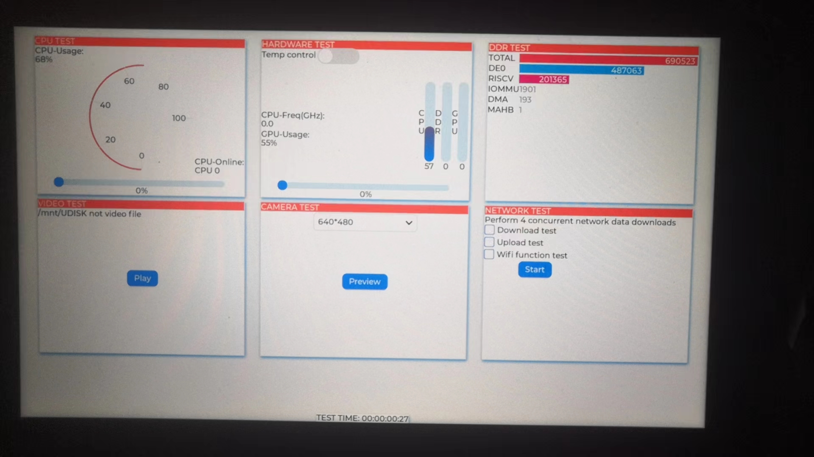
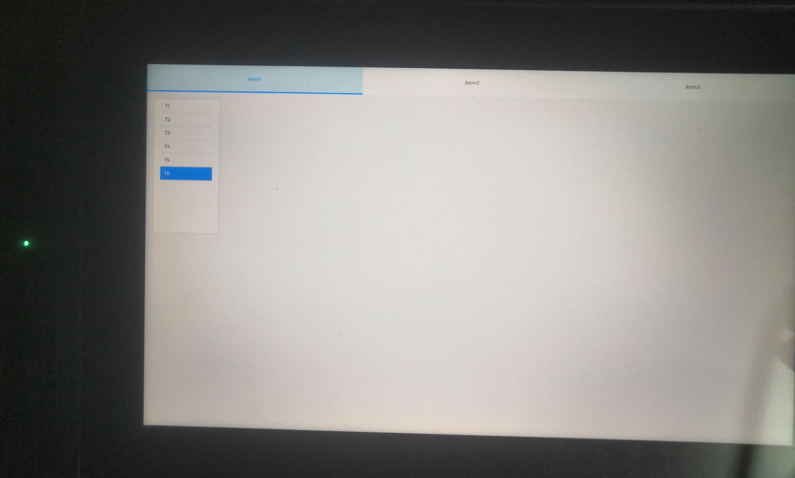

# 测试在HDMI屏幕上显示LVGL

> 评测作者：GzMark · 本篇为社区评测文章，来自开发者实测，未经官方逐字校对。

根据前面的步骤，这一步开始测试lvgl，看了sdk，已经移植好lvgl进来，用的lvgl8.0版本，我最早用的还是5.3，不用说，改动的应该很大，不过在测试lvgl之前，先尝试在fb上输出看看，毕竟驱屏从画点开始
## 1. 用fb驱屏 
在串口终端中输入：ls /dev/f 这里加个TAB键，能看到有fb0，那么后面测试就是在fb0上输出了

输出参考了这里[linux笔记(7):东山哪吒D1H使用framebuffer画直线(HDMI输出)](https://blog.csdn.net/hwd00001/article/details/127965504)

先在虚拟机将d1-h的工具链设置到系统环境

d1-h工具链路径tina-d1-h/prebuilt/gcc/linux-x86/riscv/toolchain-thead-glibc/riscv64-glibc-gcc-thead_20200702/bin
我这里sdk是放在桌面的，所以这里全路径是/home/allwinner/Desktop/tina-d1-h/prebuilt/gcc/linux-x86/riscv/toolchain-thead-glibc/riscv64-glibc-gcc-thead_20200702/bin

然后打开~/.bashrc,用什么都可以，不过要加sudo打开，不然保存不了，我用的gedit
```
sudo gedit ~/.bashrc
```
在最后加入：
```
PATH=$PATH:/home/allwinner/Desktop/tina-d1-h/prebuilt/gcc/linux-x86/riscv/toolchain-thead-glibc/riscv64-glibc-gcc-thead_20200702/bin
```
保存退出，然后执行source ~/.bashrc，这样在终端中就可以直接使用riscv64-linux-gcc了,可以测试下

在shell里，输入risv然后tab键，如果提示riscv64-linux-gcc，说明设置成功

下面是我的测试代码，在前面网友的基础上加了定点画色块，主要能验证是一个颜色问题，和坐标问题(做mcu的习惯)，测试代码如下：
```
#include <stdio.h>
#include <sys/ioctl.h>
#include <sys/types.h>
#include <sys/stat.h>
#include <fcntl.h>
#include <sys/mman.h>
#include <string.h>
#include <linux/fb.h>
#include <unistd.h>
 
static int fd_fb;
static struct fb_var_screeninfo var;	/* Current var */
static int screen_size;
static unsigned char *fb_base;
static unsigned int line_width;
static unsigned int pixel_width;
 
void lcd_put_pixel(int x, int y, unsigned int color)
//传入的 color 表示颜色，它的格式永远是 0x00RRGGBB，即 RGB888。
//当 LCD 是 16bpp 时，要把 color 变量中的 R、 G、 B 抽出来再合并成 RGB565 格式。
{
    unsigned char *pen_8 = fb_base+y*line_width+x*pixel_width;
    //计算(x,y)坐标上像素对应的 Framebuffer 地址。
 
    unsigned short *pen_16;
    unsigned int *pen_32;
    
    unsigned int red, green, blue;
    
    pen_16 = (unsigned short *)pen_8;
    pen_32 = (unsigned int *)pen_8;

    switch (var.bits_per_pixel)
    {
      //对于 8bpp， color 就不再表示 RBG 三原色了，这涉及调色板的概念， color 是调色板的值。
        case 8:
            {
                *pen_8 = color;
                break;
            }
        case 16:
            {
                //  R5 G6 B5 
                //先从 color 变量中把 R、 G、 B 抽出来。
                red = (color >> 16) & 0xff;
                green = (color >> 8) & 0xff;
                blue = (color >> 0) & 0xff;
                //把 red、 green、 blue 这三种 8 位颜色值，根据 RGB565 的格式，
                //只保留 red 中的高 5 位、 green 中的高 6 位、 blue 中的高 5 位，
                //组合成一个新的 16 位颜色值。
                color = ((red >> 3) << 11) | ((green >> 2) << 5) | (blue >> 3);
                //把新的 16 位颜色值写入 Framebuffer
                *pen_16 = color;
                break;
            }
        case 32:
            {
                //对于 32bpp，颜色格式跟 color 参数一致，可以直接写入Framebuffer
                *pen_32 = color;
                break;
            }
        default:
            {
                printf("can't surport %dbpp\n",var.bits_per_pixel);
                break;
            }
     }
}

void lcd_fill_rect(int x, int y, int w, int h, unsigned int color){
	for(int i=0; i<h; i++){
		for(int j=0; j<w; j++){
			lcd_put_pixel(x+j,y+i,color);
		}
	}
	
}

void    blushScreen2(unsigned int color)
{// 这里只考虑24色，也就是HDMI的情况
    unsigned int * p32=(unsigned int *)fb_base;
    unsigned int h,w;
    for(h=0;h<var.yres;h++)
        for(w=0;w<var.xres;w++){
            *p32= color;
            p32++;
        } 
}
int main(int argc,int **argv)
{	
	int i;
    
	printf("1.open /dev/fb0\n");
	fd_fb = open("/dev/fb0", O_RDWR);
	if (fd_fb < 0)
	{
		printf("can't open /dev/fb0\n");
		return -1;
	}	
	printf("2.get V Screen INFO\n");
	if (ioctl(fd_fb, FBIOGET_VSCREENINFO, &var))
	{
		printf("can't get var\n");
		return -1;
	}
	
	line_width = var.xres * var.bits_per_pixel / 8;
	pixel_width = var.bits_per_pixel / 8;
	screen_size = var.xres * var.yres * var.bits_per_pixel / 8;
    printf("width:%d,hight:%d,bits_per_pixel:%d\n",var.xres,var.yres,var.bits_per_pixel);
	
	printf("3.get framebuffer base address\n");
	fb_base = (unsigned char *)mmap(NULL , screen_size, PROT_READ | PROT_WRITE, MAP_SHARED, fd_fb, 0);
	if (fb_base == (unsigned char *)-1)
	{
		printf("can't mmap\n");
		return -1;
	}else{        
		printf("fb_base:0x%8x\n",fb_base);
    }
	/* 清屏: 全部设为白色 */
	//memset(fb_base, 0xff, screen_size);
    unsigned char colorData[10]={0x11,0x22,0x33,0x44,0x55,0x66,0x77,0x88,0x99,0xff};

    unsigned int cData[30] = {0x00FF0000,0xFF00FF00,0xFF0000FF,
                            0xFFFFFF00,0xFFFF00FF,0xFF00FFFF,
                            0xFF7F7F7F,0xFF007F7F,0xFF7F007F,0x007F7F00,//  0-9     FF开头
                            0x7FFF0000,0x7F00FF00,0x7F0000FF,
                            0x00FFFF00,0x7FFF00FF,0x7F00FFFF,
                            0x7F7F7F7F,0x7F007F7F,0x7F7F007F,0x007F7F00,//  10-19   7F开头
                            0xFFFF0000,0x0000FF00,0x000000FF,
                            0x00FFFF00,0x00FF00FF,0x0000FFFF,
                            0x007F7F7F,0x00007F7F,0x007F007F,0xFF7F7F00};//  20-29  00开头
          
	printf("4.flush screen in different colors\n");                      
    for(i = 0;i<10;i++)
    {
        memset(fb_base,colorData[i],screen_size );
        //sleep(1);//usleep(100*1000);
    }
	printf("5.draw 30 lines in different colors\n"); 
    for (int j = 0; j < 30;j++){
	    for (i = 0; i < 100; i++)	{
            lcd_put_pixel(var.xres/3+i, var.yres/4+20*j+0, cData[j] );
            lcd_put_pixel(var.xres/3+i, var.yres/4+20*j+1, cData[j] );
            lcd_put_pixel(var.xres/3+i, var.yres/4+20*j+2, cData[j] );
            lcd_put_pixel(var.xres/3+i, var.yres/4+20*j+3, cData[j] );

        }
    }
	
	lcd_fill_rect(0,0,100,100,0xFF00FF00);
	lcd_fill_rect(1800,0,100,100,0xFF0000FF);
	lcd_fill_rect(0,900,100,100,0xFF00FFFF);
	lcd_fill_rect(1800,900,100,100,0xFFFF0000);
	
    munmap (fb_base, screen_size);            
	close(fd_fb);
	return 0;
}
```
保存为main.c，随便吧，然后在shell下编译:
```
riscv64-unknown-linux-gnu-gcc main.c -o hdmitest
```
hdmitest即为测试程序，这里要放到板子的系统里运行，我之前在物理机的设备管理器看到板子被识别为安卓设备，可以用adb来发送，在虚拟机（virtualbox）的usb设备里将Allwinner开头的adb设备选中即可，之后在shell下执行
```
sudo adb push hdmitest .
```
我是直接放到根目录，方便测试，如果前面步骤没问题，这里应该能传输成功

在串口终端的shell下，ls能看到hdmitest，执行./hdmitest，这是就可以看到屏幕上的色块，如图

fb这么驱动没有问题，后面就可以上lvgl了
## 2. 测试sdk的lvgl测试程序
先在串口终端查看/usb/bin下有没有lv的测试程序，有的话可以跳过这步，运行测试下，没有就继续后面的步骤

在虚拟机shell执行make menuconfig
配置如下
```
 .config - Tina Configuration
 > Gui > Littlevgl ───────────────────────────────────────────────────────────────────────────────────────────────────────────────
  ┌──────────────────────────────────────────────────────── Littlevgl ─────────────────────────────────────────────────────────┐
  │  Arrow keys navigate the menu.  <Enter> selects submenus ---> (or empty submenus ----).  Highlighted letters are hotkeys.  │  
  │  Pressing <Y> includes, <N> excludes, <M> modularizes features.  Press <Esc><Esc> to exit, <?> for Help, </> for Search.   │  
  │  Legend: [*] built-in  [ ] excluded  <M> module  < > module capable                                                        │  
  │                                                                                                                            │  
  │ ┌────────────────────────────────────────────────────────────────────────────────────────────────────────────────────────┐ │  
  │ │                         <*> lv_examples................................. lvgl examples use lvgl-8.0.1                  │ │  
  │ │                         [*] lvgl-8.0.1 use sunxifb double buffer                                                       │ │  
  │ │                         [ ] lvgl-8.0.1 use sunxifb cache                                                               │ │  
  │ │                         [ ] lvgl-8.0.1 use sunxifb g2d                                                                 │ │  
  │ │                         [ ] lvgl-8.0.1 use sunxifb g2d rotate                                                          │ │  
  │ │                         <*> lv_monitor................................... lvgl monitor use lvgl-8.0.1                  │ │ 
```
然后保存退出，切换到lvgl的目录，路径：tina-d1-h/package/gui/littlevgl-8/，然后执行mm

然后croot切回tina根目录，执行make，后面打包烧录就可以了

此时在串口终端的shell就可以看到/usr/bin下有lv_examples和lv_monitor，运行下，就可以看到屏幕上的lvgl测试程序

这里有个奇怪的地方，lv_example里有5个测试demo
```
root@TinaLinux:/# lv_examples
lv_examples 0, is lv_demo_widgets
lv_examples 1, is lv_demo_music
lv_examples 2, is lv_demo_benchmark
lv_examples 3, is lv_demo_keypad_encoder
lv_examples 4, is lv_demo_stress
root@TinaLinux:/#
```
有个benchmark，我运行后，测试fps不到5……，这个有点奇怪
看图
另一个lv_monitor，界面包含cpu_test,HARDWARE_TEST,DDR_TEST,Video_TEST,camera_TEST,network_TEST   

## 搭建LVGL项目
因为sdk里有现成的lvgl，就直接用了
1. 在虚拟机shell切换到tina-d1-h/package/gui/littlevgl-8$目录，改目录下有4个文件夹
```
    lv_demos  lv_drivers  lv_examples  lvgl   lv_monitor
```
    lv_demos是之前测试的lv_examples的实际demo部分
    lv_drivers是各种驱动
    lv_examples是之前测试的lv_examples的入口程序
    lvgl是lvgl的源代码
    lv_monitor是之前那个有cpu的综合测试程序
2. 在该目录，创建lv_ir_test目录，作为测试lvgl和ir的项目目录
3. 参考lv_examples的Makefile，创建lv_ir_test/Makefile，内容如下
```
include $(TOPDIR)/rules.mk
include $(BUILD_DIR)/package.mk

PKG_NAME:=lv_ir_test
PKG_VERSION:=8.0.1
PKG_RELEASE:=1

PKG_BUILD_DIR := $(COMPILE_DIR)/$(PKG_NAME)

define Package/$(PKG_NAME)
  SECTION:=gui
  SUBMENU:=Littlevgl
  CATEGORY:=Gui
  DEPENDS:=+LVGL8_USE_SUNXIFB_G2D:libuapi +LVGL8_USE_SUNXIFB_G2D:kmod-sunxi-g2d
  TITLE:=lvgl lv_ir_test use lvgl-8.0.1
  MAINTAINER:=anruliu <anruliu@allwinnertech.com>
endef

PKG_CONFIG_DEPENDS := \
	CONFIG_LVGL8_USE_SUNXIFB_DOUBLE_BUFFER \
	CONFIG_LVGL8_USE_SUNXIFB_CACHE \
	CONFIG_LVGL8_USE_SUNXIFB_G2D \
	CONFIG_LVGL8_USE_SUNXIFB_G2D_ROTATE

# define Package/$(PKG_NAME)/config
# config LVGL8_USE_SUNXIFB_DOUBLE_BUFFER
# 	bool "lvgl-8.0.1 use sunxifb double buffer"
# 	default y
# 		help
# 		Whether use sunxifb double buffer
# config LVGL8_USE_SUNXIFB_CACHE
# 		bool "lvgl-8.0.1 use sunxifb cache"
# 	select LVGL8_USE_SUNXIFB_DOUBLE_BUFFER
# 	default y
# 		help
# 		Whether use sunxifb cache
# config LVGL8_USE_SUNXIFB_G2D
# 	bool "lvgl-8.0.1 use sunxifb g2d"
# 	select LVGL8_USE_SUNXIFB_DOUBLE_BUFFER
# 	default n
# 		help
# 		Whether use sunxifb g2d
# config LVGL8_USE_SUNXIFB_G2D_ROTATE
# 	bool "lvgl-8.0.1 use sunxifb g2d rotate"
# 	select LVGL8_USE_SUNXIFB_G2D
# 	default n
# 		help
# 		Whether use sunxifb g2d rotate
# endef

define Package/$(PKG_NAME)/Default
endef

define Package/$(PKG_NAME)/description
  a lvgl lv_ir_test v8.0.1
endef

define Build/Prepare
	$(INSTALL_DIR) $(PKG_BUILD_DIR)/
	$(CP) ./src $(PKG_BUILD_DIR)/
	$(CP) ./../lvgl $(PKG_BUILD_DIR)/src/
endef

define Build/Configure
endef

TARGET_CFLAGS+=-I$(PKG_BUILD_DIR)/src

ifeq ($(CONFIG_LVGL8_USE_SUNXIFB_DOUBLE_BUFFER),y)
TARGET_CFLAGS+=-DUSE_SUNXIFB_DOUBLE_BUFFER
endif

ifeq ($(CONFIG_LVGL8_USE_SUNXIFB_CACHE),y)
TARGET_CFLAGS+=-DUSE_SUNXIFB_CACHE
endif

ifeq ($(CONFIG_LVGL8_USE_SUNXIFB_G2D),y)
TARGET_CFLAGS+=-DUSE_SUNXIFB_G2D
TARGET_LDFLAGS+=-luapi
endif

ifeq ($(CONFIG_LVGL8_USE_SUNXIFB_G2D_ROTATE),y)
TARGET_CFLAGS+=-DUSE_SUNXIFB_G2D_ROTATE
endif

ifeq ($(CONFIG_LINUX_5_4),y)
TARGET_CFLAGS+=-DCONF_G2D_VERSION_NEW
endif

define Build/Compile
	$(MAKE) -C $(PKG_BUILD_DIR)/src\
		ARCH="$(TARGET_ARCH)" \
		AR="$(TARGET_AR)" \
		CC="$(TARGET_CC)" \
		CXX="$(TARGET_CXX)" \
		CFLAGS="$(TARGET_CFLAGS)" \
		LDFLAGS="$(TARGET_LDFLAGS)" \
		INSTALL_PREFIX="$(PKG_INSTALL_DIR)" \
		all
endef

#define Build/InstallDev
#	$(INSTALL_DIR) $(1)/usr/lib
#endef

define Package/$(PKG_NAME)/install
	$(INSTALL_DIR) $(1)/usr/bin/
	$(INSTALL_BIN) $(PKG_BUILD_DIR)/src/$(PKG_NAME) $(1)/usr/bin/
endef

$(eval $(call BuildPackage,$(PKG_NAME)))
```
用不到的，我注掉了
4. 在lv_ir_test目录下，创建src目录，作为源代码存放目录
5. 在src目录下，创建如下文件
```
disp_fb.c  irdev.c  lv_conf.h      main.c    test.c
disp_fb.h  irdev.h  lv_drv_conf.h  Makefile  test.h
最终呢，lv_ir_test结构如下：
.
├── Makefile
└── src
    ├── disp_fb.c
    ├── disp_fb.h
    ├── irdev.c
    ├── irdev.h
    ├── lv_conf.h
    ├── lv_drv_conf.h
    ├── main.c
    ├── Makefile
    ├── test.c
    └── test.h
```
文件说明：
|文件|说明|
-|-
|disp_fb.c|lvgl显示驱动，使用fb驱动|
|disp_fb.h|disp_fb.c的头文件|
|irdrv.c|红外驱动，这个备用，后面测试ir后完善|
|irdev.h|irdrv.c的头文件|
|lv_conf.h|lvgl的配置文件|
|lv_drv_conf.h|lvgl的驱动配置文件|
|main.c|lvgl的入口程序|
|test.c|测试程序，测试lvgl|
|test.h|test.c的头文件|
|src/Makefile|项目的makefile|
|Makefile(src同级目录的)|tina的package的makefile|
 我这里src下的makefile也直接参考lv_examples/src的Makefile，内容如下
```
#
# Makefile
#
CC ?= gcc
LVGL_DIR_NAME ?= lvgl
LVGL_DIR ?= ${shell pwd}
CFLAGS ?= -O3 -g0 -I$(LVGL_DIR)/ -Wall -Wshadow -Wundef -Wmissing-prototypes -Wno-discarded-qualifiers -Wall -Wextra -Wno-unused-function -Wno-error=strict-prototypes -Wpointer-arith -fno-strict-aliasing -Wno-error=cpp -Wuninitialized -Wmaybe-uninitialized -Wno-unused-parameter -Wno-missing-field-initializers -Wtype-limits -Wsizeof-pointer-memaccess -Wno-format-nonliteral -Wno-cast-qual -Wunreachable-code -Wno-switch-default -Wreturn-type -Wmultichar -Wformat-security -Wno-ignored-qualifiers -Wno-error=pedantic -Wno-sign-compare -Wno-error=missing-prototypes -Wdouble-promotion -Wclobbered -Wdeprecated -Wempty-body -Wtype-limits -Wshift-negative-value -Wstack-usage=2048 -Wno-unused-value -Wno-unused-parameter -Wno-missing-field-initializers -Wuninitialized -Wmaybe-uninitialized -Wall -Wextra -Wno-unused-parameter -Wno-missing-field-initializers -Wtype-limits -Wsizeof-pointer-memaccess -Wno-format-nonliteral -Wpointer-arith -Wno-cast-qual -Wmissing-prototypes -Wunreachable-code -Wno-switch-default -Wreturn-type -Wmultichar -Wno-discarded-qualifiers -Wformat-security -Wno-ignored-qualifiers -Wno-sign-compare
LDFLAGS ?= -lm
BIN = lv_ir_test


#Collect the files to compile
SRCDIRS   =  $(shell find . -maxdepth 1 -type d)
MAINSRC = $(foreach dir,$(SRCDIRS),$(wildcard $(dir)/*.c))

include $(LVGL_DIR)/lvgl/lvgl.mk

OBJEXT ?= .o

AOBJS = $(ASRCS:.S=$(OBJEXT))
COBJS = $(CSRCS:.c=$(OBJEXT))

MAINOBJ = $(MAINSRC:.c=$(OBJEXT))

SRCS = $(ASRCS) $(CSRCS) $(MAINSRC)
OBJS = $(AOBJS) $(COBJS)

## MAINOBJ -> OBJFILES

all: default

%.o: %.c
	@$(CC)  $(CFLAGS) -c $< -o $@
	@echo "CC $<"
    
default: $(AOBJS) $(COBJS) $(MAINOBJ)
	$(CC) -o $(BIN) $(MAINOBJ) $(AOBJS) $(COBJS) $(LDFLAGS)

clean: 
	rm -f $(BIN) $(AOBJS) $(COBJS) $(MAINOBJ)
```
main.c内容如下：
```
#include "lvgl/lvgl.h"
#include "disp_fb.h"
#include "irdev.h"
#include <unistd.h>
#include <pthread.h>
#include <time.h>
#include <sys/time.h>
#include <stdlib.h>
#include <stdio.h>

#include "test.h"


int main(void)
{
    /*LittlevGL init*/
    lv_init();
    
    /*Linux frame buffer device init*/
    fb_init();

    /*A buffer for LittlevGL to draw the screen's content*/
    static uint32_t width=0, height=0;
    fb_get_sizes(&width, &height);

    printf("Screen: %dx%d\r\n",width,height);
    static lv_color_t *buf;
    buf = (lv_color_t*) malloc(width * height * sizeof (lv_color_t));

    if (buf == NULL) {
        fb_exit();
        printf("malloc draw buffer fail\n");
        return 0;
    }

    /*Initialize a descriptor for the buffer*/
    static lv_disp_draw_buf_t disp_buf;
    lv_disp_draw_buf_init(&disp_buf, buf, NULL, width * height);

    /*Initialize and register a display driver*/
    static lv_disp_drv_t disp_drv;
    lv_disp_drv_init(&disp_drv);
    disp_drv.draw_buf   = &disp_buf;
    disp_drv.flush_cb   = fb_flush;
    disp_drv.hor_res    = width;
    disp_drv.ver_res    = height;
    // disp_drv.rotated    = rotated;
    lv_disp_drv_register(&disp_drv);

    irdev_init();
    static lv_indev_drv_t indev_drv;
    lv_indev_drv_init(&indev_drv);                /*Basic initialization*/
    indev_drv.type =LV_INDEV_TYPE_BUTTON;        /*See below.*/
    indev_drv.read_cb = irdev_read;               /*See below.*/
    /*Register the driver in LVGL and save the created input device object*/
    lv_indev_t * irdev_indev = lv_indev_drv_register(&indev_drv);
    

    /*Create a Demo*/
    test(irdev_indev);
    // lv_color_t c;
    // lv_area_t a1={0,0,99,99};
    // lv_color_t cc[10000] = {0};
    // c.ch.blue=255;
    // c.ch.alpha=255;
	// lcd_fill_rect(700,0,100,100,c.full);
    // for(int i=0; i<10000; i++)
    // cc[i] = c;
    // fb_flush(NULL,&a1,cc);

    // c.full=0;
    // c.ch.red=255;
    // c.ch.alpha=255;
	// lcd_fill_rect(1200,0,100,100,c.full);
    // lv_area_t a2={1800,0,1899,99};
    // for(int i=0; i<10000; i++)
    // cc[i] = c;
    // fb_flush(NULL,&a2,cc);

    // c.full=0;
    // c.ch.green=255;
    // c.ch.alpha=255;
	// lcd_fill_rect(700,600,100,100,c.full);
    // lv_area_t a3={0,900,99,999};
    // for(int i=0; i<10000; i++)
    // cc[i] = c;
    // fb_flush(NULL,&a3,cc);

    // c.full=0;
    // c.ch.alpha=255;
	// lcd_fill_rect(1200,600,100,100,c.full);
    // lv_area_t a4={1800,900,1899,999};
    // for(int i=0; i<10000; i++)
    // cc[i] = c;
    // fb_flush(NULL,&a4,cc);
    

    /*Handle LitlevGL tasks (tickless mode)*/
    while(1) {
        lv_timer_handler();
        usleep(5000);
    }

    return 0;
}

/*Set in lv_conf.h as `LV_TICK_CUSTOM_SYS_TIME_EXPR`*/
uint32_t custom_tick_get(void)
{
    static uint64_t start_ms = 0;
    if(start_ms == 0) {
        struct timeval tv_start;
        gettimeofday(&tv_start, NULL);
        start_ms = (tv_start.tv_sec * 1000000 + tv_start.tv_usec) / 1000;
    }

    struct timeval tv_now;
    gettimeofday(&tv_now, NULL);
    uint64_t now_ms;
    now_ms = (tv_now.tv_sec * 1000000 + tv_now.tv_usec) / 1000;

    uint32_t time_ms = now_ms - start_ms;
    return time_ms;
}
```
其中注释部分呢，是打色块测试，一个是测试lvgl的rgba，一个是测试坐标，跟前面fb测试色块一样

显示驱动部分disp_fb.c,如下
```
#include "disp_fb.h"

#include <stdlib.h>
#include <unistd.h>
#include <stddef.h>
#include <stdio.h>
#include <fcntl.h>
#include <sys/mman.h>
#include <sys/ioctl.h>
#include <linux/fb.h>


static struct fb_var_screeninfo var;	/* screen var */
static struct fb_fix_screeninfo fix;
static uint16_t linewidth,pixelwidth;
static int disp_fb;
static uint8_t* dbuf = NULL;

void fb_init(void){
    disp_fb = open(FBDEV_PATH,O_RDWR);
    if(disp_fb>0){
        printf("fb open succ\r\n");
        if(!ioctl(disp_fb,FBIOGET_VSCREENINFO, (void*)&var)){
            pixelwidth = var.bits_per_pixel/8;
            linewidth = var.xres*pixelwidth;
            printf("pixel:%d,lw:%d\r\n",pixelwidth,linewidth);
            printf("Size: %dx%d,offset:(%d,%d)\r\n",var.xres,var.yres,var.xoffset,var.yoffset);

        }
        if(!ioctl(disp_fb,FBIOGET_FSCREENINFO,(void*)&fix)){
            printf("lw:%d,m:%d\r\n",fix.line_length,fix.mmio_len);  
        }
        fix.mmio_len = fix.line_length*var.yres;
        dbuf = (uint8_t*)mmap(0,fix.mmio_len,PROT_READ|PROT_WRITE,MAP_SHARED,disp_fb,0);
        if((intptr_t)dbuf == -1){
            perror("dbuf err");
        }
        memset(dbuf,0,fix.mmio_len);
    }

}

void fb_exit(void){
    close(disp_fb);
    disp_fb =0;
}

void fb_flush(lv_disp_drv_t * drv, const lv_area_t * area, lv_color_t * color_p){
    // uint16_t x=area->x1,y=area->y1;
    if(dbuf==NULL || area->x1<0 || area->x2>var.xres-1 || area->y1<0 || area->y2>var.yres-1){
        lv_disp_flush_ready(drv);
        return;
    }
    int w = area->x2-area->x1+1;
    for(int y=area->y1; y<=area->y2; y++){
        memcpy((uint32_t*)(dbuf+(area->x1+var.xoffset)*pixelwidth+(y+var.yoffset)*linewidth),(uint32_t*)color_p,w*pixelwidth);
        color_p+=w;
    }
    lv_disp_flush_ready(drv);
}

void fb_get_sizes(uint32_t *width, uint32_t *height){
    *width = var.xres;
    *height = var.yres;
}

void lcd_put_pixel(int x, int y, uint32_t color)
//传入的 color 表示颜色，它的格式永远是 0x00RRGGBB，即 RGB888。
//当 LCD 是 16bpp 时，要把 color 变量中的 R、 G、 B 抽出来再合并成 RGB565 格式。
{
    unsigned char *pen_8 = dbuf+y*linewidth+x*pixelwidth;
    //计算(x,y)坐标上像素对应的 Framebuffer 地址。
 
    unsigned short *pen_16;
    unsigned int *pen_32;
    
    unsigned int red, green, blue;
    
    pen_16 = (unsigned short *)pen_8;
    pen_32 = (unsigned int *)pen_8;

    switch (var.bits_per_pixel)
    {
      //对于 8bpp， color 就不再表示 RBG 三原色了，这涉及调色板的概念， color 是调色板的值。
        case 8:
            {
                *pen_8 = color;
                break;
            }
        case 16:
            {
                //  R5 G6 B5 
                //先从 color 变量中把 R、 G、 B 抽出来。
                red = (color >> 16) & 0xff;
                green = (color >> 8) & 0xff;
                blue = (color >> 0) & 0xff;
                //把 red、 green、 blue 这三种 8 位颜色值，根据 RGB565 的格式，
                //只保留 red 中的高 5 位、 green 中的高 6 位、 blue 中的高 5 位，
                //组合成一个新的 16 位颜色值。
                color = ((red >> 3) << 11) | ((green >> 2) << 5) | (blue >> 3);
                //把新的 16 位颜色值写入 Framebuffer
                *pen_16 = color;
                break;
            }
        case 32:
            {
                //对于 32bpp，颜色格式跟 color 参数一致，可以直接写入Framebuffer
                *pen_32 = color;
                break;
            }
        default:
            {
                printf("can't surport %dbpp\n",var.bits_per_pixel);
                break;
            }
     }
}

void lcd_fill_rect(int x, int y, int w, int h, uint32_t color){
	for(int i=0; i<h; i++){
		for(int j=0; j<w; j++){
			lcd_put_pixel(x+j,y+i,color);
		}
	}
}
```
上面flush部分呢，因为前面fb_init里读到的pixelwidth是4，所以用就直接u32

lcd_put_pixel就单纯测试下色块，验证rgpa和坐标，mcu的习惯，soc的别人怎么做，不清楚哈哈

实际上在调显示的时候，遇到点不是问题的问题，大意了，搞了点时间，

* 一个就是main.c里屏蔽那部分，我用memset来填充lv_color_t（因为full是32位的），我直接取的cc.full，结果导致显示异常，块花屏
* 另一个呢，是fb_flush里，用到fb的缓冲区dbuf，前面是uint_8*的，在fb_flush里忘记转了，导致显示异常，色块分离，启动时整体颜色正常，但有刷新呢，颜色分层，且位置不对，但没出现段错误哈哈，不过好在后面可以了

到这里，fb_flush刷色块也没问题，就可以加入test代码了

test.c代码如下：
```
void test(lv_indev_t* d){

    base = lv_tabview_create(lv_scr_act(),LV_DIR_TOP, 80);
    lv_obj_set_size(base,1920,1080);
    lv_obj_set_pos(base,0,0);

    tabs[0] = lv_tabview_add_tab(base,"Item1");
    tabs[1] = lv_tabview_add_tab(base,"Item2");
    tabs[2] = lv_tabview_add_tab(base,"Item3");


    static lv_style_t style;
    lv_style_init(&style);

    lv_style_set_bg_opa(&style, LV_OPA_100);
    lv_style_set_bg_color(&style, lv_palette_main(LV_PALETTE_BLUE));
    lv_style_set_bg_grad_color(&style, lv_palette_darken(LV_PALETTE_BLUE, 1));
    lv_style_set_bg_grad_dir(&style, LV_GRAD_DIR_VER);


    lv_style_set_text_color(&style, lv_color_white());

    list = lv_list_create(tabs[0]);
    lv_obj_set_size(list,200,400);
    lv_obj_set_pos(list,0,0);
    for(int i=0; i<6; i++){
        char t[5] = {0};
        sprintf(t,"T%d",i+1);
        cur = lv_list_add_btn(list,NULL,t);
        lv_obj_add_style(cur,&style,LV_STATE_FOCUSED);
    }

    lv_obj_add_state(cur,LV_STATE_FOCUSED);
    curinput = d;
    timer = lv_timer_create(checkkey,5,NULL);
}

void test_quit(){
    if(base){
        lv_obj_clean(base);
        lv_obj_del(base);
    }
}
```
上面呢，定时器后面给红外用的，我没用有导航模式，觉得不好用，如果要响应键多的话，就加不上了，这个后面红外按键时说

至于用tabview和list，容易做切换展示，哈哈

上面h文件简单，就不贴了，编译下包看看先 

## 编译包开始测试
回到前面的shell，切换到lv_ir_test的根目录，执行mm
```
lv_ir_test$ mm
```
过个几分钟应该就可以了，编译后的可执行程序呢，在tina的根目录下，路径是
```
tina-d1-h/out/d1-h-nezha/compile_dir/target/lv_ir_test/ipkg-sunxi/lv_ir_test/usr/bin/lv_ir_test
```
将板子的adb加到虚拟机下，在tina根目录新建shell，执行sudo adb push out/d1-h-nezha/compile_dir/target/lv_ir_test/ipkg-sunxi/lv_ir_test/usr/bin/lv_ir_test .

执行成功，在串口终端执行ls，应该能看到lv_ir_test，执行./lv_ir_test,就可以看到上面的test的界面了，如图

