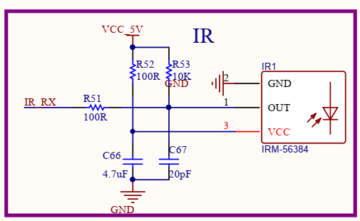

# 测试红外遥控键值

> 评测作者：GzMark · 本篇为社区评测文章，来自开发者实测，未经官方逐字校对。

前面测试lvgl已经可以在hdmi屏幕上输出显示，这一步该测试红外了。

## 1.根据原理图确定引脚
先确定红外模块的引脚，红外部分原理图：


IR_RX对应部分：


所以这里IR的pin对应的是PB12，这里有点问题不知道是不是图不对，用PB12测试一直读不到值，用的PG16才行，下面以PG16进行测试说明。

## 2. 修改设备树
    在sdk下找到设备树文件，做如下修改
    1. 修改board.dts(路径/home/allwinner/Desktop/tina-d1-h/device/config/chips/d1-h/configs/nezha/linux-5.4/board.dts)中s_cir0部分,pins改为PG16：
```
	s_cir0_pins_a: s_cir@0 {
		pins = "PG16";
		function = "ir";
		drive-strength = <10>;
		bias-pull-up;
	};

	s_cir0_pins_b: s_cir@1 {
		pins = "PG16";
		function = "gpio_in";
	};
    ···
    ;s_cir0 status改为okay

    &s_cir0 {
	pinctrl-names = "default", "sleep";
	pinctrl-0 = <&s_cir0_pins_a>;
	pinctrl-1 = <&s_cir0_pins_b>;
	status = "okay";
};
```
    2. sun20iw1p1.dtsi(路径：/home/allwinner/Desktop/tina-d1-h/lichee/linux-5.4/arch/riscv/boot/dts/sunxi/sun20iw1p1.dtsi),将S_CIR开启:
```
		s_cir0: s_cir@7040000 {
			compatible = "allwinner,s_cir";
			reg = <0x0 0x07040000 0x0 0x400>;
			interrupts-extended = <&plic0 167 IRQ_TYPE_LEVEL_HIGH>;
			clocks = <&r_ccu CLK_R_APB0_BUS_IRRX>, <&dcxo24M>, <&r_ccu CLK_R_APB0_IRRX>;
			clock-names = "bus", "pclk", "mclk";
			resets = <&r_ccu RST_R_APB0_BUS_IRRX>;
			supply = "";
			supply_vol = "";
			status = "okay";
		};
```

## 3. 修改menuconfig
在虚拟机shell下，输入：make kernel_menuconfig，进入Device Drivers > Remote Controller support > Remote controller decoders ，选择如下：
```
 .config - Linux/riscv 5.4.61 Kernel Configuration
 > Device Drivers > Remote Controller support > Remote controller decoders ────────────────────────────────────
  ┌────────────────────────────────────── Remote controller decoders ───────────────────────────────────────┐
  │  Arrow keys navigate the menu.  <Enter> selects submenus ---> (or empty submenus ----).  Highlighted    │  
  │  letters are hotkeys.  Pressing <Y> includes, <N> excludes, <M> modularizes features.  Press <Esc><Esc> │  
  │  to exit, <?> for Help, </> for Search.  Legend: [*] built-in  [ ] excluded  <M> module  < > module     │  
  │  capable                                                                                                │  
  │ ┌─────────────────────────────────────────────────────────────────────────────────────────────────────┐ │  
  │ │               --- Remote controller decoders                                                        │ │  
  │ │               <*>   Enable IR raw decoder for the NEC protocol                                      │ │  
  │ │               < >   Enable IR raw decoder for the RC-5 protocol                                     │ │  
  │ │               < >   Enable IR raw decoder for the RC6 protocol                                      │ │  
  │ │               < >   Enable IR raw decoder for the JVC protocol                                      │ │  
  │ │               < >   Enable IR raw decoder for the Sony protocol                                     │ │  
  │ │               < >   Enable IR raw decoder for the Sanyo protocol                                    │ │  
  │ │               < >   Enable IR raw decoder for the Sharp protocol                                    │ │  
  │ │               < >   Enable IR raw decoder for the MCE keyboard/mouse protocol                       │ │  
  │ │               < >   Enable IR raw decoder for the XMP protocol                                      │ │  
  │ │               < >   Enable IR raw decoder for the iMON protocol                                     │ │  
  │ │               < >   Enable IR raw decoder for the RC-MM protocol                                    │ │  
  │ │                                                                                                     │ │
```
手头的红外遥控器是NEC协议，就选择第一个了

然后返回进入Device Drivers > Remote Controller support > Remote Controller devices，选择如下：
``` 
.config - Linux/riscv 5.4.61 Kernel Configuration
 > Device Drivers > Remote Controller support > Remote Controller devices ─────────────────────────────────────
  ┌─────────────────────────────────────── Remote Controller devices ───────────────────────────────────────┐
  │  Arrow keys navigate the menu.  <Enter> selects submenus ---> (or empty submenus ----).  Highlighted    │  
  │  letters are hotkeys.  Pressing <Y> includes, <N> excludes, <M> modularizes features.  Press <Esc><Esc> │  
  │  to exit, <?> for Help, </> for Search.  Legend: [*] built-in  [ ] excluded  <M> module  < > module     │  
  │  capable                                                                                                │  
  │ ┌─────────────────────────────────────────────────────────────────────────────────────────────────────┐ │  
  │ │               --- Remote Controller devices                                                         │ │  
  │ │               < >   ATI / X10 based USB RF remote controls                                          │ │  
  │ │               < >   Hisilicon hix5hd2 IR remote control                                             │ │  
  │ │               < >   SoundGraph iMON Receiver and Display                                            │ │  
  │ │               < >   SoundGraph iMON Receiver (early raw IR models)                                  │ │  
  │ │               < >   Windows Media Center Ed. eHome Infrared Transceiver                             │ │  
  │ │               < >   RedRat3 IR Transceiver                                                          │ │  
  │ │               < >   SPI connected IR LED                                                            │ │  
  │ │               < >   Streamzap PC Remote IR Receiver                                                 │ │  
  │ │               < >   IgorPlug-USB IR Receiver                                                        │ │  
  │ │               < >   IguanaWorks USB IR Transceiver                                                  │ │  
  │ │               < >   TechnoTrend USB IR Receiver                                                     │ │  
  │ │               < >   Remote Control Loopback Driver                                                  │ │  
  │ │               < >   GPIO IR remote control                                                          │ │  
  │ │               < >   GPIO IR Bit Banging Transmitter                                                 │ │  
  │ │               < >   PWM IR transmitter                                                              │ │  
  │ │               < >   SUNXI IR remote control                                                         │ │  
  │ │               <*>   SUNXI IR RX remote control                                                      │ │  
  │ │               <*>   SUNXI IR TX remote control                                                      │ │  
  │ │               < >   Homebrew Serial Port Receiver                                                   │ │  
  │ │               < >   Built-in SIR IrDA port                                                          │ │  
  │ │               < >   Xbox DVD Movie Playback Kit                                                     │ │ 
```
保存退出，然后make编译，打包，按前面烧录的步骤烧录镜像
## 4. 测试红外驱动
 上一步烧录完成后，在串口终端中，输入下面内容后回车
```
 root@TinaLinux:/# cat proc/bus/input/devices
```
如果前面配置正确，此时应该能看到挂载的红外设备，驱动加载正常
```
root@TinaLinux:/# cat proc/bus/input/devices
I: Bus=0019 Vendor=0001 Product=0001 Version=0100
N: Name="sunxi-keyboard"
P: Phys=sunxikbd/input0
S: Sysfs=/devices/virtual/input/input0
U: Uniq=
H: Handlers=kbd event0
B: PROP=0
B: EV=3
B: KEY=100000000 0 0 100000000800 4000000000000 10000000

I: Bus=0019 Vendor=0001 Product=0001 Version=0100
N: Name="sunxi-ir"
P: Phys=sunxi-ir/input0
S: Sysfs=/devices/platform/soc@3000000/7040000.s_cir/rc/rc0/s_cir_rx
U: Uniq=
H: Handlers=kbd event1
B: PROP=20
B: EV=100017
B: KEY=2
B: REL=3
B: MSC=10

I: Bus=0000 Vendor=0000 Product=0000 Version=0000
N: Name="audiocodec sunxi Audio Jack"
P: Phys=ALSA
S: Sysfs=/devices/platform/soc@3000000/2030340.sound/sound/card0/input2
U: Uniq=
H: Handlers=kbd event2
B: PROP=0
B: EV=23
B: KEY=40 0 0 0 0 0 400000000 0 c000000000000 0
B: SW=14
```
上面红外设备节点事件是键盘event1

SDK的固件下有个getevent可以测试下红外输入，用法如下
```
root@TinaLinux:/# getevent -h
Usage: getevent [-t] [-n] [-s switchmask] [-S] [-v [mask]] [-d] [-p] [-i] [-l] [-q] [-c count] [-r] [device]
    -t: show time stamps
    -n: don't print newlines
    -s: print switch states for given bits
    -S: print all switch states
    -v: verbosity mask (errs=1, dev=2, name=4, info=8, vers=16, pos. events=32, props=64)
    -d: show HID descriptor, if available
    -p: show possible events (errs, dev, name, pos. events)
    -i: show all device info and possible events
    -l: label event types and names in plain text
    -q: quiet (clear verbosity mask)
    -c: print given number of events then exit
    -r: print rate events are received
```
根据提示，输入getevent -l /dev/input/event1,处于等待输入状态，此时按红外遥控器，日志如下：
```
root@TinaLinux:/# getevent -l /dev/input/event1
poll 2, returned 1
EV_MSC       MSC_SCAN             00000009
poll 2, returned 1
EV_SYN       SYN_REPORT           00000000
poll 2, returned 1
EV_MSC       MSC_SCAN             00000009
poll 2, returned 1
EV_SYN       SYN_REPORT           00000000
poll 2, returned 1
EV_MSC       MSC_SCAN             00000009
poll 2, returned 1
EV_SYN       SYN_REPORT           00000000
poll 2, returned 1
EV_MSC       MSC_SCAN             00000009
poll 2, returned 1
EV_SYN       SYN_REPORT           00000000
poll 2, returned 1
EV_MSC       MSC_SCAN             00000015
poll 2, returned 1
EV_SYN       SYN_REPORT           00000000
poll 2, returned 1
EV_MSC       MSC_SCAN             00000015
poll 2, returned 1
EV_SYN       SYN_REPORT           00000000
poll 2, returned 1
EV_MSC       MSC_SCAN             00000040
poll 2, returned 1
EV_SYN       SYN_REPORT           00000000
poll 2, returned 1
EV_MSC       MSC_SCAN             00000040
poll 2, returned 1
EV_SYN       SYN_REPORT           00000000
poll 2, returned 1
EV_MSC       MSC_SCAN             00000046
poll 2, returned 1
EV_SYN       SYN_REPORT           00000000
poll 2, returned 1
EV_MSC       MSC_SCAN             00000046
poll 2, returned 1
EV_SYN       SYN_REPORT           00000000
poll 2, returned 1
EV_MSC       MSC_SCAN             00000046
poll 2, returned 1
EV_SYN       SYN_REPORT           00000000
poll 2, returned 1
EV_MSC       MSC_SCAN             00000046
poll 2, returned 1
EV_SYN       SYN_REPORT           00000000
```
到这里，有键值出来，说明前面加载驱动，和配置引脚都没问题，下面可以写测试程序了
## 5. 编写红外测试程序
根据前面测试，采用节点事件event1可以获取红外键值，那么测试程序ir_test.c可以如下编写：
```
#include <stdio.h>
#include <linux/input.h>
#include <stdlib.h>
#include <sys/types.h>
#include <sys/stat.h>
#include <fcntl.h>
#include <sys/time.h>
#include <limits.h>
#include <unistd.h>
#include <signal.h>
#define DEV_PATH "/dev/input/event1" //difference is possible
const int key_exit = 102;
static int keys_fd = 0;
unsigned int test_keyboard(const char * event_file)
{
	int code = 0, i;
	struct input_event data={0};
	keys_fd=open(DEV_PATH, O_RDONLY);
	if(keys_fd <= 0)
	{
		printf("open %s error!\n", DEV_PATH);
		return -1;
	}
	fcntl(keys_fd,F_SETFL,O_NONBLOCK);
	for(;;)
	{
		read(keys_fd, &data, sizeof(data));
		if(data.value){
			printf("%d\r\n",data.value);
			code = data.value;		
		}
	}
	close(keys_fd);
	return 0;
}
int main(int argc,const char *argv[])
{
	int rang_low = 0, rang_high = 0;
	return test_keyboard(DEV_PATH);
}
```
上面fcntl(keys_fd,F_SETFL,O_NONBLOCK);主要是测试非阻塞读取，后面lvgl用到，这里放进来了

在shell下编译
```
riscv64-unknown-linux-gnu-gcc ir_test.c -o ir_test
```

然后adb推到板子上：
```
sudo adb push ir_test .
```
在串口终端下执行并测试：
```
root@TinaLinux:/# ./ir_test
70
70
70
70
71
71
71
71
71
71

```
驱动测试ok，后面就可以组装到前面的lvgl程序里了
