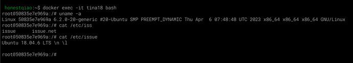
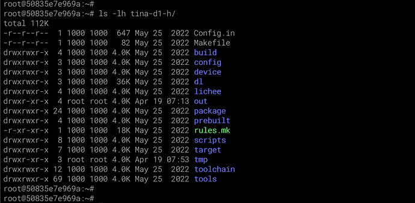
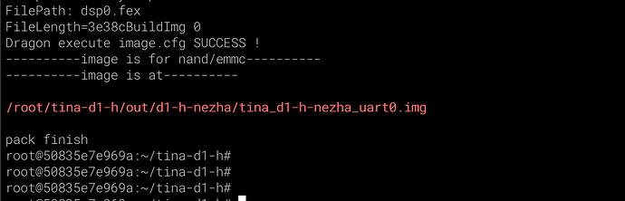
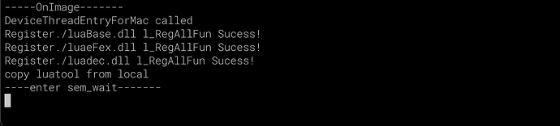
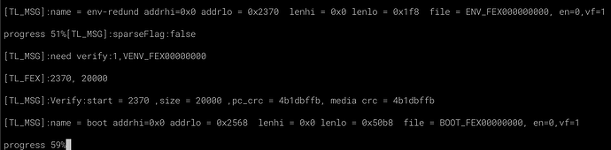
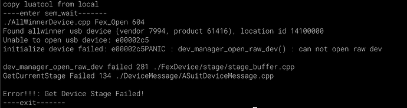
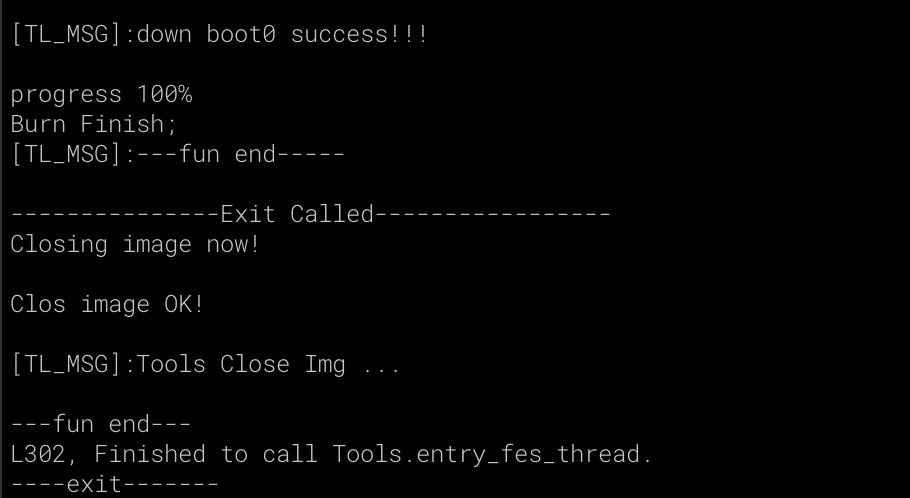
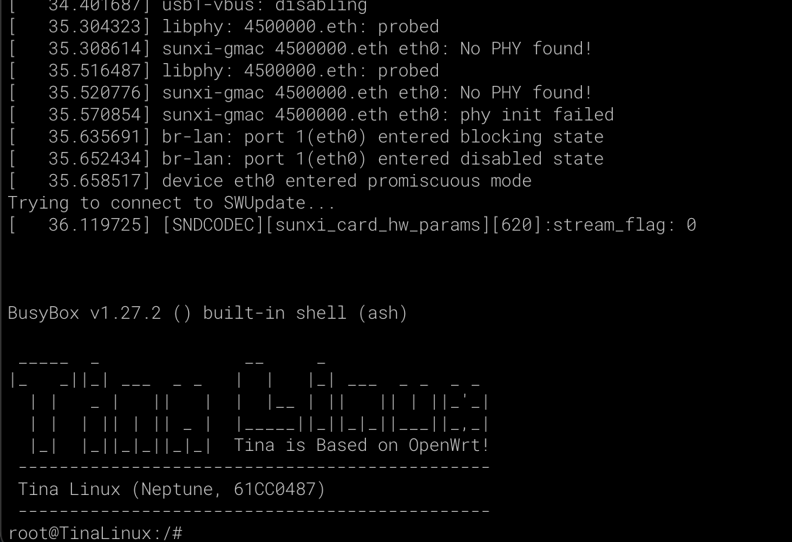

# macOS下开发编译烧录环境建立

> 评测作者：HonestQiao · 本篇为社区评测文章，来自开发者实测，未经官方逐字校对。

因为日常使用的电脑为macbook，所以我的开发编译烧录环境，是基于macOS构建的。

要在 macOS 中构建百问网D1h开发板的环境，需要以下两个好工具：

1. docker：可参考：[Docker安装入门](https://www.runoob.com/docker/ubuntu-docker-install.html)
2. PhoneixSuit_MacOS：[下载](https://github.com/YuzukiHD/R128Module/tree/master/misc/tools)

docker用于快速建立编译环境，PhoneixSuit_MacOS则用于在命令行下烧录。
对于Linux环境，也完全可以参考下面的步骤进行。

## 编译环境建立
1. 基础环境
首先，下载官方的 Tina-SDK_DevelopLearningKits-V1 资料包，其中包括相关的资料，以及Tina源码。
然后，就可以使用docker建立环境了
```
# 在电脑命令行执行
cd Tina-SDK_DevelopLearningKits-V1

# 建立实际工作目录
mkdir root

# 拉取ubuntu18.04的dcoekr镜像
docker pull ubuntu:18.04

# 建立ubuntu18.04对应的运行实例
docker run --name tina18 -v $(pwd)/root:/root -v $(pwd):/data/tina -it ubuntu:18.04 /bin/bash

```
运行后，就会自动开启对应的docker实例，并进入shell环境：


2. 工具包安装
上一步进入了ubuntu18.04的docker实例，后面的操作，就在实例对应的shell环境操作。
```
# 更新系统
apt update
apt upgrade
# 务必
apt install sudo wget rsync vim busybox python3 python3-pip

# 安装包
sudo apt-get update
sudo apt-get install build-essential subversion git-core libncurses5-dev zlib1g-dev gawk flex quilt libssl-dev xsltproc libxml-parser-perl mercurial bzr ecj cvs unzip lib32z1 lib32z1-dev lib32stdc++6 libstdc++6 -y
sudo apt-get install libc6:i386 libstdc++6:i386 lib32ncurses5 lib32z1

```

## 源码解压设置
```
# 解压
cd /root
cat /data/tina/Tina-SDK_DevelopLearningKits-V1/DongshanNezhaSTU-TinaV2.0-SDK/tina-d1-h.tar.bz2.0* | tar xvf

ls -l

# 环境设置
git config --global --add safe.directory "*"
cp /root/tina-d1-h/.repo/repo/repo /usr/bin/repo
sed -i -e 's#/usr/bin/env python.*$#/usr/bin/env python3#' /usr/bin/repo
python3 -m pip install requests
```
上述过程中，会看到如下的目录：


## 源码编译
在编译环境和源码环境设置好以后，不修改任何配置，进行一次基础编译，确保环境正常。
```
# 编译
cd ~/tina-d1-h/
source build/envsetup.sh
lunch d1-h_nezha-tina
export FORCE_UNSAFE_CONFIGURE=1
make -j16 && pack
```
最终结果如下：


## 固件烧录
在上述编译环境中，成功编译出固件后，下面就在主机环境中，进行烧录。
烧录前，先把板子上电，接好两个USB口到电脑。

我把 PhoneixSuit_MacOS 放在和Tina-SDK_DevelopLearningKits-V1平级的目录中，然后按照如下步骤操作：
```
cd Tina-SDK_DevelopLearningKits-V1

# 确保主机可以正常看到编译后的结果文件
ls -l root/tina-d1-h/out/d1-h-nezha/tina_d1-h-nezha_uart0.img

# 使用烧录工具烧录
cd ../PhoneixSuit_MacOS
./phoenixsuit ../Tina-SDK_DevelopLearningKits-V1/root/tina-d1-h/out/d1-h-nezha/tina_d1-h-nezha_uart0.img c
```
执行上述命令后，会出现提示：



此时，先按住FEL按键，再按一下RESET按键，就会进入烧录流程：


如果超时，或者按键不对，会有如下的错误提示：


一起操作正常的话，烧录完成后，会自动重启：


查看串口的话，回车，最终会进入到如下状态：


这说明烧录正常，系统成功启动了。

## 二次开发
上面编译烧录都能正常通过了，就可以进行二次开发了。
使用VSCode打开 Tina-SDK_DevelopLearningKits-V1/root/tina-d1-h目录，就可以进行二次开发了。


好了，现在基础工作完成了，后面可以继续好好玩了。
