# WiFi功能启用

> 评测作者：HonestQiao · 本篇为社区评测文章，来自开发者实测，未经官方逐字校对。

百问网D1h开发板没有提供有限网口功能，要想联网，就得通过自带的WiFi模块。

## 硬件了解
从官方提供的原理图，可以得知对应的WiFi模块：
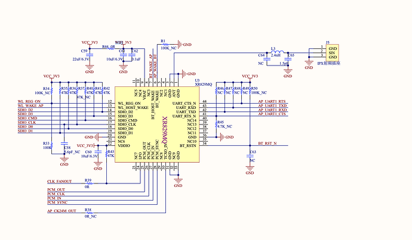

从原理图还可以得知：
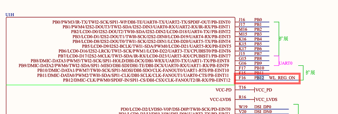

WL_REG_ON 连接到了PB12引脚。


## 设备树修改
设备树文件，位于tina-d1-h/device/config/chips/d1-h/configs/nezha/linux-5.4/board.dts
其中，默认的WL_REG_ON的配置为PG12，修改为PB12即可：
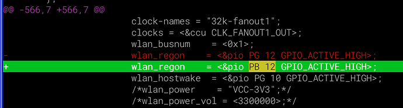

修改后结果如下：
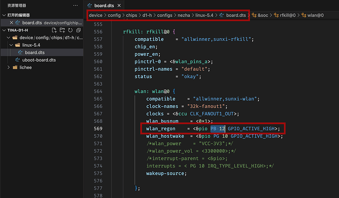

## menuconfig配置修改
另外，还需要修改对应的配置，执行make menuconfig，在按照如下步骤修改即可：
1. Kernel modules-> Wireless Drivers
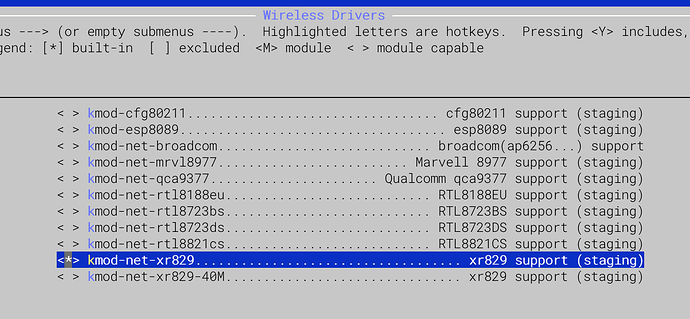

取消原有的 XR829 40M，而勾选 XR829

2. Firmware
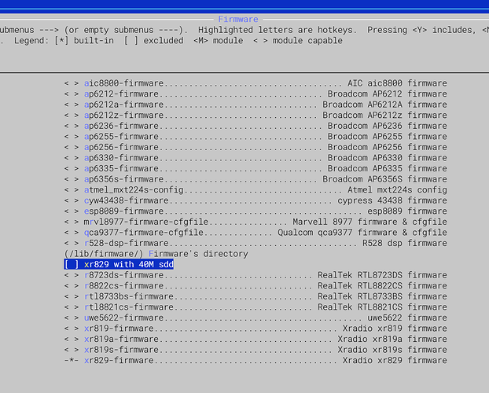
取消原有的 xr829 with 40M sdd即可

3. Network -> odhcp6c [*]
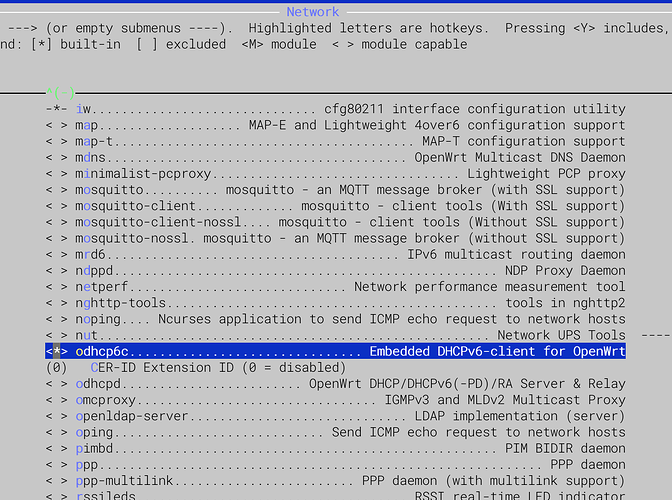
在连接到WiFi，使用DHCP获取客户端IP时，需要odcp6c来支持，否则可能出错


## 编译烧录
修改完成后，使用`make -j16 && pack` 进行编译和打包，最少结果如下：
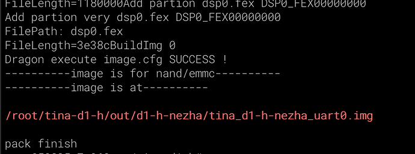

然后使用烧录工具，烧录到开发板。

## wifi设备状态查看
系统启动后，可以用adb shell或者串口连接进行操作。
再通过如下的命令，查看wifi设备启动状况：
```
dmesg | grep -i wifi -A10
```
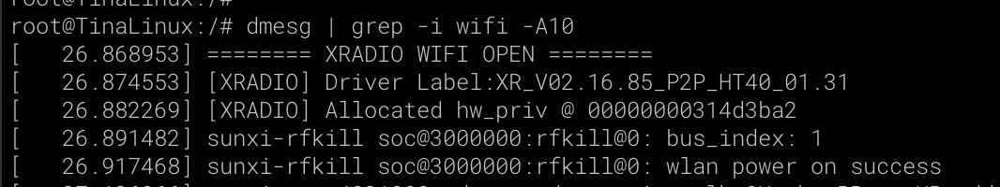

也可以查看系统内核模块加载的情况：
```
lsmod
```
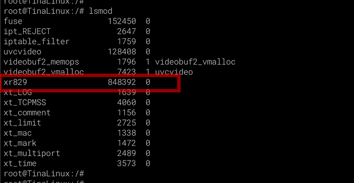

然后，再查看系统网络设备接口情况：
```
ifconfig
```
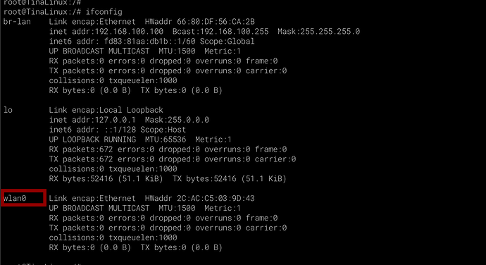

从上面的输出可以看到，xr829内核模块加载，wlan0无线网络设备也有了，后面就可以联网测试了。

## 连接到无线路由器
tina系统默认提供了一些wifi测试的调用程序，通过下面的方式可以查看：
```
# 输入后连按tab两下
wifi
```
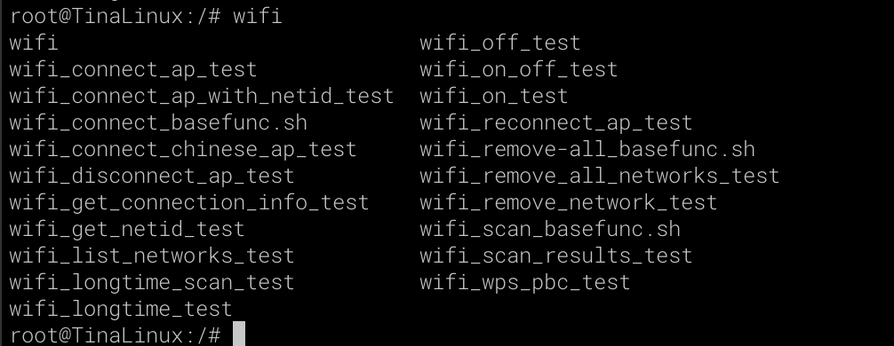

我们选取两条最核心的使用：
1 wifi_scan_results_test：扫描当前环境的无线热点
    

> ⚠️ 原文图片素材缺失：`images/2/rmfKkIIVhtvModoQss7aAzoegJF.png`


2 wifi_connect_ap_test：连接到无线热点
    

> ⚠️ 原文图片素材缺失：`images/2/u3Tn2tAAKE3OauGYDFIXlVg34jh.png`


3 wifi_disconnect_ap_test：从无线热点断开

使用 `wifi_connect_ap_test WiFi名称 WiFi密码`连接到当前环境的WiFi后，就可以使用`ifconfig`查看状态了：
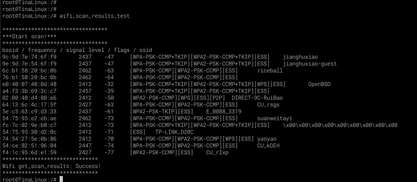
或者使用`ip addr show wlan0`查看：
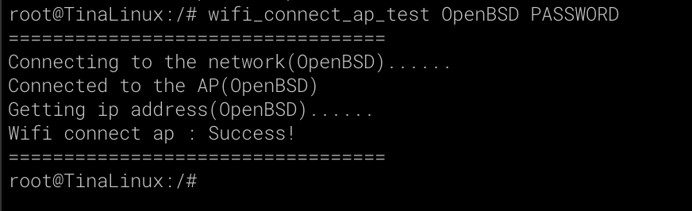

现在，就可以进行联网操作了，例如使用ping和curl：
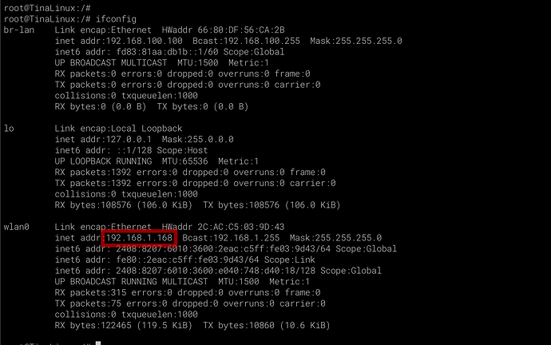
