# 官方MIPI屏幕适配

> 评测作者：HonestQiao · 本篇为社区评测文章，来自开发者实测，未经官方逐字校对。

D1系列号称点屏神器，官方为百问网D1h开发板提供了一块 480x800 MIPI显示屏。
参考 [100ASK_T113-PRO开发板适配4寸MIPI屏](https://forums.100ask.net/t/topic/3153) 以及 世大大的指导，顺利完成MIPI显示屏的适配。

## 硬件了解
从官方提供的资料，可以了解MIPI LCD对应的接口信息：
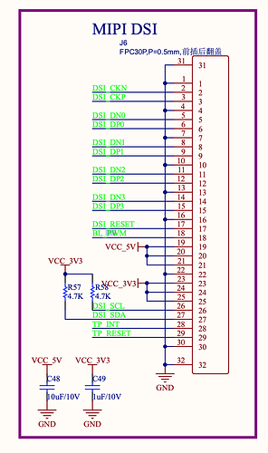

与 [100ASK_T113-PRO开发板适配4寸MIPI屏](https://forums.100ask.net/t/topic/3153) 不同的是，这里的BL_PWM，使用了PB5：
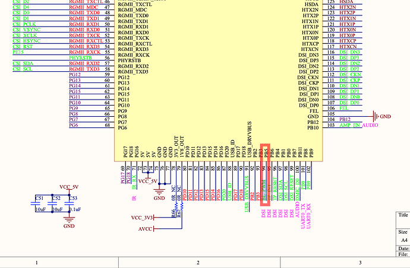

后面需要在设备树中进行修改。

## 设备树一次修改
首先参考 [100ASK_T113-PRO开发板适配4寸MIPI屏](https://forums.100ask.net/t/topic/3153)  进行初次设备树修改。

1. 修改内核设备树：
```
tina-d1-h/device/config/chips/d1-h/configs/nezha/linux-5.4/board.dts
```
使用上述文章中的配置，直接替换这个文件中 lcd0节点的配置：
```
&lcd0 {
        lcd_used            = <1>;

        lcd_driver_name     = "ili9806e";
        lcd_backlight       = <100>;
        lcd_if              = <4>;

        lcd_x               = <480>;
        lcd_y               = <800>;
        lcd_width           = <52>;
        lcd_height          = <52>;
        lcd_dclk_freq       = <25>;

        lcd_pwm_used        = <1>;
        lcd_pwm_ch          = <7>;
        lcd_pwm_freq        = <1000>;
        lcd_pwm_pol         = <1>;
        lcd_pwm_max_limit   = <255>;

        lcd_hbp             = <10>;
        lcd_ht              = <515>;
        lcd_hspw            = <5>;

        lcd_vbp             = <20>;
        lcd_vt              = <830>;
        lcd_vspw            = <5>;

        lcd_dsi_if          = <0>;
        lcd_dsi_lane        = <2>;
        lcd_dsi_format      = <0>;
        lcd_dsi_te          = <0>;
        lcd_dsi_eotp        = <0>;
        lcd_lvds_if         = <0>;
        lcd_lvds_colordepth = <0>;
        lcd_lvds_mode       = <0>;
        lcd_frm             = <0>;
        lcd_hv_clk_phase    = <0>;
        lcd_hv_sync_polarity= <0>;
        lcd_io_phase        = <0x0000>;
        lcd_dsi_te          = <0>;
        lcd_gamma_en        = <0>;
        lcd_bright_curve_en = <0>;
        lcd_cmap_en         = <0>;
        lcd_fsync_en        = <0>;
       lcd_fsync_act_time  = <1000>;
       lcd_fsync_dis_time  = <1000>;
        lcd_fsync_pol       = <0>;

        deu_mode            = <0>;
        lcdgamma4iep        = <22>;
        smart_color         = <90>;

        lcd_gpio_0 =  <&pio PG 13 GPIO_ACTIVE_HIGH>;
        pinctrl-0 = <&dsi4lane_pins_a>;
        pinctrl-1 = <&dsi4lane_pins_b>;
};
```

2. 修改uboot设备树：
```
tina-d1-h/device/config/chips/d1-h/configs/nezha/uboot-board.dts
```
同样替换原有的lcd0节点：
```
&lcd0 {
        lcd_used            = <1>;

        lcd_driver_name     = "ili9806e";
        lcd_backlight       = <100>;
        lcd_if              = <4>;

        lcd_x               = <480>;
        lcd_y               = <800>;
        lcd_width           = <52>;
        lcd_height          = <52>;
        lcd_dclk_freq       = <25>;

        lcd_pwm_used        = <1>;
        lcd_pwm_ch          = <7>;
        lcd_pwm_freq        = <1000>;
        lcd_pwm_pol         = <0>;
        lcd_pwm_max_limit   = <255>;

        lcd_hbp             = <10>;
        lcd_ht              = <515>;
        lcd_hspw            = <5>;

        lcd_vbp             = <20>;
        lcd_vt              = <830>;
        lcd_vspw            = <5>;

        lcd_dsi_if          = <0>;
        lcd_dsi_lane        = <2>;
        lcd_lvds_if         = <0>;
        lcd_lvds_colordepth = <0>;
        lcd_lvds_mode       = <0>;
        
		lcd_frm             = <0>;
        lcd_hv_clk_phase    = <0>;
        lcd_hv_sync_polarity= <0>;
        lcd_io_phase        = <0x0000>;
        lcd_dsi_te          = <0>;
        lcd_gamma_en        = <0>;
        lcd_bright_curve_en = <0>;
        lcd_cmap_en         = <0>;
        lcd_fsync_en        = <0>;
        lcd_fsync_act_time  = <1000>;
        lcd_fsync_dis_time  = <1000>;
        lcd_fsync_pol       = <0>;

        deu_mode            = <0>;
        lcdgamma4iep        = <22>;
        smart_color         = <90>;

        lcd_gpio_0 =  <&pio PG 13 GPIO_ACTIVE_HIGH>;
        pinctrl-0 = <&dsi4lane_pins_a>;
        pinctrl-1 = <&dsi4lane_pins_b>;
};
```

## 二次修改设备树
1. 修改内核设备树pwm0的配置：
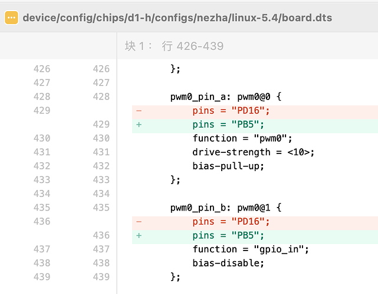

2. 修改内核设备树 lcd0中的lcd_pwm_ch为pwm0：
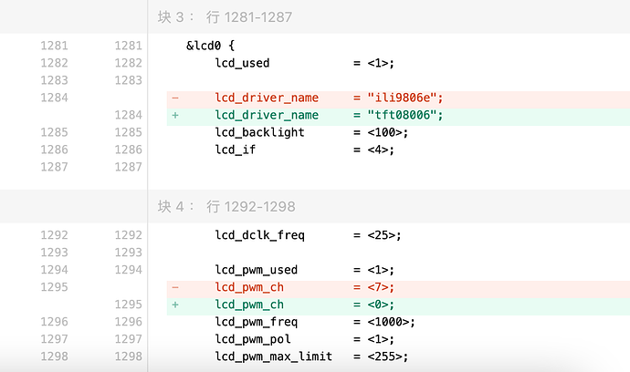
其中的lcd_driver_name 可修改，也可不修改。

3. 修改uboot设备树中lcd0的配置：
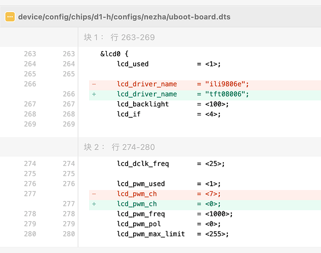
同上，其中的lcd_driver_name 可修改，也可不修改。两者要保持一致。

## 驱动程序
驱动程序参考 [100ASK_T113-PRO开发板适配4寸MIPI屏](https://forums.100ask.net/t/topic/3153) 即可，最终版本如下：
[tina-d1-h-mipi-lcd.zip|attachment](images/3/lpL5enVXlGXGnTUJ3tEJ09oXjJ4.zip) (27.8 KB)
包含了设备树的修改，以及WiFi的启用。
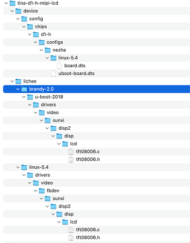

注意，内核和uboot驱动tft08006.c中的name配置，必须和设备树中配置的一致：
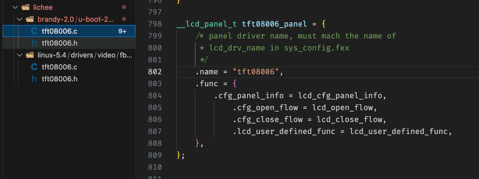

## 配置修改
官方提供的源码包中，已经启用了屏幕支持，可以通过如下命令查看
```
grep -E 'CONFIG_LCD_SUPPORT_TFT08006' ./lichee/linux-5.4/.config
grep -E 'CONFIG_DISP2_SUNXI|CONFIG_LCD_SUPPORT_TFT08006' ./lichee/brandy-2.0/u-boot-2018/.config
```
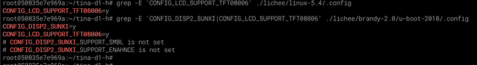

如果没有开启，可以用vim修改上面两个文件，设置以上的选项为y即可

另外，还需要启用lvgl测试程序，以便启动后，可以马上试用MIPI屏幕显示效果。
在`make menuconfig`中的 `Gui -> Littlevgl`部分，做如下的修改：
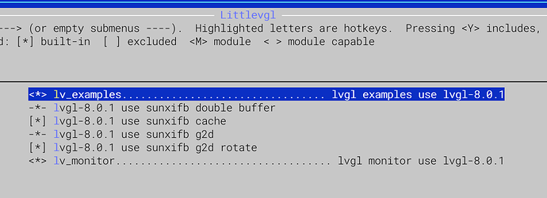

## 编译烧录
修改完成后，就可以进行编译打包`make -j16 && pack`，最终结果如下：
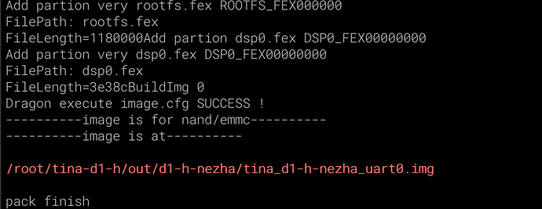

然后使用烧录工具进行烧录即可。

## MIPI LCD测试
将 MIPI LCD和板子连接好，注意连接正确：
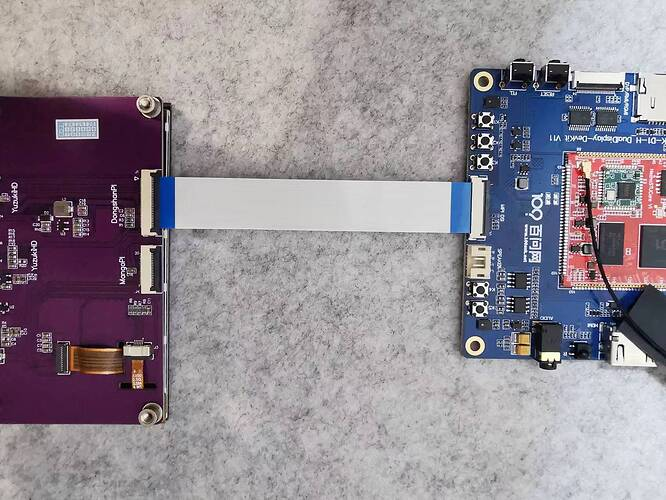

然后用adb shell或者串口连接进行操作。

1. 查看系统连接的屏幕状态：
```
cat /sys/devices/virtual/disp/disp/attr/sys
```
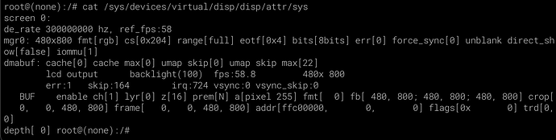
从上面的输出可以看到当前的MIPI LCD状态

2. 使用系统接口直接测试MIPI LCD
```
# 切换到MIPI LCD显示屏
cd /sys/kernel/debug/dispdbg
echo disp0 > name; echo switch1 > command; echo 1 4 0 0 0x4 0x101 0 0 0 8 > param; echo 1 > start;

# 显示色块
echo 1 > /sys/class/disp/disp/attr/colorbar
# 显示方格
echo 7 > /sys/class/disp/disp/attr/colorbar 
```
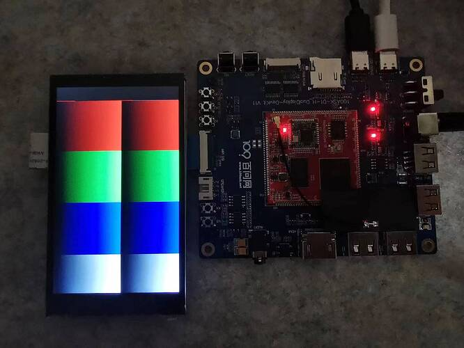
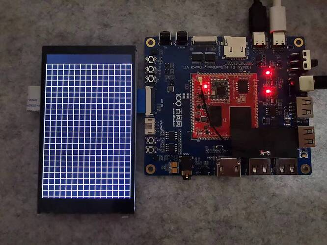

3. 使用lvgl测试用例
首先使用 lv_monitor 查看一下系统监控信息：
```
lv_monitor
```
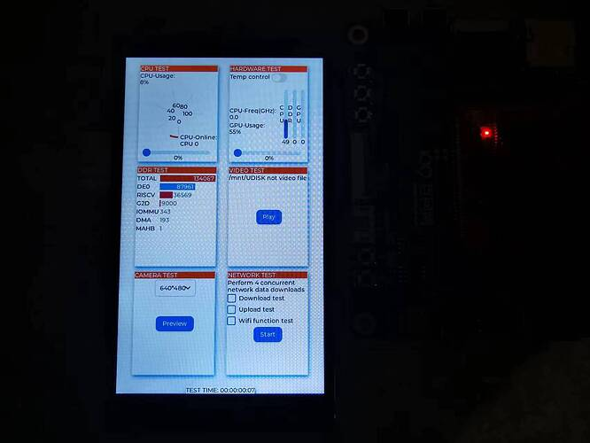

然后，使用 lv_examples进行测试：
```
lv_examples 9999
```
会输出如下结果，表示有5个测试用例可用：
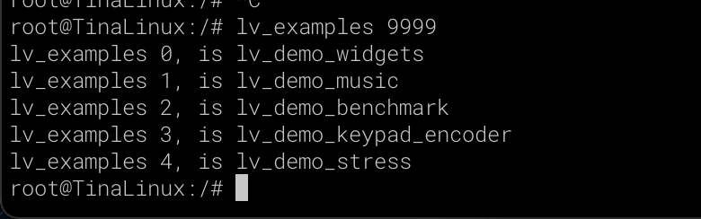

大家可以依次测试看看效果如何。

这里就展示`lv_examples 0`，结果如下：
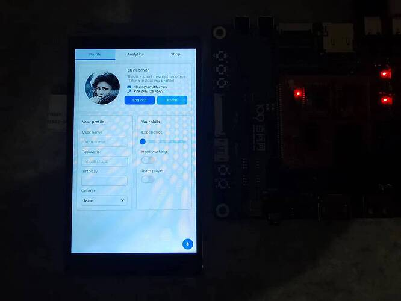

3. 视频播放
首先，使用adb推一个视频到板子上：
```
adb push ~/Downloads/跳舞视频1.mp4 /tmp/test2.mp4
```
然后在板子上，进行播放：
```
tplayerdemo /tmp/test2.mp4
```
播放fw'ih'd非常的流畅：
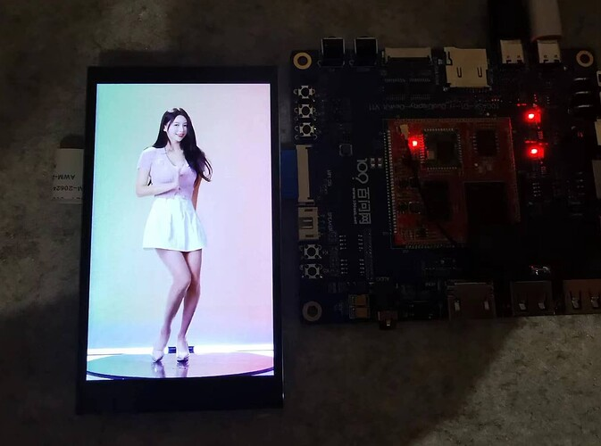


## 补充
暂时只是适配了屏幕显示，触摸即将适配上，后面再分享。
