# 官方MIPI屏幕触摸功能适配

> 评测作者：HonestQiao · 本篇为社区评测文章，来自开发者实测，未经官方逐字校对。

【百问网D1h开发板】官方MIPI屏幕触摸功能适配

在前面的分享 【【百问网D1h开发板】官方MIPI屏幕适配】中，完成了官方屏幕显示功能的适配，这里再进一步，进行触摸功能的适配。
触摸功能的实现，参考了 [100ASK_V853-PRO开发板支持4寸MIPI屏](https://forums.100ask.net/t/topic/2979)，以及世玉轩大佬的指点。

## 硬件了解
首先，还是从官方提供的资料，可以了解MIPI LCD对应的接口信息：
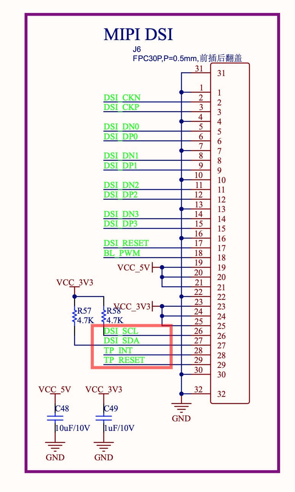
触摸功能涉及到DSI_SCL、DSI_SDA、TP_INT、TP_RESET。

从芯片的引脚图里面，可以了解到：
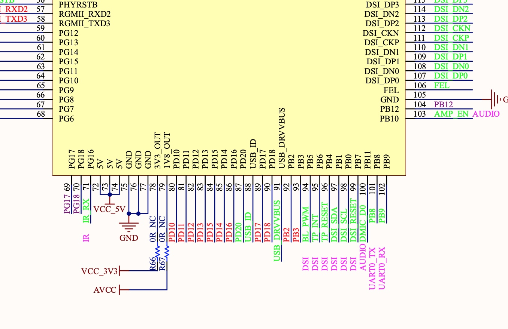

其中：
* DSI_SCL、DSI_SDA使用的是PB0、PB1
* TP_INT和TP_RESET使用的是：PB6、PB4


## 设备树修改
参考 [嵌入式开发问答社区100ASK_V853-PRO开发板支持4寸MIPI屏](https://forums.100ask.net/t/topic/2979/1)  进行设备树修改。

设备树文件：
```
tina-d1-h/device/config/chips/d1-h/configs/nezha/linux-5.4/board.dts
```
1. 检查设备树中的twi2_pins_a、twi2_pins_b的配置：
```
	twi2_pins_a: twi2@0 {
		pins = "PB0", "PB1";
		function = "twi2";
		drive-strength = <10>;
	};

	twi2_pins_b: twi2@1 {
		pins = "PB0", "PB1";
		function = "gpio_in";
	};
```
确保其中引脚与前面硬件了解中的一致。

2. 修改触摸屏的配置：
```
&twi2 {
	clock-frequency = <400000>;
	pinctrl-0 = <&twi2_pins_a>;
	pinctrl-1 = <&twi2_pins_b>;
	pinctrl-names = "default", "sleep";
	dmas = <&dma 45>, <&dma 45>;
	dma-names = "tx", "rx";
	status = "okay";

	ctp@38 {
		compatible = "focaltech,fts";
		reg = <0x00000038>;
		status = "okay";
		interrupt-parent = <&pio>;
		interrupts = <PB 6 IRQ_TYPE_LEVEL_LOW>;
		focaltech,reset-gpio = <&pio PB 4 GPIO_ACTIVE_HIGH>;
		focaltech,irq-gpio = <&pio PB 6 IRQ_TYPE_LEVEL_LOW>;
		focaltech,max-touch-number = <5>;
		focaltech,display-coords = <0 0 800 480>;
		focaltech,reg_vdd = <0x0000001f>;
		focaltech,reg_avdd = <0x0000001f>;
		#touchscreen-inverted-x = <0x00000001>;
		#touchscreen-inverted-y = <0x00000001>;
	};
};
```
确保其中引脚与前面硬件了解中的一致。

## 驱动程序
如果不修改驱动程序，触摸功能也能使用上，但是x轴是左右反向的，y轴也是如此，在设备树中不能定义处理，需要修改驱动程序。
具体如下。

驱动文件：
```
lichee/linux-5.4/drivers/input/touchscreen/focaltech_touch/focaltech_core.c
```

修改xy坐标返回值：
```
# 默认：
			input_report_abs(data->input_dev, ABS_MT_POSITION_X, event->au16_x[i]);
			input_report_abs(data->input_dev, ABS_MT_POSITION_Y, event->au16_y[i]);

# 修改为：
			input_report_abs(data->input_dev, ABS_MT_POSITION_X, 480-event->au16_x[i]);
			input_report_abs(data->input_dev, ABS_MT_POSITION_Y, 800-event->au16_y[i]);
```
因为屏幕是480x800的，所以直接用对应的宽高减去获得的值即可。

## 配置修改
1. 通用配置修改：
```
make menuconfig
```
选择：`Kernel modules > Input modules -> kmod-input-core[*]`
选择：`Kernel modules > Input modules -> kmod-touchscreen-focaltech[*]   # 其他触屏不选`
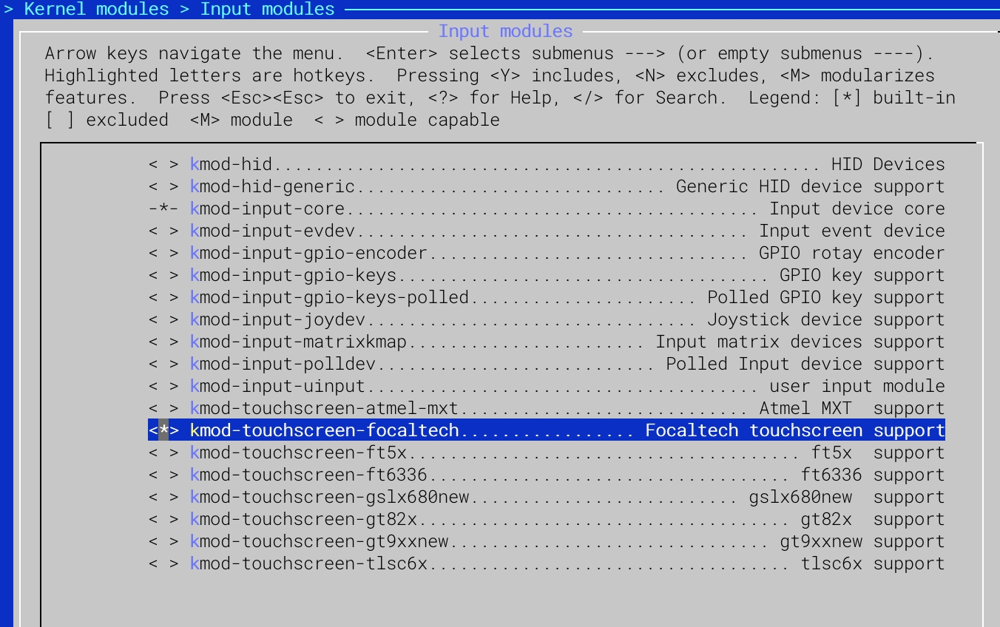

2. 内核配置修改：
```
make kernel_menuconfig
```
选择：`Device Drivers > Input device support > Touchscreens -> Focaltech Touchscreen [*] # 其他不选`
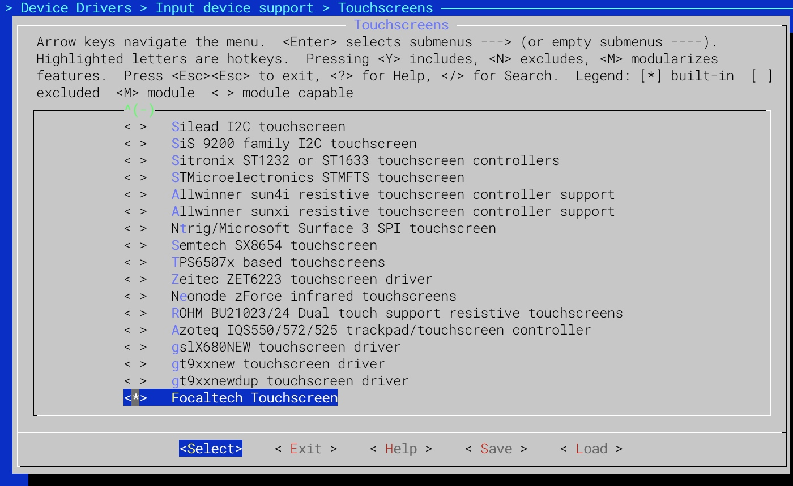


## 编译烧录
修改完成后，就可以进行编译打包`make -j16 && pack`，最终结果如下：
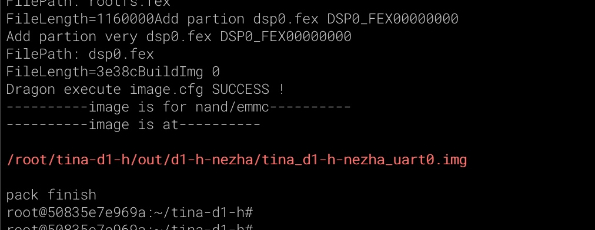


然后使用烧录工具进行烧录即可。

## MIPI LCD测试
将 MIPI LCD和板子连接好，注意连接正确：


然后用adb shell或者串口连接进行操作。

1. 查看系统连接的触摸设备：
```
cat /dev/input/
```
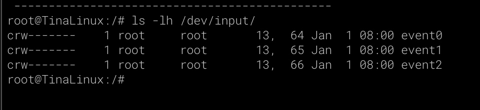

从上面的输出可以看到event2，表示识别到了。

再看看系统启动输出信息中，对应的适配信息：
```
dmesg | grep -A4 -B4 fts
```
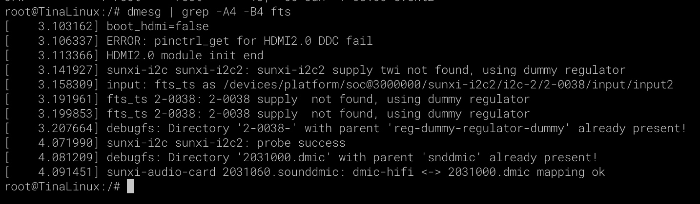

可以看到，已经成功适配，没有出错信息。

2. 直接查看设备返回信息检查触摸是否有效：
```
cat /dev/input/event2  | hexdump -x
```
执行后，点击屏幕任一位置，有返回，说明能够接收到触摸数据了：
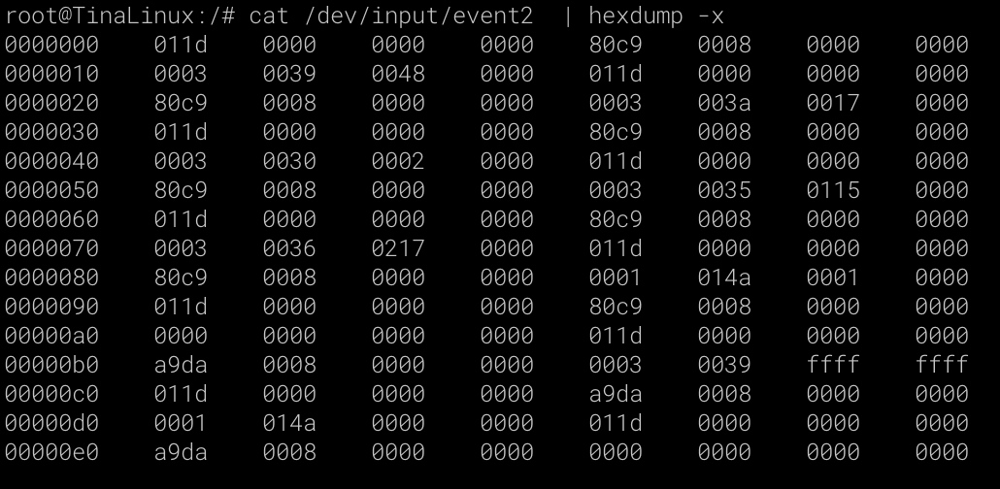


3. 屏幕校准
初次使用屏幕时，需要进行屏幕校准，确保点击位置准确，以免发生偏差。
```
## 触屏校准
export TSLIB_CALIBFILE=/etc/pointercal
export TSLIB_CONFFILE=/etc/ts.conf
export TSLIB_PLUGINDIR=/usr/lib/ts
export TSLIB_CONSOLEDEVICE=none
export TSLIB_FBDEVICE=/dev/fb0
export TSLIB_TSDEVICE=/dev/input/event2
ts_calibrate
```
执行后，输出如下：
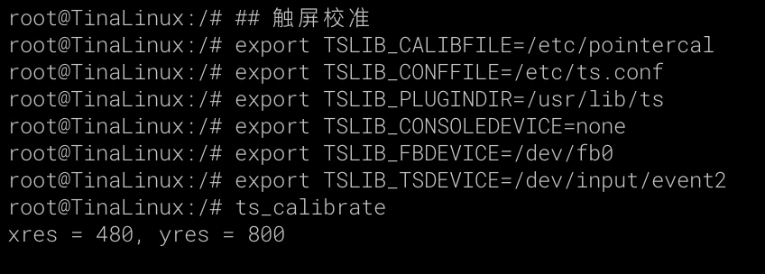

此时屏幕显示如下：
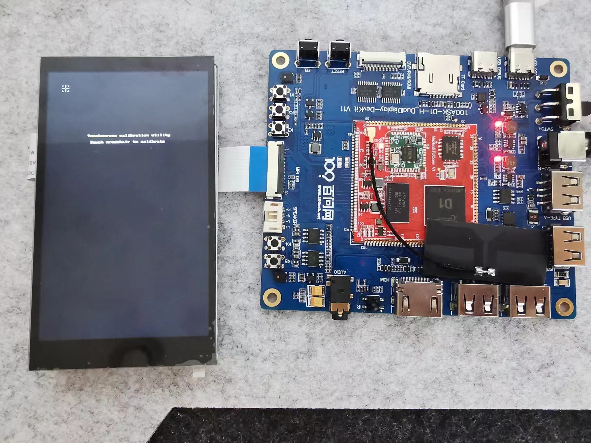

点击左上角的那个 + ，又会出现下一个，依次点击：左上、右上、右下、左下、中间，最后黑屏。

输出信息如下：
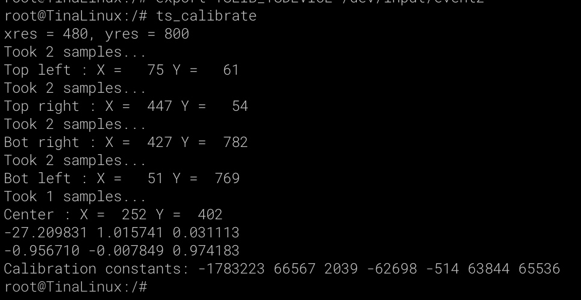

点击的时候，如果点左上角，发现X值是400+，Y值是700+，那铁定是前面的驱动文件没有修改或者修改不对，或者修改了没有重新编译烧录。

校准完成后，重启生效：
```
sudo reboot -d 0
```

4. 使用lvgl测试用例
在使用lv_examples之前，需要做一些修改，使得触摸使用/dev/input/event2
文件：
```
~/tina-d1-h/package/gui/littlevgl-8lv_examples/src/lv_drv_conf.h
```
修改：
```
define EVDEV_NAME   "/dev/input/event2"
```
修改完成后，重新编译烧录即可。

然后，使用 lv_examples进行测试：
```
lv_examples 9999
```
会输出如下结果，表示有5个测试用例可用：


大家可以依次测试看看效果如何。

这里就展示`lv_examples 0`，结果如下：
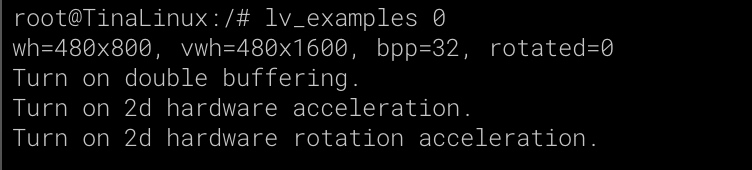

屏幕显示如下：
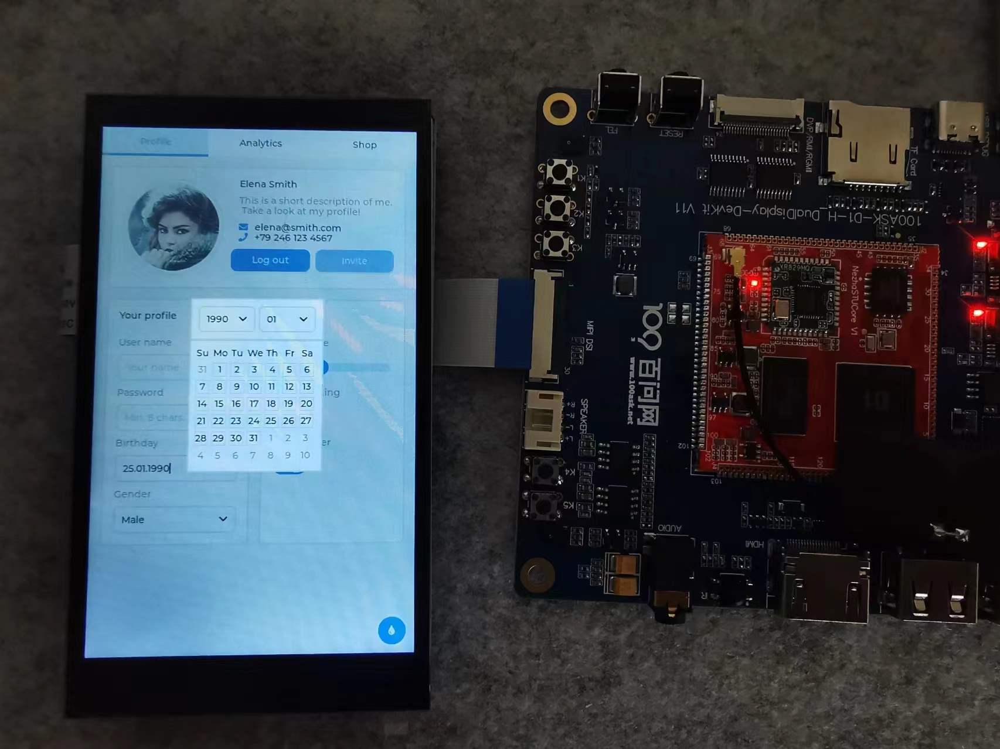

左右滑动，上下滑动，或者点击屏幕上的输入位置，就能够进行操作了。
触摸操作的时候，如果发现上面点了下面动，下面点了上面动，或者滑动刚好和实际方向相反，那铁定是前面的驱动文件没有修改或者修改不对，或者修改了没有重新编译烧录。

现在，屏幕适配好了，触摸也适配好了，后面就可以学学LVGL，来进行界面和互动设计开发了。
