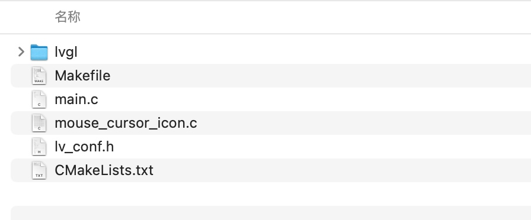
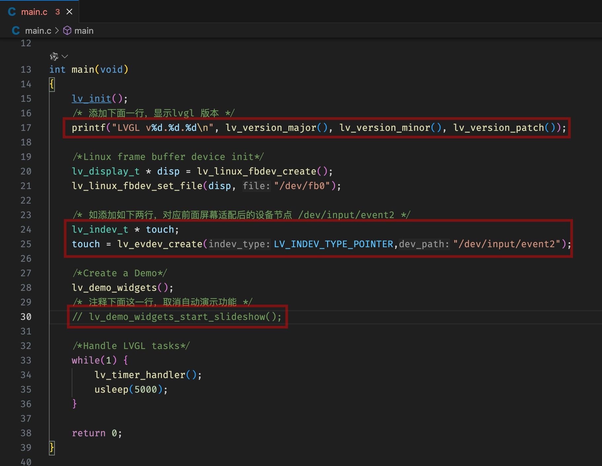
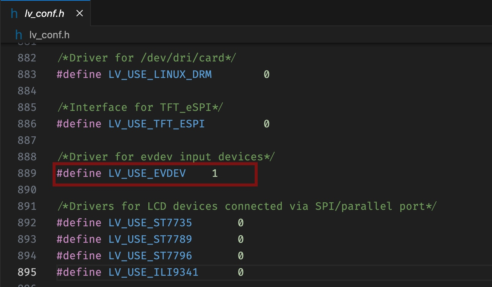
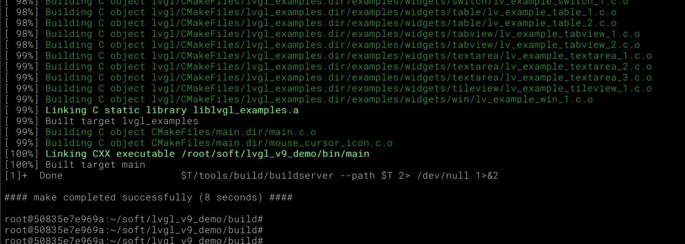
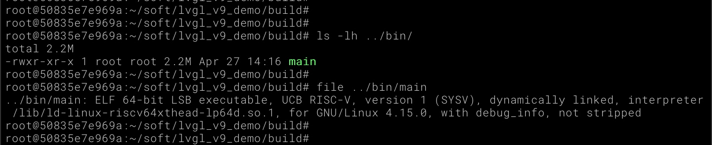
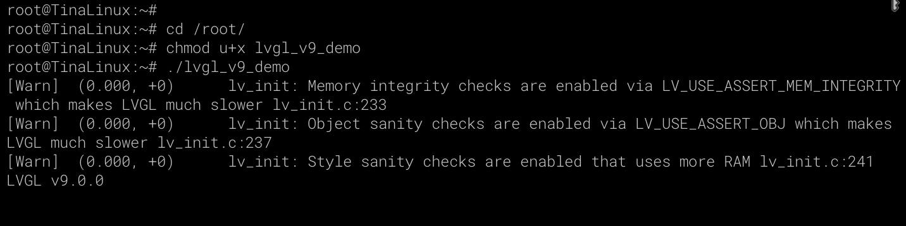
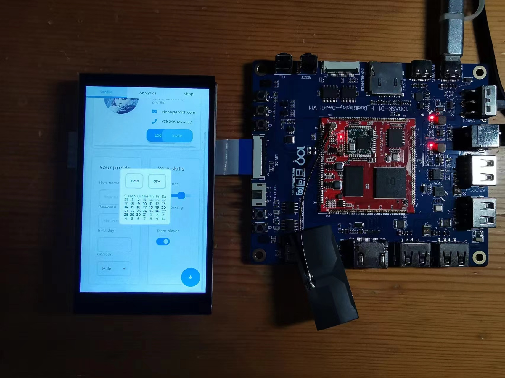

# LVGL9移植

> 评测作者：HonestQiao · 本篇为社区评测文章，来自开发者实测，未经官方逐字校对。

目前官方给【百问网D1h开发板】提供的TinaSDK中，集成了littlevgl，不过版本是8.0.1，现在LVGl官方已经升级到了9.0版本了。
经过了解，参考 [移植lvgl v9到嵌入式linux设备](https://blog.csdn.net/weixin_63773568/article/details/136913352)，将LVGL v9移植到了【百问网D1h开发板】上。

## lv_port_linux_frame_buffer源码准备
在Linux，LVGL v9可以使用标准的framebuffer，因此，只需要使用lv_port_linux_frame_buffer即可。
首先，下载 lv_port_linux_frame_buffer 的源码：
```
git clone git@github.com:lvgl/lv_port_linux_frame_buffer.git
cd lv_port_linux_frame_buffer
git checkout release/v9.0
git submodule update --init --recursive
```
在上面的命令中，切换到了v9.0版本，更为稳定。
因为 lv_port_linux_frame_buffer 设置了各分支版本绑定的 lvgl版本，所以直接使用 git submodule 即可下载。

## 移植文件准备
上一步已经下载了所有需要的源码，我们只需要把实际需要使用的源码提取出来即可，按照如下命令操作：
```
mkdir lvgl_v9_demo
cd lvgl_v9_demo
mkdir lvgl
cp ../lv_port_linux_frame_buffer/{CMakeLists.txt,Makefile,main.c,lv_conf.h,mouse_cursor_icon.c} ./
cp -r ../lv_port_linux_frame_buffer/lvgl/* lvgl/
```
最终文件和目录如下：

这是一个cmake工程，后续我们想要开发自己的项目，可以把这个目录复制一份即可。

然后，打开 `main.c`，修改如下：
```
#include "lvgl/lvgl.h"
#include "lvgl/demos/lv_demos.h"
#include <unistd.h>
#include <pthread.h>
#include <time.h>
#include <stdio.h>

int main(void)
{
    lv_init();
    /* 添加下面一行，显示lvgl 版本 */
    printf("LVGL v%d.%d.%d\n", lv_version_major(), lv_version_minor(), lv_version_patch());

    /*Linux frame buffer device init*/
    lv_display_t * disp = lv_linux_fbdev_create();
    lv_linux_fbdev_set_file(disp, "/dev/fb0");

    /* 如添加如下两行，对应前面屏幕适配后的设备节点 /dev/input/event2 */
    lv_indev_t * touch;
    touch = lv_evdev_create(LV_INDEV_TYPE_POINTER,"/dev/input/event2");

    /*Create a Demo*/
    lv_demo_widgets();
    /* 注释下面这一行，取消自动演示功能 */
    // lv_demo_widgets_start_slideshow();

    /*Handle LVGL tasks*/
    while(1) {
        lv_timer_handler();
        usleep(5000);
    }

    return 0;
}
```



再修改 `lv_conf.h`，启用evdev，以便使用触摸功能
```
/*Driver for evdev input devices*/
#define LV_USE_EVDEV    1
```


经过上面的处理，移植代码就准备好了。

## 编译LVGL v9
在编译之前，需要先安装最新版本的cmake和automake-1.16版本，具体步骤如下：
```
# 安装cmake
wget https://github.com/Kitware/CMake/releases/download/v3.29.2/cmake-3.29.2-linux-x86_64.sh
chmod u+x cmake-3.29.2-linux-x86_64.sh
./cmake-3.29.2-linux-x86_64.sh --prefix=/usr/local
# 按照提示，第一次输入Y，第二次输入N

# 安装 automake-1.16
wget https://ftp.gnu.org/gnu/automake/automake-1.16.tar.gz
tar xzvf automake-1.16.tar.gz
cd automake-1.16
./configure --prefix=/usr/local
make && make install

# 优先使用安装的版本，位于/usr/loca/bin目录中
export PATH=/usr/loca/bin:$PATH
```

然后，即可进行实际的编译工作：
```
cd lvgl_v9_demo
mkdir build
cd build
export TOOLCHAIN_ROOT=~/tina-d1-h/prebuilt/gcc/linux-x86/riscv/toolchain-thead-glibc/riscv64-glibc-gcc-thead_20200702
export PATH=$TOOLCHAIN_ROOT/bin:$PATH
cmake -DCMAKE_C_COMPILER=$TOOLCHAIN_ROOT/bin/riscv64-unknown-linux-gnu-gcc\
      -DCMAKE_CXX_COMPILER=$TOOLCHAIN_ROOT/bin/riscv64-unknown-linux-gnu-g++\
      -DCMAKE_SYSTEM_NAME=Linux \
      -DCMAKE_SYSTEM_PROCESSOR=arm \
      ..

make # 可以根据cpu核数，使用 -jN 参数来加速
```
注意，我的 tina-d1-h 源码位于 ~/tina-d1-h。如果你的 tina-d1-h 源码在其他位置，记得修改工具链 TOOLCHAIN_ROOT 配置。

编译完成后，结果如下：


在 lvgl_v9_demo/bin 目录中，有编译后的执行文件：


## 测试
使用 adb 或者网络，将main上传到开发板的Tina系统中：
```
adb push bin/main /root/lvgl_v9_demo
```

然后，在开发板上执行：
```
cd /root
chmod u+x lvgl_v9_demo
./lvgl_v9_demo
```
执行后，输出如下：


屏幕显示效果如下：



## 补充
因为是直接移植的，使用framebuffer，还没有使用到sunxifb、g2d等硬件加速功能，所以在切面切换的时候，会比集成的版本稍微要慢一点点，不过实际显示效果还是不错的。后面有时间，再考虑适配硬件加速功能。
