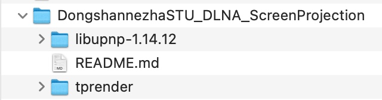
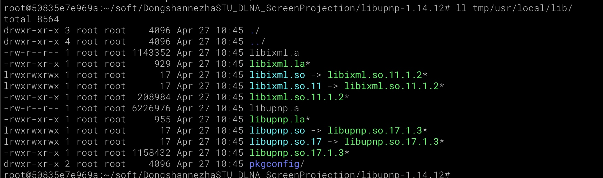
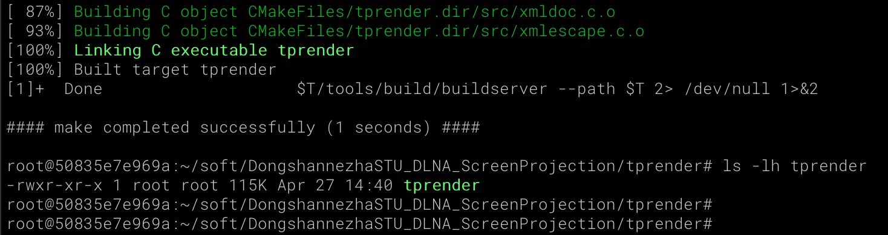
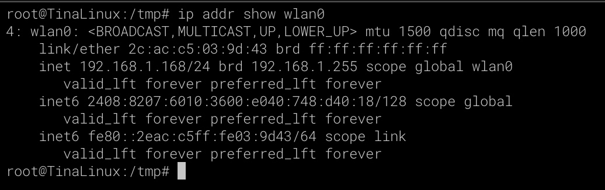
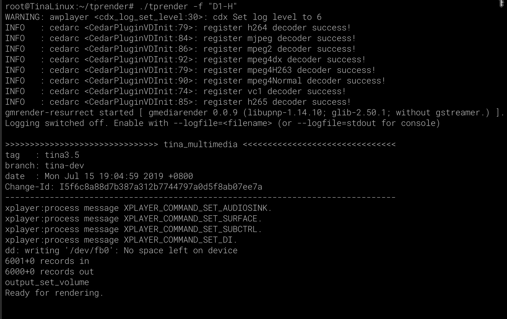

# 投屏功能实现

> 评测作者：HonestQiao · 本篇为社区评测文章，来自开发者实测，未经官方逐字校对。

D1系列号称点屏神器，不仅能点屏，还能用于投屏。
参考 [哪吒D1编译配置DLNA客户端进行B站投屏](https://whycan.com/p_97704.html) ，实现了投屏功能。

## 源码准备
百问网为 【百问网D1h开发板】提供了投屏功能需要使用的源码，直接git下载即可：
```
git clone https://github.com/DongshanPI/DongshannezhaSTU_DLNA_ScreenProjection.git
```
下载后的源码目录如下：


其中：
* libupnp是UPNP协议的一个轻量实现库。它最早由英特尔开发并开源，是目前Linux平台最流行的UPNP实现库，其官网为：[http://pupnp.sourceforge.net/](http://pupnp.sourceforge.net/)，集成了HTTP处理、XML处理、HTTP服务器、线程池等功能。
* tprender是用于实际投屏处理的应用

## 源码编译
源码分为两部分进行编译，先编译libupnp得到动态调用库，再编译tprender。
1. libupnp编译
```
export TOOLCHAIN_ROOT=~/tina-d1-h/prebuilt/gcc/linux-x86/riscv/toolchain-thead-glibc/riscv64-glibc-gcc-thead_20200702
export PATH=$TOOLCHAIN_ROOT/bin:$PATH

cd DongshannezhaSTU_DLNA_ScreenProjection/libupnp-1.14.12
./configure --host=riscv64-unknown-linux-gnu

make 
mkdir tmp
make install DESTDIR=$(pwd)/tmp/

ls -lh tmp/usr/local/lib
```
编译安装后的结果如下：


2. tprender编译
```
cd DongshannezhaSTU_DLNA_ScreenProjection/tprender

# 设置正确的目录
perl -pi -e 's#/home/book/tina-d1-h#/root/tina-d1-h#g' $(grep -rn /home/book/tina-d1-h * | cut -d ':' -f 1 | uniq)
perl -pi -e 's#/home/book/Allwinner/tprender#'$(pwd)'#g' $(grep -rn /home/book/Allwinner/tprender * | cut -d ':' -f 1 | uniq)
perl -pi -e 's#\\/home\\/book\\/Allwinner\\/tprender#'$(pwd | sed -e 's#/#\\\\/#g')'#g' tags
rm -rf CMakeFiles cmake_install.cmake  CMakeCache.txt tags

# 拷贝动态调用库
cp ../libupnp-1.14.12/tmp/usr/local/lib/libixml.so.11.1.2 libs/libixml.so
cp ../libupnp-1.14.12/tmp/usr/local/lib/libixml.so.11.1.2 libs/libixml.so.11
cp ../libupnp-1.14.12/tmp/usr/local/lib/libupnp.so.17.1.3 libs/libupnp.so
cp ../libupnp-1.14.12/tmp/usr/local/lib/libupnp.so.17.1.3 libs/libupnp.so.17

cmake .
make
```
需要注意，上面使用perl进行文件内路径替换的操作，需要根据你的实际的文件路径进行处理。

编译结果如下：


现在tprender已经准备好了，下面就进行开发板上的操作了。

## 投屏测试
### 联网
首先，使用adb或者网络，将tprender上传到开发板：
```
adb push tprender /root/
adb push libs /root/
```

然后，到开发板上进行操作，先进行联网：
```
wifi_connect_ap_test WiFi名称 WiFi密码
udhcpc -i wlan0
ip addr show wlan0
```
结果要正确显示获取到了IP：


此时，应在其他电脑上，ping上面的IP，确保可以联通。

### 启动投屏接收
再开启tprender提供投屏功能：
```
# 切换到HDMI播放
cd /sys/kernel/debug/dispdbg
echo disp0 > name; echo switch1 > command; echo 4 10 0 0 0x4 0x101 0 0 0 8 > param; echo 1 > start
echo 1 > /sys/class/disp/disp/attr/colorbar
echo 0 > /sys/class/disp/disp/attr/colorbar 

# 切换HDMI音频
sed -i -e 's#playback.pcm ".*"#playback.pcm "PlaybackHDMI"#' /etc/asound.conf
grep playback.pcm /etc/asound.conf

# 启动投屏接收
cd /root
chmod u+x tprender
./tprender -f "D1-H"
```
执行后，输出如下：


从上面的输出可以看到，成功启动，等待投屏。

### B站播放投屏
此时，打开手机B站，播放一个4K视频，然后投屏小图标，就能找到 D1-H 投屏设备了：


> ⚠️ 原文图片素材缺失：`images/assets/17144089042681.jpg`


点击D1-H，就能在 【百问网D1h开发板】 的屏幕上播放了：


> ⚠️ 原文图片素材缺失：`images/assets/17144088704798.jpg`


播放的效果非常的不错，十分流畅。

而且，播放的时候，即使把手机B站给关了，也能继续播放。看来，是把流媒体地址给直接发送过去了。


### 电脑播放投屏
在电脑上，打开流媒体服务的页面，例如 twonky，媒体接收器选择D1-H，然后选择一个视频播放，就会出现播放弹窗，显示投屏到了D1-H：


> ⚠️ 原文图片素材缺失：`images/assets/17144094354748.jpg`


 
【百问网D1h开发板】 的屏幕上，也开始播放了：
 


> ⚠️ 原文图片素材缺失：`images/assets/17144099400282.jpg`


