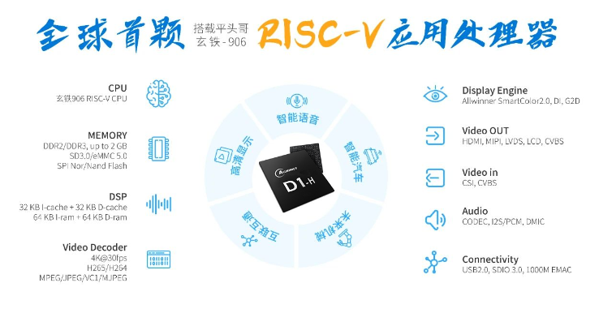
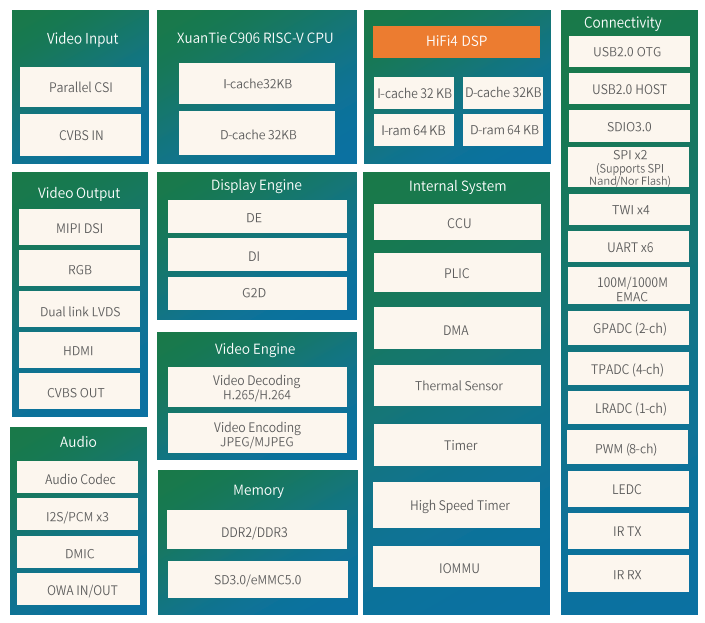
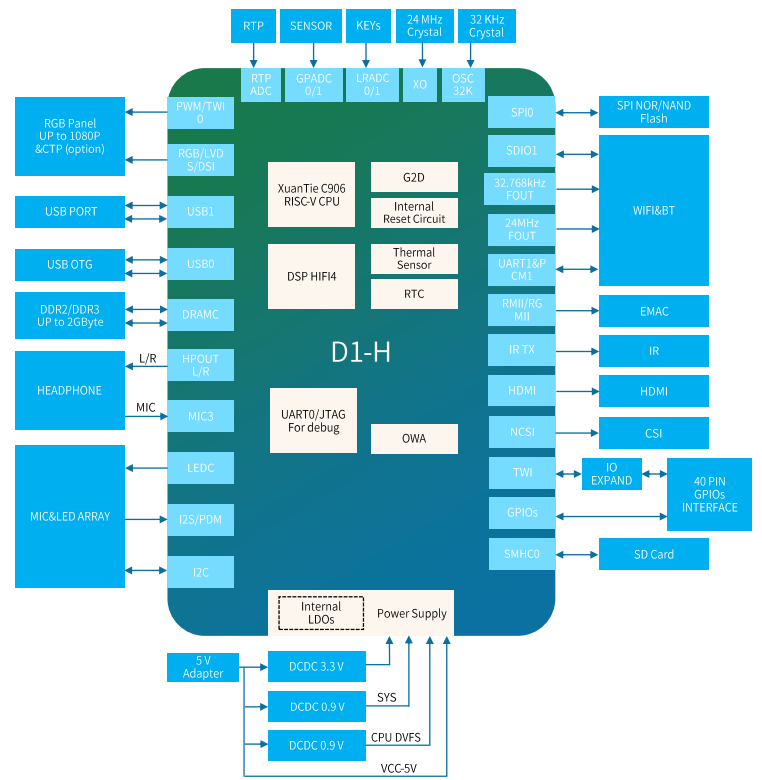
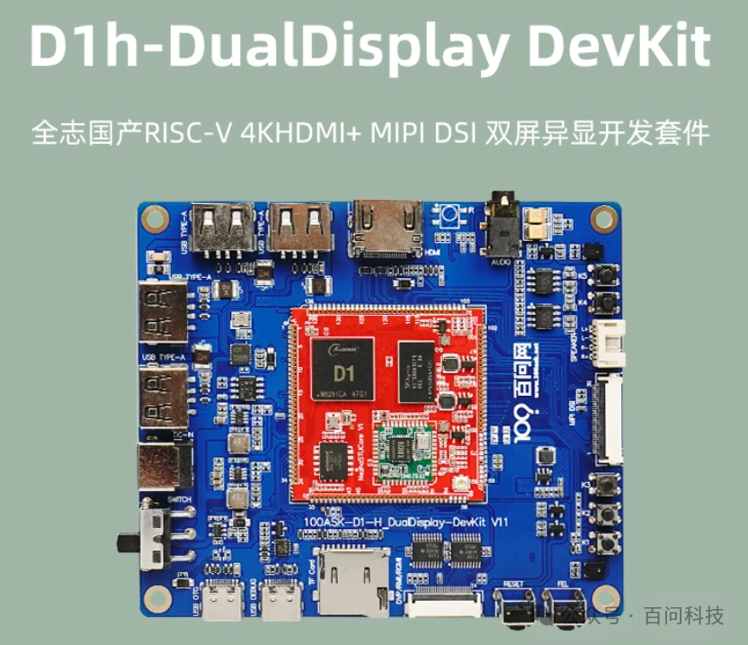
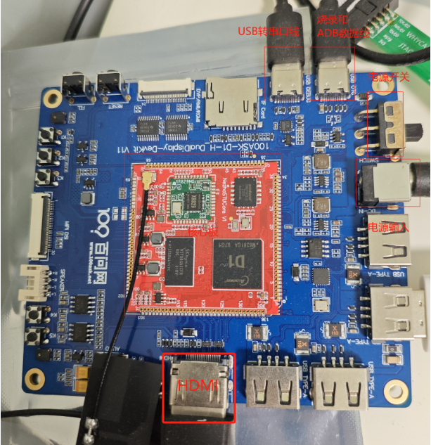
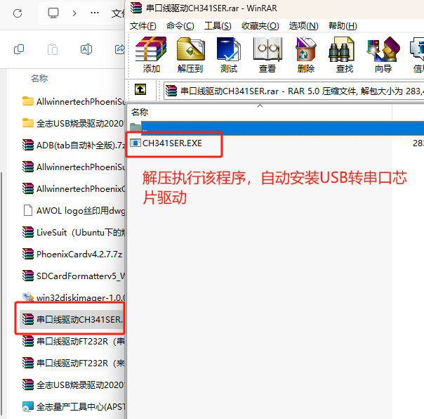
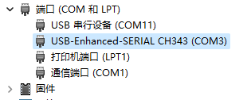
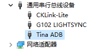

# 单板介绍及基础使用

> 评测作者：Jason · 本篇为社区评测文章，来自开发者实测，未经官方逐字校对。

# 开发板介绍

## SOC相关

### SOC介绍

**D1-H 是全志科技首款基于RISC-V指令集的芯片，集成了阿里平头哥64位C906核心，支持RVV，1GHz+主频，可支持Linux、RTOS等系统。同时支持最高4K的H.265/H.264解码，内置一颗HiFi4 DSP，最高可外接2GB DDR3，可以应用于智慧城市、智能汽车、智能商显、智能家电、智能办公和科研教育等多个领域。**

### 特性

| **CPU** | **XuanTie C906 RISCV CPU  32 KB I-cache + 32 KB D-cache** |
| ------- | ------------------------------------------------------------ |
| **DSP** | **HiFi4 32 KB l-cache + 32 KB D-cache 64 KB I-ram + 64KB D-ram** |
| **Memory** | **DDR2/DDR3,up to 2 GB SD3.0/eMMC5.0, SPI Nor/Nand Flash** |
| **Video Engine** | **Video decoding   -H.265 up to 1080p@60fps, or 4K@30fps   -H.264 up to 1080p@60fps,or 4K@24fps   -MPEG-1/2/4,JPEG,VCl up to 1080p@60fps Video encoding   -JPEG/MJPEG up to 1080p@60fps   -Supports input picture scaler up/down** |
| **Display Engine** | **AllwinnerSmartColor2.0 post processing for anexcellent display experience Supports de-interlace (Dl) up to 1080p@60fps Supports G2D hardware accelerator including rotate, mixer, lbc decompression functions** |
| **Video OUT** | **RGB LCD output interface up to 1920x1080@60fps Dual link LvDS interface up to 1920x1080@60fps 4-lane MlPl DSl interface up to 1920x1200@60fps HDMl V1.4 output interface up to 4K@30fps CVBS OUT interface, supporting NTSC and PAL format** |
| **Video IN** | **8-bit parallel CSl interface CVBS IN interface, supporting NTSC and PAL format** |
| **Audio** | **2 DACs and 3 ADCs Analog audio interfaces: MICINIP/N, MICIN2P/N, MICIN3P/N, FMINL/R, LINEINL/R.LINEOUTLP/N,LINEOUTRP/N.HPOUTL/R Digital audio interfaces: 12S/PCM,DMIC, OWA IN/OUT** |
| **Connectivity** | **USB2.0 OTG,USB2.0 Host SD10 3.0,SPIx2.UARTx6,TWIx4 PWM (8-ch),GPADC (2-ch), LRADC (1-ch),TPADC (4-ch),IR TX&RX 10/100/1000M EMAC with RMll and RGMll interfaces** |
| **Package** | **LFBGA 337 balls, 13 mm x 13 mm** |

### 架构图

### 典型应用

## 开发板相关

百问网D1h双屏异显开发套件是采用全志科技首款RISC-V处理器D1-H，该芯片是基于RISC-V指令集的芯片，集成了阿里平头哥64位C906核心，支持RVV，1GHz+主频，可支持Linux、RTOS等系统。同时支持最高4K的H.265/H.264解码，内置一颗HiFi4 DSP，最高可外接2GB DDR3，可以应用于智慧城市、智能汽车、智能商显、智能家电、智能办公和科研教育等多个领域。

# 基础使用

## 连接外设

按下图所示，需要连接一根USB转串口的线、还有一根用于烧录用的数据线。

## 安装驱动程序

### USB转串口芯片驱动

下载网盘SDK文件，在Tina-SDK_DevelopLearningKits-V1\Tools目录下，安装USB转串口芯片的驱动程序，如下所示：

安装完成后，可以在设备管理器中识别到如下设备，即安装成功，可以正常使用。

### USB烧录驱动

下载网盘SDK文件，在Tina-SDK_DevelopLearningKits-V1\Tools目录下，解压全志USB烧录驱动20201229.zip；然后用管理员权限执行install.bat即可，安装后，默认单板系统启动后，会识别到ADB设备，如下所示：

## 连接调试串口

用串口工具，打开识别到的单板上的USB转串口，我这里示例是COM3，打开后上电，会有Tina Linux启动的日志，那么说明单板的基础使用环境已经准备好了，输入回车后可以看到如下打印：

