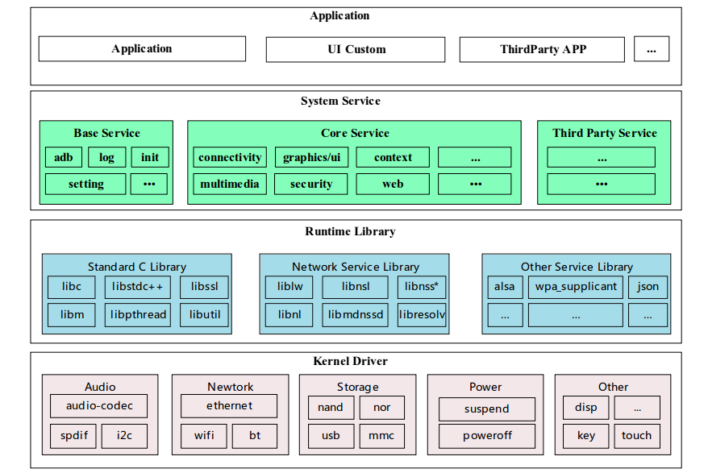
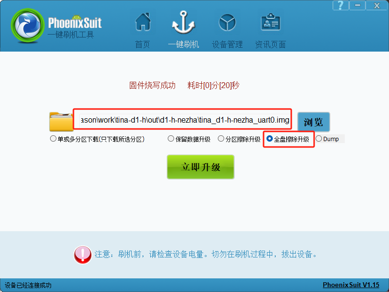
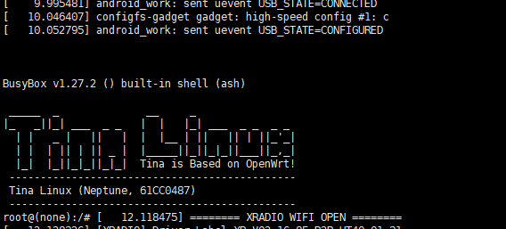

# 开发环境搭建与烧录

> 评测作者：Jason · 本篇为社区评测文章，来自开发者实测，未经官方逐字校对。

## 一、Tina Linux介绍

百问网D1h双屏异显开发套件默认自带基于全志科技官方适配的Tina Linux系统。

Tina Linux是全志科技基于Linux内核开发的针对智能硬件类产品的嵌入式软件系统。Tina Linux基于openwrt-14.07 版本的软件开发包，包含了 Linux 系统开发用到的内核源码、驱动、工具、系统中间件与应用程序包。

*openwrt 是知名的开源嵌入式 Linux 系统自动构建框架，是由 Makefile 脚本和 Kconfig 配置文件构成的。使得用户可以通过 menuconfig配置，编译出一个完整的可以直接烧写到机器上运行的 Linux 系统软件。

### 1. 系统框图



Tina系统软件架构如图所示。从下至上分别为Kernel && Driver、Libraries、System Services、Applications 四层。

#### Kernel && Driver

Kernel&&Driver 层主要提供 Linux Kernel 的标准实现。Tina 平台的 Linux Kernel 采用 Linux3.4、Linux3.10、Linux4.4、Linux4.9、Linux5.4 等内核，不同硬件平台使用不同内核版本，提供安全性、内存管理、进程管理、网络协议栈等基础支持，并通过 Linux 内核管理设备硬件资源，如 CPU 调度、缓存、内存、I/O 等。 其中D1-H适配的是Linux 5.4内核。

#### Libraries

Libraries 层对应一般嵌入式系统，相当于中间件层次。其包含了各种系统基础库、第三方开源程序库支持，为应用层提供 API 接口，系统定制者和应用开发者可以基于 Libraries 层的API 开发新的系统服务和应用程序。

#### System Services

System Services 层对应系统服务层，包含系统启动管理、配置管理、热插拔管理、存储管理、多媒体中间件等。

#### Applications

Applications 层主要是实现具体的产品功能及交互逻辑，开发者可以开发实现自己的应用程序，提供系统各种能力给到终端用户。

### 2. SDK结构

Tina Linux SDK 主要由构建系统、配置工具、工具链、host 工具包、目标设备应用程序、文档、脚本、linux 内核、bootloader 部分组成，下面是Tina主目录包含的文件和目录。

```bash
Tina-SDK/
├── build
├── config
├── Config.in
├── device
├── dl
├── lichee
├── Makefile
├── out
├── package
├── prebuilt
├── rules.mk
├── scripts
├── target
├── tmp
├── toolchain
└── tools
```

以下将对主要目录中包含的内容进行简单介绍。

#### build 目录

build 目录存放 Tina Linux 的构建系统文件，此目录结构下主要是一系列基于 Makefile 规格编写的 .mk 文件，主要的功能有：

（1）检测当前的编译环境是否满足 Tina Linux 的构建需求；

（2）生成 host 包（PC端软件包）编译规则；

（3）生成工具链的编译规则；

（4）生成 target 包的编译规则；

（5）生成 linux kernel 的编译规则；

（6）生成系统固件的生成规则。

```bash
build/
├── autotools.mk
├── aw-upgrade.mk
├── board.mk
├── cmake.mk
├── config.mk
├── debug.mk
├── depends.mk
├── device.mk
├── device_table.txt
├── download.mk
├── dumpvar.mk
├── envsetup.sh
    .....
```

#### config 目录

config 目录主要存放 Tina Linux 中配置菜单的界面以及一些固定的配置项，该配置菜单基于内核的 mconf 规格编写。

```bash
config/
├── Config-build.in
├── Config-devel.in
├── Config-images.in
├── Config-kernel.in
├── Config-systeminit.in
└── top_config.in
```

#### device 目标

devices 目录用于存放方案的配置文件，包括内核配置、env 配置、分区表配置、sys_config.fex（全志定制板级配置文件）、

board.dts（linux标准设备树文件） 等。

*这些配置在旧版本Tina（Tina3.0以前）上是保存于 target 目录下，现新版本均移到了 device 目录下，但defconfig仍保存在 target 目录下

```bash
device/
└── config
    ├── chips
    │   └── d1-h
    └── common
        ├── cert
        ├── debug
        ├── dtb
        ├── hdcp
        ├── imagecfg
        ├── partition
        ├── sign_config
        ├── toc
        ├── tools
        └── version
```

其中，config/chips/d1 存放D1-H平台相关的配置，其目录结构如下：

```bash
device/config/chips/d1-h
├── bin
├── boot-resource
│   └── boot-resource
│       └── bat
├── configs
│   ├── default
│   ├── nezha
│   │   ├── configs
│   │   ├── linux -> linux-5.4
│   │   └── linux-5.4
│   └── nezha_min
│       └── linux-5.4
└── tools
```

- bin 目录存放编译 boot 等bin文件，当Tina SDK构建或重新编译boot时，对应的文件会被替换。
  快捷跳转命令： cbin。
- boot-resource 目录存放开机动画等资源。
- tools 目录存放方案构建时需要的工具
- configs 目录存放该CHIP平台对应的 多个硬件方案配置文件。其中，default 为公共配置，nezha 对应硬件nezha板的方案配置，若存在更多个硬件方案，便会在该目录下新建对应的方案目录。 若公共配置目录default和方案配置目录中，存在相同的配置文件时，优先使用方案配置。
  快捷跳转命令：cconfigs（该命令会跳转到该目录下linux目录）

以nezha方案为例，简述方案配置目录下，具体内容：

```bash
device/config/chips/d1-h/configs/nezha
├── board.dts -> linux-5.4/board.dts
├── configs
│   └── bootlogo.bmp
├── env.cfg
├── linux -> linux-5.4
├── linux-5.4
│   ├── board.dts
│   └── config-5.4
├── sys_config.fex
├── sys_partition.fex
└── uboot-board.dts
```

board.dts 板级dts配置文件，符合linux内核dts配置格式及合并规则。

env.cfg 环境变量配置文件，Uboot将此环境变量传递给内核。

linux/config-5.4 Linux5.4 内核配置文件，配置方案下默认linux内核功能。

sys_config.fex 打包阶段根据sys_config配置更新boot0, uboot, optee等bin文件的头部等信息，例如更新dram参数、uart参数等。

sys_partition.fex 分区配置文件。

#### lichee 目录

lichee 目录主要存放 bootloader、linux内核、DSP等代码，其中DSP代码及编译环境因涉及DSP供应商科声讯版权，需单独申请。lichee目录下结构如下：

```bash
Tina-SDK
    ├── brandy-2.0
    │   ├── build.sh
    │   ├── tools
    │   └── u-boot-2018
    └── linux-5.4
```

#### package 目录

package 目录存放Tina系统支持的软件包源码和编译规则，目录按照目标软件包的功能进行分类，该目录包含了Tina系统全平台（包括全志R/H/F/V/T系列）的软件包，但是并不是所有软件包都适配了D1-H方案，部分软件包需要开发者自行适配。

```bash
package/
├── add-rootfs-demo
├── admin
├── allwinner
    ...
├── utils
└── wayland
```

#### prebuild 目录

prebuild目录存放预编译交叉编译器，目录结构如下。 gcc/riscv 即为编译 D1-H 所用的工具链目录

```bash
prebuilt/
└── gcc
    └── linux-x86
        ├── host
        └── riscv
            └── toolchain-thead-glibc
```

#### scripts 目录

scripts目录用于存放host端(PC端，下同)或target端（小机端，即目标机器，下同）使用的一些脚本。

> 一般指定解释器为`#!/bin/bash`的脚本是host`#!/bin/sh`的脚本是target端工具。

```bash
scripts/
├── add_initramfs.sh
├── arm-magic.sh
├── ...
```

#### target 目录

target目录用于存放目标板相关的配置以及sdk和toolchain生成的规格。

```bash
target/
    ├── allwinner
    ├── Config.in
    ├── imagebuilder
    ├── Makefile
    ├── sdk
    └── toolchain
```

快捷跳转命令：cdevice。

#### toolchain 目录

toolchain目录包含交叉工具链构建配置、规则。

```bash
toolchain/
├── binutils
├── fortify-headers
├── gcc
├── gdb
├── glibc
├── insight
├── kernel-headers
├── musl
└── wrapper
```

#### tools 目录

tools 目录用于存放 host 端工具的编译规则。

#### out 目录

out目录用于保存编译相关的临时文件和最终镜像文件 ，编译后自动生成此目录，以编译d1-h-nezha方案为例说明。

```bash
out/
├── d1-h-nezha
└── host
```

其中，host目录用于存放host端的工具以及一些开发相关的文件。

d1-h-nezha 目录为方案对应的目录。方案目录下的结构如下：

```bash
out/d1-evb1/
├── boot.img
├── compile_dir
├── d1-nezha-boot.img
├── d1-nezha-Image
├── d1-nezha-uImage
├── image
├── md5sums
├── packages
├── rootfs.img
├── sha256sums
├── staging_dir
├── tina_d1-nezha_uart0.img
└── usr.img
```

其中， - tina_d1-nazha_uart0.img为最终固件包(系统镜像)，串口信息通过串口输出。若使用pack -d，则生成的固件包为xxx_card0.img，串口信息转递到tf卡座输出。
\- boot.img为最终烧写到系统boot分区的数据，可能为boot.img格式也可能为uImage格式。
\- rootfs.img为最终烧写到系统rootfs分区的数据，该分区默认为squashfs格式。
\- d1-nezha-Image 为内核的 Image格式镜像，用于进一步生成uImage。
\- d1-nezha-uImage为内核的uImage格式镜像，若配置为uImage格式，则会拷贝成boot.img。
\- d1-nezha-boot.img为内核的boot.img格式镜像，若配置为boot.img格式，则会拷贝成boot.img
\- compile_dir为sdk编译host，target和toolchain的临时文件目录，存有各个软件包的源码。
\- staging_dir为sdk编译过程中保存各个目录结果的目录。
\- packages目录保存的是最终生成的ipk软件包。

快捷跳转命令：cout。

## 二、编译环境配置

嵌入式产品开发流程中，通常有两个关键的步骤，编译源码与烧写固件。源码编译需要先准备 好编译环境，而固件烧写则需要厂家提供专用烧写工具。本章节主要介绍如何搭建环境来实现Tina sdk的编译和打包。

一个典型的嵌入式开发环境包括本地开发主机和目标硬件板：

- 本地开发主机作为编译服务器，需要提供linux操作环境，建立交叉编译环境，为软件开发提供 代码更新下载，代码交叉编译服务。
- 本地开发主机通过串口或USB与目标硬件板连接，可将编译后的镜像文件烧写到目标硬件板， 并调试系统或应用程序。

### 1. 编译环境要求

本文从一个WSL中全新安装的Ubuntu18.04作为开发环境，记录需要做的环境配置，日常工作用wsl或者linux物理机作为开发主机，比较贴合实际使用场景。

> 说明：此处不再累述如何在Windows10/11上安装和配置WSL，并安装Ubuntu18.04发行版，操作步骤请检索网络上的资料。

### 2. 安装开发工具

```bash
$ sudo apt-get install build-essential subversion git-core libncurses5-dev zlib1g-dev gawk flex quilt libssl-dev xsltproc libxml-parser-perl mercurial bzr ecj cvs unzip lib32z1 lib32z1-dev lib32stdc++6 libstdc++6 -y
$ sudo apt install autoconf automake bison make cmake -y
$ sudo apt install repo -y # 或者使用wget直接下载repo到本地目录，然后将目录加到环境变量中，这样也可以正常使用repo
```

> 说明：因为Ubuntu包的下载服务器在非中国大量地区，所有下载速度会很慢，甚至可能下载不了，所以建议下载前先将apt的下载源改为国内的地址，国内有多家组织提供开源镜像站，如清华、阿里等。*由衷感谢这些组织为我们提供的便利！

## 三、编译与烧写

### 1. 准备源码

在搭建好编译环境并下载好源码后，即可对源码进行编译，编译打包好后，即可将打包好的固件烧写到设备中去。本章节主要介绍编译和烧写的方法。

*源码下载的方法：下载百问网提供的DongshanNezhaSTU-TinaV2.0-SDK，会有如下文件：

```bash
DongshanNezhaSTU-TinaV2.0-SDK
├── README.md
├── tina-d1-h.tar.bz2.00
├── tina-d1-h.tar.bz2.01
├── tina-d1-h.tar.bz2.02
├── tina-d1-h.tar.bz2.03
├── tina-d1-h.tar.bz2.04
├── tina-d1-h.tar.bz2.05
├── tina-d1-h.tar.bz2.06
├── tina-d1-h.tar.bz2.07
└── tina-d1-h.tar.bz2.08
```

按照README.md中的步骤，在WSL Ubuntu18.04的当前用户家目录（可自行指定解压目录），将sdk源码解压即可，最终结果示例：

```bash
jason@DESKTOP-xyz:~/work/tina-d1-h$ tree . -L 1
.
├── Config.in
├── Makefile
├── README.md
├── build
├── config
├── config_gstreamers
├── device
├── dl
├── lichee
├── out
├── package
├── prebuilt
├── rules.mk
├── scripts
├── target
├── tmp
├── toolchain
└── tools
```

### 2. 开始编译

```bash
jason@DESKTOP-xyz:~/work/tina-d1-h$ source build/envsetup.sh
Setup env done! Please run lunch next.
jason@DESKTOP-xyz:~/work/tina-d1-h$ lunch

You're building on Linux

Lunch menu... pick a combo:
     1. d1-h_nezha-tina
     2. d1-h_nezha_min-tina
     3. d1s_nezha-tina

Which would you like? [Default d1-h_nezha]: 1
============================================
TINA_BUILD_TOP=/home/jason/work/tina-d1-h
TINA_TARGET_ARCH=riscv
TARGET_PRODUCT=d1-h_nezha
TARGET_PLATFORM=d1-h
TARGET_BOARD=d1-h-nezha
TARGET_PLAN=nezha
TARGET_BUILD_VARIANT=tina
TARGET_BUILD_TYPE=release
TARGET_KERNEL_VERSION=5.4
TARGET_UBOOT=u-boot-2018
TARGET_CHIP=sun20iw1p1
============================================
no buildserver to clean
[1] 2670
jason@DESKTOP-xyz:~/work/tina-d1-h$ make menuconfig # 在界面修改自己需要的配置
jason@DESKTOP-xyz:~/work/tina-d1-h$ make -j$(nproc) # 指定make的JOB数量为系统中cpu的个数
jason@DESKTOP-xyz:~/work/tina-d1-h$ pack # 生成可以用烧录工具烧录的.img镜像文件
jason@DESKTOP-xyz:~/work/tina-d1-h$ ls out/d1-h-nezha/
boot.img             d1-h-nezha-boot.img  md5sums     sha256sums                      tina_d1-h-nezha_uart0.img
compile_dir          d1-h-nezha-uImage    packages    staging_dir
d1-h-nezha-Image.gz  image                rootfs.img
```

> 说明：tina_d1-h-nezha_uart0.img文件，即可以使用烧录工具进行烧录的镜像文件。

### 3. 烧写固件

百问网D1h双屏异显开发套件是板载的SPI NAND FLASH，用pack默认制作的是flash中运行的固件，符合我们的预期。

这里我们使用全志科技提供的PhoenixSuit烧录工具即可，原厂。建议开发者开发时使用该工具进行固件升级。

#### PhoenixSuit使用简介

下面主要介绍用PhoenixSuit烧写的方法，LiveSuit和PhoenixUSBpro烧写的方法类似。

PhoenixSuit下载地址：[固件烧写工具PhoenixSuit](https://www.aw-ol.com/downloads/resources/13)

同时需安装全志USB驱动，下载链接：[全志USB驱动](https://www.aw-ol.com/downloads/resources/15)

*企业开发者在安装APST的同时也会安装全志USB驱动，无需单独再安装

具体步骤如下：

（1）打开PhoenixSuit，当设备上电启动并插入USB与PC相连的时，PhoenixSuit会提示识别到设备；

（2）点击 `一键刷机-浏览`选择要烧写的固件；

（3）点击 `立即升级`，此时会通过USB给设备发送重启命令，设备会带着烧写标识重启，并在重启阶段进入烧写模式；

（4）设备重新到boot的时候会自动进行烧写，可以看到PhoenixSuit的进度条在动；

（5）烧写成功，设备重启。



> 注意：开发阶段，建议勾上全盘擦除升级。

烧写过程中遇到的问题，请查阅全志官方文档：[D1-H 编译与烧写](https://d1.docs.aw-ol.com/study/study_4compile/)。

### 4. 烧写后进入系统

打开对应的开发板USB串口，在烧写完成后，可以看到如下界面，即烧录成功：


