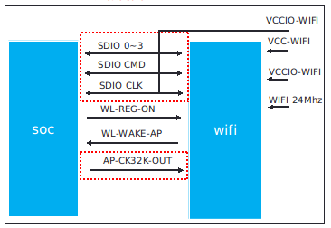
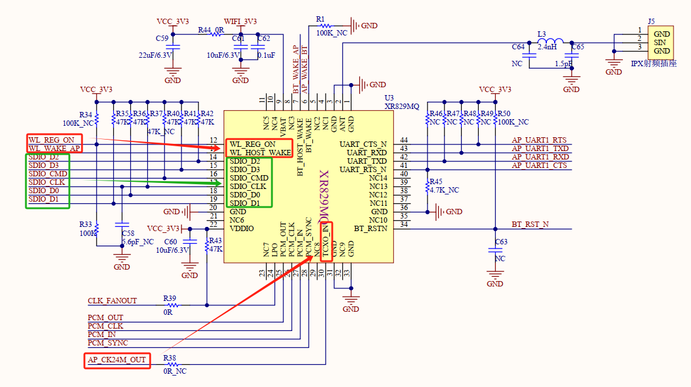
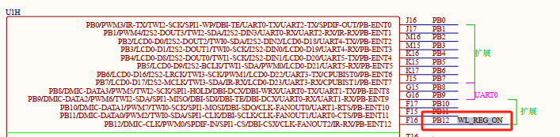
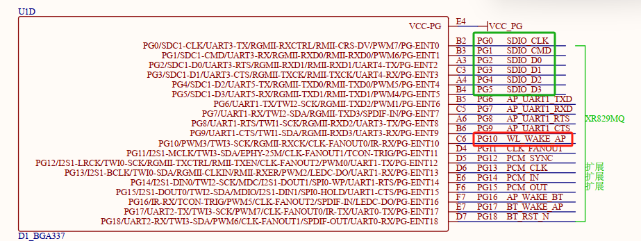
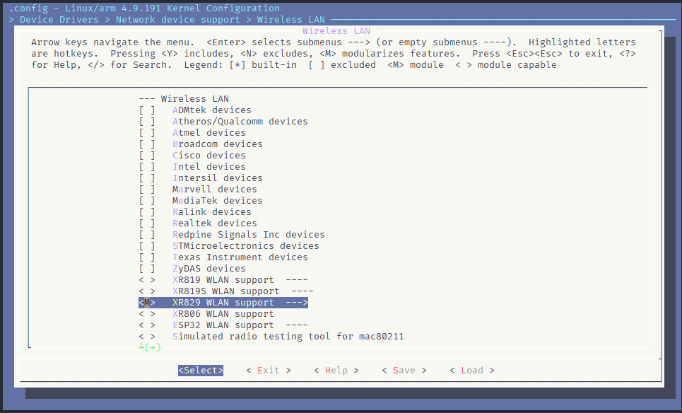
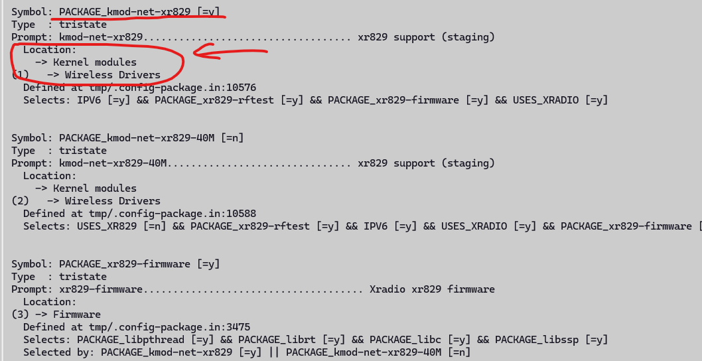
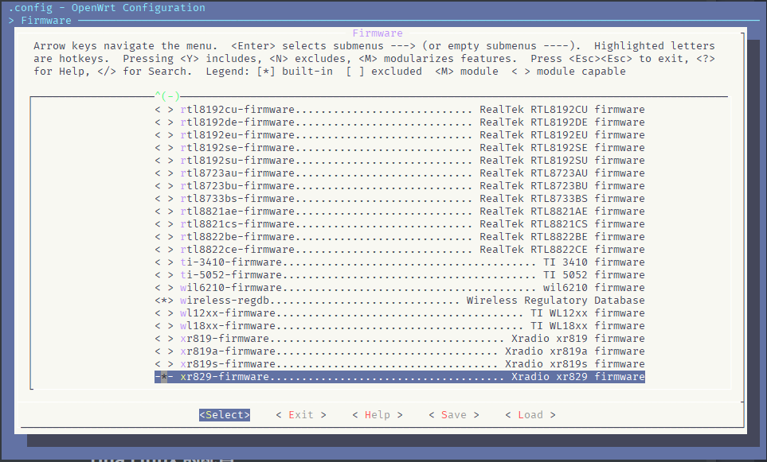

# 支持WiFi联网

> 评测作者：Jason · 本篇为社区评测文章，来自开发者实测，未经官方逐字校对。

# 支持WiFi功能

## 背景

本文基于WiFi+投屏功能的目标，需要首先在百问网D1h双屏异显开发套件上把WiFi功能支持起来，然后再去实现其他功能。

## Tina WiFi软件结构


- `wifimanger`： 主要用于STATION模式，提供Wi-Fi连接扫描等功能。
- `softap manager`：提供启动AP的功能。
- `smartlink`： 对于 `NoInput` 的设备，通过借助第三方设备（如手机）实现透传配网的功能,包括 `softap/soundwave/xconfig/airkiss/` 等多种配网方式。
- `wpa_supplicant`: 开源的无线网络配置工具，主要用来支持WEP，WPA/WPA2和WAPI无线协议和加密认证的，实际上的工作内容是通过 `socket` 与驱动交互上报数据给用户。
- `hostapd`: 是一个用户态用于AP和认证服务器的守护进程。
- `monitor`: Wi-Fi处于混杂设备监听模式的处理应用。

## WiFi模组适配

### WiFi模组介绍

百问网D1h双屏异显开发套件，板载的XR829 WiFi和BT二合一模块，XR829是全志旗下全资子公司芯之联（[XradioTech](http://www.xradiotech.com/)）设计开发的WiFi/蓝牙无线芯片。 可平替AP6212/RTL8723。模组可与市面上通用的AP6212/RTL8723 pin to pin替换。

### Wi-Fi模组移植原理



Wi-Fi模组工作的条件，需要硬件满足以下几个条件:

- 供电：一般有两路供电，其中 VCC-Wi-Fi 为主电源，VCCIO-Wi-Fi 为 IO 上拉电源。
- 使能：要能正常工作，需要 WL-REG-ON 给高电平。
- SDIO：与SOC的通信有通过 USB，SDIO 等，这里以 SDIO 为例，其中 SDIO 0~3 为SDIO 的 4 条数据线。
- 唤醒主控：当系统休眠时，Wi-Fi 模组可通过 WL-WAKE-AP 通过中断的方式唤醒主控，有些模组也通过该引脚来作为主控接收数据的中断。
- 24/26/30/40/60MHz 时钟信号，依照 Wi-Fi 芯片而定
- 32.768KHz信号：根据模组而定，有些模组可以内部生成，有些需要外部单独输入该信号。

### 模组移植适配

在Tina Linux SDK 中已经内置了 XR829 的驱动并已经启用，但是其默认适配的是全志官方的哪吒D1-H开发板，并不一定能直接在我们的开发板上直接使用（测试发现确实无法直接使用）。我们需要按照上一节中的原理，对照硬件原理图中，对应的IO口进行相应的配置，并正确设置时钟，并在Tina Linux中正确的配置，那么编译出来的固件，在烧录后，WiFi功能才能正确使能。

#### 查看原理图







查看XR829的原理图和核心板的IO关系，可以得出：

- WL_REG_ON连接到D1-H的PB12引脚
- WL_WAKE_AP连接到D1-H的PG10引脚
- SDIO的通信部分（SDIO_CLK, SDIO_CMD, SDIO_D0, SDIO_D1, SDIO_D2, SDIO_D3）别连接到D1-H的PG0  ~ PG5

那么接下来就需要修改一下设备树文件，针对百问网D1h双屏异显开发套件做相应的修改适配。

#### 设备树配置

我们首先找到 `SDC1` 并启用它，设置 `status = "okay"`，Tina Linux里面默认已经是了，此处不修改。

```bash
 658 &sdc1 {
 659         bus-width = <4>;  # SDIO 总线，4Bit
 660         no-mmc;           # 声明不是一个 MMC 设备
 661         no-sd;            # 声明不是一个 SD 设备
 662         cap-sd-highspeed; # 高速模式
 663         /*sd-uhs-sdr12*/
 664         /*sd-uhs-sdr25;*/
 665         /*sd-uhs-sdr50;*/
 666         /*sd-uhs-ddr50;*/
 667         /*sd-uhs-sdr104;*/
 668         /*sunxi-power-save-mode;*/
 669         /*sunxi-dis-signal-vol-sw;*/
 670         cap-sdio-irq;          # 捕获中断
 671         keep-power-in-suspend; # 保持持续供电
 672         ignore-pm-notify;      # # 无视提醒
 673         max-frequency = <150000000>;
 674         ctl-spec-caps = <0x8>;
 675         status = "okay";
 676 };
 677
```

经过检查，修改对应的pinctl：

sdc1引脚配置：

```bash
 108         sdc1_pins_a: sdc1@0 {
 109                 pins = "PG0", "PG1", "PG2",
 110                        "PG3", "PG4", "PG5";
 111                 function = "sdc1";
 112                 drive-strength = <30>;
 113                 bias-pull-up;
 114         };
 115
```
 wlan相关引脚配置：
 ```bash
 ...
 142         wlan_pins_a:wlan@0 {
 143                 pins = "PG11";
 144                 function = "clk_fanout1";
 145         };
 ...
556         rfkill: rfkill@0 {
 557                 compatible    = "allwinner,sunxi-rfkill";
 558                 chip_en;
 559                 power_en;
 560                 pinctrl-0 = <&wlan_pins_a>; # 引用PG11
 561                 pinctrl-names = "default";
 562                 status        = "okay";
 563
 564                 wlan: wlan@0 {
 565                         compatible    = "allwinner,sunxi-wlan";
 566                         clock-names = "32k-fanout1";
 567                         clocks = <&ccu CLK_FANOUT1_OUT>;
 568                         wlan_busnum    = <0x1>;
 569                         wlan_regon    = <&pio PB 12 GPIO_ACTIVE_HIGH>; /* PB12 on NezhaSTU-Core_SCH_V1 */
 570                         wlan_hostwake  = <&pio PG 10 GPIO_ACTIVE_HIGH>;
 571                         /*wlan_power    = "VCC-3V3";*/
 572                         /*wlan_power_vol = <3300000>;*/
 573                         /*interrupt-parent = <&pio>;
 574                         interrupts = < PG 10 IRQ_TYPE_LEVEL_HIGH>;*/
 575                         wakeup-source;
 576
 577                 };
 ```

主要的设备树修改见下方diff：

```bash
jason@DESKTOP-xxx:~/work/tina-d1-h/device/config/chips/d1-h$ git diff
diff --git a/configs/nezha/linux-5.4/board.dts b/configs/nezha/linux-5.4/board.dts
    index 963aa17..e50efcb 100755
    --- a/configs/nezha/linux-5.4/board.dts
    +++ b/configs/nezha/linux-5.4/board.dts
    @@ -566,7 +566,7 @@
    clock-names = "32k-fanout1";
clocks = <&ccu CLK_FANOUT1_OUT>;
wlan_busnum    = <0x1>;
-                       wlan_regon    = <&pio PG 12 GPIO_ACTIVE_HIGH>;
+                       wlan_regon    = <&pio PB 12 GPIO_ACTIVE_HIGH>; /* PB12 on NezhaSTU-Core_SCH_V1 */
                        wlan_hostwake  = <&pio PG 10 GPIO_ACTIVE_HIGH>;
                        /*wlan_power    = "VCC-3V3";*/
                        /*wlan_power_vol = <3300000>;*/
```

#### 驱动配置

首先我们进入 `make kernel_menuconfig` 配置界面，在 `Device Drivers > Network device support > Wireless LAN` 找到 `<M> XR829 WLAN support --->` 选项，并启用为模块`<M>`。



#### Tina Linux配置

### Tina Linux 的配置

根据XR829原理图中的时钟可以看出，在百问网D1h双屏异显开发套件上，时钟输入为20M，而默认的Tina linux中，设置的是40，这会导致后面和XR829芯片进行通信的时候出现错误，需要手动修改对应的配置到20M晶振配置上。

```bash
$ make menuconfig
# 找到下面的符号，将对应的当前值修改为目标值，如[=n] => [y]
Symbol: PACKAGE_kmod-net-xr829 [=n] => [y]
Symbol: PACKAGE_kmod-net-xr829-40M [=y] => [n]
Symbol: XR829_USE_40M_SDD [=y] => [n]
```

下面以将PACKAGE_kmod-net-xr829由n改为y的过程，介绍一下如何通过搜索某个配置符号，快速查找到对应界面选择的位置：

输入/，然后输入xr829，即可进行符号的搜索，如下图所示：



通过查找到的Location，我们手动的到对应的地址，进行选择，输入y将其设置为y。

在上面的步骤完成后，此时也可以去检查一下 `Firmware` 目录中的固件有没有被成功勾选。



### 模组测试

在上面的步骤执行完成乎，接下来要对wlan功能进行简单的验证，可以发现烧录后，识别到了WiFi芯片。

```bash
...
[   11.970807] ======== XRADIO WIFI OPEN ========
[   11.980666] [XRADIO] Driver Label:XR_V02.16.85_P2P_HT40_01.31   
[   11.989015] [XRADIO] Allocated hw_priv @ 00000000b5be3749
[   11.999973] sunxi-rfkill soc@3000000:rfkill@0: bus_index: 1
[   12.017850] sunxi-rfkill soc@3000000:rfkill@0: wlan power on success
[   12.285149] sunxi-mmc 4021000.sdmmc: sdc set ios:clk 0Hz bm PP pm UP vdd 21 width 1 timing LEGACY(SDR12) dt B
[   12.296706] [XRADIO] Detect SDIO card 1
[   12.313255] sunxi-mmc 4021000.sdmmc: no vqmmc,Check if there is regulator
[   12.338125] sunxi-mmc 4021000.sdmmc: sdc set ios:clk 400000Hz bm PP pm ON vdd 21 width 1 timing LEGACY(SDR12) dt B
[   12.374733] sunxi-mmc 4021000.sdmmc: sdc set ios:clk 400000Hz bm PP pm ON vdd 21 width 1 timing LEGACY(SDR12) dt B
[   12.402287] sunxi-mmc 4021000.sdmmc: sdc set ios:clk 400000Hz bm PP pm ON vdd 21 width 1 timing LEGACY(SDR12) dt B
[   12.428628] sunxi-mmc 4021000.sdmmc: sdc set ios:clk 400000Hz bm PP pm ON vdd 21 width 1 timing SD-HS(SDR25) dt B
[   12.442308] sunxi-mmc 4021000.sdmmc: sdc set ios:clk 50000000Hz bm PP pm ON vdd 21 width 1 timing SD-HS(SDR25) dt B
[   12.457624] sunxi-mmc 4021000.sdmmc: sdc set ios:clk 50000000Hz bm PP pm ON vdd 21 width 4 timing SD-HS(SDR25) dt B
[   12.477031] mmc1: new high speed SDIO card at address 0001
[   12.488905] [SBUS] XRadio Device:sdio clk=50000000
[   12.499644] [XRADIO] XRADIO_HW_REV 1.0 detected.
[   12.612035] [XRADIO] xradio_update_dpllctrl: DPLL_CTRL Sync=0x01400000.
[   12.681916] [XRADIO] Bootloader complete
[   12.861513] [XRADIO] Firmware completed.
[   12.872769] [WSM] Firmware Label:XR_C09.08.52.64_DBG_02.100 2GHZ HT40 Jan  3 2020 13:14:37
[   12.901437] [XRADIO] Firmware Startup Done.
[   12.911770] [XRADIO_WRN] enable Multi-Rx!
...
```

## Wi-Fi 的使用

### Wi-Fi 工作的几种模式

*目前Tina平台上的Wi-Fi一般可处于3种工作模式，分别是 STA，AP，MONITOR*。

- STATION：连接无线网络的终端，大部分无线网卡默认都处于该模式，也是常用的一种模式。
- AP：无线接入点，常称热点，比如路由器功能。
- MONITOR：也称为混杂设备监听模式，所有数据包无过滤传输到主机。

### Wi-Fi 扫描网络与连接网络

Tina 提供了一套简易方便的 Wi-Fi  STA测试套件：`wifi_connect_ap_test` ，使用 `wifi_connect_ap_test` 命令可以设置连接的AP的SSID和密码。针对我们的WiFi + HDMI + 手机投屏目标，只需要STA工作模式；然后手机和开发板都连接上同一个测试AP，便可以使开发板和手机在一个局域网，后面便可以使用移植的投屏服务，将手机的APP音视频流推送到开发板，并通过HDMI显示出来。

```bash
root@TinaLinux:~# wifi_connect_ap_test 
ERROR: paras more or less!
---------------------------------------------------------------------------------
NAME:
	wifi_connect_ap_test
DESCRIPTION:
	connect the AP when don't konw the key_mgmt.
USAGE:
	wifi_connect_ap_test <ssid> <passwd> <level>
PARAMS:
	ssid   : ssid of the AP
	passwd : password of the AP, don't need it when key_mgmt is NONE
	level  : print level(d0~d5).larger value,more info.para is not required,default d2.
--------------------------------------MORE---------------------------------------
The way to get help information:
	wifi_connect_ap_test --help
	wifi_connect_ap_test -h
	wifi_connect_ap_test -H
---------------------------------------------------------------------------------
# 使用测试套件中的程序，连接PC机开启的AP, SSID是"test-AP"，密码是12345678
root@TinaLinux:~# wifi_connect_ap_test test-AP 12345678
==================================
Connecting to the network(test-AP)......
[ 2802.910842] wlan0: authenticate with 30:b4:9e:c8:ef:46 (try 1)
[ 2802.917856] [STA_WRN] [HT40][xradio_join_work][bss_ht_info]:
[ 2802.917856] [primary_chan  :0x0000000b]
[ 2802.917856] [ht_param      :0x00000000]
[ 2802.917856] [operation_mode:0x00000000]
[ 2802.917856] [stbc_param    :0x00000000]
[ 2802.917856] [basic_set[0]  :0x00000000]
[ 2802.945701] [STA_WRN] [HT40][xradio_join_work][PhyModeCfg:0x0007]
[ 2802.945701] [ModemFlags    :0x00000007]
[ 2802.945701] [ChWidthCfg    :0x00000000]
[ 2802.945701] [PriChCfg      :0x00000000]
[ 2802.945701] [BandCfg       :0x00000000]
[ 2802.945701] [STBC_Enable   :0x00000000]
[ 2802.945701] [PreambleCfg   :0x00000000]
[ 2802.945701] [SGI_Enable    :0x00000000]
[ 2802.945701] GF_Enable      :0x00000000]
[ 2803.000421] wlan0: authenticated
[ 2803.004630] wlan0: associate with 30:b4:9e:c8:ef:46 (try 1)
[ 2803.014594] wlan0: RX AssocResp from 30:b4:9e:c8:ef:46 (capab=0x1431 status=0 aid=1)
[ 2803.023735] wlan0: associated
[ 2803.027052] wlan0: No basic rates in AssocResp. Using min supported rate instead.
[ 2803.042814] [WSM_WRN] wsm_flush_tx:No pengding, but hw_bufs_used=1
[ 2803.050958] [AP_WRN] [STA] ASSOC HTCAP 11N 58
[ 2803.055819] [AP_WRN] [HT40][xradio_bss_info_changed][ht_prot:0x00000008][HtProtMode:0x0002][Green:0x0000]
[ 2803.056230] [AP_WRN] [HT40][xradio_bss_info_changed][PhyModeCfg:0x5007]
[ 2803.056230] [ModemFlags    :0x00000007]
[ 2803.056230] [ChWidthCfg    :0x00000000]
[ 2803.056230] [PriChCfg      :0x00000000]
[ 2803.056230] [BandCfg       :0x00000000]
[ 2803.056230] [STBC_Enable   :0x00000000]
[ 2803.056230] [PreambleCfg   :0x00000001]
[ 2803.056230] [SGI_Enable    :0x00000001]
[ 2803.056230] [GF_Enable     :0x00000000]
[ 2803.115811] [AP_WRN] [STA] ASSOC HTCAP 11N 58
[ 2803.121966] [AP_WRN] [HT40][xradio_bss_info_changed][ht_prot:0x00000000][HtProtMode:0x0000][Green:0x0000]
[ 2803.122270] [AP_WRN] [HT40][xradio_bss_info_changed][PhyModeCfg:0x5007]
[ 2803.122270] [ModemFlags    :0x00000007]
[ 2803.122270] [ChWidthCfg    :0x00000000]
[ 2803.122270] [PriChCfg      :0x00000000]
[ 2803.122270] [BandCfg       :0x00000000]
[ 2803.122270] [STBC_Enable   :0x00000000]
[ 2803.122270] [PreambleCfg   :0x00000001]
[ 2803.122270] [SGI_Enable    :0x00000001]
[ 2803.122270] [GF_Enable     :0x00000000]
[ 2803.181716] [AP_WRN] [STA] ASSOC HTCAP 11N 58
[ 2803.186705] [AP_WRN] [HT40][xradio_bss_info_changed][ht_prot:0x00000008][HtProtMode:0x0002][Green:0x0000]
[ 2803.187132] [AP_WRN] [HT40][xradio_bss_info_changed][PhyModeCfg:0x5007]
[ 2803.187132] [ModemFlags    :0x00000007]
[ 2803.187132] [ChWidthCfg    :0x00000000]
[ 2803.187132] [PriChCfg      :0x00000000]
[ 2803.187132] [BandCfg       :0x00000000]
[ 2803.187132] [STBC_Enable   :0x00000000]
[ 2803.187132] [PreambleCfg   :0x00000001]
[ 2803.187132] [SGI_Enable    :0x00000001]
[ 2803.187132] [GF_Enable     :0x00000000]
[ 2803.244155] IPv6: ADDRCONF(NETDEV_CHANGE): wlan0: link becomes ready
Connected to the AP(test-AP)
Getting ip address(test-AP)......
[ 2804.372933] [AP_WRN] [STA] ASSOC HTCAP 11N 58
[ 2804.378118] [AP_WRN] [HT40][xradio_bss_info_changed][ht_prot:0x00000000][HtProtMode:0x0000][Green:0x0000]
[ 2804.379099] [AP_WRN] [HT40][xradio_bss_info_changed][PhyModeCfg:0x5007]
[ 2804.379099] [ModemFlags    :0x00000007]
[ 2804.379099] [ChWidthCfg    :0x00000000]
[ 2804.379099] [PriChCfg      :0x00000000]
[ 2804.379099] [BandCfg       :0x00000000]
[ 2804.379099] [STBC_Enable   :0x00000000]
[ 2804.379099] [PreambleCfg   :0x00000001]
[ 2804.379099] [SGI_Enable    :0x00000001]
[ 2804.379099] [GF_Enable     :0x00000000]
Wifi connect ap : Success!
==================================
root@TinaLinux:~# sh: odhcp6c: not found # 这里有这个输出是因为Tina Linux中未集成odhcp6c，只有udhcp
root@TinaLinux:~# ifconfig
...
wlan0     Link encap:Ethernet  HWaddr 38:E6:D9:47:04:26  
          UP BROADCAST MULTICAST  MTU:1500  Metric:1
          RX packets:120 errors:0 dropped:0 overruns:0 frame:0
          TX packets:83 errors:0 dropped:0 overruns:0 carrier:0
          collisions:0 txqueuelen:1000 
          RX bytes:15395 (15.0 KiB)  TX bytes:11958 (11.6 KiB)
# 可以看到这个时候，WIFI接口已经识别到了，并且连接到了AP上，但是因为不存在odhcp6c工具，导致没有使用dhcp服务从AP获取到IP地址；
# 那么这个时候我们手动用Tina Linux中集成的udhcp获取一下IP即可
root@TinaLinux:~# udhcpc -i wlan0
udhcpc: started, v1.27.2
udhcpc: sending discover
udhcpc: sending select for 192.168.137.41
udhcpc: lease of 192.168.137.41 obtained, lease time 604800
udhcpc: ifconfig wlan0 192.168.137.41 netmask 255.255.255.0 broadcast +
udhcpc: setting default routers: 192.168.137.1
root@TinaLinux:~# ifconfig # 这个时候可以看到，WiFi STA接口已经获取到了从AP那里通过DHCP获取到的IP地址
...
wlan0     Link encap:Ethernet  HWaddr 38:E6:D9:47:04:26  
          inet addr:192.168.137.41  Bcast:192.168.137.255  Mask:255.255.255.0
          inet6 addr: fe80::3ae6:d9ff:fe47:426/64 Scope:Link
          UP BROADCAST RUNNING MULTICAST  MTU:1500  Metric:1
          RX packets:141 errors:0 dropped:0 overruns:0 frame:0
          TX packets:111 errors:0 dropped:0 overruns:0 carrier:0
          collisions:0 txqueuelen:1000 
          RX bytes:18163 (17.7 KiB)  TX bytes:16030 (15.6 KiB)
```

可以使用 `ping` 命令测试 网络连接

```
root@TinaLinux:/# ping www.baidu.com
```

它会输出以下内容

```
PING www.baidu.com (39.156.66.18): 56 data bytes
64 bytes from 39.156.66.18: seq=0 ttl=52 time=40.997 ms
64 bytes from 39.156.66.18: seq=1 ttl=52 time=48.450 ms
64 bytes from 39.156.66.18: seq=2 ttl=52 time=49.043 ms
64 bytes from 39.156.66.18: seq=3 ttl=52 time=48.703 ms
64 bytes from 39.156.66.18: seq=4 ttl=52 time=48.545 ms
```

### 修改配置

目前连接完AP后，因为缺少odhcp6c，导致无法通过WiFi链路，进行IP地址的获取。这个时候我们按照下面的方式修改wpa_supplicant的启动脚本，操作示例如下：

```bash
root@TinaLinux:~# vim /etc/init.d/wpa_supplicant
...
wlan=`ifconfig | grep wlan0 | awk '{print $1}'`
if [ x$wlan=="xwlan0" ]; then
    echo "======wlan0 up successed!======"
else
    echo "======wlan0 up failed!========="
fi
/etc/wifi/udhcpc_wlan0 start

brlan=`ifconfig | grep br-lan | awk '{print $1}'`
if [ x$brlan=="xbr-lan" ]; then
        echo "change the default ip address 192.168.1.1"
        ifconfig br-lan 192.168.100.100
fi
...
```

## 参考资料

- [Tina Wi-Fi 软件结构](https://v853.docs.aw-ol.com/soft/tina_wifi/#wi-fi_1)
- 【D1-H_Tina_Linux_Wi-Fi_开发指南】（需要获取SDK和对应的文档）
