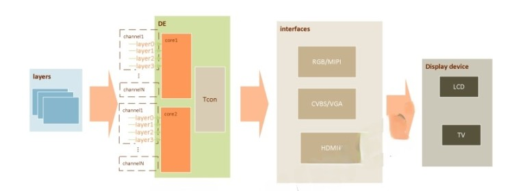
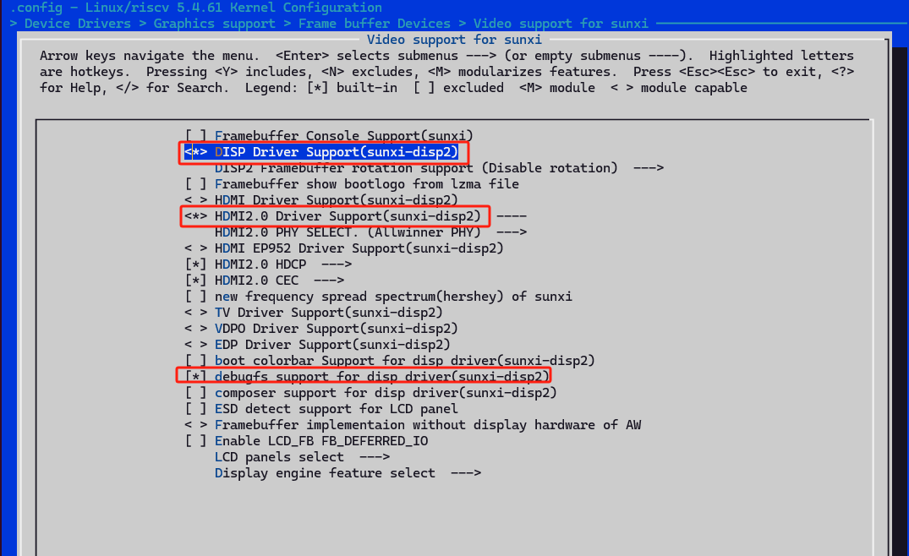
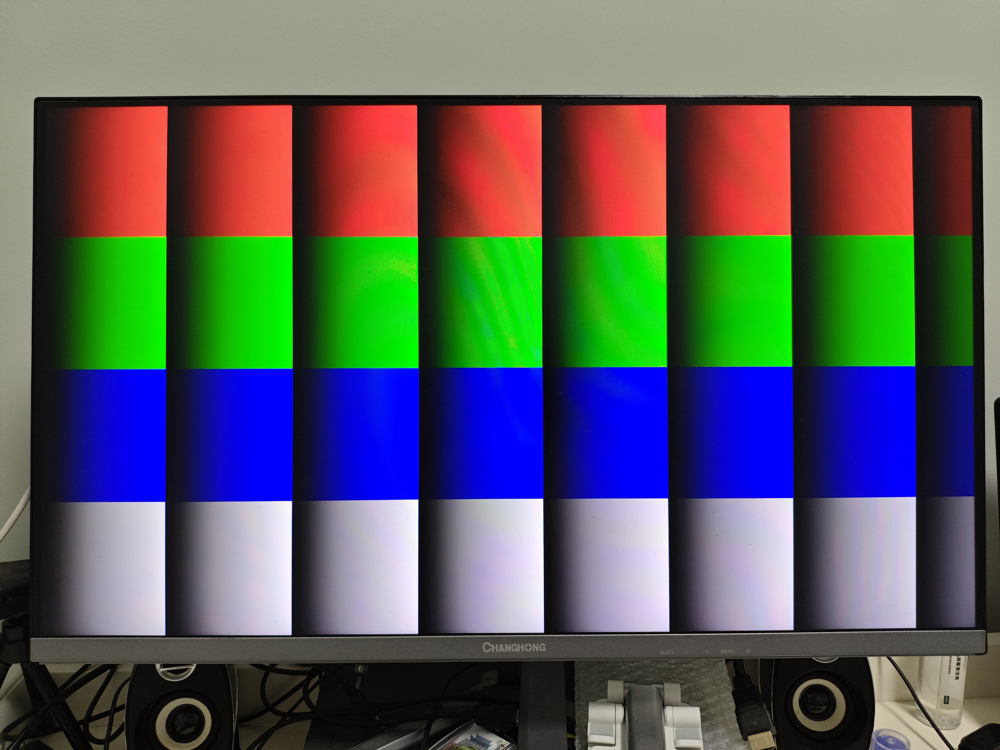
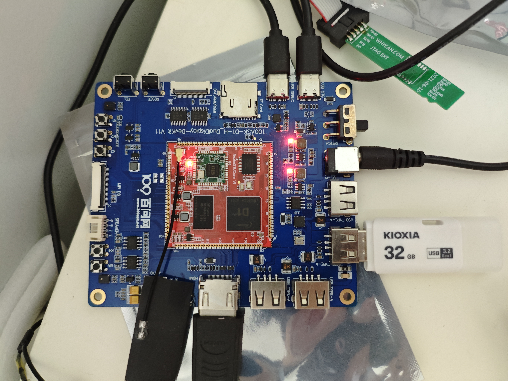
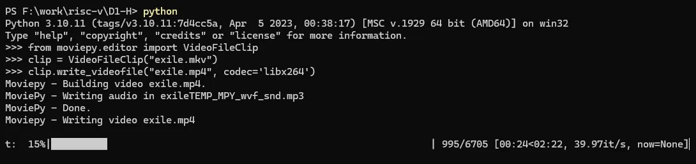
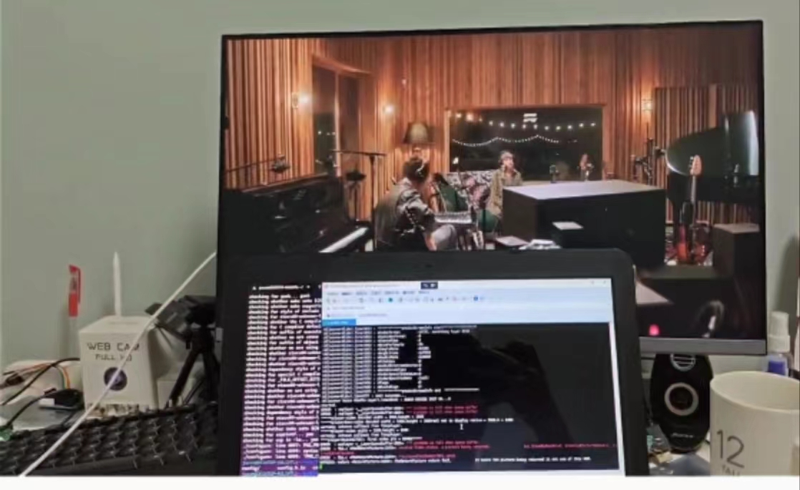
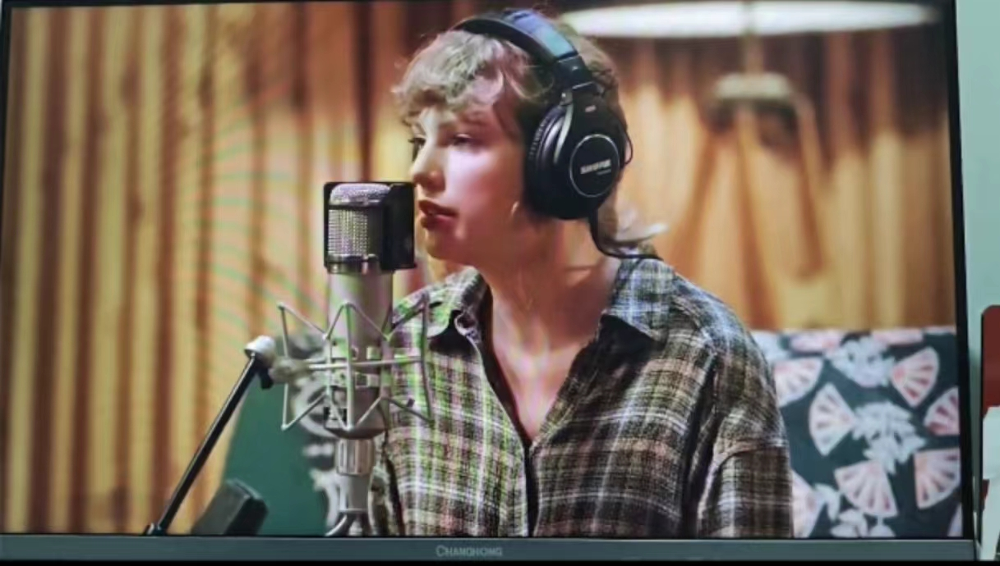
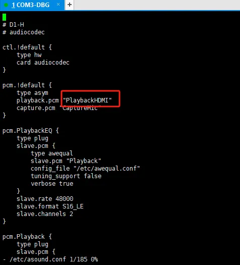

# 支持HDMI播放音视频

> 评测作者：Jason · 本篇为社区评测文章，来自开发者实测，未经官方逐字校对。

# 支持HDMI显示和音频播放

## HDMI介绍

HDMI（High-Definition Multiface Interface）是 Hitachi, Panasonic, Philips, SiliconImage, Sony, Thomson, Toshiba 几家公司共同发布的一款音视频传输协议，主要用于 DVD,机顶盒等音视频 source 到 TV，显示器等 sink 设备的传输。传输基于的是 TMDS(Transition Minimized Differential Signaling) 协议。此外，使用 TMDS 也是 DVI 标准的主要特点。  

## 芯片显示架构



针对D1-H显示架构，由显示引擎（DE）和各类型控制器（tcon）组成。输入图层（layers）在 DE中进行显示相关处理后，通过一种或多种接口输出到显示设备上显示，以达到将众多应用渲染的图层合成后在显示器呈现给用户观看的作用。 

DE 有 2 个独立单元（可以简称 de0、 de1），可以分别接受用户输入的图层进行合成，输出到不同的显示器，以实现双显。 DE 的每个独立的单元有1-4 个通道（典型地， de0 有 4 个， de1 有 2 个），每个通道可以同时处理接受 4 个格式相同的图层。 sunxi 平台有视频通道和 UI 通道之分。视频通道功能强大，可以支持 YUV 格式和 RGB图层。 UI 通道只支持 RGB 图层。

简单来说，显示模块的主要功能如下：

- 支持 lcd(hv/lvds/cpu/dsi) 输出。

- 支持双显输出。

- 支持多图层叠加混合处理。

- 支持多种显示效果处理（alpha, colorkey, 图像增强，亮度/对比度/饱和度/色度调整）。

- 支持智能背光调节。

- 支持多种图像数据格式输入 (arg,yuv)

- 支持图像缩放处理。

- 支持截屏。

- 支持图像转换。

## 使能显示模块

```bash
make kernel_menuconfig
```

具体配置为：

```bash
Device Drivers --->
	Graphics support --->
		<*> Support for frame buffer devices --->
			Video support for sunxi --->
				<*> DISP Driver Support(sunxi-disp2)
```



默认配置选择了DISP Driver Support(suxi-disp2)，并且选上了HDMI2.0的驱动支持，这里我们选上debugfs support for disp drivers，方便通过debugfs动态的跟disp驱动进行交互，写或者读对应的配置信息。

## 显示模块debugfs接口配置

### 调试节点与命令格式

```bash
$ mount -t debugfs none /sys/kernek/debug
$ cd /sys/kernel/debug/dispdbg
# 命令格式
name command param start info
//name: 表示操作的对象名字
//command: 表示执行的命令
//param: 表示该命令接收的参数
//start: 输入1 开始执行命令
//info: 保存命令执行的结果
//只读，大小是1024 bytes。
```

> 更多配置内容，见dts文件中的注释：tina-d1-h/device/config/chips/d1-h/configs/nezha/board.dts

## 使能HDMI接口并测试

### 设置HDMI显示

根据上一张的调试命令格式，我们这里设置显示通道0，输出为HDMI。

```bash
root@TinaLinux:~# cd /sys/kernel/debug/dispdbg
root@TinaLinux:/sys/kernel/debug/dispdbg# echo disp0 > name; echo switch1 > command; echo 4 10 0 0 0x4 0x101 0 0 0 8 > param; echo 1 > start;
```

###  测试显示colorbar

```bash
root@TinaLinux:~# cd /sys/kernel/debug/dispdbg
root@TinaLinux:/sys/kernel/debug/dispdbg# echo 1 > /sys/class/disp/disp/attr/colorbar 
```



### 测试播放视频

这里采用U盘的方式，将测试的视频存储在U盘中，然后插入到开发板的USB接口，因为板载的NAND-Flash空间不太大，使用U盘，然后将U盘设备挂载到对应的目录，算是比较方便的测试步骤。



> 说明：默认Tina Linux会自动挂载U盘的默认分区到/mnt/exUDisk目录，这里我们在U盘中考入了exile的MV视频（半个Taylor粉丝的我）。

然后我们通过官方SDK中默认集成的播放示例程序tplayerdemo进行视频播放，步骤如下：

```bash
root@TinaLinux:~# tplayerdemo /mnt/exUDISK/exile.mkv
```

结果接入的HDMI屏幕没有任何显示。。。后来找大佬交流沟通，把他们可以播放的视频拷贝到U盘，然后同样的方式进行测试，结果是可以播放的。那么可以说明是播放的文件的问题，他们可以播放的视频都是mp4格式的。

那么说明mkv视频无法播放，可能需要解码器。这里用Python脚本转换成mp4，再进行测试：



转换完成


于是我尝试将从油管下载的mkv视频转为mp4的，然后拿到单板上进行测试，就可以正常播放了。





## HDMI播放声音输出

但是这个时候发现，播放的只有视频，没有声音呢，这个时候到全志的D1-H论坛进行关键词搜索，HDMI播放声音，发现只需要简单的修改asound.conf文件即可。

> 引用论坛大佬回复：修改etc/asound.conf文件，将pcm.!default里面的playback.pcm，从"Playback"改成"PlaybackHDMI"，alsa框架默认会从这个配置文件读取配置，配成HDMI输出就可以了。

asound.conf里面默认不是配置的HDMI出声音，需要修改为：

```bash
root@TinaLinux:~# vim /etc/asound.conf
```



做到这里，已经可以稳定的用tplayerdemo程序，愉快的将视频文件通过HDMI接口播放啦，并且还可以通过HDMI播放声音！

## 参考资料

- [D1哪吒开发板默认输出改成HDMI](https://bbs.aw-ol.com/topic/253/d1%E5%93%AA%E5%90%92%E5%BC%80%E5%8F%91%E6%9D%BF%E9%BB%98%E8%AE%A4%E8%BE%93%E5%87%BA%E6%94%B9%E6%88%90hdmi/7?lang=zh-CN)

- [开发板硬件简介D1-H  - HDMI](https://d1.docs.aw-ol.com/study/study_5connect/#hdmi)

- [D1开发板如何改成HDMI音频输出？](https://bbs.aw-ol.com/topic/134/d1%E5%BC%80%E5%8F%91%E6%9D%BF%E5%A6%82%E4%BD%95%E6%94%B9%E6%88%90hdmi%E9%9F%B3%E9%A2%91%E8%BE%93%E5%87%BA?lang=zh-CN)
