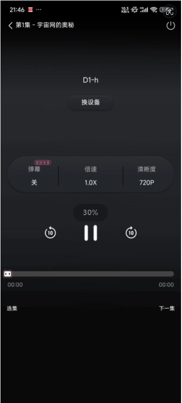

# WiFi+HDMI实现投屏播放功能

> 评测作者：Jason · 本篇为社区评测文章，来自开发者实测，未经官方逐字校对。

## 常见的投屏协议

投屏协议主要有三种：AirPlay、Miracast 和 DLNA，它们各自有不同的特点和应用场景：

1. **AirPlay**
   - 开发者：苹果公司
   - 设备兼容性：主要用于苹果设备，如iPhone、iPad、Mac等，但也支持一些第三方设备。
   - 功能：支持视频投屏和屏幕镜像。屏幕镜像功能允许用户将移动设备上的画面无线投屏到支持AirPlay协议的电视上。
   - 特点：抗干扰性强，镜像效果佳，原生支持苹果设备，但使用范围局限在苹果设备之间。
2. **Miracast**
   - 开发者：Wi-Fi联盟
   - 设备兼容性：支持Android 4.2及以上版本的设备，以及一些Windows设备。
   - 功能：支持屏幕镜像，可以将手机屏幕内容直接投放到高清电视屏幕里。
   - 特点：兼容性广，不需要无线路由器也能工作，使用Wi-Fi Direct技术实现设备间的直接连接。
3. **DLNA**
   - 开发者：Digital Living Network Alliance（数字生活网络联盟）
   - 设备兼容性：支持多种设备，包括智能电视、手机、平板电脑等。
   - 功能：主要用于媒体内容的推送，如照片和视频，不支持屏幕镜像。
   - 特点：基于文件的推送，需要设备支持DLNA协议，适合在线视频推送，播放体验可能需要缓存一小段时间。

这些协议各有优势和局限性，用户可以根据个人设备和需求选择最合适的投屏协议。例如，苹果用户可能更倾向于使用AirPlay，而Android用户可能会选择Miracast或DLNA。此外，一些设备可能同时支持多种投屏协议，提供了更多的灵活性和选择。

## 常见视频APP投屏的实现

视频APP的电视投屏功能通常是通过内置的投屏协议实现的，这些协议包括但不限于DLNA、AirPlay和Miracast。以下是这些协议如何实现视频APP的电视投屏的详细说明：

1. **DLNA (Digital Living Network Alliance)**
   - DLNA协议允许用户将手机中的视频、图片或音频内容推送到支持DLNA的设备上播放。当用户在视频APP中选择投屏功能时，APP会搜索同一Wi-Fi网络下支持DLNA的设备，如智能电视或电视盒子。选择设备后，视频内容会通过DLNA协议传输到电视上播放。DLNA主要用于媒体内容的推送，不支持屏幕镜像。
2. **AirPlay**
   - AirPlay是苹果开发的无线技术，允许iOS设备通过Wi-Fi将内容传输到支持AirPlay的设备，如Apple TV或其他智能电视。AirPlay支持屏幕镜像功能，允许用户将iPhone或iPad的屏幕内容实时传输到电视上。使用AirPlay时，需要确保苹果设备和电视处于同一局域网内。
3. **Miracast**
   - Miracast是由Wi-Fi联盟制定的无线投屏协议，允许Android设备通过Wi-Fi Direct技术直接将屏幕内容镜像到支持Miracast的电视或其他显示设备上。Miracast在Android 4.2及以上版本的设备中得到支持，用户可以在手机的无线显示或类似设置中找到并使用这一功能。

视频APP的投屏过程一般如下：

- 确保手机和电视连接到同一Wi-Fi网络。
- 在视频APP中选择想要观看的视频。
- 寻找APP界面中的TV按钮或类似投屏功能的按钮。
- 选择并连接到电视或电视盒子。
- 视频内容将通过相应的投屏协议传输到电视上播放。

值得注意的是，一些视频平台可能会对VIP视频的投屏功能做出限制，以防止VIP内容通过投屏被非会员用户观看。此外，不同品牌和型号的电视或电视盒子可能对这些协议的支持程度不同，用户在使用时可能需要查看具体设备的说明书或联系制造商获取详细信息。

## 在开发板实现投屏

### 实现方案

通过上面的背景知识可以了解到，我们经常使用的那些安卓APP引用，基本都是通过在电视上，运行一个支持DLAN协议的TV端视频APP，然后手机和电视保持在同一个局域网，这样手机端的APP就可以搜索到局域网内的TV，然后在手机端APP上选择TV，就完成了手机APP的音视频流推送到TV端的过程。

类似的，我们在百问网D1h双屏异显开发套件上，也运行一个支持DLAN的应用，并且开发板能播放HDMI视频和音频；手机视频APP上点击投屏按钮，就能搜索到我们的开发板，然后选择并连接到开发板，这样就可以实现通过WiFi+HDMI实现投屏播放功能。

### 实现步骤

#### 开发板支持WiFi STA功能

详细步骤查阅本系列的第三个文档 - 【百问网D1h开发板】-003-支持WiFi联网.md。

#### 开发板支持HDMI播放音视频

详细步骤查阅本系列的第四个文档 - 【百问网D1h开发板】-004-支持HDMI播放音视频.md。

#### 移植支持DLAN投屏的应用

>  参考百问网的B站视频中的资料：工程源码及配套文档  https://github.com/DongshanPI/DongshannezhaSTU_DLNA_ScreenProjection.git）

##### 1. 下载patch并应用

```bash
jason@DESKTOP-AULSVFL:~/work$ ls
Tina-sdk_dongshannezhastu  tina-d1-h
jason@DESKTOP-AULSVFL:~/work$ cp Tina-sdk_dongshannezhastu/* -rfvd tina-d1-h/
'Tina-sdk_dongshannezhastu/1' -> 'tina-d1-h/1'
'Tina-sdk_dongshannezhastu/README.md' -> 'tina-d1-h/README.md'
'Tina-sdk_dongshannezhastu/config_gstreamer' -> 'tina-d1-h/config_gstreamer'
'Tina-sdk_dongshannezhastu/device/config/chips/d1-h/configs/nezha/sys_partition.fex' -> 'tina-d1-h/device/config/chips/d1-h/configs/nezha/sys_partition.fex'
'Tina-sdk_dongshannezhastu/device/config/chips/d1-h/configs/nezha/uboot-board.dts' -> 'tina-d1-h/device/config/chips/d1-h/configs/nezha/uboot-board.dts'
'Tina-sdk_dongshannezhastu/package/firmware/linux-firmware/xr829/boot_xr829.bin' -> 'tina-d1-h/package/firmware/linux-firmware/xr829/boot_xr829.bin'
'Tina-sdk_dongshannezhastu/package/firmware/linux-firmware/xr829/etf_xr829.bin' -> 'tina-d1-h/package/firmware/linux-firmware/xr829/etf_xr829.bin'
'Tina-sdk_dongshannezhastu/package/firmware/linux-firmware/xr829/fw_xr829.bin' -> 'tina-d1-h/package/firmware/linux-firmware/xr829/fw_xr829.bin'
'Tina-sdk_dongshannezhastu/package/firmware/linux-firmware/xr829/fw_xr829_bt.bin' -> 'tina-d1-h/package/firmware/linux-firmware/xr829/fw_xr829_bt.bin'
'Tina-sdk_dongshannezhastu/package/firmware/linux-firmware/xr829/fw_xr829_bt_40M.bin' -> 'tina-d1-h/package/firmware/linux-firmware/xr829/fw_xr829_bt_40M.bin'
'Tina-sdk_dongshannezhastu/package/firmware/linux-firmware/xr829/sdd_xr829.bin' -> 'tina-d1-h/package/firmware/linux-firmware/xr829/sdd_xr829.bin'
'Tina-sdk_dongshannezhastu/package/firmware/linux-firmware/xr829/sdd_xr829_40M.bin' -> 'tina-d1-h/package/firmware/linux-firmware/xr829/sdd_xr829_40M.bin'
'Tina-sdk_dongshannezhastu/package/utils/e2fsprogs/Makefile' -> 'tina-d1-h/package/utils/e2fsprogs/Makefile'
'Tina-sdk_dongshannezhastu/target/allwinner/d1-h-nezha/base-files/etc/config/fstab' -> 'tina-d1-h/target/allwinner/d1-h-nezha/base-files/etc/config/fstab'
'Tina-sdk_dongshannezhastu/target/allwinner/d1-h-nezha/defconfig' -> 'tina-d1-h/target/allwinner/d1-h-nezha/defconfig'
```

##### 2. 编译固件并烧录

同样的，需参考上面章节【四、支持WiFi】部分，重新修改一下配置，因为投屏的配置，测试是使用的40M配置，我们的板子上是24M，需要修改过后，再进行编译，然后执行pack，生成可以烧录的*tina_d1-h-nezha_uart0.img*文件。

##### 3. 交叉编译投屏应用

###### 3.1 libupnp

```bash
jason@DESKTOP-AULSVFL:~/work$ wget https://github.com/pupnp/pupnp/releases/download/release-1.14.12/libupnp-1.14.12.tar.bz2
jason@DESKTOP-AULSVFL:~/work$ tar -xf libupnp-1.14.12.tar.bz2
jason@DESKTOP-AULSVFL:~/work$ cd libupnp-1.14.12
jason@DESKTOP-AULSVFL:~/work/libupnp-1.14.12$ export PATH=$PATH:~/work/tina-d1-h/out/d1-h-nezha/staging_dir/toolchain/bin
jason@DESKTOP-AULSVFL:~/work/libupnp-1.14.12$ ./configure --host=riscv64-unknown-linux-gnu
jason@DESKTOP-AULSVFL:~/work/libupnp-1.14.12$ make -j$(nproc)
jason@DESKTOP-AULSVFL:~/work/libupnp-1.14.12$ mkdir tmp
jason@DESKTOP-AULSVFL:~/work/libupnp-1.14.12$ make install DESTDIR=~/work/libupnp-1.14.12/tmp/
```

###### 3.2. tprender

```bash
jason@DESKTOP-AULSVFL:~/work$ git clome https://github.com/DongshanPI/DongshannezhaSTU_DLNA_ScreenProjection.git dlan_demo
jason@DESKTOP-AULSVFL:~/work$ cd dlan_demo/
jason@DESKTOP-AULSVFL:~/work/dlan_demo$ ls
README.md  libupnp-1.14.12  tprender
jason@DESKTOP-AULSVFL:~/work/dlan_demo$ cd tprender/
jason@DESKTOP-AULSVFL:~/work/dlan_demo/tprender$ autoreconf -ivf
autoreconf: Entering directory `.'
autoreconf: configure.ac: not using Gettext
autoreconf: running: aclocal --force
autoreconf: configure.ac: tracing
autoreconf: configure.ac: not using Libtool
autoreconf: running: /usr/bin/autoconf --force
autoreconf: running: /usr/bin/autoheader --force
autoreconf: running: automake --add-missing --copy --force-missing
autoreconf: Leaving directory `.'
jason@DESKTOP-AULSVFL:~/work/dlan_demo/tprender$ cmake .
jason@DESKTOP-AULSVFL:~/work/dlan_demo/tprender$ make
...
[100%] Built target tprender
# 交叉编译出来的三方库目录
jason@DESKTOP-AULSVFL:~/work/dlan_demo/tprender$ ls libs/
libixml.so  libixml.so.11  libupnp.so  libupnp.so.17
# 交叉编译出来的DLAN投屏应用
jason@DESKTOP-AULSVFL:~/work/dlan_demo/tprender$ ll tprender
-rwxr-xr-x 1 jason jason 116984 Apr 30 16:01 tprender*
jason@DESKTOP-AULSVFL:~/work/dlan_demo/tprender$
```

##### 4. 上传并运行投屏应用

###### 4.1. 上传交叉编译的投屏应用

1. 在wsl中，将交叉编译生成的投屏应用二进制和库拷贝到outpu目录：

   ```bash
   jason@DESKTOP-AULSVFL:~/work/dlan_demo/tprender$ mkdir output
   jason@DESKTOP-AULSVFL:~/work/dlan_demo/tprender$ cp tprender output/
   jason@DESKTOP-AULSVFL:~/work/dlan_demo/tprender$ cp libs/* output/ -a
   ```

2. 在windows的资源管理器中找到对应的wsl发行版的编译目录，按住shift，鼠标右键单击，选择在终端中打开，然后执行下面的命令，将output整个目录拷贝到板子上的/root目录

   ```powershell
   PS Microsoft.PowerShell.Core\FileSystem::\\wsl.localhost\Ubuntu-18.04\home\jason\work\dlan_demo\tprender> adb push .\output\ /root/
   .\output\: 5 files pushed. 4.9 MB/s (2854648 bytes in 0.560s)
   ```

###### 4.2. 单板上运行投屏应用

在单板是的调试串口中，运行tprender，详细命令参考：

```bash
root@TinaLinux:~# ifconfig wlan0
# 测试AP名称和密码，手机和单板必现在同一个局域网中
root@TinaLinux:~# wifi_connect_ap_test test-AP 12345678
root@TinaLinux:~# udhcpc -i wlan0
root@TinaLinux:~# 
root@TinaLinux:~# cd /root/output
root@TinaLinux:~/output# chmod +x tprender
root@TinaLinux:~/output# export LD_LIBRARY_PATH=$LD_LIBRARY_PATH:.
root@TinaLinux:~/output# ./tprender -f "D1-h"
WARNING: awplayer <cdx_log_set_level:30>: cdx Set log level to 6
INFO   : cedarc <CedarPluginVDInit:79>: register h264 decoder success!
INFO   : cedarc <CedarPluginVDInit:84>: register mjpeg decoder success!
INFO   : cedarc <CedarPluginVDInit:86>: register mpeg2 decoder success!
INFO   : cedarc <CedarPluginVDInit:92>: register mpeg4dx decoder success!
INFO   : cedarc <CedarPluginVDInit:79>: register mpeg4H263 decoder success!
INFO   : cedarc <CedarPluginVDInit:90>: register mpeg4Normal decoder success!
INFO   : cedarc <CedarPluginVDInit:74>: register vc1 decoder success!
INFO   : cedarc <CedarPluginVDInit:85>: register h265 decoder success!
gmediarender 0.0[ 2283.505561] raw_flag value is 0
.9 started [ gmediarender 0.0.9_git2022-07-25_1867e4b (libupnp-1.14.10; glib-2.50.1; without gstreamer.) ].
Logging switched off. Enable with --logfile=<filename> (or --logfile=stdout for console)

>>>>>>>>>>>>>>>>>>>>>>>>>>>>>>> tina_multimedia <<<<<<<<<<<<<<<<<<<<<<<<<<<<<<<
tag   : tina3.5
branch: tina-dev
date  : Mon Jul 15 19:04:59 2019 +0800
Change-Id: I5f6c8a88d7b387a312b7744797a0d5f8ab07ee7a
-------------------------------------------------------------------------------
xplayer:process message XPLAYER_COMMAND_SET_AUDIOSINK.
xplayer:process message XPLAYER_COMMAND_SET_SURFACE.
xplayer:process message XPLAYER_COMMAND_SET_SUBCTRL.
xplayer:process message XPLAYER_COMMAND_SET_DI.
dd: writing '/dev/fb0': No space left on device
32401+0 records in
32400+0 records out
ERROR [2024-04-30 22:13:12.352445 | webserver] Could not stat './/grender-64x64.png': No such file or directory
ERROR [2024-04-30 22:13:12.352967 | webserver] Could not stat './/grender-128x128.png': No such file or directory
output_set_volume
Ready for rendering.
```

###### 4.3. 手机上进行投屏

根据上一节运行的设备参数"D1-h"，在手机应用软件如B站APP上，点击播放界面的TV图标，然后选择D1-h，这个时候数据流便推到了单板的应用tprender中，并通过HDMI显示出来，这个时候如果没声音，参考本系列的第四个文档 - 【百问网D1h开发板】-004-支持HDMI播放音视频.md。，配置音频信号输出到HDMI接口。

## 投屏详细步骤

参考B站视频：[国产RISC-V B站投屏至东山哪吒STU开发板实现播放视频](https://www.bilibili.com/video/BV1GY4y1A7xp/?spm_id_from=333.880.my_history.page.click&vd_source=16b0951009a6e309359305cecc275f73)

## 投屏结果示范

### APP选择投屏设备

手机上选择配置的DLAN设备名D1-h:



### 开发板投屏播放


