# 开箱、基础环境搭建

> 评测作者：pomin张海良 · 本篇为社区评测文章，来自开发者实测，未经官方逐字校对。

有幸参与的百问的D1-H双屏开发板的测评活动，经过了几天的等待终于收到了开发板，包装很精致，D1-H的主板，接口丰富，支持4K的HDMI输出，同时板载了mipi的接口，很适合作大屏幕的应用

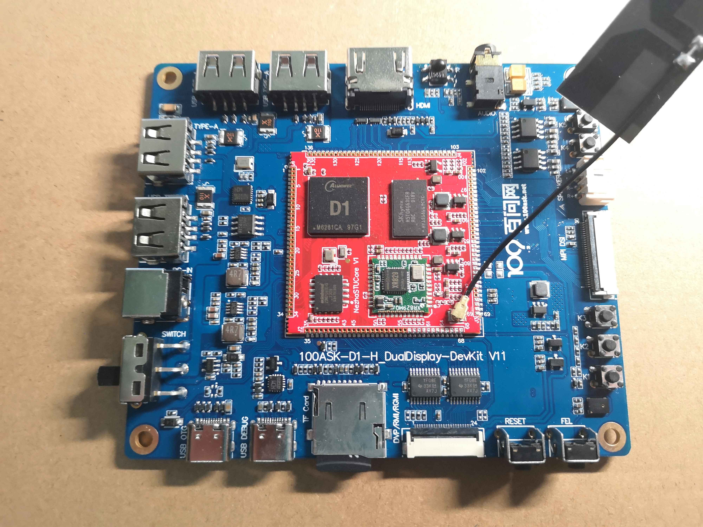


还有许多的配件

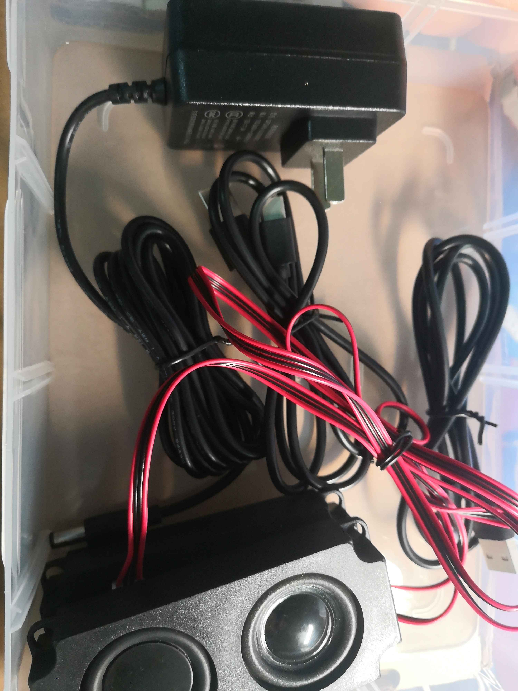

# 环境搭建
## 先前条件

预先安装好 Ubuntu18.04 版本的虚拟机，对于 VMware 的安装就不做详细介绍了，可以查看这篇教程 https://zhuanlan.zhihu.com/p/38797088

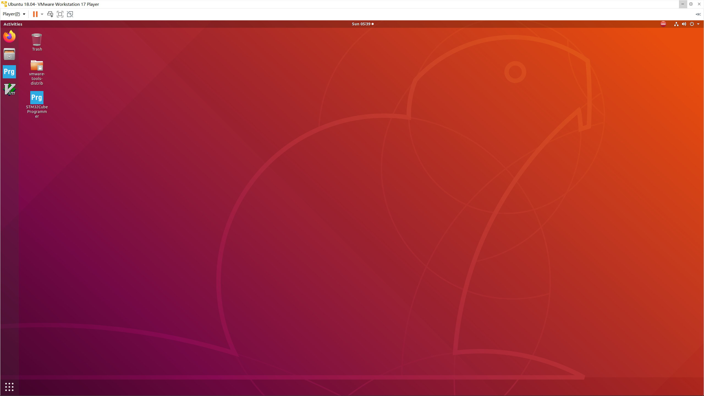

### SSH 远程登录

Ubuntu 18.04 好像默认是没有开启 SSH 远程登陆的，把 ssh 安装上去。

```sh
sudo apt install openssh-server
sudo service ssh start
```

然后在Windows中打开一个自己常用的 ssh 终端工具，我这里用的 Tabby，当然 MobaXterm 也是一样的。

然后把 Ubuntu 中的 IP 地址设置成静态的，我这里设置成了 192.168.64.64

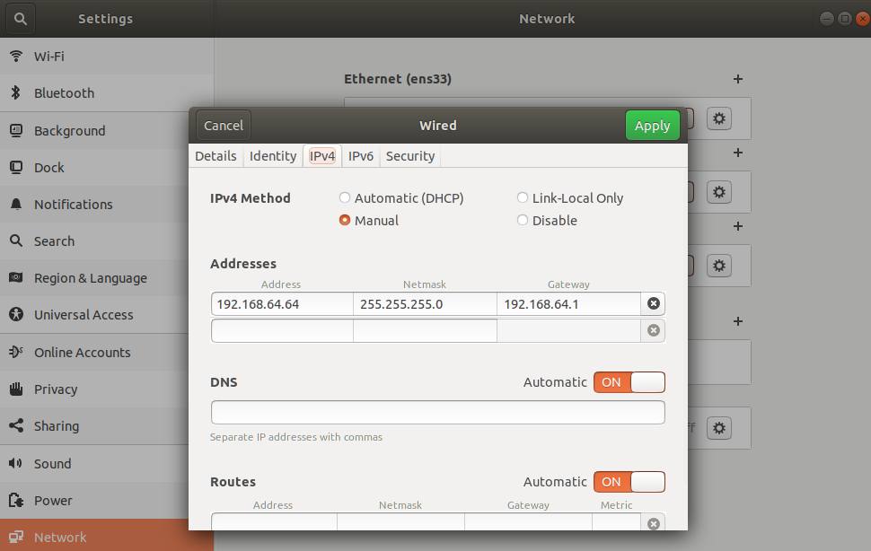

然后用 Windows中的终端工具去 ssh 远程连接到 Ubuntu

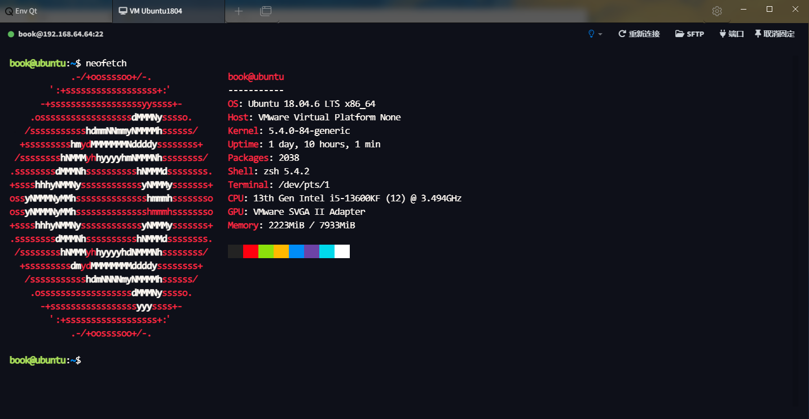

### 所需软件包

然后安装一些需要用到的软件包，执行如下命令

```
sudo apt-get install -y sed make binutils build-essential gcc g++ bash patch gzip bzip2 perl tar cpio unzip rsync file bc wget python cvs git mercurial rsync subversion android-tools-mkbootimg vim libssl-dev android-tools-fastboot
```

## SDK 环境

### 解压源码包

将 SDK 的源码压缩包放在 ~ 目录或者新建一个文件夹放进去，这里放在了 ~/aw 这个目录中，然后执行如下命令来解压所有的 SDK 源码压缩包

```
cat tina-d1-h.tar.bz2.* | tar -jxv
```

源码包的目录结构如下，tina Linux 是 Owrt 修改过来的，目录结构也是十分相似

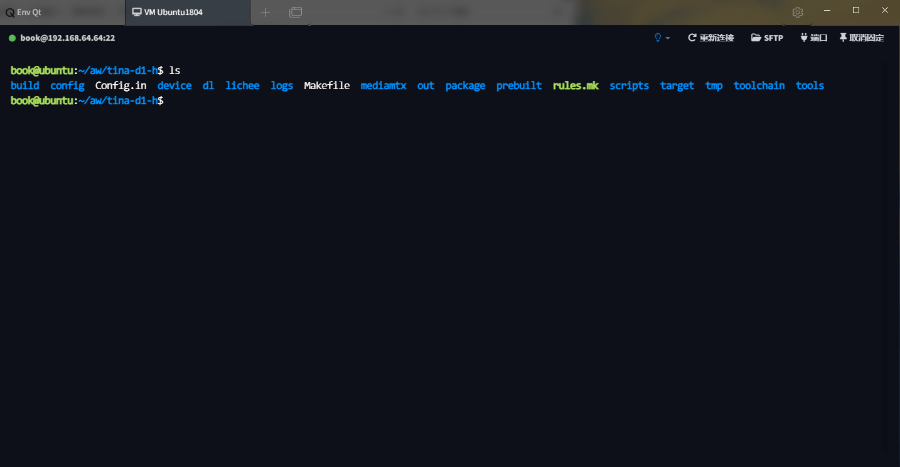

### 常用文件

这里列出经常修改的文件，设备树文件和分区表文件

- DTS 文件
	- ./device/config/chips/d1-h/configs/nezha/uboot-board.dts
	- ./device/config/chips/d1-h/configs/nezha/linux-5.4/board.dts
- 分区文件
	- ./target/allwinner/d1-h-nezha/swupdate/sys_partition_ab.fex

### 编译

> 必须使用 bash，不能使用 zsh 等工具

然后初始化编译环境

```sh
 source build/envsetup.sh
```

然后根据提示运行 lunch 命令，会提示需要选择目标板，这里选择 d1-h_nezha-tina 这个选项，选择好后会提示目标板的编译选项

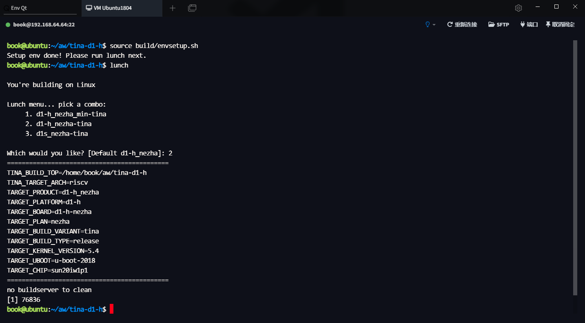

然后就可以开始编译了，运行 make -j16，也可以指定别的数字，因为我这里是给了虚拟机 16个 cpu 核心所以是 -j16

```
 make -j16
```

编译一段时间后看到 make completed successfully，编译成功了

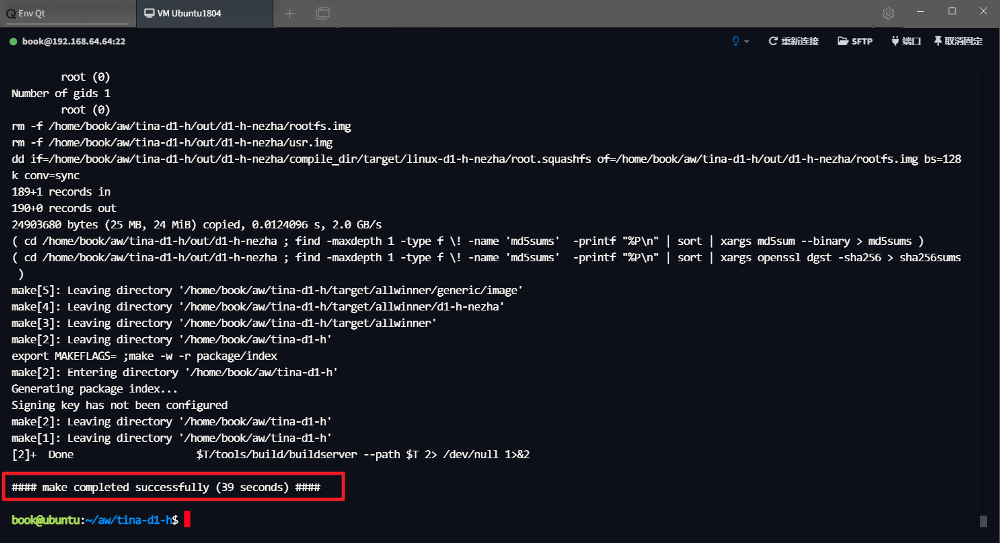

### 打包镜像

打包镜像也十分的简单，直接执行 pack 命令即可

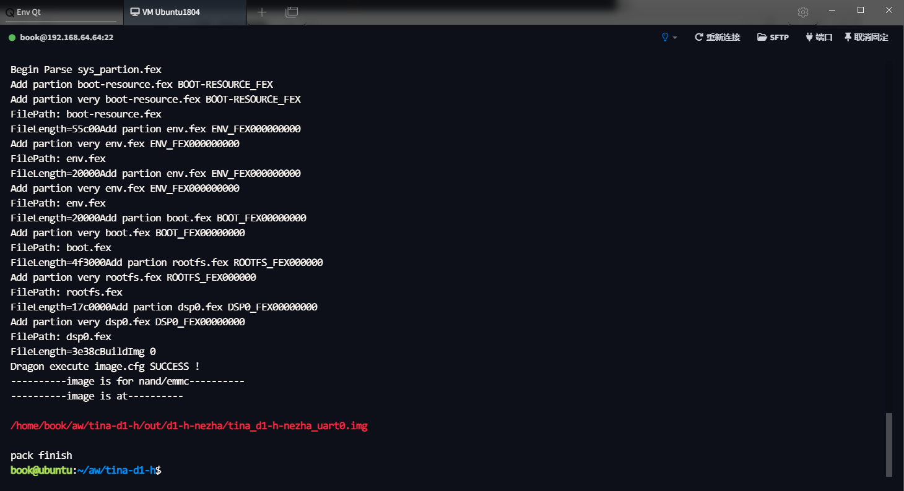

## 烧录镜像

把编译好的镜像，默认存放位置： out/d1-h-nezha/tina_d1-h-nezha_uart0.img 用 filezilla 工具传输到 Windows 中

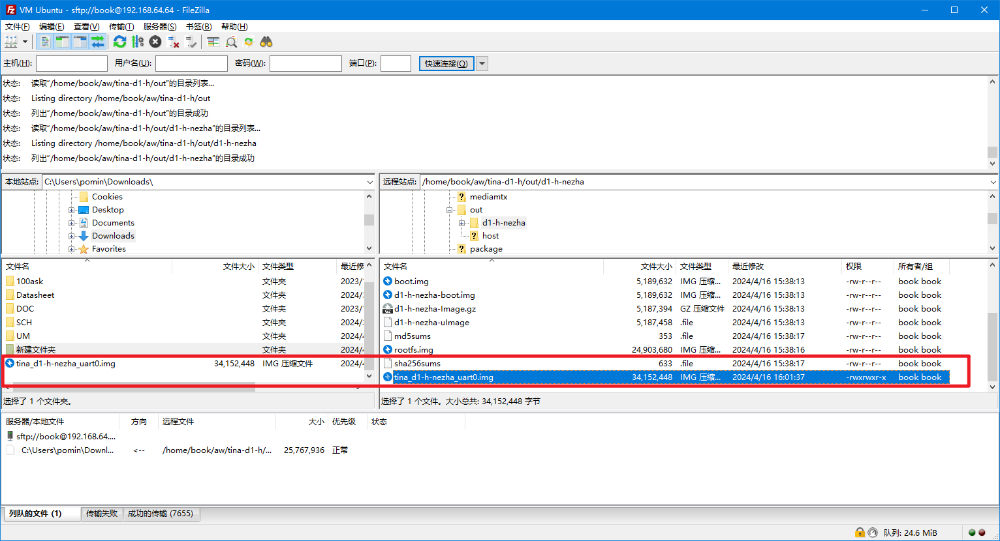

然后打开 PhoenixSuit 填入镜像的路径，不需要点击立即升级，插入开发板的时候会自动烧录。

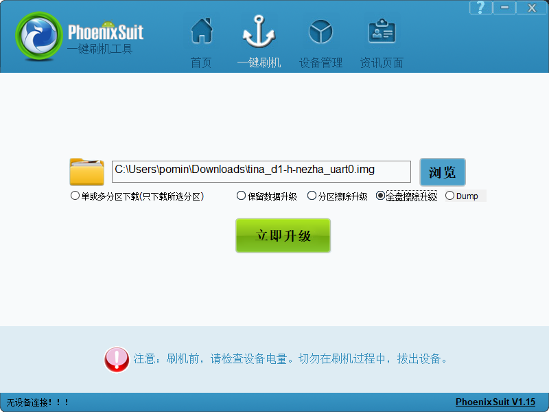

然后打开串口的终端，点击一下回车键，就可以看到 tina linux 的大 logo 了

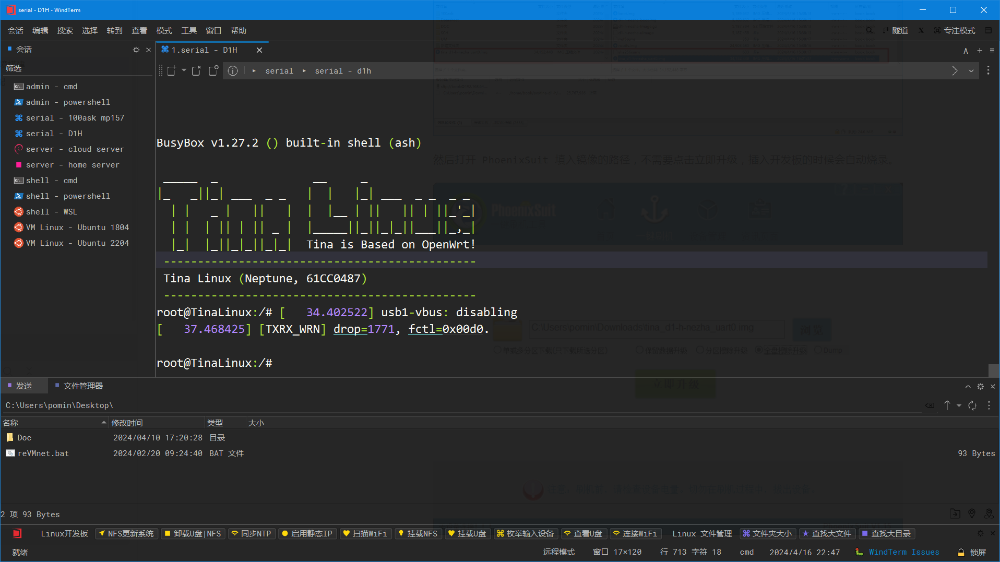
