# HDMI、IR、WIFI 适配

> 评测作者：pomin张海良 · 本篇为社区评测文章，来自开发者实测，未经官方逐字校对。

- DTS 文件
	- ./device/config/chips/d1-h/configs/nezha/uboot-board.dts
	- ./device/config/chips/d1-h/configs/nezha/linux-5.4/board.dts
- 分区文件
	- ./target/allwinner/d1-h-nezha/swupdate/sys_partition_ab.fex

## 默认 HDMI 输出

这里我希望开机就是默认输出到 HDMI，需要对 ./device/config/chips/d1-h/configs/nezha/uboot-board.dts 进行修改

对 uboot-board.dts 中的 disp 节的代码进行修改，patch 文件如下，把默认的输出设备改为 HDMI 输出

```d
diff --git a/configs/nezha/uboot-board.dts b/configs/nezha/uboot-board.dts
index 81a521e..ca1b898 100644
--- a/configs/nezha/uboot-board.dts
+++ b/configs/nezha/uboot-board.dts
@@ -214,31 +214,29 @@
 	disp_init_enable         = <1>;
 	disp_mode                = <0>;
 
-	screen0_output_type      = <1>;
-	screen0_output_mode      = <4>;
-
-	screen1_output_type      = <3>;
-	screen1_output_mode      = <10>;
-
-	screen1_output_format    = <0>;
-	screen1_output_bits      = <0>;
-	screen1_output_eotf      = <4>;
-	screen1_output_cs        = <257>;
-	screen1_output_dvi_hdmi  = <2>;
-	screen1_output_range     = <2>;
-	screen1_output_scan      = <0>;
-	screen1_output_aspect_ratio = <8>;
-
-	dev0_output_type         = <1>;
-	dev0_output_mode         = <4>;
-	dev0_screen_id           = <0>;
-	dev0_do_hpd              = <0>;
-
-	dev1_output_type         = <4>;
-	dev1_output_mode         = <10>;
-	dev1_screen_id           = <1>;
-	dev1_do_hpd              = <1>;
+	screen0_output_type      = <3>;
+	screen0_output_mode      = <10>;
 
+	screen1_output_type      = <1>;
+    screen1_output_mode      = <4>;
+
+    screen0_output_format = <0>;
+    screen0_output_bits = <0>;
+    screen0_output_eotf = <4>;
+    screen0_output_cs = <257>;
+    screen0_output_dvi_hdmi = <2>;
+    screen0_output_range = <2>;
+    screen0_output_scan = <0>;
+    screen0_output_aspect_ratio = <8>;
+
+
+    dev0_output_type         = <4>;
+
+
+
+
+	dev0_output_mode         = <10>;	dev0_screen_id           = <0>;
+	dev0_do_hpd              = <1>;
 	def_output_dev           = <0>;
 	hdmi_mode_check          = <1>;
 

```

## Wi-Fi、IR 适配

查看核心板的原理图可以看到 XR829 蓝牙+WiFi 模块的 WL_REG_ON 管脚需要修改，在 SDK　原本的设备树中 WL_REG_ON 管脚是 PG12，但是开发板的管脚是 PB12

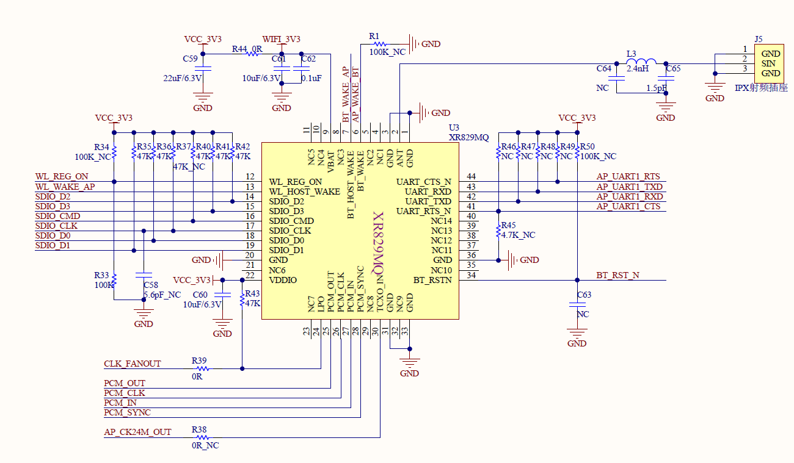

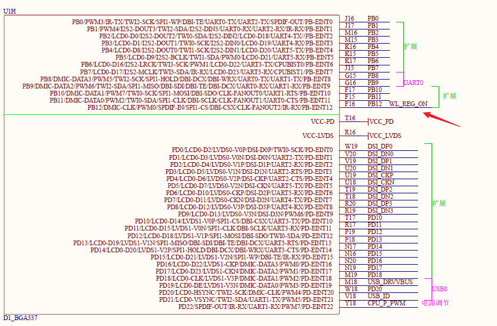

红外接收头的输入管脚接到的是 PG16，和 SDK 原本的 PB12 不同，也需要修改

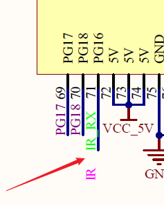

board.dts 的 patch 文件如下

```d
diff --git a/configs/nezha/linux-5.4/board.dts b/configs/nezha/linux-5.4/board.dts
old mode 100755
new mode 100644
index 963aa17..15eed8c
--- a/configs/nezha/linux-5.4/board.dts
+++ b/configs/nezha/linux-5.4/board.dts
@@ -464,14 +464,14 @@
 */
 
 	s_cir0_pins_a: s_cir@0 {
-		pins = "PB12";
+		pins = "PG16";
 		function = "ir";
 		drive-strength = <10>;
 		bias-pull-up;
 	};
 
 	s_cir0_pins_b: s_cir@1 {
-		pins = "PB12";
+		pins = "PG16";
 		function = "gpio_in";
 	};
 
@@ -566,7 +566,7 @@
 			clock-names = "32k-fanout1";
 			clocks = <&ccu CLK_FANOUT1_OUT>;
 			wlan_busnum    = <0x1>;
-			wlan_regon    = <&pio PG 12 GPIO_ACTIVE_HIGH>;
+			wlan_regon    = <&pio PB 12 GPIO_ACTIVE_HIGH>;
 			wlan_hostwake  = <&pio PG 10 GPIO_ACTIVE_HIGH>;
 			/*wlan_power    = "VCC-3V3";*/
 			/*wlan_power_vol = <3300000>;*/
@@ -1391,7 +1391,7 @@ pull up or pull down(default 0), driver level(default 1), data>
 	pinctrl-names = "default", "sleep";
 	pinctrl-0 = <&s_cir0_pins_a>;
 	pinctrl-1 = <&s_cir0_pins_b>;
-	status = "disabled";
+	status = "okay";
 };
 
 &ir1 {

```

修改完了设备树后还需要修改一下 menuconfig 的配置，执行下面命令打开 kernel 的 menuconfig 的窗口

```
make kernel_menuconfig
```

然后使用 / 键进入搜索，搜索 IR_RX_SUNXI，可以看到我这里已经使能了，SDK 默认可能是没有使能的，需要修改下，前面标有（1），按下数字 1 键就可以跳转到这个位置

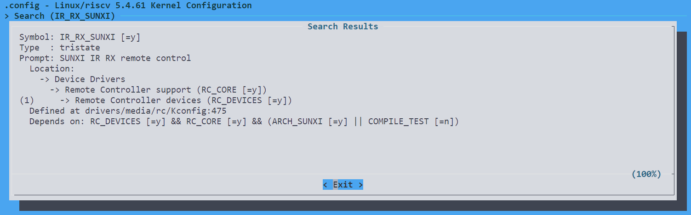

这时红外功能就可以用了，后续会注册到 /dev/input/event\* 中

核心板的 Wi-Fi 模块有可能会是 24MHz 的晶振，而 SDK 默认的是 40MHz 的，需要修改下，运行命令打开 menuconfig

```
make menuconfig
```

使用 / 进入搜索模式，搜索 XR829，把 kmod-net-xr829-40M 改成 kmod-net-xr829

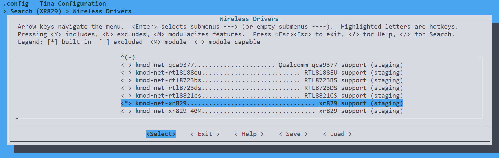

失能掉 xr829 with 40M sdd

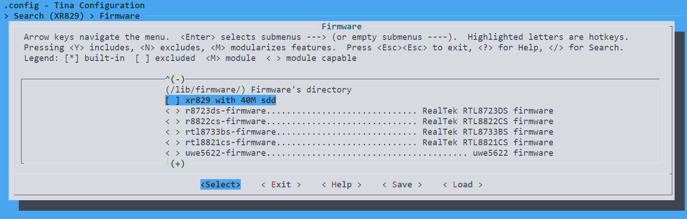

确保 xr829-firmware 是使能的

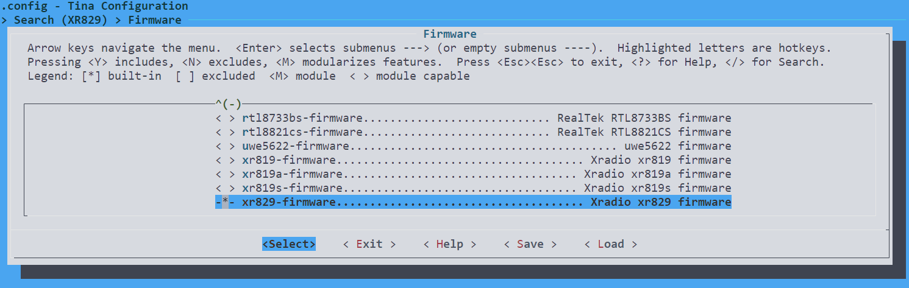

然后退出保存即可。

## 烧录测试

在 SDK 根目录以此运行如下命令完成编译和打包

```
source build/envsetup.sh
lunch
make -j99
pack
```

将 Ubuntu 虚拟机编译出的镜像传输到 Windows 实体机中

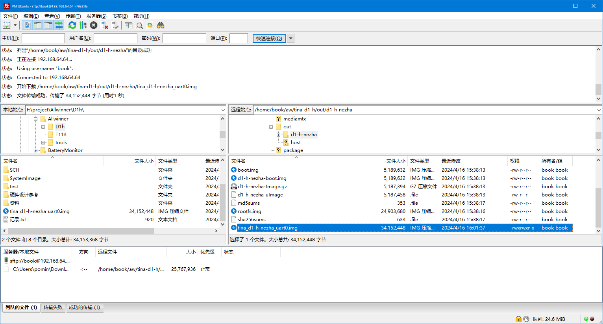

烧录到开发板中

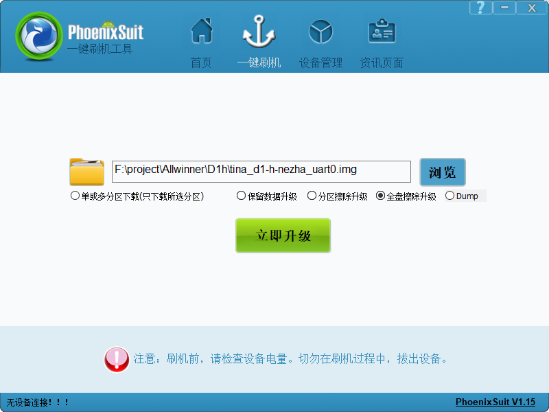

启动开发板，./device/config/chips/d1-h/configs/nezha/configs/bootlogo.bmp 是下面这个图片


> 📹 原文包含视频/位图素材 `images/bootlogo.bmp`，未包含在文档中。


通过 HDMI 采集器可以看到在开发板启动的时候默认进入了 HDMI 的显示了

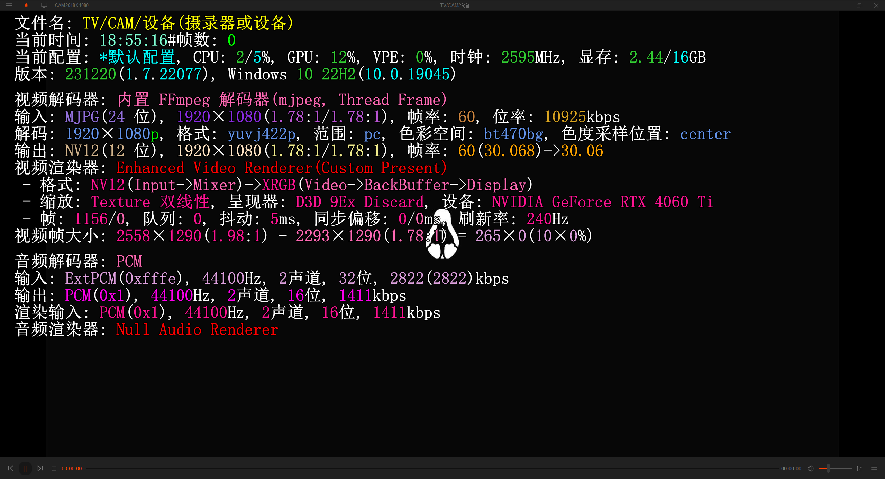

ifconfig 命令查看网卡，可以看到 wlan0 了，使用 wifi_connect_ap_test 命令连接到 Wi-Fi

```
wifi_connect_ap_test [ssid] [passwd]
```

命令尝试连接到一个 Wi-Fi，连接完后尝试 ping 百度来看看

```
ping baidu.com -Iwlan0
```

可以看到通过 Wi-Fi 可以正常访问到互联网了

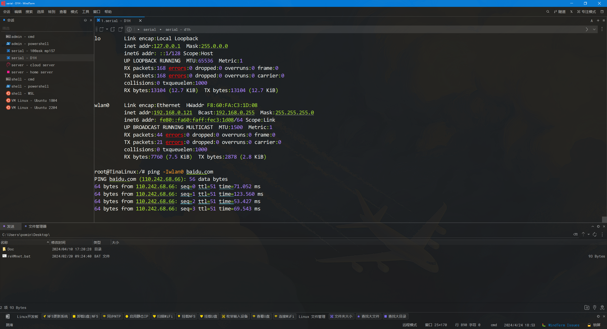

再看看红外 O不OK

```
cat /proc/bus/input/devices
```


可以看到红外的输入对应的是 event1，然后使用 hexdump 查看下输出

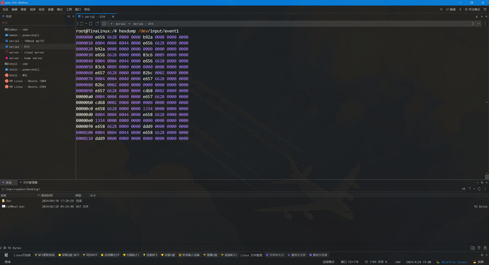
