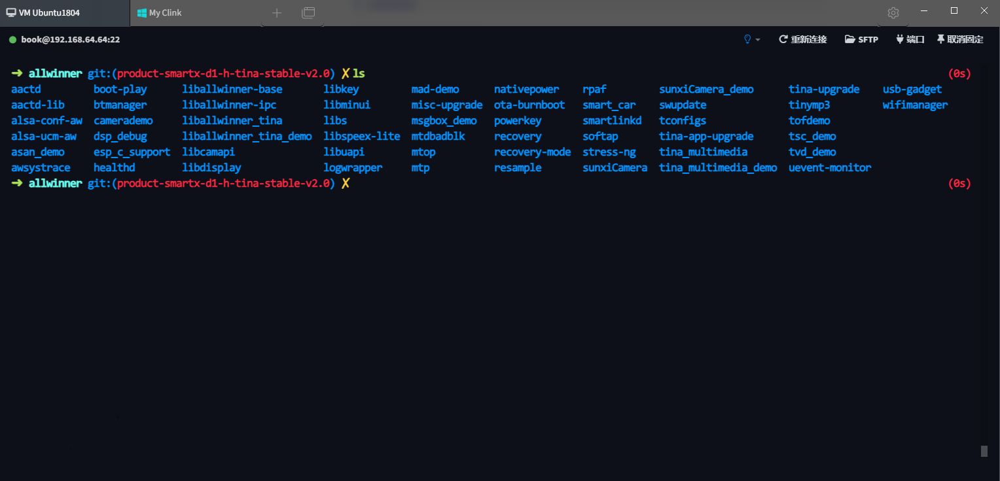
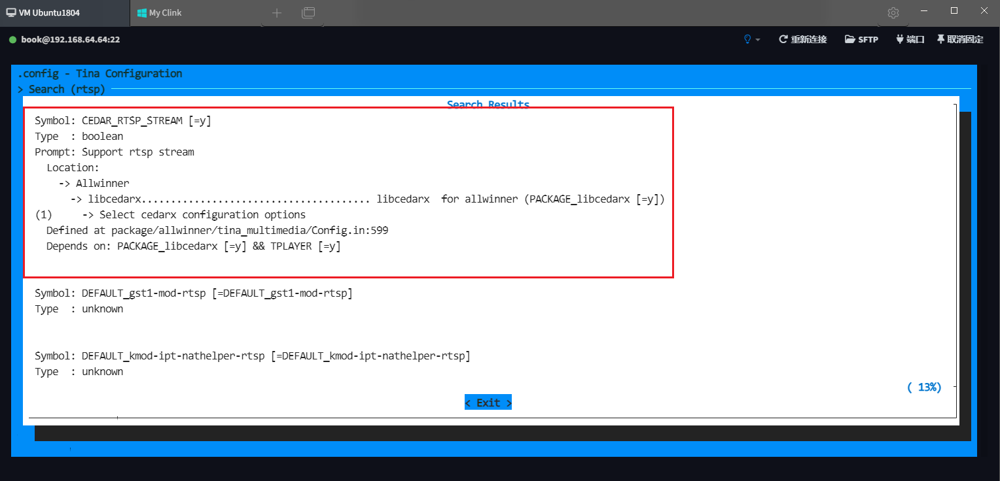
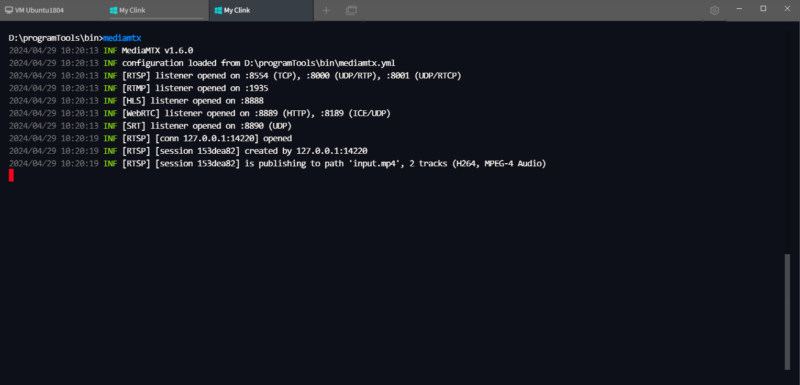
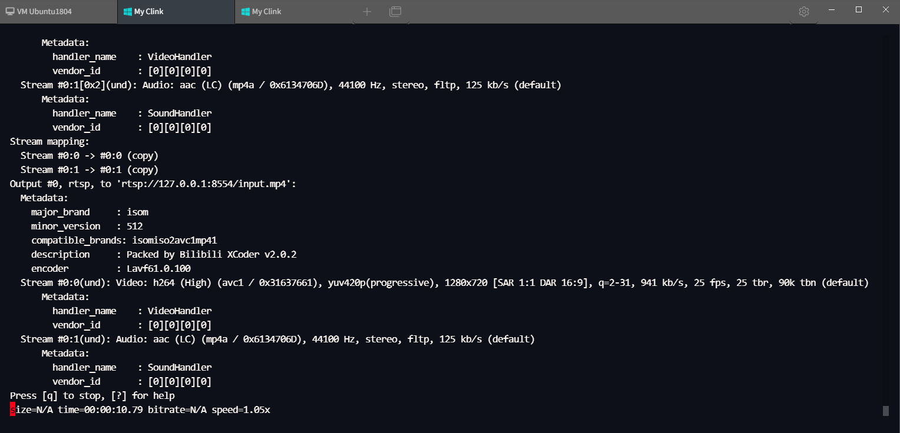

# 播放网络视频

> 评测作者：pomin张海良 · 本篇为社区评测文章，来自开发者实测，未经官方逐字校对。

本文主要参考了这篇文章 https://blog.csdn.net/weixin_43094346/article/details/124265641

## 使能 RTSP

进入到 SDK 的 package/allwinner 目录下，这个目录下是一个 git 仓库



新建一个名字为 support_rtsp.patch 的文件，写入以下内容

```sh
diff --git a/allwinner/tina_multimedia/libcedarx/libcore/parser/Makefile.am b/allwinner/tina_multimedia/libcedarx/libcore/parser/Makefile.am
index f33af3743..5d1aeaf0c 100755
--- a/allwinner/tina_multimedia/libcedarx/libcore/parser/Makefile.am
+++ b/allwinner/tina_multimedia/libcedarx/libcore/parser/Makefile.am
@@ -72,4 +72,7 @@ if PLS_PARSER_ENABLE
 SUBDIRS += pls
 endif

-SUBDIRS += base
\ No newline at end of file
+SUBDIRS += remux
+
+SUBDIRS += base
+
diff --git a/allwinner/tina_multimedia/libcedarx/libcore/parser/base/CdxParser.c b/allwinner/tina_multimedia/libcedarx/libcore/parser/base/CdxParser.c
index 44305f3c6..a24273fbc 100755
--- a/allwinner/tina_multimedia/libcedarx/libcore/parser/base/CdxParser.c
+++ b/allwinner/tina_multimedia/libcedarx/libcore/parser/base/CdxParser.c
@@ -50,7 +50,7 @@ static struct ParserUriKeyInfoS asfKeyInfo =
 };
 #endif

-#if 0
+#if 1
 extern CdxParserCreatorT remuxParserCtor;
 static struct ParserUriKeyInfoS remuxKeyInfo =
 {
@@ -460,7 +460,7 @@ void AwParserInit(void)
     AwParserRegister(&movParserCtor, CDX_PARSER_MOV, &movKeyInfo);
 #endif

-#if 0
+#if 1
     AwParserRegister(&remuxParserCtor, CDX_PARSER_REMUX, &remuxKeyInfo);
 #endif

diff --git a/allwinner/tina_multimedia/libcedarx/libcore/parser/base/Makefile.am b/allwinner/tina_multimedia/libcedarx/libcore/parser/base/Makefile.am
index 9dbb73590..86174f94e 100755
--- a/allwinner/tina_multimedia/libcedarx/libcore/parser/base/Makefile.am
+++ b/allwinner/tina_multimedia/libcedarx/libcore/parser/base/Makefile.am
@@ -65,6 +65,8 @@ libcdx_parser_la_LIBADD += $(top_srcdir)/libcore/parser/avi/libcdx_avi_parser.la
 libcdx_parser_la_CFLAGS += -DAVI_PARSER_ENABLE
 endif

+libcdx_parser_la_LIBADD += $(top_srcdir)/libcore/parser/remux/libcdx_remux_parser.la
+
 if TS_PARSER_ENABLE
 libcdx_parser_la_LIBADD += $(top_srcdir)/libcore/parser/ts/libcdx_ts_parser.la
 libcdx_parser_la_CFLAGS += -DTS_PARSER_ENABLE

```

用 git apply 来运行 patch 补丁

```
git apply support_rtsp.patch
```

然后运行 make menuconfig 打开配置菜单，搜索 rtsp 看到的第一个就是了，把它使能，然后编译、打包、烧录到开发板



这时就可以用开发板来进行“拉流”了

## RTSP 推流

有拉当然还得有推，推流用 Windows 的机器，需要先开放几个端口，rtsp 的话用的默认是 8554 端口，这里直接用一个现成的工具，省去反复开端口的麻烦
- 可执行文件 https://github.com/bluenviron/mediamtx ，这个工具会根据 yml 来打开一些常用的端口
- yml 文件 https://github.com/bluenviron/mediamtx/blob/main/mediamtx.yml 可以直接使用仓库中的这个文件
- 把上面两个文件放在同一目录

直接运行，可以从日志中看到打开了很多常用的端口



然后再打开一个终端来运行推流，指定端口到8554端口，事先准备的 input.mp4 文件也在当前目录

```
ffmpeg -re -stream_loop -1 -i input.mp4 -c copy -f rtsp rtsp://127.0.0.1:8554/input.mp4
```



这时推流已经就位了，下面开始在开发板上面进行拉流的操作

## RTSP 拉流

完成了之前的步骤后，开发板进行 RTSP 拉流就比较容易了，联网、拉流即可

先连接上 Wi-Fi

```
wifi_connect_ap_test [ssid] [password]
```

然后用 tplayerdemo 来拉流播放

```
tplayerdemo rtsp://192.168.0.109:8554/input.mp4
```

可以看到视频可以播放到 HDMI 的输出了，日志如下

```
root@TinaLinux:/# tplayerdemo rtsp://192.168.0.109:8554/input.mp4
WARNING: awplayer <cdx_log_set_level:30>: cdx Set log level to 6

INFO   : cedarc <CedarPluginVDInit:79>: register h264 decoder success!
INFO   : cedarc <CedarPluginVDInit:84>: register mjpeg decoder success!
INFO   : cedarc <CedarPluginVDInit:86>: register mpeg2 decoder success!
INFO   : cedarc <CedarPluginVDInit:92>: register mpeg4dx decoder success!
INFO   : cedarc <CedarPluginVDInit:79>: register mpeg4H263 decoder success!
INFO   : cedarc <CedarPluginVDInit:90>: register mpeg4Normal decoder success!
INFO   : cedarc <CedarPluginVDInit:74>: register vc1 decoder success!
INFO   : cedarc <CedarPluginVDInit:85>: register h265 decoder success!

******************************************************************************************
* This program implements a simple player, you can type commands to control the player.
* To show what commands supported, type 'help'.
******************************************************************************************
dd: writing '/dev/fb0': No space left on device
32401+0 records in
32400+0 records out
argc = 2
argv[0] = tplayerdemo
argv[1] = rtsp://192.168.0.109:8554/input.mp4
may be is one file:cut[  133.664339] [SNDCODEC][sunxi_card_hw_params][620]:stream_flag: 0
 down suffix is:.mp4
find the matched type:.mp4
create player:0

>>>>>>>>>>>>>>>>>>>>>>>>>>>>>>> tina_multimedia <<<<<<<<<<<<<<<<<<<<<<<<<<<<<<<
tag   : tina3.5
branch: tina-dev
date  : Mon Jul 15 19:04:59 2019 +0800
Change-Id: I5f6c8a88d7b387a312b7744797a0d5f8ab07ee7a
-------------------------------------------------------------------------------
xplayer:process message XPLAYER_COMMAND_SET_AUDIOSINK.
xplayer:process message XPLAYER_COMMAND_SET_SURFACE.
xplayer:process message XPLAYER_COMMAND_SET_SUBCTRL.
xplayer:process message XPLAYER_COMMAND_SET_DI.
create player[0]:0x34a2a3d0
screen width:1920,screen height:1080
1:playVideo:0
before TPlayerSetDataSource,94712:rtsp://192.168.0.109:8554/input.mp4
xplayer:process message XPLAYER_COMMAND_SET_SOURCE.
setDataSource end
xplayer:process message XPLAYER_COMMAND_PREPARE.
Created new TCP socket 9 for connection
INFO   : cedarc <log_set_level:4[  133.983565] VE: enable hw clock
3>: Set log level to 5 from /ven[  133.989646] enable_cedar_hw_clk,552
dor/etc/cedarc.conf
ERROR  : cedarc <DebugCheckConfig:301>: [4[  133.998973] VE: VE real_freq=576000000
[  133.998973]
0;31mnow cedarc log level:5
info: media source is unseekable.
TPlayerPrepare end
TPlayerSetHoldLastPicture()
xplayer:process message XPLAYER_COMMAND_START.
(Allwinner Audio Middle Layer),line(971) : Create Decoder!!=====
(Allwinner Audio Middle Layer),line(603) : AudioDec_Installaudiolib ok
(Allwinner Audio Middle Layer),line(606) : audio decoder init start ...
(AllwinnerAlibs),line(50) :
>>>>>>>>>>>>>>>>>>>>>>>>>>>>>>> Audio <<<<<<<<<<<<<<<<<<<<<<<<<<<<<<<
tag   : audiocodec-v1.2
branch: new
commit: 3ba65962c01cbf1280ddda19d843009b6ef8ce85
date  : Tue Jan 8 16:25:27 2019 +0800
----------------------------------------------------------------------

(AllwinnerAlibs),line(700) : ----Loading so success!
(AllwinnerAlibs),line(902) : *************pAudioStreamInfo start******************
(AllwinnerAlibs),line(903) : eCodecFormat         :id(4), name(aac low-complexy)
(AllwinnerAlibs),line(904) : eSubCodecFormat      :0
(AllwinnerAlibs),line(905) : nChannelNum          :2
(AllwinnerAlibs),line(906) : nBitsPerSample       :16
(AllwinnerAlibs),line(907) : nSampleRate          :44100
(AllwinnerAlibs),line(908) : nAvgBitrate          :0
(AllwinnerAlibs),line(909) : nMaxBitRate          :0
(AllwinnerAlibs),line(910) : nFileSize            :0
(AllwinnerAlibs),line(911) : eAudioBitstreamSource:0
(AllwinnerAlibs),line(912) : eDataEncodeType      :0
(AllwinnerAlibs),line(913) : nCodecSpecificDataLen:2
(AllwinnerAlibs),line(914) : pCodecSpecificData   :0x3fbc088420
(AllwinnerAlibs),line(915) : nFlags               :0
(AllwinnerAlibs),line(916) : nBlockAlign          :0
(AllwinnerAlibs),line(917) : *************pAudioStreamInfo end  ******************
(AAC Decoder),line(36) : init successs...
(Allwinner Audio Middle Layer),line(614) : AUDIO DECODE INIT OK...0
started.

tplayerdemo# ERROR  : awplayer <PlayerStart:806>: invalid start operation, player already in started status.
have no enough data to play
have enough data to play again
ERROR  : awplayer <__LayerQueueBuffer:969>: *** picNode is full when queue buffer
ERROR  : awplayer <__LayerQueueBuffer:969>: *** picNode is full when queue buffer
*****tplayer:video decoded width = 1280,height = 720
*****tplayerdemo:video decoded width = 1280,height = 720real set to display rect:w = 1280,h = 720
warning: unknown callback from Tinaplayer.
*****tplayer:video width = 1280,height = 720
warning: unknown callback from Tinaplayer.
****player(0x34a2c7b0): first video pts = 1714438937699315*****
ERROR  : awplayer <__LayerQueueBuffer:969>: *** picNode is full when queue buffer
ERROR  : fbm.c <FbmReturnPicture:1043>: invalid frame status, a picture being returned,                 but bUsedByRender=0, bInValidPictureQueue=1, bAlreadyDisplayed=0.
ERROR  : fbm.c <FbmReturnPicture:1044>: **picture[0x3fb4001f08],id[8]
WARNING: cedarc <ReturnPicture:1698>: FbmReturnPicture return fail,            it means the picture being returned it not one of this FBM.
```


> 📹 原文包含视频/位图素材 `images/2024-04-30-21-46-12.mp4`，未包含在文档中。


