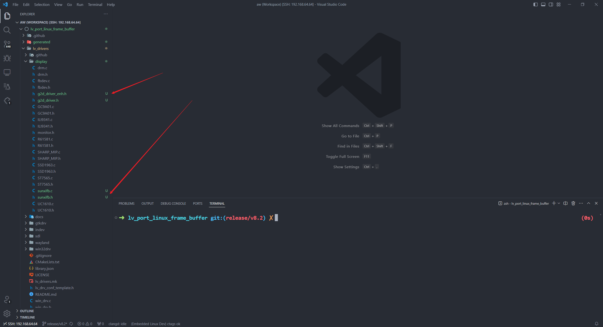
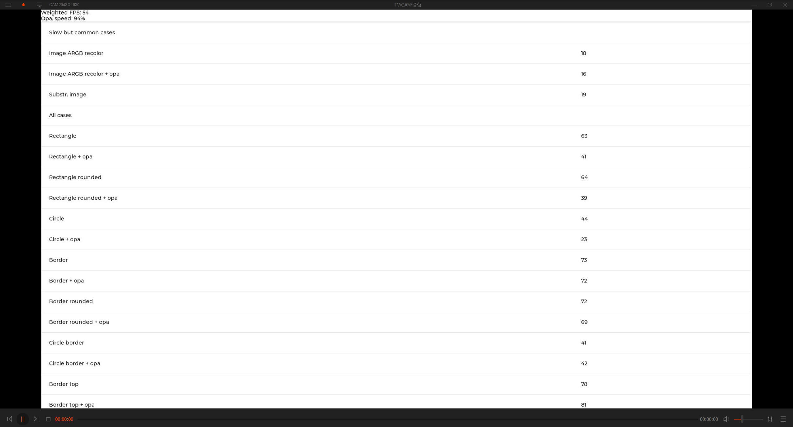

# lvgl移植

> 评测作者：pomin张海良 · 本篇为社区评测文章，来自开发者实测，未经官方逐字校对。

> 在 tina 原本的 package 中是有 LVGL V8.0.1 版本的代码的，不过这里还是选择了在 SDK 外开发

## 拉取 LVGL V8.2

先拉取 lvgl 官方已经移植好的 fbdev 的驱动代码，指定版本为 V8.2 版本。submodule 也一起拉取

```
git clone https://github.com/lvgl/lv_port_linux_frame_buffer.git -b release/v8.2 --recursive
```

## 适配 sunxi 驱动

在拉取下来的代码中是没有 sunxi 的驱动的，这里把 package 里面的驱动代码给复制过来



然后在 lv_drv_conf.h 中添加如下宏配置，启用 sunxifb 的驱动

```c
#define USE_SUNXIFB 1
#define USE_SUNXIFB_CACHE 1
#define USE_SUNXIFB_G2D 1
```

把 main.c 修改为如下内容，在 main 中初始化 sunxi 的驱动并且注册到 lvgl 的显示框架中，执行 lv_demo_benchmark 来调用 benchmark 测试

```c
#include "lvgl/lvgl.h"
#include "lv_drivers/display/sunxifb.h"
#include "lvgl/demos/lv_demos.h"
#include <unistd.h>
#include <time.h>
#include <sys/time.h>
#include <stdlib.h>
#include <stdio.h>
#include "gui_guider.h"

lv_ui guider_ui;

int main(int argc, char *argv[])
{
    /*LittlevGL init*/
    lv_init();

    uint32_t rotated = LV_DISP_ROT_NONE;

    /*Linux frame buffer device init*/
    sunxifb_init(rotated);

    /*A buffer for LittlevGL to draw the screen's content*/
    static uint32_t width, height;
    sunxifb_get_sizes(&width, &height);

    static lv_color_t *buf;
    buf = (lv_color_t*) malloc(width * height * sizeof (lv_color_t));

    if (buf == NULL) {
        sunxifb_exit();
        printf("malloc draw buffer fail\n");
        return 0;
    }

    /*Initialize a descriptor for the buffer*/
    static lv_disp_draw_buf_t disp_buf;
    lv_disp_draw_buf_init(&disp_buf, buf, NULL, width * height);

    /*Initialize and register a display driver*/
    static lv_disp_drv_t disp_drv;
    lv_disp_drv_init(&disp_drv);
    disp_drv.draw_buf   = &disp_buf;
    disp_drv.flush_cb   = sunxifb_flush;
    disp_drv.hor_res    = width;
    disp_drv.ver_res    = height;
    disp_drv.rotated    = rotated;
    lv_disp_drv_register(&disp_drv);

    lv_demo_benchmark();

    /*Handle LitlevGL tasks (tickless mode)*/
    while(1) {
        lv_task_handler();
        usleep(5000);
    }

    /*free(buf);*/
    /*sunxifb_exit();*/
    return 0;
}

/*Set in lv_conf.h as `LV_TICK_CUSTOM_SYS_TIME_EXPR`*/
uint32_t custom_tick_get(void)
{
    static uint64_t start_ms = 0;
    if(start_ms == 0) {
        struct timeval tv_start;
        gettimeofday(&tv_start, NULL);
        start_ms = (tv_start.tv_sec * 1000000 + tv_start.tv_usec) / 1000;
    }

    struct timeval tv_now;
    gettimeofday(&tv_now, NULL);
    uint64_t now_ms;
    now_ms = (tv_now.tv_sec * 1000000 + tv_now.tv_usec) / 1000;

    uint32_t time_ms = now_ms - start_ms;
    return time_ms;
}

```

然后 把 Makefile 文件的第一行修改一下，指定到自己的编译器路径

```
CC = /home/book/aw/tina-d1-h/lichee/brandy-2.0/tools/toolchain/riscv64-linux-x86_64-20200528/bin/riscv64-unknown-linux-gnu-gcc

# CC ?= gcc
```

## 烧录测试

编译一下然后用 adb 传到板子上面

```
make -j99
adb push demo /
```

在板子上运行 /demo，就可以看到 benchmark 的运行了，最终分数如下



后续就使用 V8.2 来进行 红外遥控器切换 lvgl 界面的 demo 开发了，V9 的版本移植 sunxi 的驱动比较多，后续有时间再移植了
