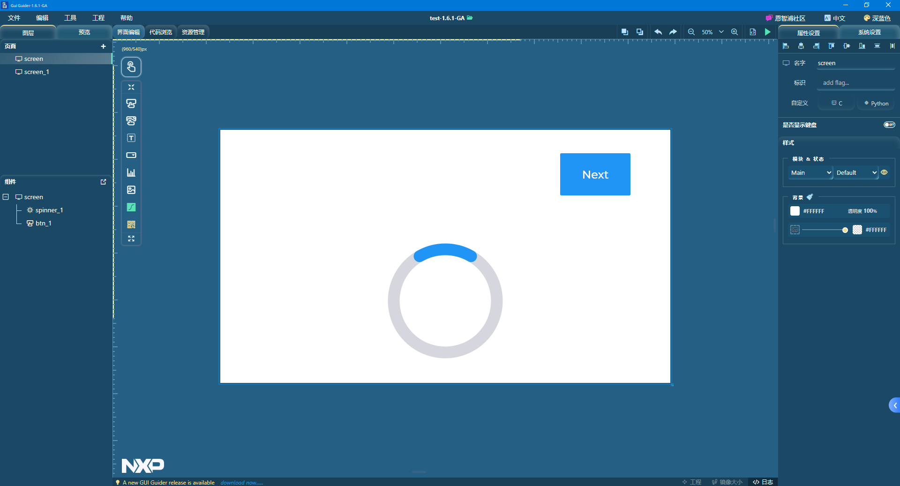
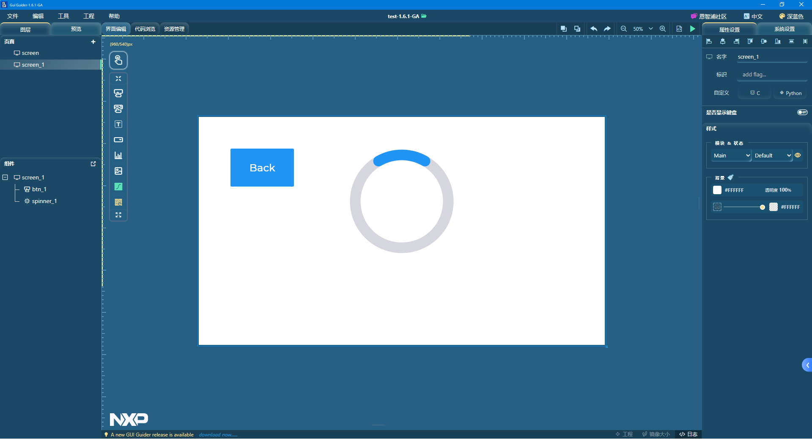
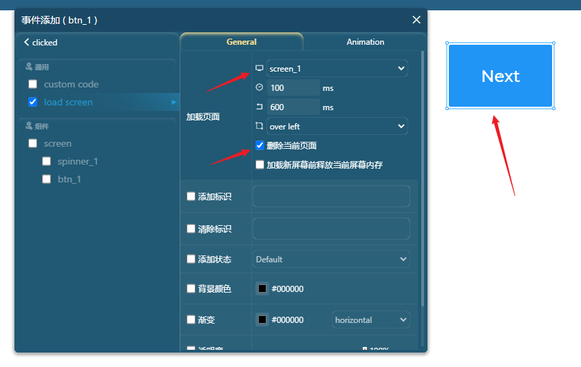
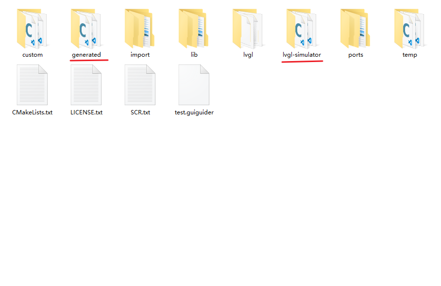
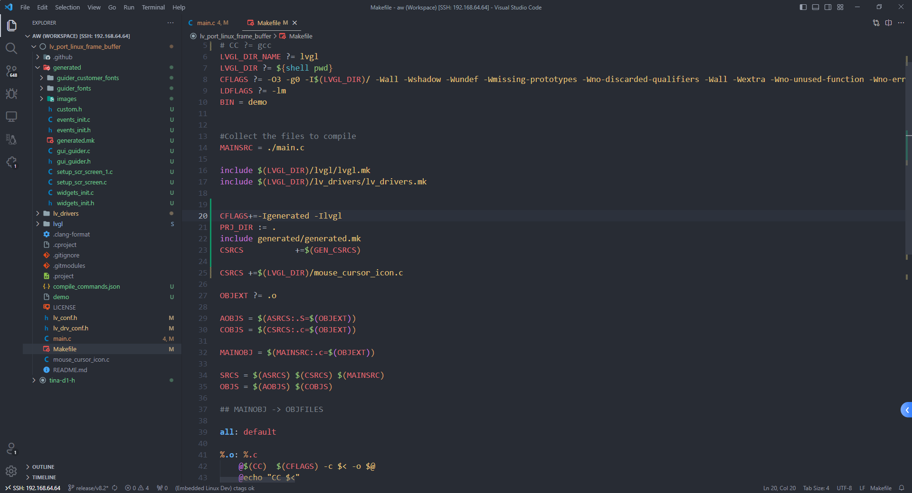
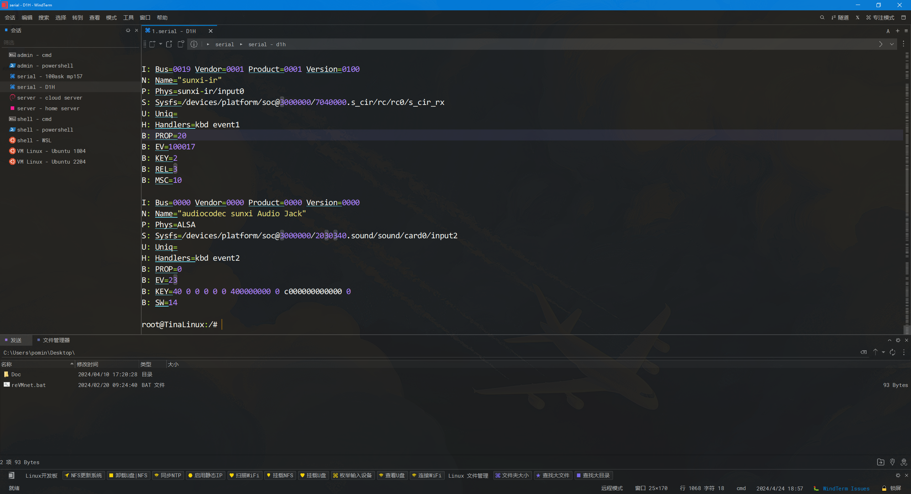

# lvgl 界面切换

> 评测作者：pomin张海良 · 本篇为社区评测文章，来自开发者实测，未经官方逐字校对。

## 界面设计

使用 NXP 的 GUI Guider 软件来对界面进行设计，这里设计了一个简单界面，两个页面可以通过按键来进入、返回





设置 Next、Back 两个按键的事件为点击按键后加载到另一个界面



然后点击生成代码即可，对于生成的代码中，查看工程目录



其中 generated 是生成的代码，lvgl-simulator 是 GUI Guider 模拟器的入口代码，打开lvgl-simulator/main.c 进行查看，可以看到加载生成的界面和事件代码只需要：
- 一个全局变量 lv_ui guider_ui;
- setup_ui(&guider_ui); 载入界面和事件
- custom_init(&guider_ui); 自定义代码，这里没用到

```c
lv_ui guider_ui;

int main(int argc, char ** argv)
{
    (void) argc;    /*Unused*/
    (void) argv;    /*Unused*/

    /*Initialize LittlevGL*/
    lv_init();

    /*Initialize the HAL (display, input devices, tick) for LittlevGL*/
    hal_init();

    /*Create a GUI-Guider app */
    setup_ui(&guider_ui);
	custom_init(&guider_ui);

    while(1) {
        /* Periodically call the lv_task handler.
         * It could be done in a timer interrupt or an OS task too.*/
        lv_task_handler();
#if LV_USE_VIDEO
        video_play(&guider_ui);
#endif
        usleep(5 * 1000);
    }

    return 0;
}
```

然后把生成的这些代码复制到 Linux 的工程下面，在 Makefile 中添加如下代码，把生成代码的 generated.mk 给加入进来

```d
CFLAGS+=-Igenerated -Ilvgl
PRJ_DIR := .
include generated/generated.mk
CSRCS           +=$(GEN_CSRCS)
```



此时 HMI 的事件驱动已经适配好了，下面要做的就是使用 lvgl 的输入设备驱动框架来注册一个真实输入设备，这里也就是红外遥控器上面的两个按键

## 红外按键输入事件



在前文中，已经知道了红外接收头对应的输入为 event1，在 lvgl 的输入设备框架中注册为两个 button 按键，绑定两个红外按键到 lvgl 的两个触摸坐标 (200, 200), (1500, 150)，对于初始化按键的代码片段如下

```c
void lvgl_btn_init(void)
{
    /*------------------
     * Button
     * -----------------*/

    /*Initialize your button if you have*/
    button_init();
    static lv_indev_drv_t indev_drv;

    /*Register a button input device*/
    lv_indev_drv_init(&indev_drv);
    indev_drv.type = LV_INDEV_TYPE_BUTTON;
    indev_drv.read_cb = button_read;
    indev_button = lv_indev_drv_register(&indev_drv);

    /*Assign buttons to points on the screen*/
    static const lv_point_t btn_points[2] = {
        {200, 200},   /*Button 0 -> x:10; y:10*/
        {1500, 150},   /*Button 1 -> x:40; y:100*/
    };
    lv_indev_set_button_points(indev_button, btn_points);
}
```

然后再 main 函数中调用 lvgl_btn_init 来完成按键的初始化即可，最终的 main.c 代码如下，因为红外按键按下的时候会连续的发信号，为了避免按下松开太快，实现的是红外按键按下时界面按键按下，等待一段时间后界面按键松开，红外按键松开时无操作的逻辑

```c
#include "lvgl/lvgl.h"
#include "lv_drivers/display/sunxifb.h"
#include "lvgl/demos/lv_demos.h"
#include <unistd.h>
#include <time.h>
#include <sys/time.h>
#include <stdlib.h>
#include <stdio.h>
#include "gui_guider.h"
#include <fcntl.h>
#include <linux/input.h>

lv_ui guider_ui;

static void button_init(void);
static void button_read(lv_indev_drv_t * indev_drv, lv_indev_data_t * data);
static int8_t button_get_pressed_id(void);
static bool button_is_pressed(uint8_t id);

lv_indev_t * indev_button;
int fd_ir;
const char *pDevice = "/dev/input/event1";
uint16_t sw_page_timeout[2];

/*------------------
 * Button
 * -----------------*/

/*Initialize your buttons*/
static void button_init(void)
{
    /*Your code comes here*/
    fd_ir = open(pDevice, O_RDWR | O_NONBLOCK);

    if(fd_ir == -1)
    {
        printf("ERROR Opening %s\n", pDevice);
        return;
    }
}

/*Will be called by the library to read the button*/
static void button_read(lv_indev_drv_t * indev_drv, lv_indev_data_t * data)
{

    static uint8_t last_btn = 0;

    /*Get the pressed button's ID*/
    int8_t btn_act = button_get_pressed_id();

    if(btn_act >= 0) {
        data->state = LV_INDEV_STATE_PR;
        last_btn = btn_act;
    }
    else {
        data->state = LV_INDEV_STATE_REL;
    }

    /*Save the last pressed button's ID*/
    data->btn_id = last_btn;
}

/*Get ID  (0, 1, 2 ..) of the pressed button*/
static int8_t button_get_pressed_id(void)
{
    uint8_t i;

    /*Check to buttons see which is being pressed (assume there are 2 buttons)*/
    for(i = 0; i < 2; i++) {
        /*Return the pressed button's ID*/
        if(button_is_pressed(i)) {
            return i;
        }
    }

    /*No button pressed*/
    return -1;
}

/*Test if `id` button is pressed or not*/
static bool button_is_pressed(uint8_t id)
{

    /*Your code comes here*/

    return !!sw_page_timeout[id];
}

void lvgl_btn_init(void)
{
    /*------------------
     * Button
     * -----------------*/

    /*Initialize your button if you have*/
    button_init();
    static lv_indev_drv_t indev_drv;

    /*Register a button input device*/
    lv_indev_drv_init(&indev_drv);
    indev_drv.type = LV_INDEV_TYPE_BUTTON;
    indev_drv.read_cb = button_read;
    indev_button = lv_indev_drv_register(&indev_drv);

    /*Assign buttons to points on the screen*/
    static const lv_point_t btn_points[2] = {
        {200, 200},   /*Button 0 -> x:10; y:10*/
        {1500, 150},   /*Button 1 -> x:40; y:100*/
    };
    lv_indev_set_button_points(indev_button, btn_points);
}


int main(int argc, char *argv[])
{
    /*LittlevGL init*/
    lv_init();

    uint32_t rotated = LV_DISP_ROT_NONE;

    /*Linux frame buffer device init*/
    sunxifb_init(rotated);

    /*A buffer for LittlevGL to draw the screen's content*/
    static uint32_t width, height;
    sunxifb_get_sizes(&width, &height);

    static lv_color_t *buf;
    buf = (lv_color_t*) malloc(width * height * sizeof (lv_color_t));

    if (buf == NULL) {
        sunxifb_exit();
        printf("malloc draw buffer fail\n");
        return 0;
    }

    /*Initialize a descriptor for the buffer*/
    static lv_disp_draw_buf_t disp_buf;
    lv_disp_draw_buf_init(&disp_buf, buf, NULL, width * height);

    /*Initialize and register a display driver*/
    static lv_disp_drv_t disp_drv;
    lv_disp_drv_init(&disp_drv);
    disp_drv.draw_buf   = &disp_buf;
    disp_drv.flush_cb   = sunxifb_flush;
    disp_drv.hor_res    = width;
    disp_drv.ver_res    = height;
    disp_drv.rotated    = rotated;
    lv_disp_drv_register(&disp_drv);

    lvgl_btn_init();

    int ret;
    struct input_event ev_ir;

    setup_ui(&guider_ui);
    // lv_demo_benchmark();

    /*Handle LitlevGL tasks (tickless mode)*/
    while(1) {
        lv_task_handler();

        memset(&ev_ir, 0, sizeof(struct input_event));
        ret = read(fd_ir, &ev_ir, sizeof(struct input_event));

        if(ret == sizeof(struct input_event))
        {
            if(ev_ir.type == 4 && ev_ir.code == 4)
            {
                if(ev_ir.value == 0x44) {
                    if(sw_page_timeout[0] == 0) {
                        printf("key 0 pressed\n");
                        sw_page_timeout[0] = 1;
                    }
                }
                if(ev_ir.value == 0x40) {
                    if(sw_page_timeout[1] == 0) {
                        printf("key 1 pressed\n");
                        sw_page_timeout[1] = 1;
                    }
                }
            }
        }
        if(sw_page_timeout[0] > 1000) {
            printf("key 0 releaseed\n");
            sw_page_timeout[0] = 0;
        }
        if(sw_page_timeout[1] > 1000) {
            printf("key 1 releaseed\n");
            sw_page_timeout[1] = 0;
        }
        if (sw_page_timeout[0] > 0) sw_page_timeout[0]++;
        if (sw_page_timeout[1] > 0) sw_page_timeout[1]++;
        usleep(100);
    }

    /*free(buf);*/
    /*sunxifb_exit();*/
    return 0;
}

/*Set in lv_conf.h as `LV_TICK_CUSTOM_SYS_TIME_EXPR`*/
uint32_t custom_tick_get(void)
{
    static uint64_t start_ms = 0;
    if(start_ms == 0) {
        struct timeval tv_start;
        gettimeofday(&tv_start, NULL);
        start_ms = (tv_start.tv_sec * 1000000 + tv_start.tv_usec) / 1000;
    }

    struct timeval tv_now;
    gettimeofday(&tv_now, NULL);
    uint64_t now_ms;
    now_ms = (tv_now.tv_sec * 1000000 + tv_now.tv_usec) / 1000;

    uint32_t time_ms = now_ms - start_ms;
    return time_ms;
}
```

## 烧录测试

编译一下然后用 adb 传到板子上面

```
make -j99
adb push demo /
```

测试现象，用红外遥控器可以切换页面


> 📹 原文包含视频/位图素材 `images/VID_20240430_203307.mp4`，未包含在文档中。


