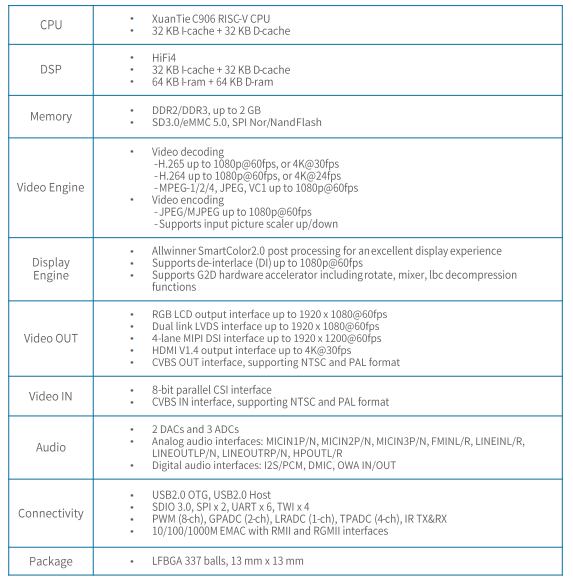
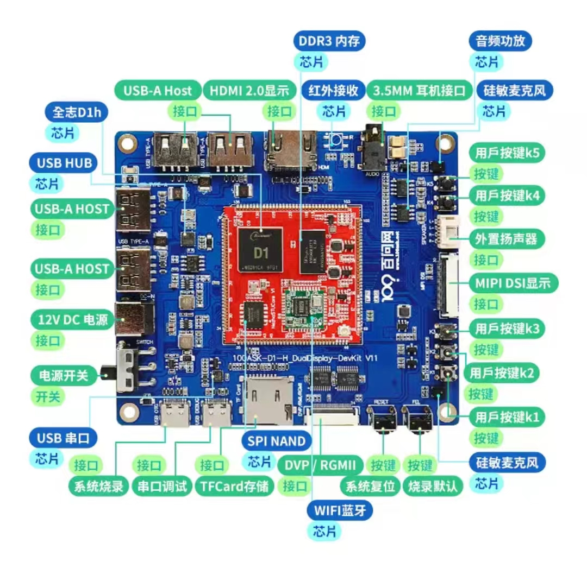
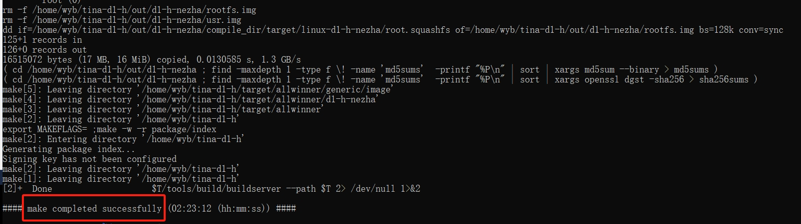
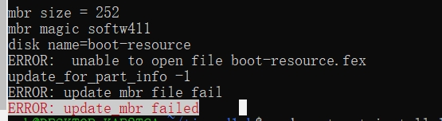
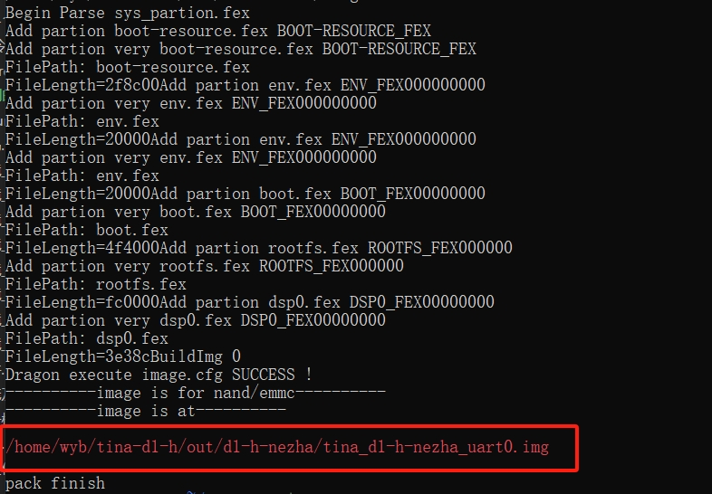
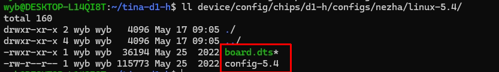
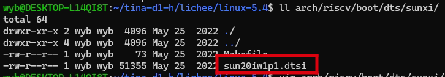
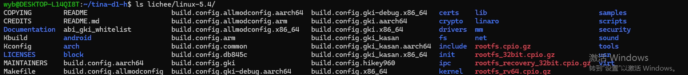
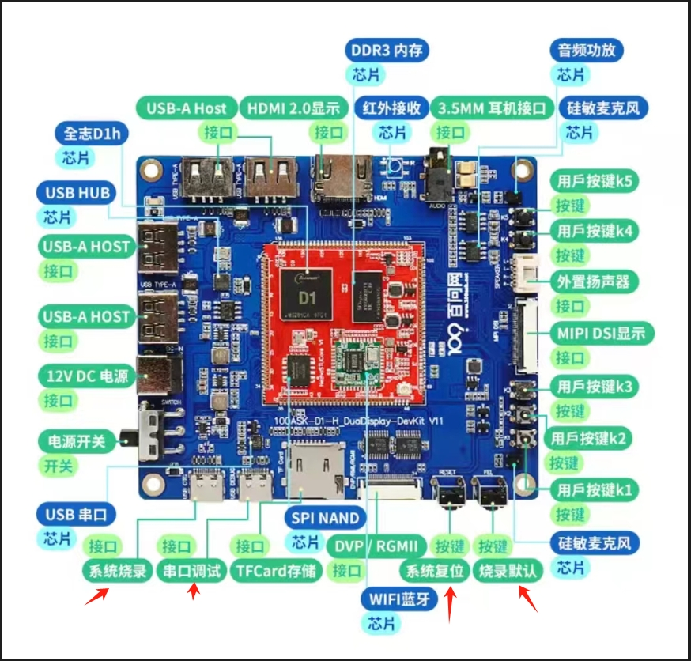
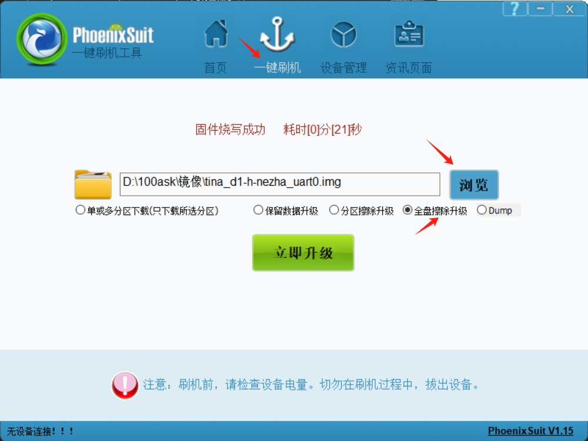

# 开机体验

> 评测作者：宁静致远 · 本篇为社区评测文章，来自开发者实测，未经官方逐字校对。

---
## 前言

百问科技推出了全志哪吒D1h开发板评测计划，经过申请，我有幸顺利通过百问科技审核加入评测计划。

3月底收到哪吒D1h开发板后，马上就体验了一把。

## 硬件资源

先熟悉了一下开发板的硬件资源，还是挺丰富的。
1. SOC资源：
    - CPU是使用了阿里平头哥的64位C906核心，支持RVV，1GHz+主频；
    - CPU集成32KB的指令缓存(I-Cache)和32KB的数据缓存(D-Cache)；
    - 内置一颗处理高质量音频信号的HIFI4 DSP；
    - DSP同样集成了32KB的指令缓存(I-Cache)和32KB的数据缓存(D-Cache)；
    - DSP同时集成了64KB的指令RAM(I-Ram)和64KB的数据RAM(D-Ram)；
2. 板载资源：
    - 麦克风
    - 3.5MM 音频接口
    - 红外传感器
    - 蓝牙/WIFI
    - 4路USB-A
    - 1路串口
    - TFCD接口
    - HDMI
    - MIPI

SOC资源和板载资源详细如下图：



*SOC资源*



*板载资源*


&lt;!-- 

> ⚠️ 原文图片素材缺失：`/onboardresources.jpg`

 -->

## SDK
SDK存放在Ubuntu主目录下的tina-d1-h目录下。

## 编译
1. 编译前先建立编译环境，SDK中有个脚本build/envsetup.sh，加载该脚本

```shell
    source build/envsetup.sh
```

2. 使用lunch命令选择要编译的开发板
3. make编译，耐心等待完成

```shell
    make
```

报错提示缺少python2.x和ncurses
```shell
 sudo apt-get install python2.7
 sudo apt install libncurses-dev  libssl-dev openssl build-essential unzip zlib1g-dev
```

编译成功的话会显示“make completed successfully”，如图


*编译成功*


4. 打包镜像，使用pack命令将刚刚编译的系统打包成可以烧写到开发板EMMC上的镜像

```shell
    pack
```



*打包镜像*


ubuntu启用32位支持
```shell
sudo dpkg --add-architecture i386  
sudo apt-get update
```

安装32位下的库
```shell
sudo apt-get install libc6:i386 libgcc1:i386 libstdc++6:i386 -y
```

安装好后打包成功：


*打包镜像*



*设备树文件*

*父级设备树*

*内核源码*


## 烧写
官方推荐使用PhoenixSuit烧写工具进行系统的烧写。

1. 下载并安装全志的USB烧录驱动包：AllwinnerUSBFlashDeviceDriver 
2. 下载并安装全志线刷工具：AllwinnertechPhoeniSuit 
3. 将系统烧录TypeC和串口调试TypeC接口和电脑相连，打开电源开关上电如下图:



*烧录*


4. 选择镜像



*选择镜像*


5. 先按住烧录默认（FEL键），再按系统复位（RESET键）复位。
## 演示
