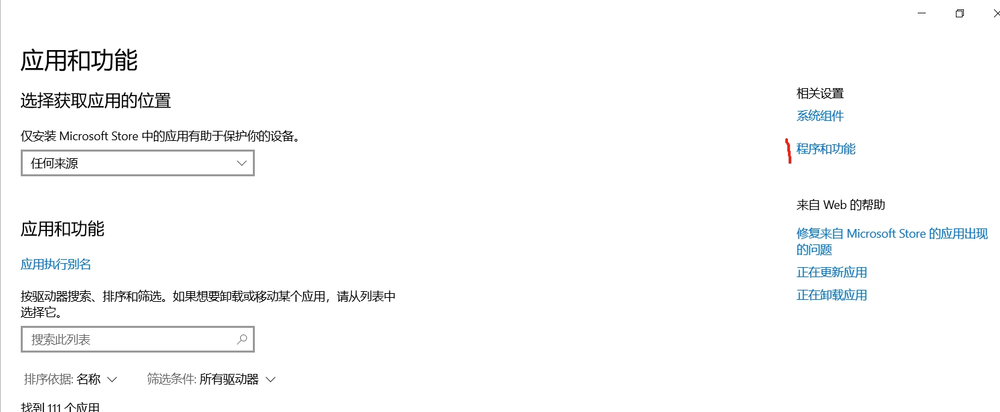
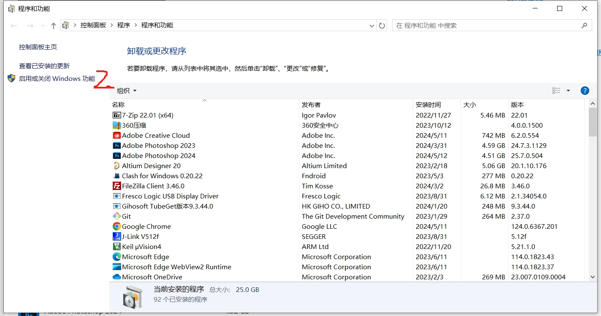
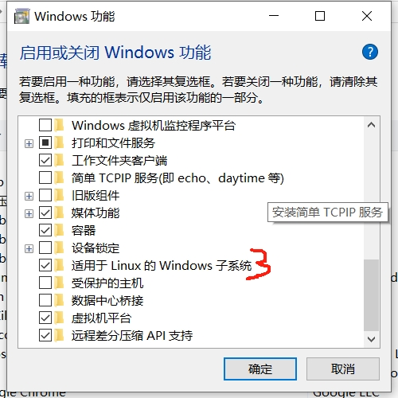
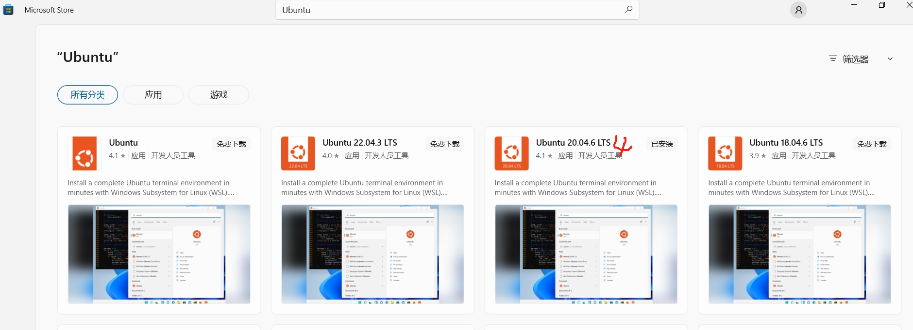
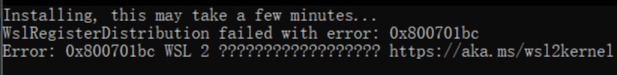
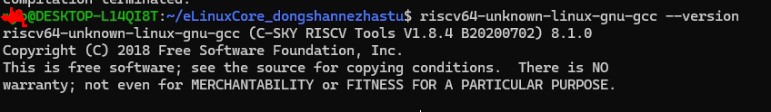

# 开发环境

> 评测作者：宁静致远 · 本篇为社区评测文章，来自开发者实测，未经官方逐字校对。

---
## 前言

在 Windows10中的WSL配置开发环境，WSL采用Ubuntu 20.04.6 LTS。

## 配置使能WSL

1. 进入系统设置；
2. 进入应用->应用和功能；
3. 点击“程序和功能”；
4. 点击“启用或关闭Windows功能”；
5. 勾选“适用于Linux的Windows子系统”；
6. 在Microsoft Store选择Ubuntu 20.04.6 LTS下载并安装。



*步骤1*

*步骤2*

*步骤3*

*步骤4*


安装成功后，启动Ubuntu时遇到一个问题：



*WSL错误*


原因是WSL版本从WSL1升级到WSL2后，windows本地内核更有升级更新，前往微软WSL官网下载安装适用于 x64 计算机的最新 WSL2 Linux 内核更新包即可。
下载链接：https://wslstorestorage.blob.core.windows.net/wslblob/wsl_update_x64.msi
## 交叉编译工具链
从官网获取工具链的源码：https://gitee.com/weidongshan/eLinuxCore_dongshannezhastu.git

```shell
git clone https://gitee.com/weidongshan/eLinuxCore_dongshannezhastu.git
cd  eLinuxCore_dongshannezhastu
git submodule update  --init --recursive
```

配置工具链并验证是否可用。
1. 将工具链路径加入PATH环境变量
   ```shell
   export PATH=$PATH:~/eLinuxCore_dongshannezhastu/toolchain/riscv64-glibc-gcc-thead_20200702/bin
   ```
2. 查看gcc版本
   ```shell
   riscv64-unknown-linux-gnu-gcc --version
   ```
显示如下图就代表配置成功



*GCC版本*


上面的PATH环境变量配置只是临时有效，重启系统或终端后就失效了，要永久配置只需修改文件~/.bashrc：
```shell
vim ~/.bashrc
export PATH=$PATH:~/eLinuxCore_dongshannezhastu/toolchain/riscv64-glibc-gcc-thead_20200702/bin
```

到这里开发环境就配置成功了。

## 将Ubuntu转移到非系统盘
ubuntu默认安装在C盘，随着D1-H不同版本，Tina、buildroot、又是东山的，又是全志社区的，每个版本都要占用几个G的空间，所以最好迁移到非系统盘。
1. 查看已安装的linux版本
```shell
wsl -l --all -v
```
2. 导出Ubuntu的tar文件到D盘
```shell
wsl --export Ubuntu-20.04 d:\ubuntu.tar
```
3. 注销当前Ubuntu
```shell
wsl --unregister Ubuntu-20.04
```
4. 重新导入并安装WSL到D盘
```shell
wsl --import Ubuntu-20.04 d:\wsl-ubuntu20.04 d:\ubuntu.tar --version 2
```
5. 设置默认登录用户为安装时的用户名
```shell
ubuntu2004 config --default-user USERNAME
```
6. 删除Ubuntu的tar文件
```shell
del d:\ubuntu.tar
```

如下图：


&lt;img src="assets/开发环境_8.png" style="width:800px;height:600px;" />
*转移到非系统盘*


## Windows和WSL之间数据传输
为了方便后续开发便利，要配置Windows对WSL文件的读写权限。
1. 从windows的资源浏览器进入ubuntu-20.04的虚拟硬盘：win+r快捷键弹出地址栏，输入 \\wsl$
2. 在Ubuntu的用户主目录下新建一个目录，作为Windows和WSL的共享目录

&lt;img src="assets/开发环境_7.png" style="width:800px;height:600px;" />
*共享目录*

