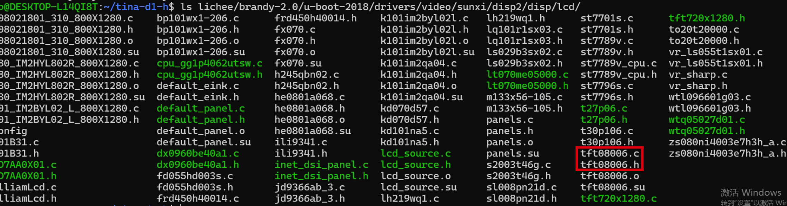
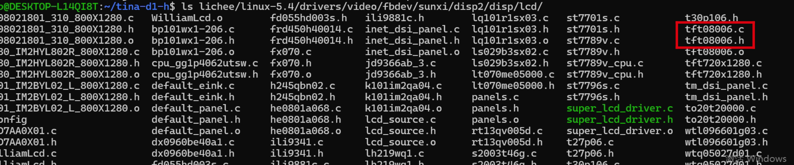
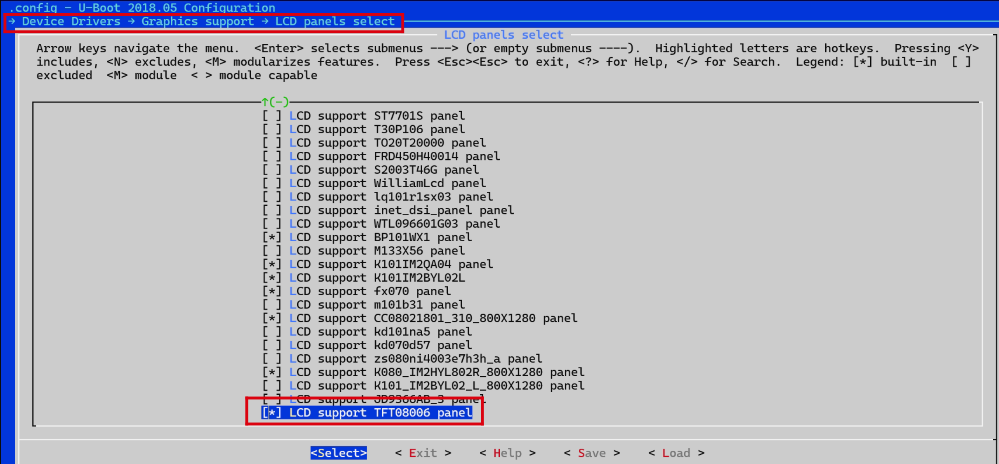
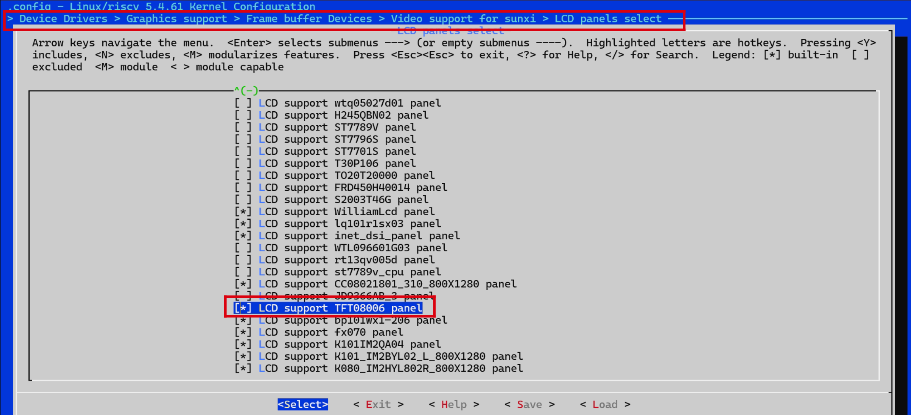
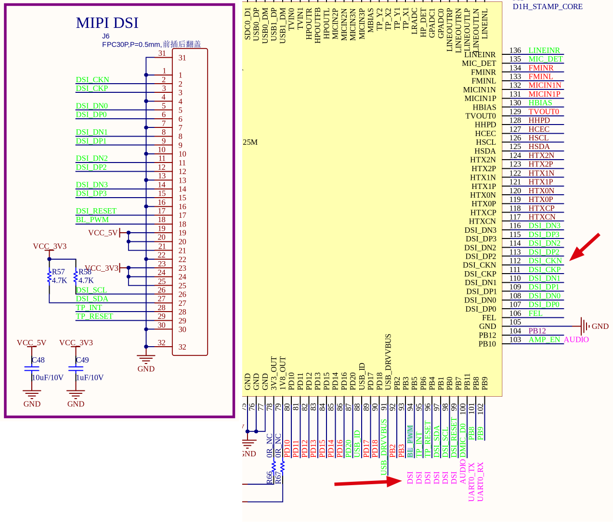

# 4寸MIPI

> 评测作者：宁静致远 · 本篇为社区评测文章，来自开发者实测，未经官方逐字校对。

手里有块4寸的MIPI屏幕TFT08006，下面要完成哪吒开发板支持这块屏幕。
## 驱动
首先是屏幕驱动，LCD的驱动路径：
uboot的LCD驱动路径：lichee/brandy-2.0/u-boot-2018/drivers/video/sunxi/disp2/disp/lcd/
内核的LCD驱动路径：lichee/linux-5.4/drivers/video/fbdev/sunxi/disp2/disp/lcd/

&lt;div style="text-align:center;width:800px;height:600px;">

&lt;p style="font-style:italic;">uboot屏幕驱动&lt;/p>

&lt;p style="font-style:italic;">内核屏幕驱动&lt;/p>
&lt;/div>

可以看到，SDK已经集成了tft08006的驱动源文件。
下面要做的是分别修改uboot和内核的配置，保证tft08006的驱动分别编译到了uboot和内核。

修改uboot配置
执行cboot快捷命令进入uboot根目录，执行make menuconfig
→ Device Drivers
→ Graphics support
→ LCD panels select
[*] LCD support TFT08006 panel

&lt;div style="text-align:center;width:800px;height:600px;">

&lt;p style="font-style:italic;">uboot屏幕驱动配置&lt;/p>
&lt;/div>

修改内核配置
执行croot快捷命令进入SDK根目录，执行make kernel_menuconfig
→ Device Drivers
→ Graphics support
→ Frame buffer Devices
→ Video support for sunxi
→ LCD panels select
[*] LCD support tft08006 panel

&lt;div style="text-align:center;width:800px;height:600px;">

&lt;p style="font-style:italic;">内核屏幕驱动配置&lt;/p>
&lt;/div>

## 设备树
下面要根据哪吒开发板的硬件设计，来修改设备树文件。原理图如下：

&lt;div style="text-align:center;width:800px;height:600px;">

&lt;p style="font-style:italic;">mipi原理图&lt;/p>
&lt;/div>

uboot设备树文件在device/config/chips/d1-h/configs/nezha/uboot-board.dts
vim device/config/chips/d1-h/configs/nezha/uboot-board.dts

修改lcd0节点

&lcd0 \{
	base_config_start = &lt;1>;
	lcd_used = &lt;1>;
	lcd_driver_name = "tft08006";
	lcd_backlight = &lt;500>;
	lcd_if = &lt;4>;
	lcd_x = &lt;480>;
	lcd_y = &lt;800>;
	lcd_width = &lt;52>;
	lcd_height = &lt;52>;
	lcd_dclk_freq = &lt;25>;
	lcd_pwm_used = &lt;1>;
	lcd_pwm_ch = &lt;9>;
	lcd_pwm_freq = &lt;50000>;
	lcd_pwm_pol = &lt;1>;
	lcd_pwm_max_limit = &lt;255>;
	lcd_hbp = &lt;10>;
	lcd_ht = &lt;515>;
	lcd_hspw = &lt;5>;
	lcd_vbp = &lt;20>;
	lcd_vt = &lt;830>;
	lcd_vspw = &lt;5>;
	lcd_dsi_if = &lt;0>;
	lcd_dsi_lane = &lt;2>;
	lcd_dsi_format = &lt;0>;
	lcd_dsi_te = &lt;0>;
	lcd_dsi_eotp = &lt;0>;
	lcd_frm = &lt;0>;
	lcd_io_phase = &lt;0x0000>;
	lcd_hv_clk_phase = &lt;0>;
	lcd_hv_sync_polarity= &lt;0>;
	lcd_gamma_en= &lt;0>;
	lcd_bright_curve_en = &lt;0>;
	lcd_cmap_en= &lt;0>;
	lcdgamma4iep= &lt;22>;
	lcd_gpio_0= &lt;&pio PH 0 1 0 3 1>;
	pinctrl-0 = &lt;&dsi4lane_pins_a>;
	pinctrl-1= &lt;&dsi4lane_pins_b>;
	base_config_end = &lt;1>;
\};

依据硬件原理图，定义管脚
&pio\{
	dsi4lane_pins_a: dsi4lane@0 \{
		allwinner,pins = "PD1", "PD2", "PD3", "PD4", "PD5", "PD6", "PD7","PD9", "PD10", "PD11";
		allwinner,pname = "PD1", "PD2", "PD3", "PD4", "PD5", "PD6","PD7", "PD9", "PD10", "PD11";
		allwinner,function = "dsi";
		allwinner,muxsel = &lt;5>;
		allwinner,drive = &lt;3>;
		allwinner,pull = &lt;0>;
	\};

	dsi4lane_pins_b: dsi4lane@1 \{
		allwinner,pins = "PD1", "PD2", "PD3", "PD4", "PD5", "PD6", "PD7","PD9", "PD10", "PD11";
		allwinner,pname = "PD1", "PD2", "PD3", "PD4", "PD5", "PD6","PD7", "PD9", "PD10", "DP11";
		allwinner,function = "io_disabled";
		allwinner,muxsel = &lt;0xf>;
		allwinner,drive = &lt;1>;
		allwinner,pull = &lt;0>;
	\};
\}

内核设备树文件在device/config/chips/d1-h/configs/nezha/linux-5.4/board.dts
vim device/config/chips/d1-h/configs/nezha/linux-5.4/board.dts
修改&lcd0节点
&lcd0 \{
	base_config_start = &lt;1>;
	lcd_used= &lt;1>;
	lcd_driver_name = "tft08006";
	lcd_backlight= &lt;500>;
	lcd_if= &lt;4>;
	lcd_x= &lt;480>;
	lcd_y= &lt;800>;
	lcd_width= &lt;52>;
	lcd_height= &lt;52>;
	lcd_dclk_freq= &lt;25>;
	lcd_pwm_used= &lt;1>;
	lcd_pwm_ch= &lt;9>;
	lcd_pwm_freq= &lt;50000>;
	lcd_pwm_pol= &lt;1>;
	lcd_pwm_max_limit = &lt;255>;
	lcd_hbp= &lt;10>;
	lcd_ht= &lt;515>;
	lcd_hspw= &lt;5>;
	lcd_vbp= &lt;20>;
	lcd_vt= &lt;830>;
	lcd_vspw= &lt;5>;
	lcd_dsi_if= &lt;0>;
	lcd_dsi_lane= &lt;2>;
	lcd_dsi_format = &lt;0>;
	lcd_dsi_te= &lt;0>;
	lcd_dsi_eotp= &lt;0>;
	lcd_frm= &lt;0>;
	lcd_io_phase= &lt;0x0000>;
	lcd_hv_clk_phase = &lt;0>;
	lcd_hv_sync_polarity= &lt;0>;
	lcd_gamma_en= &lt;0>;
	lcd_bright_curve_en = &lt;0>;
	lcd_cmap_en= &lt;0>;
	lcdgamma4iep= &lt;22>;
	lcd_gpio_0= &lt;&pio PH 0 1 0 3 1>;
	pinctrl-0= &lt;&dsi4lane_pins_a>;
	pinctrl-1= &lt;&dsi4lane_pins_b>;
	base_config_end = &lt;1>;
\};

依据硬件原理图，定义管脚

&pio \{
	dsi4lane_pins_a: dsi4lane@0 \{
		allwinner,pins = "PD1", "PD2", "PD3", "PD4", "PD5", "PD6", "PD7","PD9", "PD10", "PD11";
		allwinner,pname = "PD1", "PD2", "PD3", "PD4", "PD5", "PD6","PD7", "PD9", "PD10", "PD11";
		allwinner,function = "dsi";
		allwinner,muxsel = &lt;5>;
		allwinner,drive = &lt;3>;
		allwinner,pull = &lt;0>;
	\};

	dsi4lane_pins_b: dsi4lane@1 \{
		allwinner,pins = "PD1", "PD2", "PD3", "PD4", "PD5", "PD6", "PD7","PD9", "PD10", "PD11";
		allwinner,pname = "PD1", "PD2", "PD3", "PD4", "PD5", "PD6","PD7", "PD9", "PD10", "DP11";
		allwinner,function = "io_disabled";
		allwinner,muxsel = &lt;0xf>;
		allwinner,drive = &lt;1>;
		allwinner,pull = &lt;0>;
	\};	
\}

## 编译并打包成镜像
croot
make -j4
pack

## 烧录并测试
将新镜像烧录到开发板后，在串口终端中输入：
lv_example 0
启动示例
