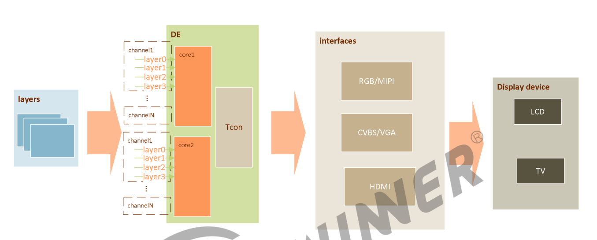
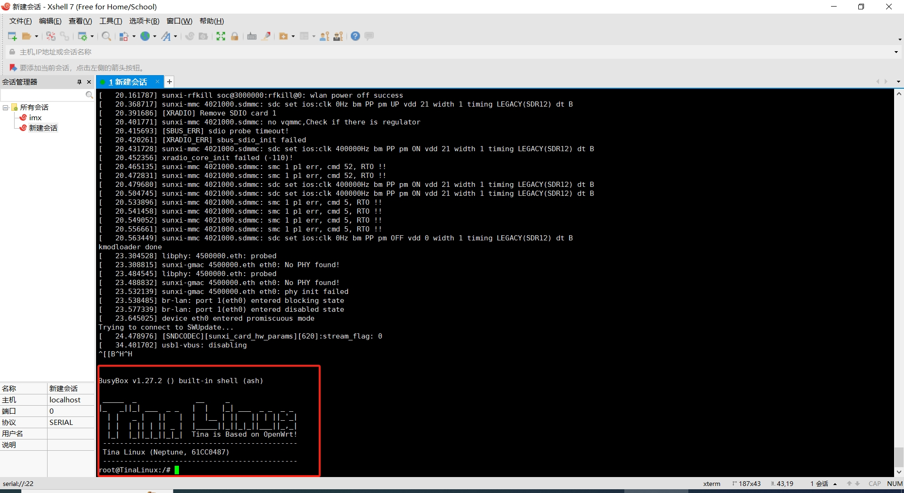
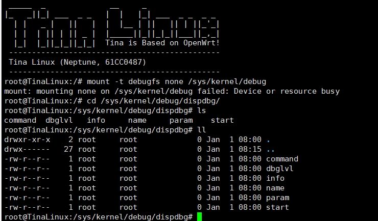

# HDMI测试

> 评测作者：宁静致远 · 本篇为社区评测文章，来自开发者实测，未经官方逐字校对。

## 显示模块
d1h的显示模块主要有显示引擎（DE）、各类型控制器（tcon）、输出接口组成。输入图层（layers）由DE处理后，受tcon控制输出到RGB、HDMI等显示接口上。如下图：

&lt;div style="text-align:center;width:800px;height:600px;">

&lt;p style="font-style:italic;">显示驱动&lt;/p>
&lt;/div>

## 内核配置
在内核源码目录下执行 make menuconfig
进入内核图形化配置界面

## 显示配置
从上图我们就知道，如果需要将一张图片通过HDMI输出到显示器上，需要完成的工作有：

1. 准备显示数据layers（读取图片到内存）；
2. 处理数据（配置DE）；
3. 由HDMI输出（配置tcon）

下面我们来实施配置，首先从串口终端登录开发板系统

&lt;div style="text-align:center;width:800px;height:600px;">

&lt;p style="font-style:italic;">串口终端&lt;/p>
&lt;/div>

首先挂载debugfs文件系统：
mount -t debugfs none /sys/kernel/debug
进入显示debug配置目录：
cd /sys/kernel/debug/dispdbg/


&lt;div style="text-align:center;width:800px;height:600px;">

&lt;p style="font-style:italic;">显示配置目录&lt;/p>
&lt;/div>

这个目录下有几个文件，分别介绍下
- name
name有下面几个选项：
disp0/1/2 – 显示通道
lcd0/1/2 – LCD
enhance0/1/2 – 色彩增强模式
smbl0/1/2 – 背光
- command
命令有7个：
switch – 切换显示通道
blank – 显示开关
suspend – 显示进入休眠
resume – 显示从休眠中唤醒
setbl – 背光调节
vsync – 消息开关
getinfo – 查看智能背光的状态
- param
  命令参数，参数格式是“type mode”：
  echo type mode > param
  这里我们选择type = 4，mode = 10。
输入命令：
echo 4 10 > param
每个命令都有自己的参数，switch命令有2个参数：
type ,HDMI对应 4
typedef enum
\{
DISP_OUTPUT_TYPE_NONE = 0,
DISP_OUTPUT_TYPE_LCD = 1,
DISP_OUTPUT_TYPE_TV = 2,
DISP_OUTPUT_TYPE_HDMI = 4,
DISP_OUTPUT_TYPE_VGA = 8,
\}disp_output_type;
对于mode，这里我随便选择一个10，对应 DISP_TV_MOD_1080P_60HZ
typedef enum
\{
DISP_TV_MOD_480I = 0,
DISP_TV_MOD_576I = 1,
DISP_TV_MOD_480P = 2,
DISP_TV_MOD_576P = 3,
DISP_TV_MOD_720P_50HZ = 4,
DISP_TV_MOD_720P_60HZ = 5,
DISP_TV_MOD_1080I_50HZ = 6,
DISP_TV_MOD_1080I_60HZ = 7,
DISP_TV_MOD_1080P_24HZ = 8,
DISP_TV_MOD_1080P_50HZ = 9,
DISP_TV_MOD_1080P_60HZ = 0xa,
DISP_TV_MOD_1080P_24HZ_3D_FP = 0x17,
DISP_TV_MOD_720P_50HZ_3D_FP = 0x18,
DISP_TV_MOD_720P_60HZ_3D_FP = 0x19,
DISP_TV_MOD_1080P_25HZ = 0x1a,
DISP_TV_MOD_1080P_30HZ = 0x1b,
DISP_TV_MOD_PAL = 0xb,
DISP_TV_MOD_PAL_SVIDEO = 0xc,
DISP_TV_MOD_NTSC = 0xe,
DISP_TV_MOD_NTSC_SVIDEO = 0xf,
DISP_TV_MOD_PAL_M = 0x11,
DISP_TV_MOD_PAL_M_SVIDEO = 0x12,
DISP_TV_MOD_PAL_NC = 0x14,
DISP_TV_MOD_PAL_NC_SVIDEO = 0x15,
DISP_TV_MOD_3840_2160P_30HZ = 0x1c,
DISP_TV_MOD_3840_2160P_25HZ = 0x1d,
DISP_TV_MOD_3840_2160P_24HZ = 0x1e,
DISP_TV_MODE_NUM = 0x1f,
\}disp_tv_mode;

完成以上配置后，就可以对HDMI进行测试了。
系统里面准备了测试图片，我们指定下：
echo 1 > /sys/class/disp/disp/attr/colorbar
然后开启显示：
echo 1 > start

## 初始化HDMI
如果每次启动开发板都要配置下HDMI，就太麻烦了。下面写一个shell脚本，
然后配置Systemd，有init程序自动启动该shell脚本，完成HDMI的配置。


```shell
#!/bin/bash
#	0.挂载debug 节点
mount -t debugfs none /sys/kernel/debug
#	1.进入目录
cd /sys/kernel/debug/dispdbg
#	2.设置 name
echo   disp0 > /sys/kernel/debug/dispdbg/name
#	3.设置命令
echo switch > /sys/kernel/debug/dispdbg/command
#	4.设置参数
echo 4 10 > /sys/kernel/debug/dispdbg/param
#	5.启动
echo 1 > start
```

在System V init系统中（常见于较老的Unix和类Unix系统，如Solaris、HP-UX和一些Linux发行版的早期版本），服务的自启动通常是通过在/etc/init.d/目录下放置启动脚本，并在系统运行级别对应的/etc/rcX.d/（其中X是运行级别，如0-6）目录中创建符号链接来实现的。

以下是如何将你的dispconfig.sh脚本配置为自启的步骤：

将脚本放置在/etc/init.d/目录下：
将你的dispconfig.sh脚本复制到/etc/init.d/目录下。确保脚本具有执行权限：
bash
sudo cp dispconfig.sh /etc/init.d/  
sudo chmod +x /etc/init.d/dispconfig.sh
为脚本创建符号链接：
接下来，你需要在适当的运行级别目录中为脚本创建符号链接。例如，如果你希望脚本在系统启动时（运行级别3或5）运行，你可以这样做：
bash
sudo ln -s /etc/init.d/dispconfig.sh /etc/rc3.d/S99dispconfig  
sudo ln -s /etc/init.d/dispconfig.sh /etc/rc5.d/S99dispconfig
注意，链接名称以S开头表示这是一个启动脚本，并且数字（在这里是99）决定了它在同一运行级别中脚本的启动顺序。数字越大，启动越晚。如果你想让脚本在其他运行级别也启动，你需要在相应的rcX.d目录中创建链接。
确保脚本兼容System V init：
你的dispconfig.sh脚本需要能够处理一些特定的参数，如start、stop、restart等，以便init系统能够正确地管理它。一个简单的例子可能如下所示：
bash
#!/bin/bash  
# /etc/init.d/dispconfig.sh  
#  
# Simple init script for dispconfig  
case "$1" in  
start)  
    echo "Starting dispconfig..."  
    # 你的启动命令  
    ;;  
stop)  
    echo "Stopping dispconfig..."  
    # 你的停止命令（如果需要）  
    ;;  
restart)  
    $0 stop  
    $0 start  
    ;;  
*)  
    echo "Usage: $0 \{start|stop|restart\}"  
    exit 1  
esac  
exit 0
更新系统服务（如果适用）：
在一些系统上，你可能需要更新服务数据库或使用特定的工具来添加或更新服务。这取决于你的具体系统和发行版。
测试脚本：
在更改任何系统配置后，都应该进行测试以确保一切正常。你可以手动运行脚本来测试它是否按预期工作：
bash
sudo /etc/init.d/dispconfig.sh start
然后检查系统日志或脚本输出以确保它已成功启动。
重启系统（可选）：
如果你想确保脚本在系统启动时运行，你可以重启系统并检查脚本是否已自动启动。但是，请注意，这可能会导致系统暂时不可用，因此最好在非生产环境中或计划好的维护窗口内执行此操作。
