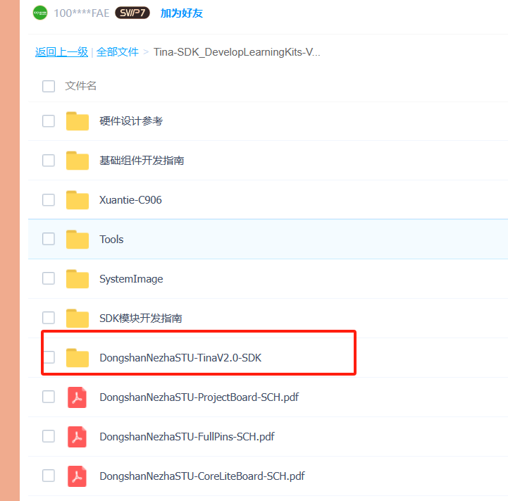
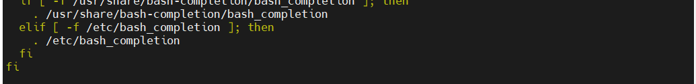

# 编译

> 评测作者：拍一下_彭延鑫 · 本篇为社区评测文章，来自开发者实测，未经官方逐字校对。

## 1、下载sdk源码

```
https://pan.baidu.com/s/13uKlqDXImmMl9cgKc41tZg?pwd=qcw7 
```

提取码：qcw7

压缩包的路径在 Tina-SDK_DevelopLearningKits-V1/DongshanNezhaSTU-TinaV2.0-SDK



把下载下来，文件夹内有一个README文件，按照文件内的命令解压缩，然后就可以开始进行亮机操作啦

## 2、了解全志sdk目录

全志的目录结构如下


```
Tina-SDK/
    ├── build
    ├── config
    ├── Config.in
    ├── device
    ├── dl
    ├── docs
    ├── lichee
    ├── Makefile
    ├── out
    ├── package
    ├── prebuilt
    ├── rules.mk
    ├── scripts
    ├── target
    ├── tmp
    ├── toolchain
    └── tools
```

build目录存放Tina Linux的构建系统文件

config目录主要存放Tina Linux中配置菜单的界面以及一些固定的配置项

devices目录用于存放方案的配置文件，包括内核配置，env配置，分区表配置，sys_config.fex， board.dts等。

docs目录主要存放用于开发的文档，以markdown格式书写。

lichee目录主要存放bootloader，内核，arisc，dsp等代码。

out目录用于保存编译相关的临时文件和最终镜像文件，编译后自动生成此目录，例如编译方案 r328s2-perf1。

具体的详细介绍都在百问网[全志完全开发手册](https://tina.100ask.net/SdkModule/Linux_SystemSoftware_DevelopmentGuide-02/#53-sdk)有详细描述，这里不再赘述。

但是几个比较重要的快捷键需要记住一下

```
cconfigs  #跳转到配置文件界面
cout #跳转到out目录下
cdevice #跳转到单板配置目录
croot #跳转回SDK根目录
ckernel #跳转到内核源码目录
```

##  3、编译sdk

### 3.1安装依赖包

```
sudo apt-get install -y  sed make binutils build-essential  gcc g++ bash patch gzip bzip2 perl  tar cpio unzip rsync file  bc wget python  cvs git mercurial rsync  subversion android-tools-mkbootimg vim  libssl-dev  android-tools-fastboot
sudo apt install open-vm-tools-desktop 
```

### 3.2检查编译器环境变量

这步是防止之前在使用其他的sdk时更改过环境变量，如果环境变量已经指定了一个交叉编译器，而不是Ubuntu原本的编译器，那么编译会失败。

```
vi ~/.bashrc
```



确保环境变量下没有东西后，保存退出。

更新环境变量并重启

```
source ~/.bashrc
reboot
```

进行编译

```
source build/envsetup.sh #获取环境变量
lunch #会提供方案选项以供选择，其中 lunch d1-h_nezha-tina 是 d1-h_nezha-tina 的标准方案，lunch d1-h_nezha_min-tina 是只能让系统跑起来的最小系统方案
make -j32 #编译，其中-j后面的数字参数为编译用的线程数，可根据开发者编译用的PC实际情况选择。
pack #打包，将编译好的固件打包成一个.img格式的固件，固件路径 /out/d1-h_nezha-tina/tina_d1-h-nezha_uart0.img
```
