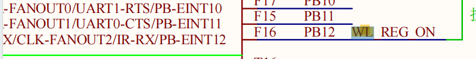
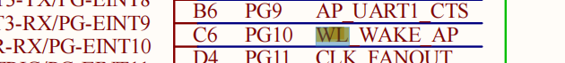
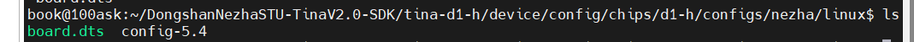
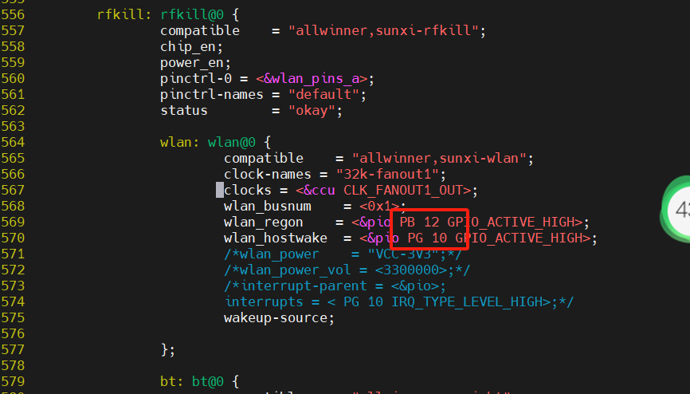
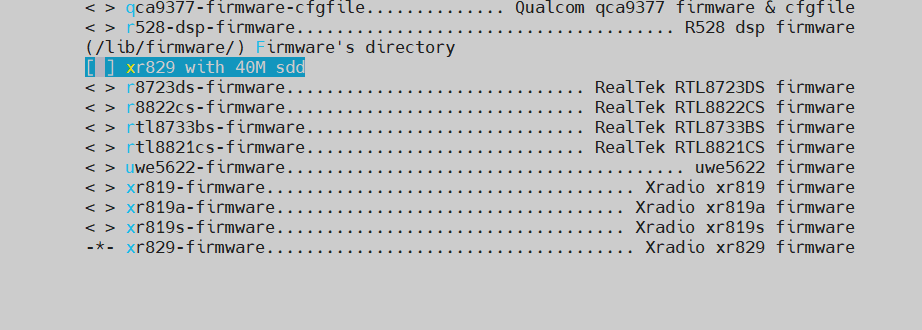
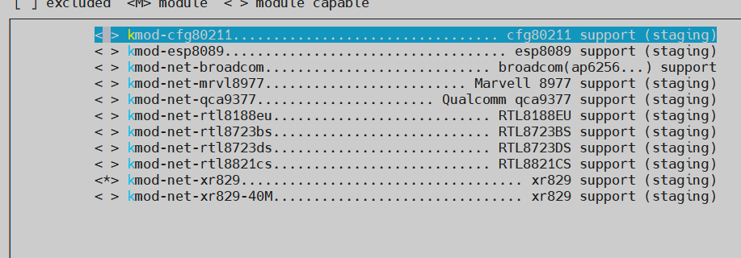

# 适配功能

> 评测作者：拍一下_彭延鑫 · 本篇为社区评测文章，来自开发者实测，未经官方逐字校对。

## 1、WiFi适配

### 1.1修改设备树

在本款单板中，因为我们需要wifi模块，但是现有的sdk源码中，我们选择的WiFi模块还没有进行完全适配，所以需要进行wifi模块的适配

首先适配设备树，这款开发板带有的开发板为XR829，可以看到，在原理图上关于wifi的两个引脚是分别接到了芯片的PB12和PG10，那么我们需要找到设备树内相关的功能定义里去查看并修改。





sdk根目录下输入

```
cconfig
ls
```

可以看到



```
vi board.dts
```

搜索wlan，按n往下查找，修改下图标记点，然后按wq保存退出

```
/wlan
```



### 1.2修改config文件

因为其实sdk里面XR829的模块已经有了，但是因为晶振和引脚功能的关系，所以不能使用，所以我们只需要修改设备树的引脚功能和config使能内核的menuconfig就可以正常使用了，比较简单。

执行  make kernel_menuconfig 修改为如下

```
Device Drivers --->
[*] Network device support --->
[*] Wireless LAN --->
<M> XR829 WLAN support
```

执行 make menuconfig  修改如下内容

```
Firmware --->
[ ] xr829 with 40M sdd  
< > xr829-firmware..................................... Xradio xr829 firmware
```



```
make munuconfig
Kernel modules --->
Wireless Drivers --->
<*> kmod-net-xr829............................... xr829 support (staging)
```



如果说，还有其他功能需要进行适配的，也是按照以上步骤，先查看原理图的引脚功能定义，然后根据百问网官方文档的指导手册进行设备树的修改，以及驱动代码的修改去适配menuconfig

## 2、编译打包

```
make -j32 #编译，其中-j后面的数字参数为编译用的线程数，可根据开发者编译用的PC实际情况选择。
pack #打包，将编译好的固件打包成一个.img格式的固件，固件路径 /out/d1-h_nezha-tina/tina_d1-h-nezha_uart0.img
```
