# 烧录过程

> 评测作者：拍一下_彭延鑫 · 本篇为社区评测文章，来自开发者实测，未经官方逐字校对。

# 全志d1-H开发板初体验之三、烧录

## 1、先决条件

1. D1-H哪吒开发板主板 x1
2. 下载全志线刷工具AllwinnertechPhoeniSuit： https://gitlab.com/dongshanpi/tools/-/raw/main/AllwinnertechPhoeniSuit.zip
3. TypeC线一根、电源线一根
4. 下载全志USB烧录驱动：https://gitlab.com/dongshanpi/tools/-/raw/main/AllwinnerUSBFlashDeviceDriver.zip
5. 编译好的系统镜像

但是在贴心的韦东山老师的sdk百度网盘包里，以上的驱动工具和USB驱动工具已经有啦，不用自己单个的去下载了。

## 2、连接开发板

连接开发板，电源线直接接就好了，typeC接口需要接到这个USB-OTG接口上面，而且跟DongshanPI不同，这个开发板的USB-DEBUG接口是没有供电功能的，所以烧录时候接不接这个接口无伤大雅。

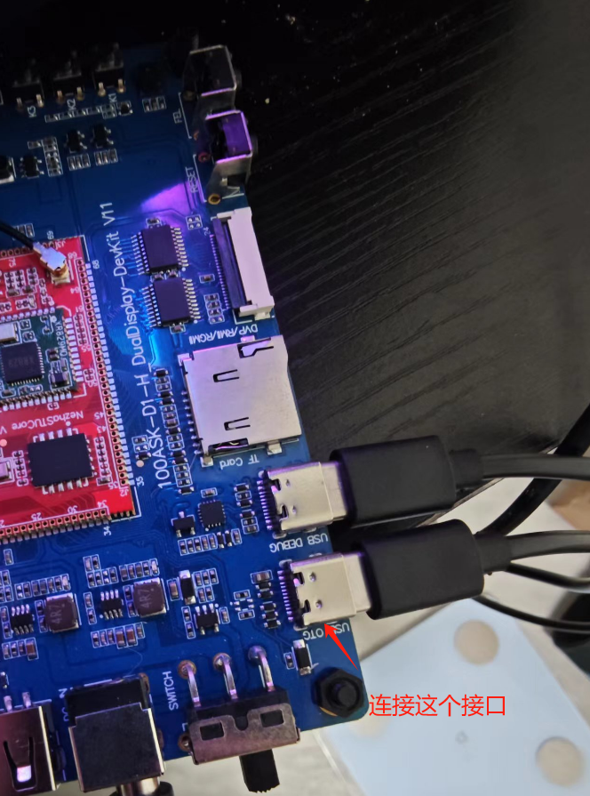

编译完成后，在我们的sdk源码包*\\Tina-SDK_DevelopLearningKits-V1\Tools*目录下有各类工具，打开 AllwinnertechPhoeniSuit文件夹，双击PhoenixSuit.exe文件夹打开烧录工具

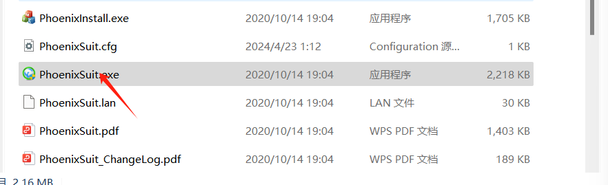

## 3、安装驱动

如果已经拿到的开发板是烧录好完整镜像了的，打开开发板，稍等几秒钟，应用左下角会出现“设备已连接成功”字样，这时候表示正常连接可以烧录了。

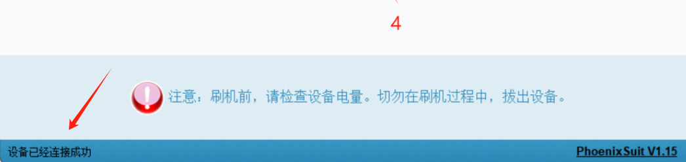

如果没有，检查设备管理器的驱动程序，进行*\\Tina-SDK_DevelopLearningKits-V1\Tools*文件夹下的全志驱动程序安装。

连接开发板，先按住 **FEL** 烧写模式按键，之后按一下 **RESET** 系统复位键，就可以自动进入烧写模式。

这时我们可以看到设备管理器 **通用串行总线控制器** 弹出一个 未知设备 ，这个时候我们就需要把我们提前下载好的 **全志USB烧录驱动** 进行修改，然后将解压缩过的 **全志USB烧录驱动** 压缩包，解压缩，可以看到里面有这几个文件。

```
InstallUSBDrv.exe
drvinstaller_IA64.exe
drvinstaller_X86.exe
UsbDriver/          
drvinstaller_X64.exe   
install.bat
```

win7系统可以直接打开install.bat进行安装，我的是win11系统，需要在设备管理器里面进行手动安装驱动。

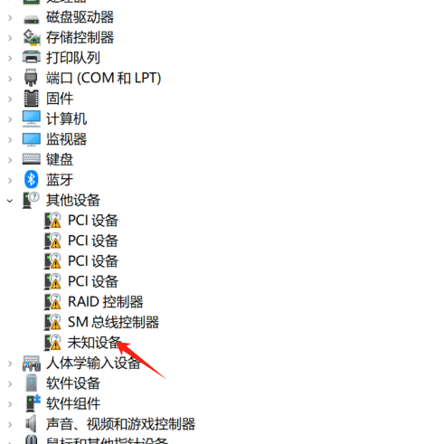

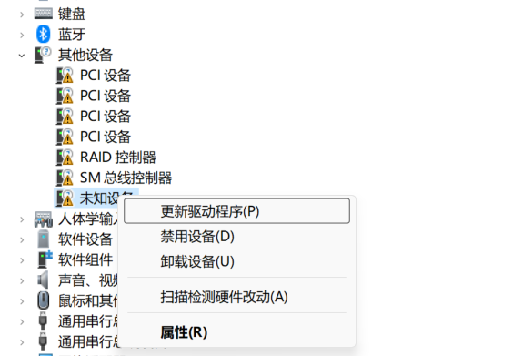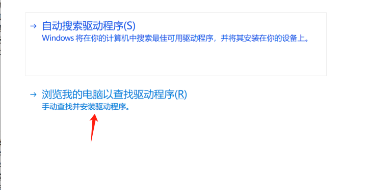

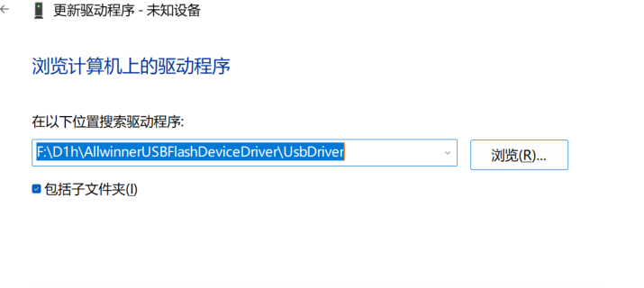

选择好这些之后，下一步安装就可以了

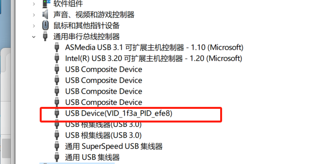

这样就表示成功了。

把打包好的镜像放置到自己方便找到的文件夹下，继续打开全志线刷工具 **AllwinnertechPhoeniSuit**进行烧录。

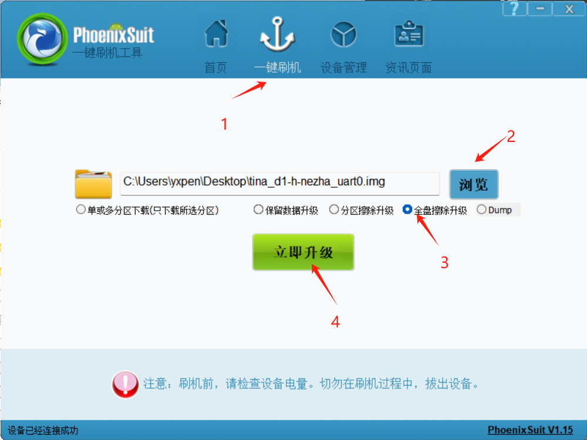

等待烧录完成。

## 4、启动系统

一般情况下，烧写成功后 都会自动重启 启动系统，此时我们进入到 串口终端，可以看到它的启动信息，等所有启动信息加载完成，按下回车可登录烧写好的系统内。

查看是否有节点和wlan0

```
lsmod
```

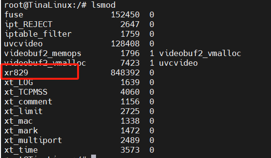

```
ifconfig
```

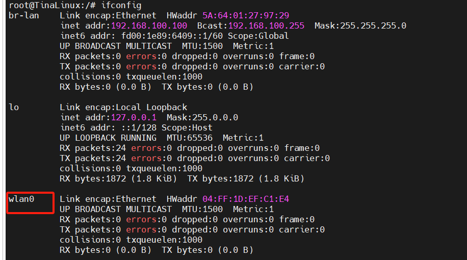

至此适配成功，完成亮机操作。

```
wifi_connect_ap_test test-503 xptx321.. #连接WiFi，后面两个参数为用户名和密码
wifi_scan_results_test  #扫描周围热点
```

##
