# 基础功能测试

> 评测作者：拍一下_彭延鑫 · 本篇为社区评测文章，来自开发者实测，未经官方逐字校对。

开发板板载硬件有DC-N电源接口一个、按键5个、USB四个、type-C接口两个（串口一个和烧录及adb接口一个），3.5mm耳机孔，HDMI接口一个，wifi和蓝牙以及SD卡卡槽和显示接口等。因为显示屏其他接口的功能需要外设，我们这次就简单测试USB、耳机孔及HDMI和WiFi等功能。


## 1、串口和烧录

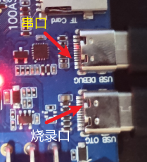

烧录接口在开发板上标记为USB-OTG，当然，功能不只有烧录，还有ADB shell、adb push/pull等功能，在设备没有经过任何烧录、刚出厂之时，需要进行usb驱动安装，也就是百度网盘资料下的Tina-SDK_DevelopLearningKits-V1\Tools\全志USB烧录驱动20201229这个驱动给装上具体操作流程查看韦东山老师资料[快速启动 - DongshanPI Board Documentation Center.](https://dongshanpi.com/DongshanNezhaSTU/03-QuickStart/#usb)。


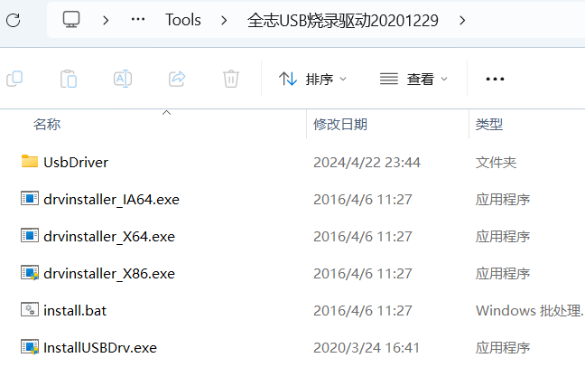

烧录一个完整的镜像之后，连接主机启动开发板，会自动识别驱动Tina ADB，这时候就可以进行adb shell和adb push功能啦

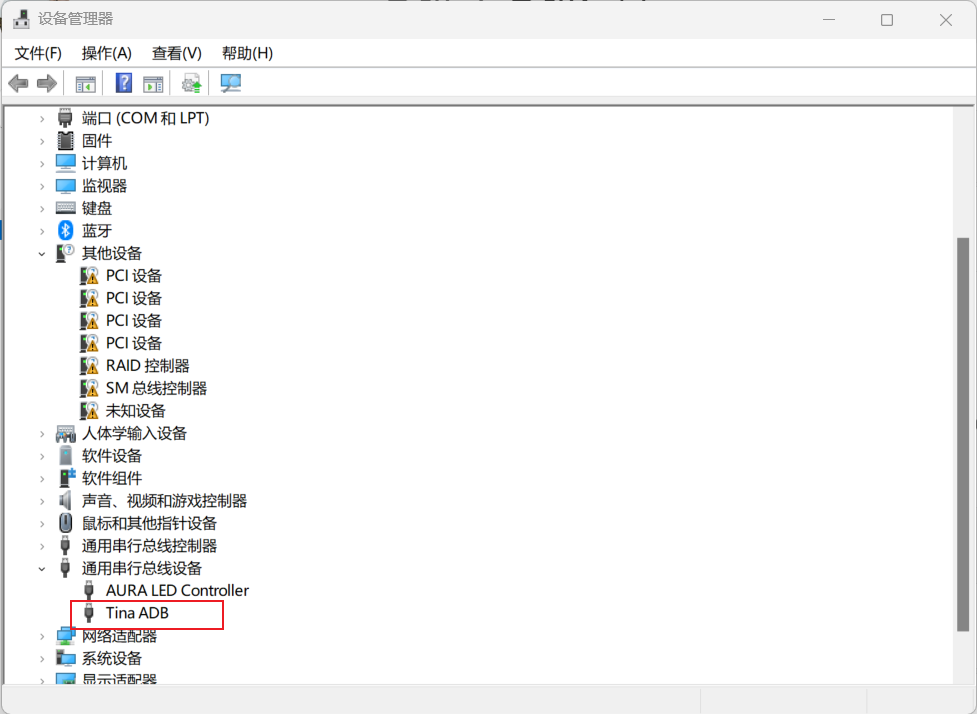


然后，烧录之后当然是连接串口功能啦，本开发板串口使用type-C接口连接，开发板上标记USB-DEBUG字样。连接之后使用串口工具打开，波特率为115200，我这里使用的是mobaxterm工具，与我自己平常使用的串口会识别CH340不同，这个串口工具为CH343。

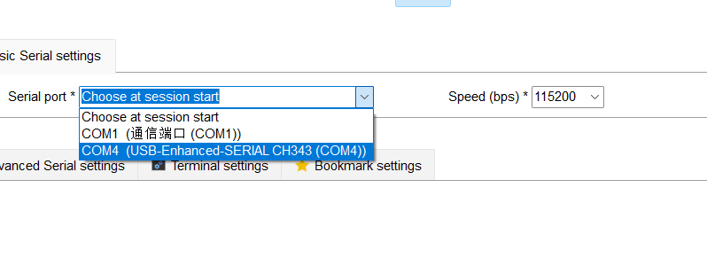

接上串口之后连接电源，打开SWITCH开关，会进入开机启动阶段，启动时间大概14秒，可以进入shell界面，进行命令行操作。

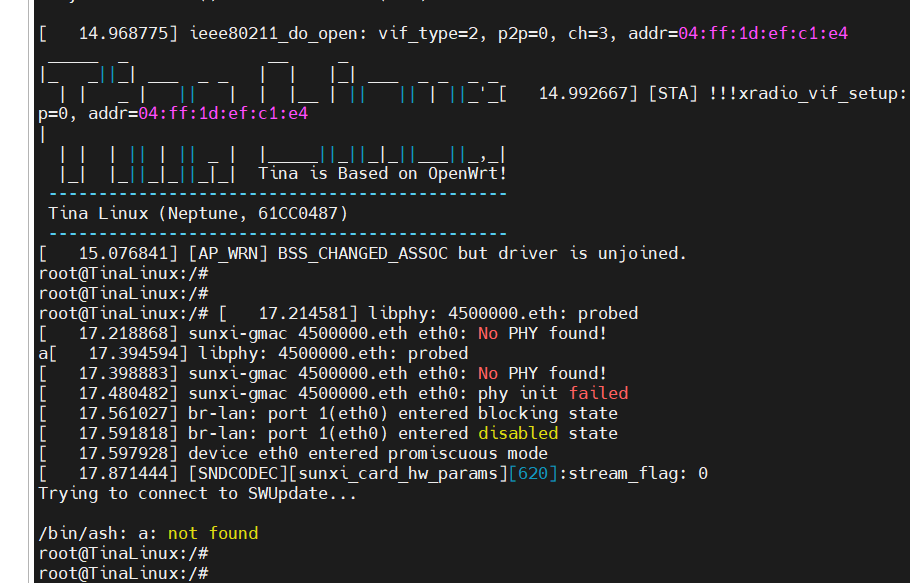

此时，正常开机如下图显示，三个红灯常亮。

## 2、USB

板载四个USN-TYPEA2.0功能，支持鼠标、键盘、摄像头等功能，我这里把我的罗技鼠标插上，很顺利进行了识别，但是应该是需要额外的驱动程序去进行驱动和识别，对usb研究不够深入，就没有继续测试下去啦。按道理应该会根据我的移动打印报点才对。

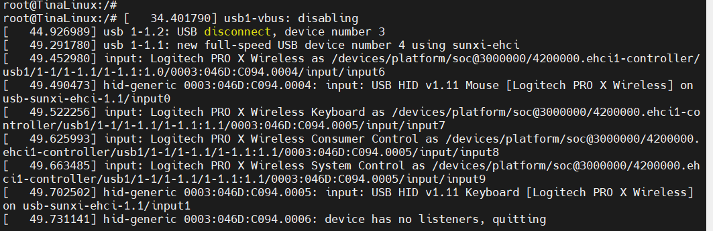

##  3、3.5mm耳机接口

测试这几个输出都较为简单，找一个3.5mm接口的音响或者耳机输出设备，进行连接。接入时会显示设备接入信息

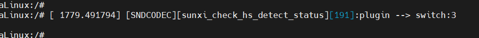

拔下时也会显示设备拔出。


测试插上设备，听一曲音乐。

首先找一个音乐资源，push进入开发板，我这里找了一首WAV格式的歌曲，在这里以前导入了一首mp3格式的歌曲，但是播放出来全是杂音，不知道为什么，可能解码不正确，不支持mp3解码。

```
adb push C:\Users\yxpen\Desktop\1213.wav /root
```


然后戴上耳机。输入指令，出现下图的信息就是在播放啦。音质还蛮好的，不知道是歌曲本身音质原因还是本身这个硬件就很顶。

```
aplay /root/1213.wav
```

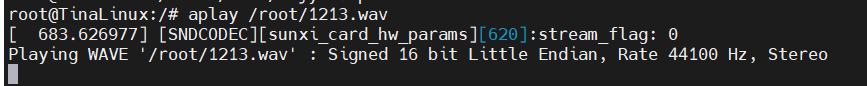

## 4、hdmi

音频测试了，现在应该是测试视频啦，hdmi全志的sdk也已经适配好啦，不需要改动，只需要打开hdmi的输出，然后进行demo的测试就可以了。官方也给出了教程，十分方便。

切换到HDMI输出，以下界面表示成功

```
cd /sys/kernel/debug/dispdbg
echo disp0 > name; echo switch1 > command; echo 4 10 0 0 0x4 0x101 0 0 0 8 > param; echo 1 > start;
```

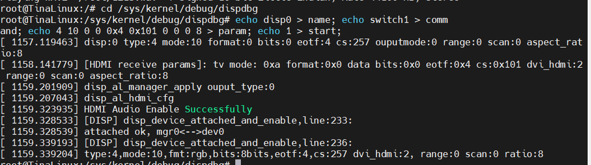

切换到HDMI输出时，我接连的hdmi的屏幕会显示默认画面，但是不全，应该是图片自身分辨率的原因。

测试显示colorbar：

```
echo 1 > /sys/class/disp/disp/attr/colorbar 
```

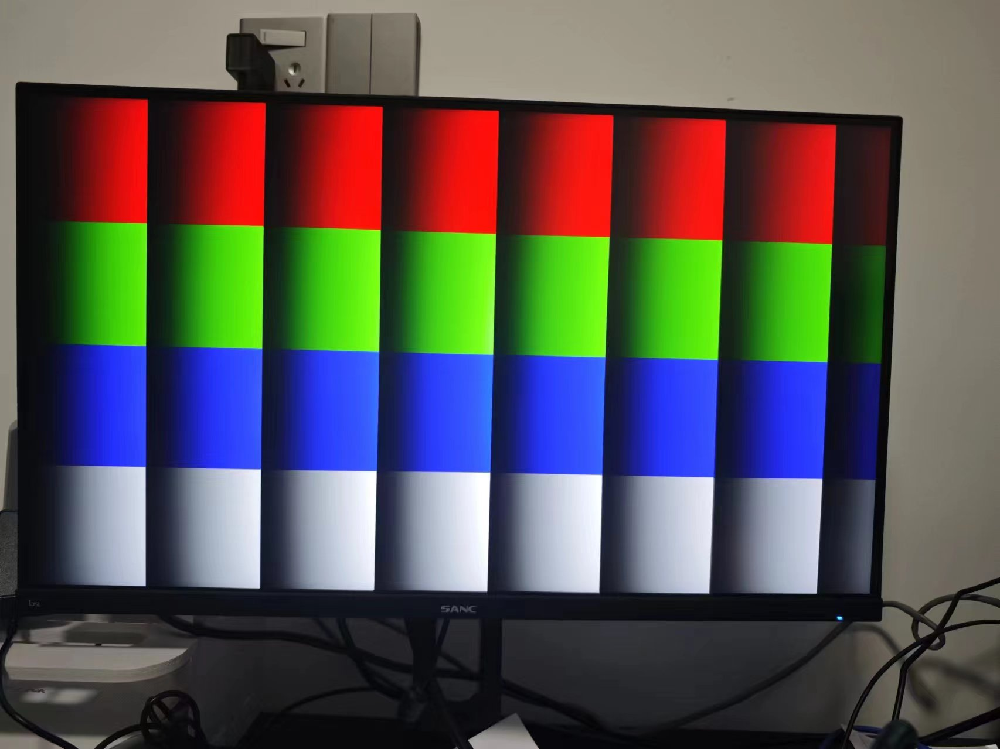

测试mhdi视频播放

下载一个mp4格式的视频。push到开发板内

```
adb push C:\Users\yxpen\Downloads\mixkit-girl-reading-a-book-in-nature-4897-medium.mp4 /root/
```

使用tplayerdemo播放

```
tplayerdemo /root/mixkit-girl-reading-a-book-in-nature-4897-medium.mp4
```

播放效果如下，我的是一个2k的显示屏，确实高清。


> 📹 视频素材：`4_BasicTest.assets/6f2cc4d07f175cf2468ffc8fed2ccdb7.mp4`（未包含在文档中）


## 5、wifi

wifi因为之前已经有过适配，所以简单测试一下连接和网速就可以了。

先来欣赏一下外观。

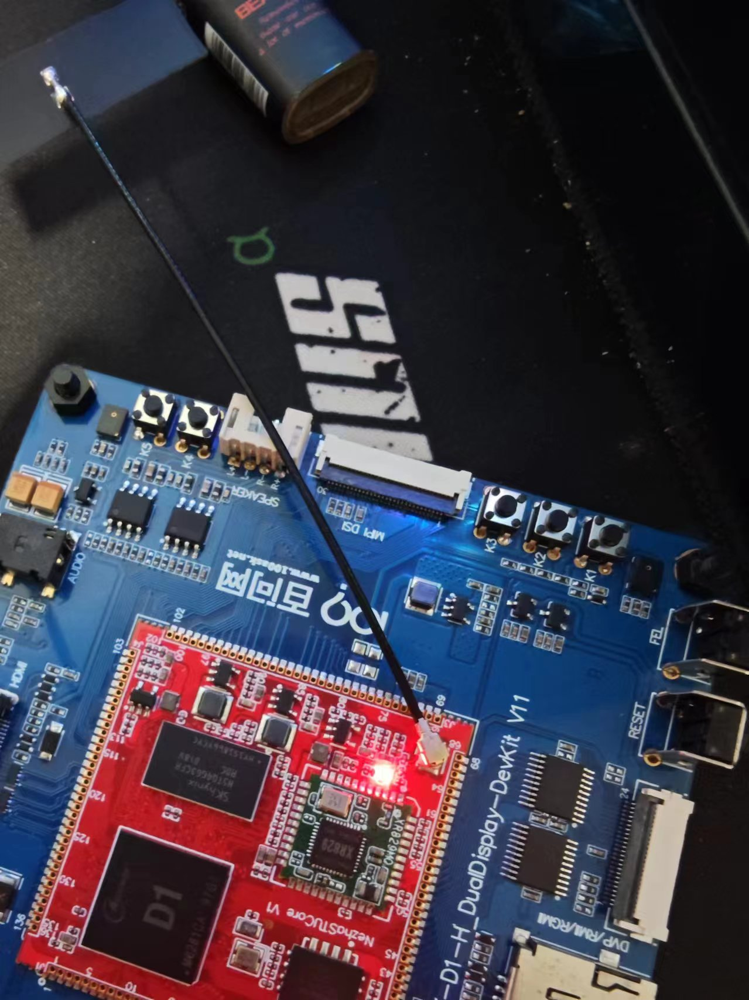

本块开发板搭载的是XR829芯片，它是一个完全集成的SoC（系统级芯片），支持2.4G WLAN 802.11b/g/n和蓝牙2.1+EDR/4.2。这款芯片针对PDA（个人数字助理）和便携式媒体播放器等移动应用进行了优化，具有高度的系统集成度和价格竞争力。它提供了长距离和坚固的连接，支持站点、软AP和P2P模式，以及Wi-Fi Direct。此外，XR829还包括一个单频2.4G射频收发器（与PA、LNA和TR开关集成）、PMU、WLAN调制解调器、WLAN MAC、蓝牙调制解调器和蓝牙协议栈。然后我自己接上了一根帅气的小天线，打开了它的无线传输功能。

扫描周围热点

```
wifi_scan_results_test
```

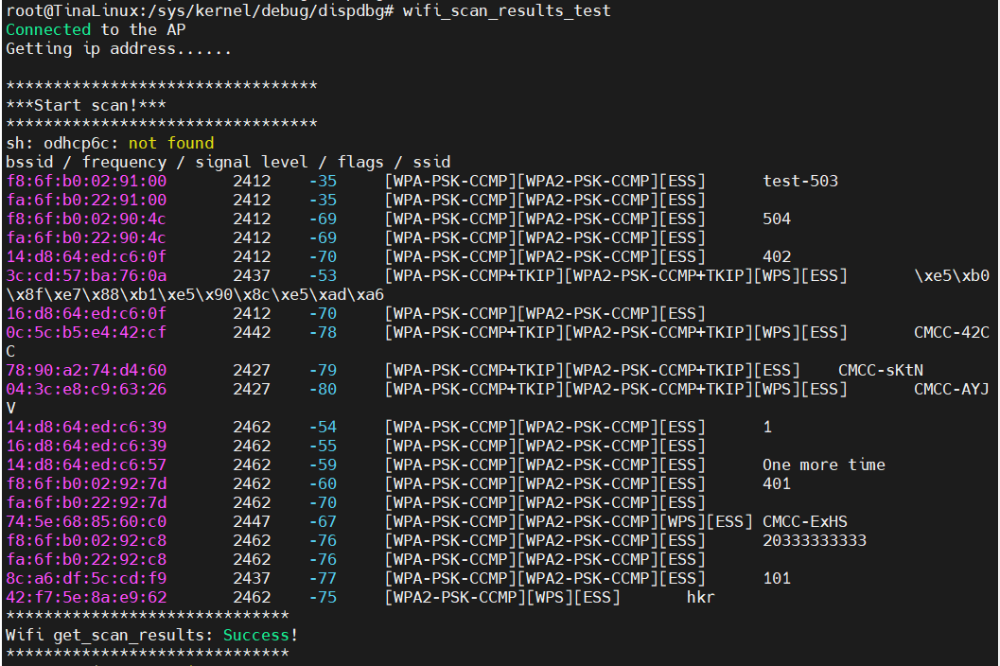

看得出来周围的热点还蛮多的

连接我自己的WiFi

```
wifi_connect_ap_test test-503 xptx321..
```

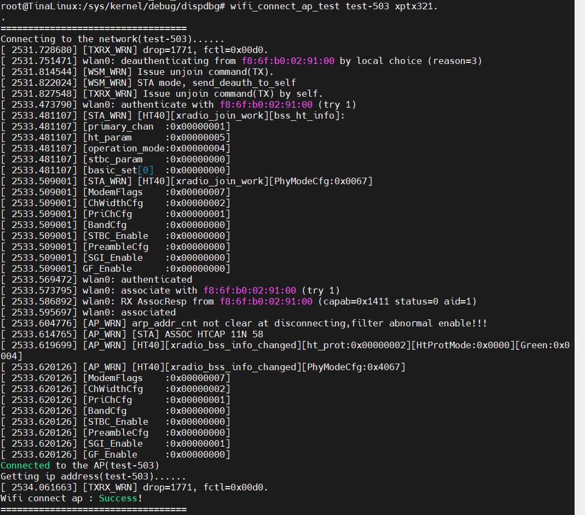

这样就成功啦。

那么接下来，测试WiFi效果，来一个经典效果，ping百度

```
ping www.baidu.com
```

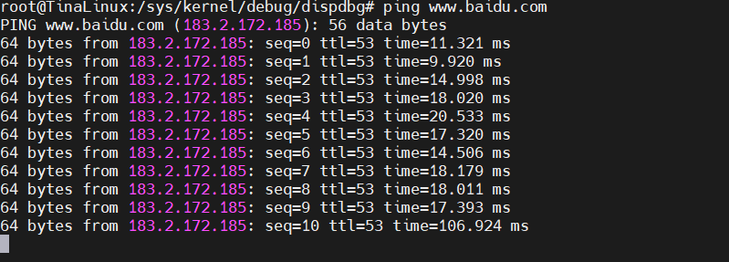

表示效果相当不错，舒舒服服。

## 6、蓝牙

WiFi适配好了，蓝牙也不会有什么问题，因为蓝牙本身和WiFi就是一个芯片。加上sdk里面已经进行过基础的适配了，所以我们不需要更改什么东西。

测试蓝牙的命令是 bt_test, 该 app 可以后台运行，也可以交互运行。

启动运行帮助命令：

```
bt_test -h
```

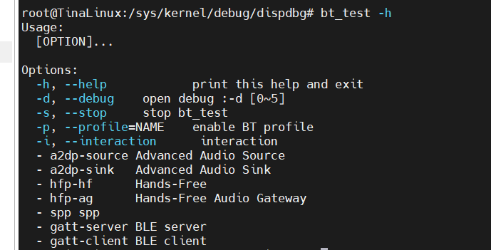

后台模式

```
bt_test
```

交互模式

```
bt_test -i
```

蓝牙有两个模式 一个是a2dp sink 把开发板当作从机，用其他设备控制播放等指令，另一个是a2dp Souce用开发板当作主机发出指令。

### 6.1 a2dp sink 测试

```shell
#终端执行：bt_test -p a2dp-sink 或者 bt_test -p a2dp-sink -i (将进入交互模式)
#2. 使用手机打开蓝牙，搜索"aw-bt-test-xxxx"的设备，并进行链接
#3. 手机打开播放器app，进行播放音乐，设备端将同步输出声音
bt_test -p a2dp-sink
```

这样就开启成功了，用手机连接上蓝牙就可以放歌让开发板播放了，可以从耳机孔听音乐，因为我已经配对过一次，所以蓝牙显示直接匹配上了我的手机。


> ⚠️ 原文图片素材缺失：`../../d1h_test/D1h_test.assets/image-20240509002250080.png`


> ⚠️ 原文图片素材缺失：`../../d1h_test/D1h_test.assets/image-20240509002302881.png`


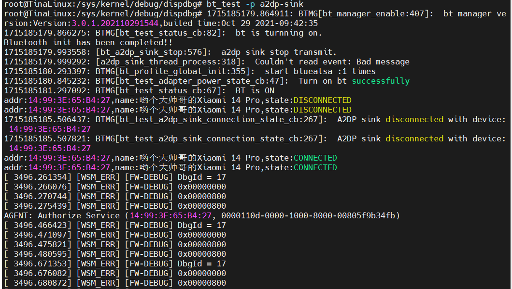

### 6.2 a2dp Souce 测试

a2dp source 模式必须要交互模式运行:

``` bt_test -i
bt_test -i
```

首先将一个音频文件push到我们的开发板上，我这里测试耳机时候已经push过了，所以就不用再操作了。

然后执行

```
bt_test -i -p a2dp-source
```

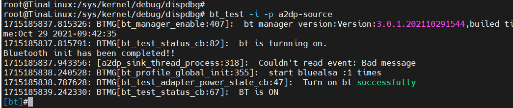

扫描设备

```shell
#扫描指定设备获取到mac地址：scan 1，扫描到后停止扫描：scan 0,获取已经扫描到的设备：scan_list
scan 1
```

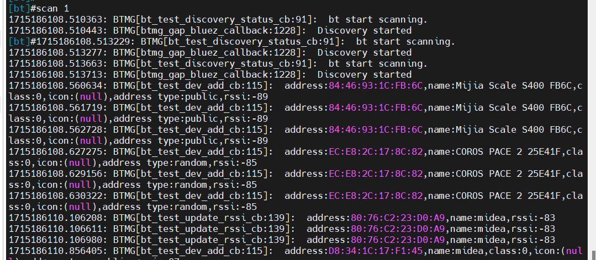


连接设备

```
connect 80:76:C2:23:D0:A9
```

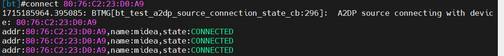

然后就可以开始放歌了

```shell
#开始播放：a2dp_src_start /root/1213.wav
#停止播放：a2dp_src_stop /root/1213.wav
```

### 6.3 其他测试

蓝牙还有很多别的功能，我们封装一下也可以写很多个程序，这里基础测试就不一一测试出来了，具体方法写在下面。

avrcp 测试

```
在 a2dp sink 测试步骤前提下（执行：bt_test -p a2dp-sink -i 进入交互模式）。
分别执行：avrcp play/pause/stop/fastforward/rewind/forward/backward 可进行音乐播放，暂停，快进，快退，上下曲等操作。
```

gatt server 测试

```
1. 执行：gatt_server_test。
2. 执行：test。
3. 手机app（ble scanner或nrf connect）。
4. 连接到"aw-bt-testxx"字样的蓝牙服务。
5. 对uuid为3334分别进行read和write操作。
6. read操作时手机app会收到数字累计增加。
7. write操作时手机app发送的字符会显示在样机的串口终端上。
```

hfp client 测试

```
1. 执行: bt_test -i。
2. 手机连接上蓝牙设备 。
3. 来电接听：hfp_answer 。
4. 来电拒绝:hfp_hangup 。
5. 样机拨号：hfp_dial 10001 。
6. 样机拨打上一个电话:hfp_last_num 。
7. 样机获取手机:hfp_cnum。
```

##
