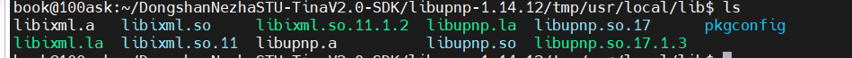
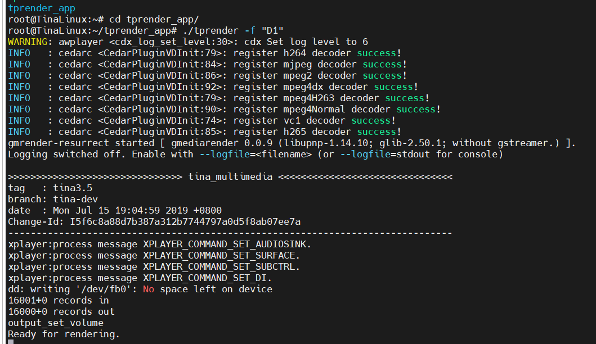

# WiFi投屏

> 评测作者：拍一下_彭延鑫 · 本篇为社区评测文章，来自开发者实测，未经官方逐字校对。

# 全志d1-H开发板初体验之五、专题测试

此次拿到开发板的测试重点，也就是下面的HDMI+WiFi的投屏测试，也是本次测试和学习的大头

## 1、下载源码

WiFi+hdmi投屏，韦东山老师是有完整教程的，地址[在这里](https://github.com/DongshanPI/DongshannezhaSTU_DLNA_ScreenProjection/tree/master)下载源码，然后按照指导进行操作，但是在编译tprender时候不知道为什么一直报错，可能是操作有误，然后下载了另外一份魔改过的代码，一次性编译通过，也把代码贴在此处，供大家参考。[全志论坛](https://bbs.aw-ol.com/topic/411/%E5%93%AA%E5%90%92d1%E7%BC%96%E8%AF%91%E9%85%8D%E7%BD%AEdlna%E5%AE%A2%E6%88%B7%E7%AB%AF%E8%BF%9B%E8%A1%8Cb%E7%AB%99%E6%8A%95%E5%B1%8F-%E8%BD%AC?_=1715011703298)

## 2、make Puppnp

make Puppnp的过程比较简单，下载到虚拟机并解压出来Puppnp的源码

```
https://github.com/pupnp/pupnp/releases/download/release-1.14.12/libupnp-1.14.12.tar.bz2
tar -xvf libupnp-1.14.12.tar.bz2
```

链接自己sdk里面的交叉编译工具链

```
export PATH=P$PATH:/home/book/DongshanNezhaSTU-TinaV2.0-SDK/tina-d1-h/out/d1-h-nezha/staging_dir/toolchain/bin
```

执行./configure

```
cd libupnp-1.14.12/
./configure --host=riscv64-unknown-linux-gnu
```

执行并创建目录，将编译出来的库文件放入tmp

```
make
mkdir tmp
make install DESTDIR=/home/book/DongshanNezhaSTU-TinaV2.0-SDK/libupnp-1.14.12/tmp/
```

## 3、make tprender

make tprender的时候我出现了找不到头文件config.h的报错，几经尝试也没有解决，换成了全志网站里的帖子的源码后解决掉了，所以我个人建议使用全志帖子内的源码

首先在虚拟机进入到tprender的目录

```
cd tprender
```

使用vim打开 CMakeLists.txt

```
vim CMakeLists.txt
```

修改下面内容的路径为自己SDK的路径

```
cmake_minimum_required(VERSION 2.8)

project(tprender C)

SET(CROSS_COMPILE 1)
set(CMAKE_SYSTEM_NAME Linux)
#编译器路径
set(CMAKE_C_COMPILER "/home/book/DongshanNezhaSTU-TinaV2.0-SDK/tina-d1-h/prebuilt/gcc/linux-x86/riscv/toolchain-thead-glibc/riscv64-glibc-gcc-thead_20200702/bin/riscv64-unknown-linux-gnu-gcc")
#链接库路径
link_directories(
                ./libs
                /home/book/DongshanNezhaSTU-TinaV2.0-SDK/tina-d1-h/out/d1-h-nezha/staging_dir/target/usr/lib
)

aux_source_directory(src SOURCE)

include_directories(./)
include_directories(./include)
include_directories(./glib-2.0)
#头文件路径
include_directories(/home/book/DongshanNezhaSTU-TinaV2.0-SDK/tina-d1-h/out/d1-h-nezha/staging_dir/target/usr/include)
include_directories(/home/book/DongshanNezhaSTU-TinaV2.0-SDK/tina-d1-h/out/d1-h-nezha/staging_dir/target/usr/include/allwinner/)
include_directories(/home/book/DongshanNezhaSTU-TinaV2.0-SDK/tina-d1-h/out/d1-h-nezha/staging_dir/target/usr/include/allwinner/include)

```

修改完成后执行

```shell
cmake .
#cmake执行完成后再执行
make
```

然后就编译出来tprender

就可以把以上编译的东西按照需要的进行打包了，建立一个文件夹	

```
mkdir tprender_app
```

文件夹里面内容有以下的东西

```shell
#tprender			由tprender编译出来在tprender源码根目录下
#libixml.so	 		由pupnp编译出来在libupnp-1.14.12/tmp/usr/local/lib目录下
#libupnp.so 		由pupnp编译出来在libupnp-1.14.12/tmp/usr/local/lib目录下
#grender-64x64.png		在tprender\data
#grender-128x128.png	在tprender\data
```




## 4、开始投屏

连接WiFi

```
wifi_connect_ap_test test-503 xptx321..
```

获取WiFi的ip

第一次运行wifi_connect_ap_test 会自动获取ip4地址 但是下次开机会自动连接wifi 但不会自动获取ip4地址 所以要检查一下

```
udhcpc -i wlan0
```

在windows用adb把tprender_app发送到开发板

```
adb push C:\Users\yxpen\Desktop\tprender_app /root/
```

从开发板进入目录

```
cd /root/tprender_app
cp libs/* /usr/lib/
chmod +x tprender
./tprender -f "D1"
```



这里就开始了投屏模式，此时可以开始打开手机bilibili进行投屏操作


> ⚠️ 原文图片素材缺失：`../../d1h_test/D1h_test.assets/image-20240509013112207.png`


> ⚠️ 原文图片素材缺失：`../../d1h_test/D1h_test.assets/image-20240509013149140.png`


> ⚠️ 原文图片素材缺失：`../../d1h_test/D1h_test.assets/image-20240509013255195.png`


> 📹 视频素材：`5_WiFiProjectionScreen.assets/8040c13d5677d7ad0880a1c4c8cfa77a.mp4`（未包含在文档中）


另外，因为我这里hdmi显示屏没有语音输出功能，所以没有设置，只用了3.5mm耳机孔去听声音，其实也是可以直接将声音输出到HDMI设备音视频一起播放的。在这里设置。

 ```
vi /etc/asound.conf
 ```


> ⚠️ 原文图片素材缺失：`../../d1h_test/D1h_test.assets/image-20240509013923354.png`


在这里加上HDMI四个字符就可以了，至此，整个评测完结啦，谢谢大家，辛苦自己啦。
