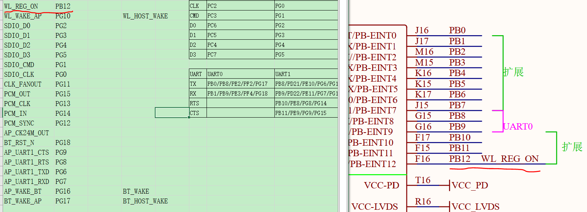
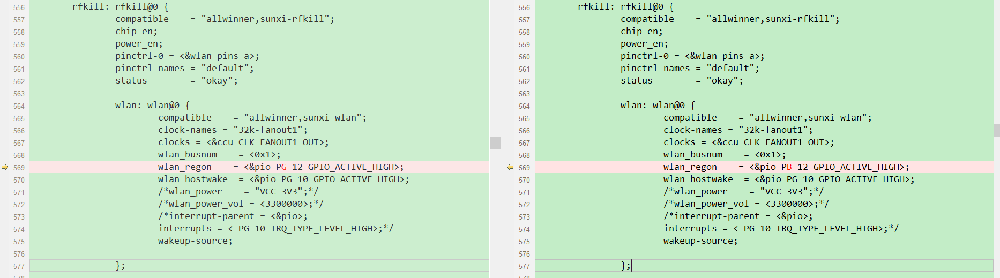
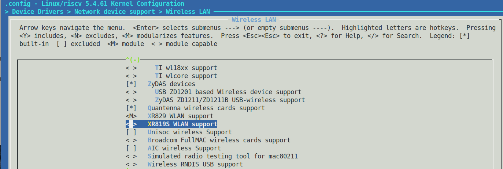
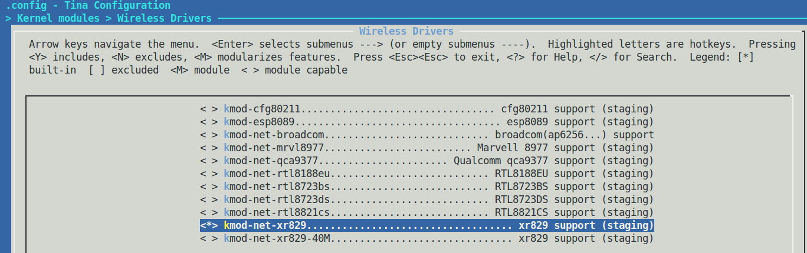
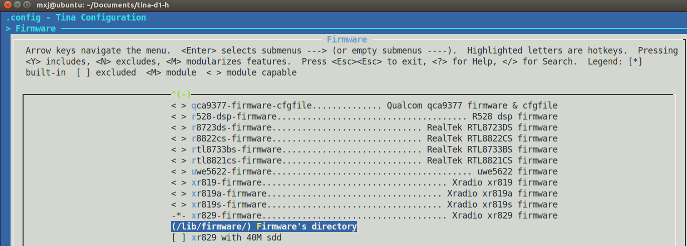
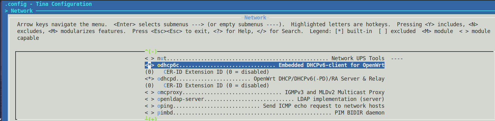
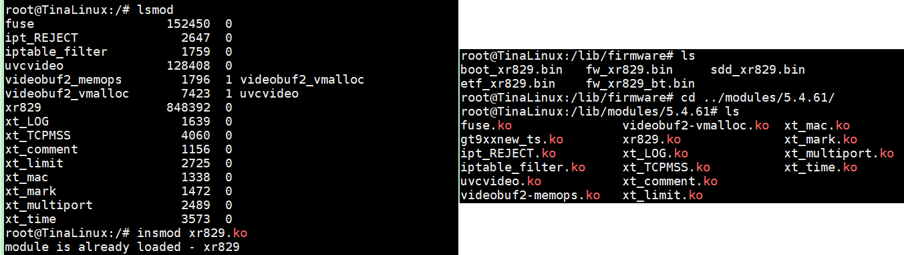
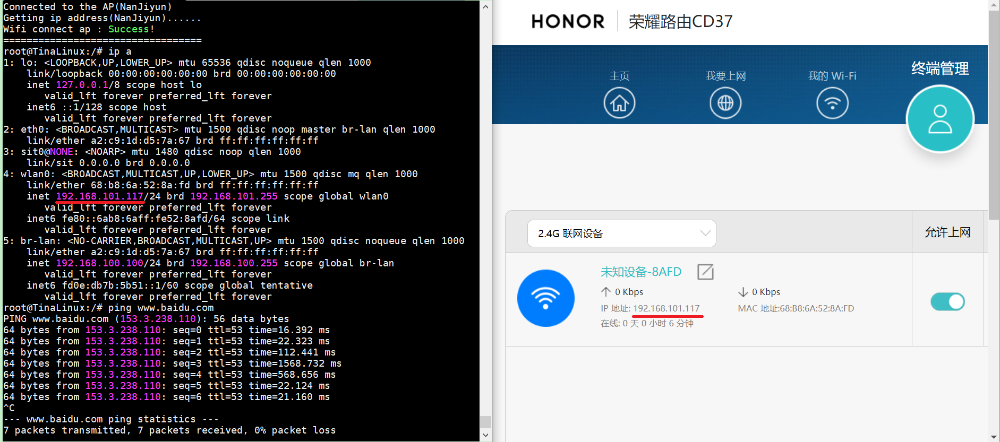
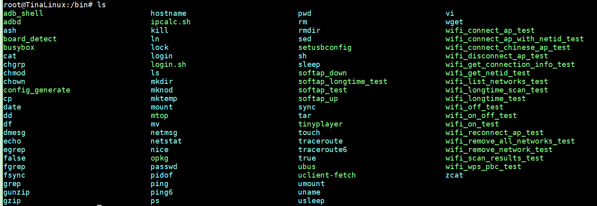

# 基础配置：网络篇

> 评测作者：百拙上人 · 本篇为社区评测文章，来自开发者实测，未经官方逐字校对。本文由原 Word 文档转换而来。

XR829集蓝牙\+WiFi二合一，WiFi通过SDIO与主机相连，蓝牙通过UART（HCI）与主机相连，具体如下：

　

新

　

WL\_REG\_ON

PB12

　

WL\_WAKE\_AP

PG10

　

SDIO\_D0

PG2

SDC1

SDIO\_D1

PG3

SDIO\_D2

PG4

SDIO\_D3

PG5

SDIO\_CMD

PG1

SDIO\_CLK

PG0

CLK\_FANOUT

PG11

　

PCM\_OUT

PG15

　

PCM\_CLK

PG13

　

PCM\_IN

PG14

　

PCM\_SYNC

PG12

　

AP\_CK24M\_OUT

　

　

BT\_RST\_N

PG18

　

AP\_UART1\_CTS

PG9

UART1

AP\_UART1\_RTS

PG8

AP\_UART1\_TXD

PG6

AP\_UART1\_RXD

PG7

AP\_WAKE\_BT

PG16

　

BT\_WAKE\_AP

PG17

　

SD\_CLK

PC2

　

SD\_CMD

PC3

　

SD\_D2

PC4

　

SD\_D1

PC5

　

SD\_D0

PC6

　

SD\_D3

PC7

　

XR829有6路UART，3路SDIO，其中SDIO1、UART1分别连到XR829的WiFi、蓝牙子系统。首先配置网络，以太网被合进DVP接口插座中，无线网可以来配置一下，对比原理图：

图1 XR89接线原理图

设备树文件\.dts或\.fex在目录tina\-d1\-h\\device\\config\\chips\\d1\-h\\configs\\nezha\\board\.dts下发现WL\_REG\_ON管脚没对应，修改PG12成PB12：

图2 XR829 WiFi设备树引脚修改

驱动程序在tina\-d1\-h\\lichee\\linux\-5\.4\\drivers\\net\\wireless\\xr829目录下，通过敲击“make kernel\_menuconfig”进入Device Drivers\->Network device support\->Wirelwss LAN核查XR829 WLAN Support是否编译成\.ko并进入内核：

图3 kernel内核配置

此时编译烧录发现报错“No vqmmc,check if there is regulator”,按照文档《D1\-H\_Tina\_Linux\_Wi\-Fi\_开发指南》P9上电时序需要24/26MHz时钟，而驱动有两个版本XR829和XR829\_40M，于是Kernel modules\->Wireless Drviers取消选择kmode\-net\-xr829\-40M，选择kmode\-net\-xr829（目录/lib/modules/5\.4\.61）：

图4 内核驱动配置

Firmware：取消选择“xr829 with 40M SDD”（目录/lib/firmware），配置变动在SDK/target/allwinner/d1\-h\-nezha/defconfig

图5 设备固件配置

再次编译烧录仍然报警odhcp6c not found，查了下odhcp6c在openwrt是经典配置，按照[https://www\.jianshu\.com/p/59332ac490ec](https://www.jianshu.com/p/59332ac490ec)操作了一下，依旧不行，于是在Network\->ohdcp6c和ohdcp6d选中即可：

图6 开启odhcp6c

再次启动终于成功了，分别在rootfs目录/lib/firmware和/lib/modules/5\.4\.61下看到固件和内核驱动，输入insmod xr829\.ko提示已加载：

图7 检查文件系统固件和驱动的存在

输入wifi\_connect\_ap\_test ssid passwd连接网络，通过“ip a”可以看到ipv4地址，ping [www\.baidu\.com](http://www.baidu.com)也是通的：

图8 WLAN网络

而WLAN的测试指令可以在/bin找到：

图9 wifi测试指令
