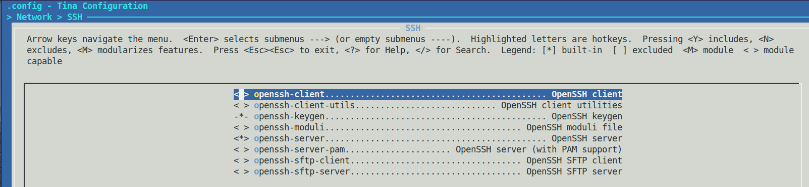
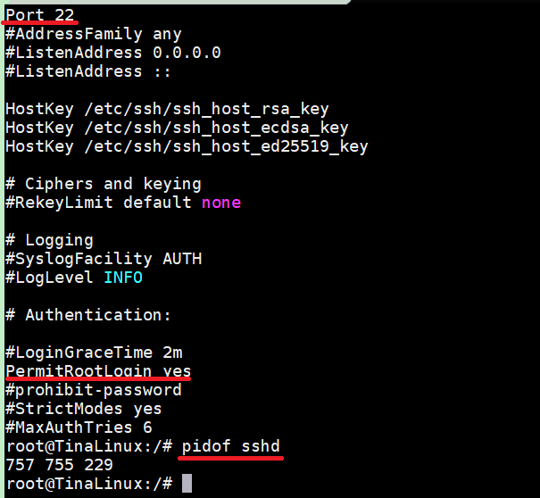
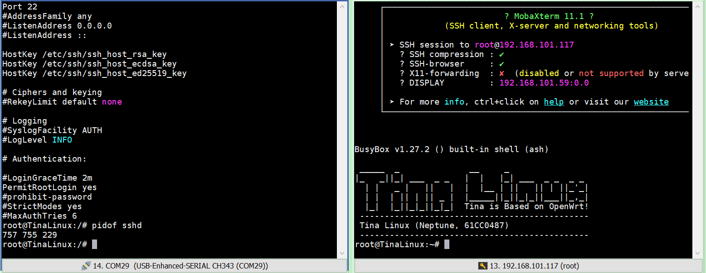
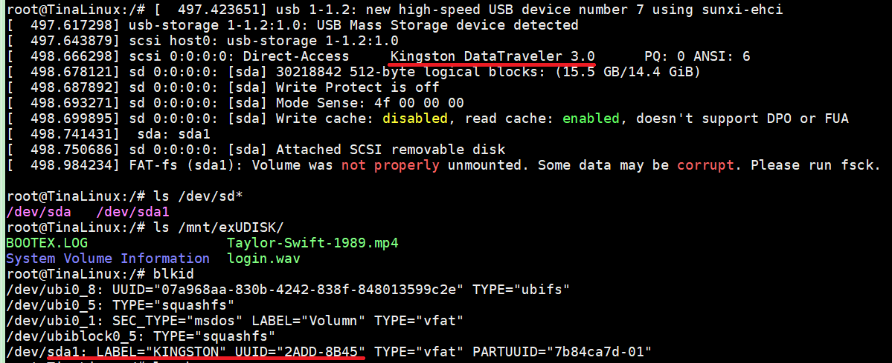
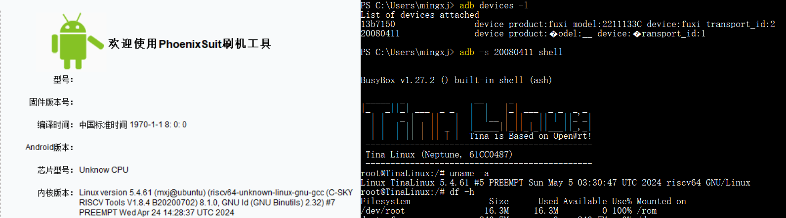

# 基础配置：通信篇

> 评测作者：百拙上人 · 本篇为社区评测文章，来自开发者实测，未经官方逐字校对。本文由原 Word 文档转换而来。

上篇把xr829的无线WiFi测试通过，网络通信SSH/FTP均可以测试一下，

1. SSH网络

在Network\->SSH\->openssh\-server选中即可，

图1 openssh配置

编译烧录后输入“pidof sshd”看到sshd已经在运行状态，登录发现不行提示“Access denied”，此时即使“passwd root”修改密码仍然不行，输入“vi /etc/ssh/sshd\_config”查看sshd配置才发现默认没有打开“PermitRootLogin”，去掉注释，并把值改为yes，

图2 修改/etc/ssh/sshd\_config

改完重启，再登录就可以了：

图3 SSH登录

再scp上传文件发现不行，开启了sftp发现ftp/scp/telnet暂时都不行。

1. USB文件

插入我的Kingston U盘，自动挂载到/mnt/exUDISK下，输入“blkid”可以查看，

图4 U盘文件传输

1. ADB调试

USB\-OTG模式支持安卓ADB调试命令，有多个设备可以“\-s”参数指定，像SSH一样远程登录输入“adb shell”，也可以adb push/pull上传下载文件：

图5 adb调试模式
