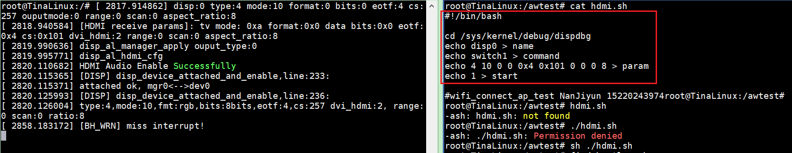
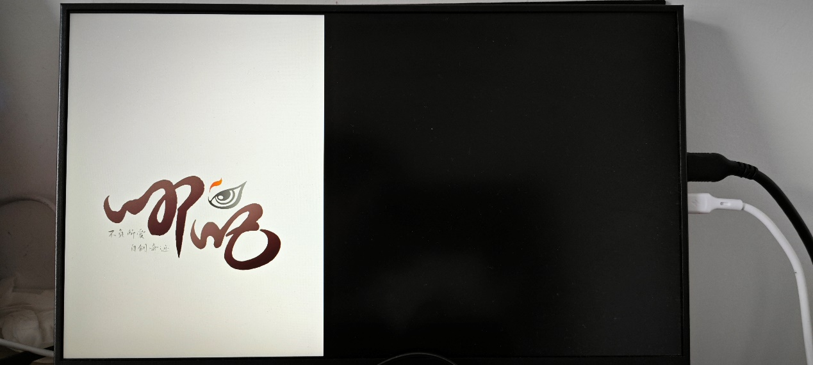
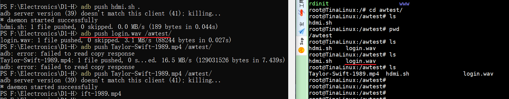
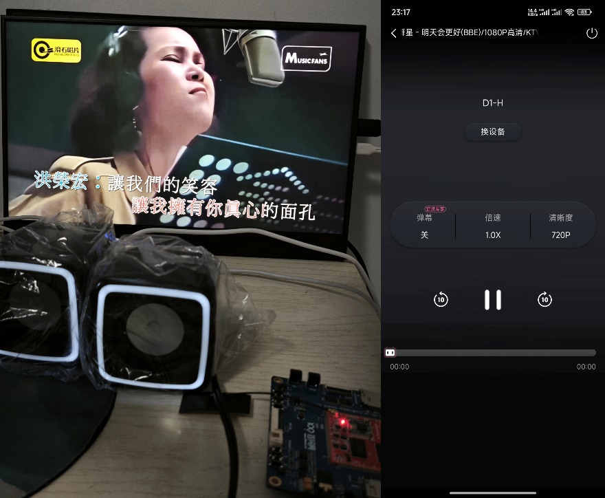

# HDMI测试

> 评测作者：百拙上人 · 本篇为社区评测文章，来自开发者实测，未经官方逐字校对。本文由原 Word 文档转换而来。

一、HDMI测试

	新建hdmi\.sh脚本，输入内容：

\#\!/bin/bash

cd /sys/kernel/debug/dispdbg

echo disp0 > name

echo switch1 > command

echo 4 10 0 0 0x4 0x101 0 0 0 8 > param

echo 1 > start

执行\./hdmi\.sh后HDMI输出一张800\*1280图片到屏幕上，该图片在SDK\\device\\config\\chips\\d1\-h\\configs\\nezha\\configs\\bootlogo\.bmp

用上篇讲的adb或者U盘来传输音频和视频到D1\-H的文件系统中：

视频是4K，大小有600多M，超出D1\-H的文件系统大小，最好插U盘来测试，详细测试录成视频，见[https://www\.bilibili\.com/video/BV1zb421a7gK/](https://www.bilibili.com/video/BV1zb421a7gK/)。其中HDMI视频输出倍速、跳转有点问题，可能程序写的有点问题，而且播放过程日志有好几处在报错，这个还要对照文档《D1\-H\_Linux\_HDMI20\_开发指南》仔细看看。

二、投屏

	这里源码编译和原理解析这里有，拾人牙慧[https://bbs\.aw\-ol\.com/topic/411/%E5%93%AA%E5%90%92d1%E7%BC%96%E8%AF%91%E9%85%8D%E7%BD%AEdlna%E5%AE%A2%E6%88%B7%E7%AB%AF%E8%BF%9B%E8%A1%8Cb%E7%AB%99%E6%8A%95%E5%B1%8F\-%E8%BD%AC?\_=1715043842562&lang=zh\-CN](https://bbs.aw-ol.com/topic/411/%E5%93%AA%E5%90%92d1%E7%BC%96%E8%AF%91%E9%85%8D%E7%BD%AEdlna%E5%AE%A2%E6%88%B7%E7%AB%AF%E8%BF%9B%E8%A1%8Cb%E7%AB%99%E6%8A%95%E5%B1%8F-%E8%BD%AC?_=1715043842562&lang=zh-CN)。tprender上传到 D1\-H上，输入：

\./tprender \-f "D1\-H"，就能在Bilibili看到设备“D1\-H”，比如点击投影《明天会更好》：

