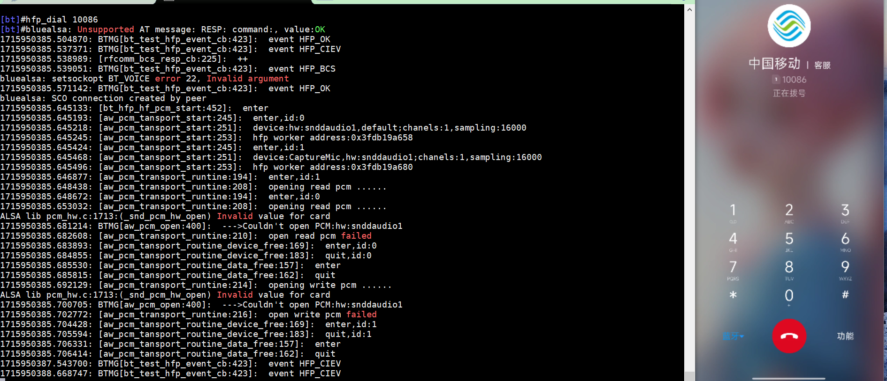
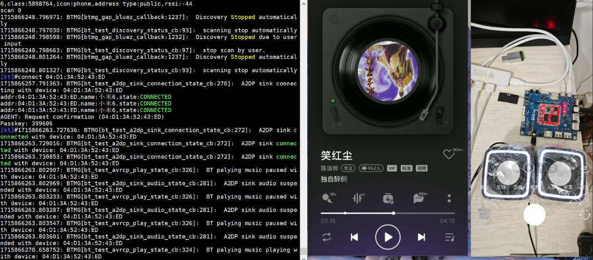
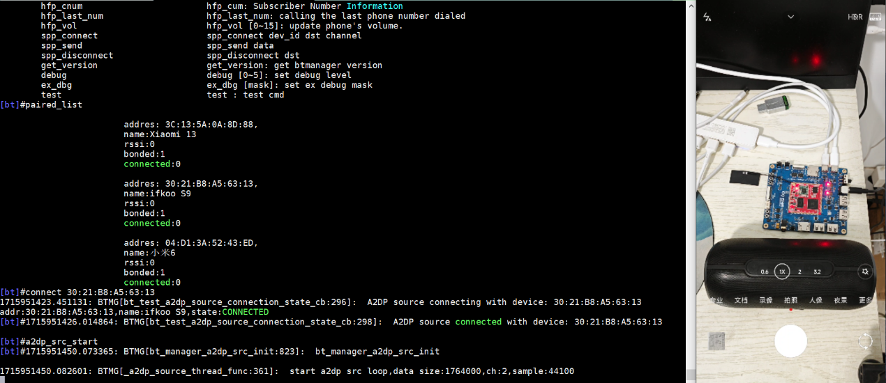

# 蓝牙测试：BR-EDR经典蓝牙

> 评测作者：百拙上人 · 本篇为社区评测文章，来自开发者实测，未经官方逐字校对。本文由原 Word 文档转换而来。

蓝牙测试：BR/EDR（包含蓝牙音箱）

本文测试效果见视频《D1\-H蓝牙篇：BR/EDR测试》，下面开始描述实现过程。

[https://www\.bilibili\.com/video/BV1Zx4y1p7zX/?vd\_source=35452f3eb796fc9d05d0c6ede616f282](https://www.bilibili.com/video/BV1Zx4y1p7zX/?vd_source=35452f3eb796fc9d05d0c6ede616f282)，下面开始描述实现过程。

前文讲了双模蓝牙中的BLE模式，现在这篇来讲XR829的BR/EDR模式。音频一直是个很复杂的问题，光编码就很多专利，苹果用的是AAC编码，安卓一般用的是SBC编码，还有高通的aptX/aptX\-Adptive/aptX\-HD、索尼LDAC等，还要调EQ、ENC降噪，双声道传输方式又分主副式、镜像式、平衡式等，需要MCU\+DSP组合运行，以往蓝牙音响被高通/CSR占据半壁江山，不过人家的开发工具确实做的很好，从ADK到后来的MDE。原先台湾半导体市场有声有色，瑞昱Realtek、洛达、原相PXI、创杰ISSC等百花齐放，后来才有国产恒玄、杰理、炬芯、中科蓝讯的入局竞争。闲话休絮，开始测试经典蓝牙的SCO蓝牙通话和ACL蓝牙音频通道，经典蓝牙同样也有一套状态机，Page扫描、Inquiry寻呼组成一个piconet或scatternet。以下按照文档《D1\-H\_Tina\_Linux\_蓝牙\_开发指南》说明来做:

一、蓝牙通话HFP

同样也是要先” bt\_test \-i”打开蓝牙电源、D1\-H主机和控制器XR829的数据传输通道HCI进入交互模式，蓝牙打开后和手机配对，再直接” hfp\_dial 10086”就可对外拨号：

二、蓝牙音频A2DP

分audio sink和audio source，在标准A2DP有讲。一般的音频板子支持sink得多，source很少见到，经典的CSR8675曾在很多家蓝牙音响里见到它的身影。

1\.sink

做sink像headset、speaker、soundbar等都是此类角色，直接输入” bt\_test \-p a2dp\-sink”就可充当sink，手机传送音频流给sink设备：

于是一个蓝牙音响就此出现。

2\.source

	这是对设备要求就高了，音频源要在它自身且要是支持的编码格式，这里选择了44\.1kHz的PCM编码梁静茹《暖暖》一段波形文件，首先把它放到/tmp目录下，然后按照文档一步步来。首次配对可以输入”scan 1”可以扫描然后”scan 0”、”scan\_list”找到蓝牙音响再”connect xx”或者原先已经配对连接过就可一步”connect xx”到位，再输入” a2dp\_src\_start”就能听到音频流传到另外一个真正的蓝牙音响上

