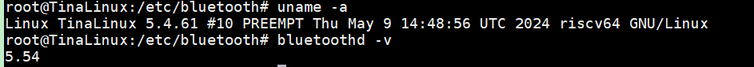
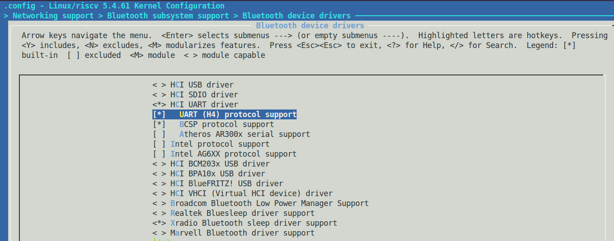
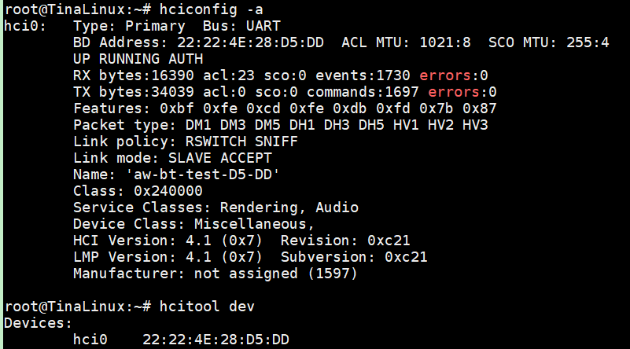
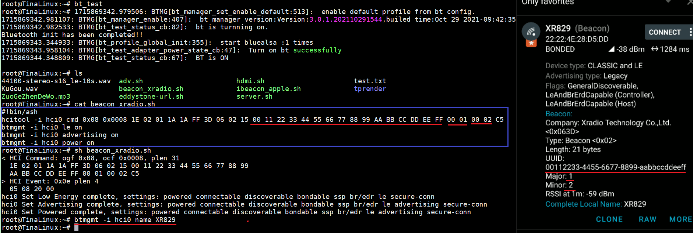
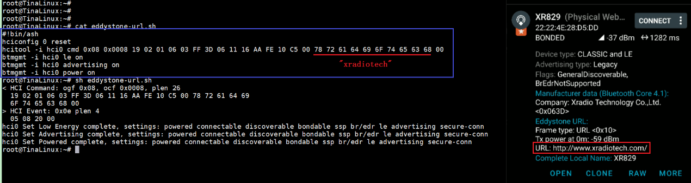
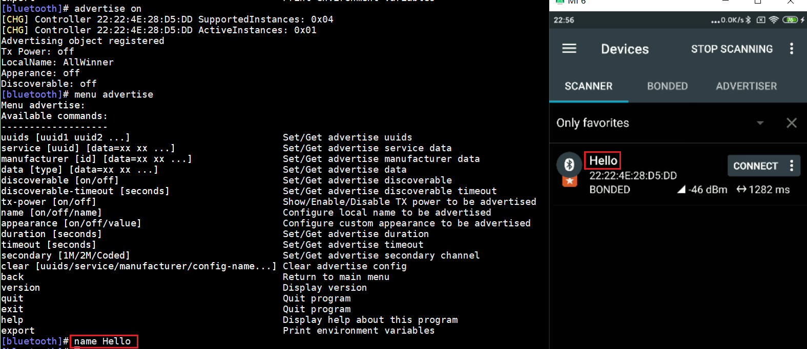
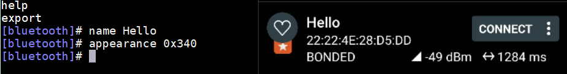

# 蓝牙测试：BLE低功耗蓝牙

> 评测作者：百拙上人 · 本篇为社区评测文章，来自开发者实测，未经官方逐字校对。本文由原 Word 文档转换而来。

蓝牙测试：BLE

本文测试效果见视频《D1\-H蓝牙篇：BLE测试》[https://www\.bilibili\.com/video/BV1Kf42117iR/?vd\_source=35452f3eb796fc9d05d0c6ede616f282](https://www.bilibili.com/video/BV1Kf42117iR/?vd_source=35452f3eb796fc9d05d0c6ede616f282)，下面开始描述实现过程。

常见开源蓝牙协议栈有btstack、zephyr、nimble、bluez、BlueDroid等，而在安卓4\.2后，原先内置的BlueZ被BlueDroid取代，但linux上仍旧是BlueZ协议栈。BlueZ上有常见btmon、btmgmt、bluetoothctl、hciattach、hciconfig、hcidump、hcitool、gatttool、bluetooth\-meshd等工具。蓝牙控制器和主机通过H2（USB）、H4（UART）、H5（UART）、BCSP（BlueCore Serial Port）、SDIO来构建HCI来进行数据传递。D1\-H的tina\-linux内核是5\.4，内置bluez 5\.54：

而蓝牙SoC与主机D1\-H数据通信方式可选，本次选择H4：

输入“hciconfig \-a”或者“hcitool dev”可以查看蓝牙数据通道、MAC地址、连接信息、版本信息等等，可以看到MAC地址为22:22:4E:28:D5:DD，设备名称“aw\-bt\-test\-D5\-DD”用了MAC后2字节：

以下测试第一步均需输入“bt\_test”打开蓝牙电源和数据传输通道HCI。然后从btmgmt和bluetoothctl两大部分来进行设置，可以单独输入”btmgmt”进入\[mgmt\]菜单或”bluetoothctl”进入\[Bluetooth\]菜单，以下以脚本命令和菜单方式进行测试：

1. iBeacon（btmgmt）

iBeacon内容格式不赘述，广播UUID\+Major\+Minor共20B，可以逐条输入以下命令或者创建脚本运行，

\#\!bin/ash

hcitool \-i hci0 cmd 0x08 0x0008 1E 02 01 1A 1A FF 3D 06 02 15 00 11 22 33 44 55 66 77 88 99 AA BB CC DD EE FF 00 01 00 02 C5

btmgmt \-i hci0 le on

btmgmt \-i hci0 advertising on

btmgmt \-i hci0 power on

输入“btmgmt \-i hci0 name XR829”可以修改设备名，而其中Xradio Tech的公司ID在SIG官网查到是0x063d。

1. Eddystone\-URL（btmgmt）

Eddystone格式也不赘述，共有UID/URL/TLM/EID 4种格式，以其中URL网址作为演示，同样可逐条输入或脚本一次执行，

\#\!bin/ash

hciconfig 0 reset

hcitool \-i hci0 cmd 0x08 0x0008 19 02 01 06 03 FF 3D 06 11 16 AA FE 10 C5 00 78 72 61 64 69 6F 74 65 63 68 00

btmgmt \-i hci0 le on

btmgmt \-i hci0 advertising on

btmgmt \-i hci0 power on

1. 广播（bluetoothctl）

先输入”bluetoothctl”进入该命令子菜单，不清楚就输入”help”查看帮助，然后”menu advertise”进入广播参数设置，比如同样设置名字输入”name Hello”，再”back”然后”advertise on”开启就能看到效果：

再比如设置appearance为心率计（别的像鼠标、键盘、耳机等都是一样），SIG查询心率计appearance为0x0340：

其他类似GATT属性同理。
