# D1h开发板评测体验

> 评测作者：罗马不起多（徐毅锋） · 本篇为社区评测文章，来自开发者实测，未经官方逐字校对。本文由原 Word 文档转换而来。

百问网D1h双屏异显开发套件是采用全志科技**首款RISC-V**处理器D1-H，该芯片是基于RISC-V指令集的芯片，集成了阿里平头哥64位C906核心，支持RVV，1GHz+主频，可支持Linux、RTOS等系统。同时支持最高4K的H.265/H.264解码，内置一颗HiFi4 DSP，最高可外接2GB DDR3，可以应用于智慧城市、智能汽车、智能商显、智能家电、智能办公和科研教育等多个领域。

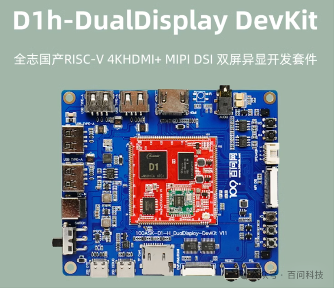

本次板子采用的主控芯片是全志D1H。这里我们先快速的安装SDK。

## 快速使用Tina-SDK 指南

- Tina-SDK开发HOST主机环境主要基于ubuntu-16.04及以上系统，其它系统暂未做过验证，请尽量使用 ubuntu-18.04。

### 获取配套开发文档

Tina-SDK提供的配套开发资料非常丰富，有驱动开发有组件开发等，大家可以直接点击下方的链接进行下载。

- 传输链接：[https://dongshanpi.cowtransfer.com/s/734005e89c9c43](https://dongshanpi.cowtransfer.com/s/734005e89c9c43)

### 获取Tina-SDK源码

#### 网盘获取

- 由于整个Tina-SDK V2.0工程比较大，所以我们单独将其分卷压缩存放至 网盘内，可以点击此 传输链接获取：[https://cowtransfer.com/s/adad917a1e5f43](https://cowtransfer.com/s/adad917a1e5f43)
- 下载成功后，需要先拷贝到 Ubuntu系统目录下，请尽量准备足够的硬盘存储空间，建议至少保留 **100G**以上剩余空间。
- 之后进入到 ubuntu系统目录下 执行解压缩命令 `cat tina-d1-h.tar.gz.* | tar zvx` 等待解压缩完成。
- 解压缩完成后，我们就可以开始配置HOST主机环境了。

#### 全志客户服务获取

- 参考 [https://d1.docs.aw-ol.com/study/study_2getsdk/](https://d1.docs.aw-ol.com/study/study_2getsdk/)

### 配置主机环境

#### ubuntu-16.04

安装命令：

```sh
sudo apt-get update
sudo apt-get install build-essential subversion git-core libncurses5-dev zlib1g-dev gawk flex quilt libssl-dev xsltproc libxml-parser-perl mercurial bzr ecj cvs unzip lib32z1 lib32z1-dev lib32stdc++6 libstdc++6 -y
```

#### ubuntu-18.04

安装命令：

```sh
sudo apt-get update
sudo apt-get install build-essential subversion git-core libncurses5-dev zlib1g-dev gawk flex quilt libssl-dev xsltproc libxml-parser-perl mercurial bzr ecj cvs unzip lib32z1 lib32z1-dev lib32stdc++6 libstdc++6 -y
sudo apt-get install libc6:i386 libstdc++6:i386 lib32ncurses5 lib32z1
```

### 配置&编译

1. 进入获取完成的Tina-SDK V2.0目录下，执行 `cd tina-d1-h/` 即可进入目录内。
2. 首先执行 `source build/envsetup.sh` 命令设置环境变量等待配置完成。会提示 `Setup env done! Please run lunch next.` 此段命令。
3. 选择你要编译的目标方案配置名称，比如输入 `lunch d1-h_nezha-tina` 说明指定编译d1-h tina方案，当然也可以输入 `lunch` 命令显示所有的方案，在弹出的对话框中输入你要编译的方案序号。
4. 配置好方案名称后，就可以执行 `make` 命令来开始编译了，整个编译过程比较漫长，可以加上 `-jN` 参数来加速编译，这里 N 指的是CPU的个数，一般可以以 CPU个数 x 线程数 进行指定。
5. 编译完成后，相应的文件会输出到 `/out/d1_nezha-tina/` 目录下，之后我们继续执行 `pack` 打包命令，来进行打包操作。

```sh
book@100ask:~$ cd tina-d1-h/
book@100ask:~/tina-d1-h$ source build/envsetup.sh
Setup env done! Please run lunch next.
book@100ask:~/tina-d1-h$ lunch

You're building on Linux

Lunch menu... pick a combo:

     1. d1-h_nezha_min-tina
     2. d1-h_nezha-tina
     3. d1s_nezha-tina

Which would you like?: 2
============================================
TINA_BUILD_TOP=/home/book/tina-d1-h
TINA_TARGET_ARCH=riscv
TARGET_PRODUCT=d1-h_nezha
TARGET_PLATFORM=d1-h
TARGET_BOARD=d1-h-nezha
TARGET_PLAN=nezha
TARGET_BUILD_VARIANT=tina
TARGET_BUILD_TYPE=release
TARGET_KERNEL_VERSION=5.4
TARGET_UBOOT=u-boot-2018
TARGET_CHIP=sun20iw1p1
============================================
no buildserver to clean
[1] 20070
book@100ask:~/tina-d1-h$ make -j16
```

如上示例，我进入 tina-d1-h 目录 之后使用lunch命令 显示所有的支持方案，选中 第二个 d1-h_nezha-tina 之后 执行 make -j16开始编译。这里给大家提醒一下，我们的 **东山哪吒STU** 开发板支持方案 `1. d1-h_nezha_min-tina` 和方案 `2. d1-h_nezha-tina`。

### 打包&烧写

编译完成后，我们就可以执行 `pack` 命令，将编译好的固件打包成一个 img 文件，用于后续烧写操作，固件路径在 `/out/d1_nezha-tina/tina_d1-nezha_uart0.img`，以 方案名称_串口节点.img 进行命名。最后我们就可以参考页面左侧 快速开始 内 烧写 全志原厂 系统的说明文档进行烧写操作啦。

### 获取交叉编译工具链

Tina-SDK可以使用专门的配套教程编译工具链 单独编译组件，编译内核驱动 或者 编写相应的应用程序，可以直接点击链接进行下载。

- 传输链接：[https://dongshanpi.cowtransfer.com/s/2b0439d7171b43](https://dongshanpi.cowtransfer.com/s/2b0439d7171b43)

下载成功后，拷贝到ubuntu系统内，执行 `tar -xvf riscv64-glibc-gcc-thead_20200702.tar.xz` 进行解压缩，等待解压缩完成后，可以执行如下命令设置环境变量。比如解压到家目录下也就是 `/home/book` 目录，则单独执行 `tar -xvf riscv64-glibc-gcc-thead_20200702.tar.xz -C ~`。之后执行如下命令在终端下设置环境变量，再设置之前需要您确认没有设置其它的环境变量。

```sh
book@100ask:~$ export ARCH=riscv
book@100ask:~$ export CROSS_COMPILE=riscv64-unknown-linux-gnu-
book@100ask:~$ export PATH=$PATH:/home/book/riscv64-glibc-gcc-thead_20200702/bin
```

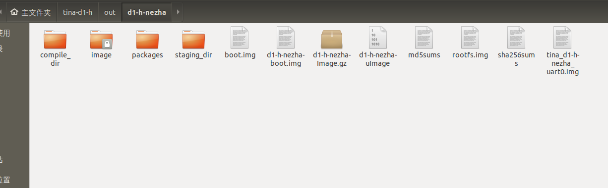

到了这里我们就可以获得烧录的镜像，烧录的镜像名字叫做 `tina_d1-h-nezha_uart0.img`。

## 烧写固件至TF卡

- 我们提供的系统镜像有多种不同的镜像类型，主要以全志原厂Tina-SDK构建出来的系统，和使用Buildroot构建出来的两种不同类型的系统镜像。本文先以介绍全志原厂Tina-SDK构建出来的系统进行演示，后续再提供Buildroot构建出来的系统烧写步骤。

### 准备工作

1. 东山哪吒STU开发板主板 x1
2. TF卡读卡器 x1
3. 8GB以上的 micro TF卡 x1
4. 全志原厂Tina-SDK烧写所用的烧录工具：点击下载 [https://cowtransfer.com/s/7536f3b4d23042](https://cowtransfer.com/s/7536f3b4d23042)
5. SDcard专用格式化工具：点击下载 [https://dongshanpi.cowtransfer.com/s/0c89eedff85547](https://dongshanpi.cowtransfer.com/s/0c89eedff85547)

### 烧录Tina-SDK镜像

1. 下载需要的镜像文件：点此传输链接 [https://cowtransfer.com/s/b50be87e55ef4c](https://cowtransfer.com/s/b50be87e55ef4c)，下载任意镜像，然后参考下面步骤进行烧写。
2. 使用 `SD Card Formatter.exe` 格式化插入的 Micro TF卡。

打开原厂专用烧录工具，参考下图进行烧写操作。打开烧录软件 PhoenixCard，选择烧录的固件，将内存卡通过读卡器插入电脑中：

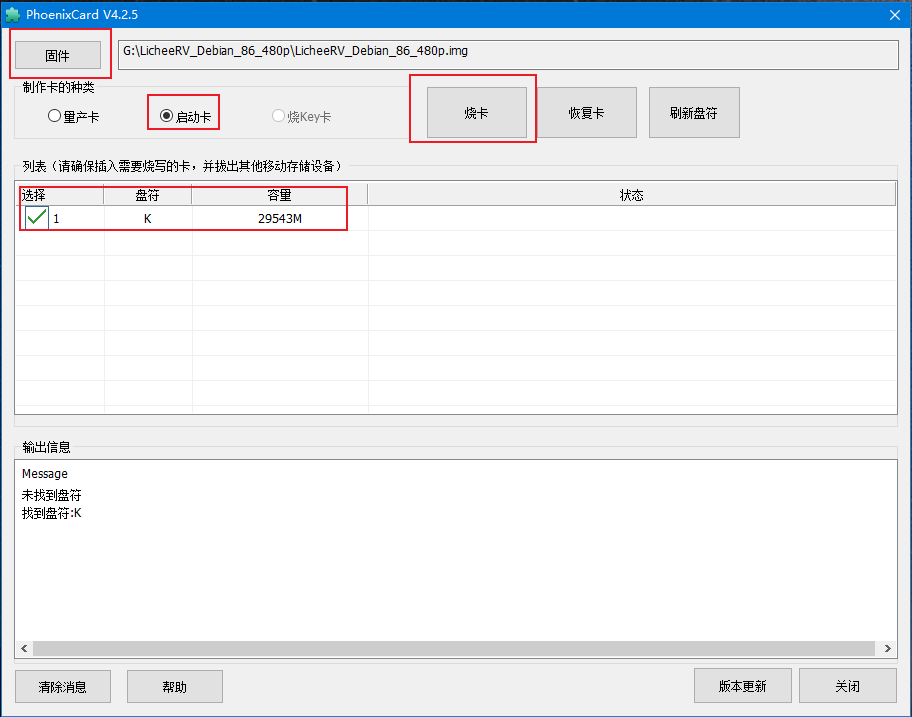

选择启动卡能成功启动系统：

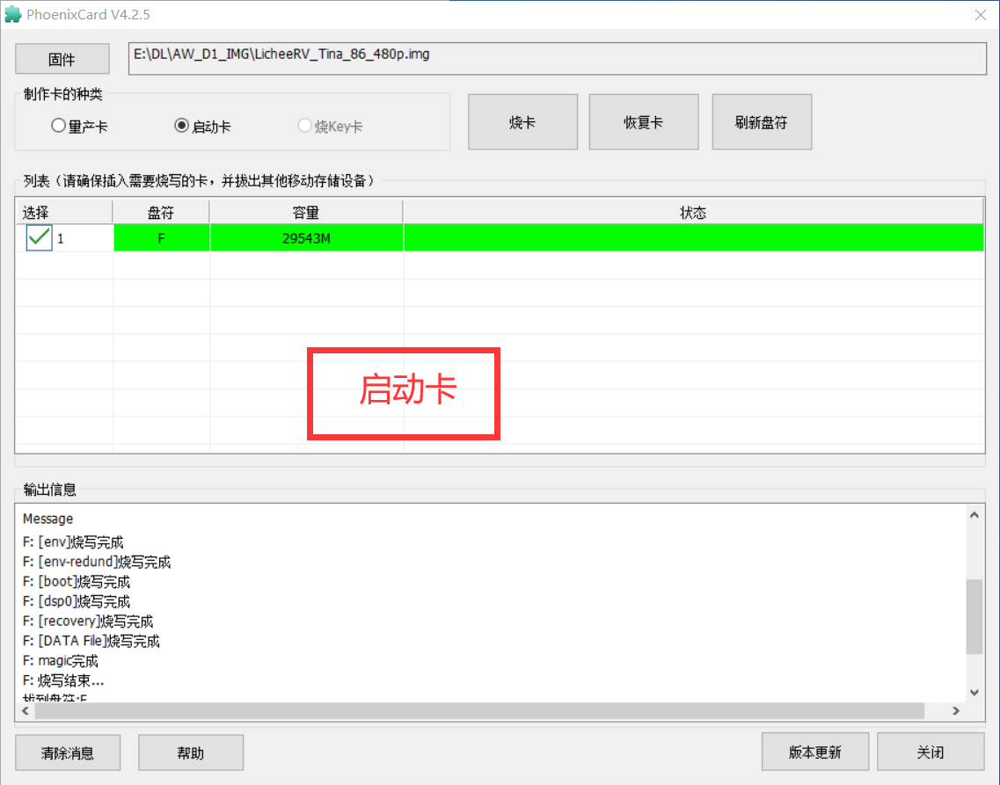

并不能保证每台电脑和每个人的内存卡都是可以烧录的，烧录失败的话建议购买官方的镜像卡。等待提示烧录结束，之后拔下卡插入到东山哪吒STU背面TF卡卡槽内，按下进去，继续进行如下步骤启动开发板进入系统。

- 如果需要自行从头编译构建全志原厂Tina-SDK V2.0系统，请移步至左侧 Tina-SDK V2.0开发指南页面。

## 上电启动系统

### 1. 连接串口线

将配套的TypeC线一端连接至开发板的串口/供电接口，另一端连接至电脑USB接口，连接成功后板载的红色电源灯会亮起。默认情况下系统会自动安装串口设备驱动，如果没有自动安装，可以使用驱动精灵来自动安装。

- 对于Windows系统，此时Windows设备管理器在 端口(COM和LPT) 处会多出一个串口设备，一般是以 `USB-Enhanced-SERIAL CH9102` 开头，您需要留意一下后面的具体COM编号，用于后续连接使用。如上图，COM号是96，我们接下来连接所使用的串口号就是96。
- 对于Linux系统，可以查看是否多出一个 `/dev/tty<>` 设备，一般情况设备节点为 `/dev/ttyACM0`。

### 2. 打开串口控制台

**获取串口工具**

使用Putty或者MobaXterm等串口工具来连接开发板设备。

- 其中putty工具可以访问页面 [https://www.chiark.greenend.org.uk/~sgtatham/putty/](https://www.chiark.greenend.org.uk/~sgtatham/putty/) 来获取。
- MobaXterm可以通过访问页面 [https://mobaxterm.mobatek.net/](https://mobaxterm.mobatek.net/) 获取（推荐使用）。

**使用putty登录串口**

**使用Mobaxterm登录串口**

打开MobaXterm，点击左上角的“Session”，在弹出的界面选中“Serial”，如下图所示选择端口号（前面设备管理器显示的端口号COM21）、波特率（Speed 115200）、流控（Flow Control: none），最后点击“OK”即可。**注意：流控（Flow Control）一定要选择none，否则你将无法在MobaXterm中向串口输入数据**。

### 3. 进入系统shell

使用串口工具成功打开串口后，可以直接按下 Enter 键进入shell，当然您也可以按下板子上的 Reset 复位键，来查看完整的系统信息。

这里之后我们就可以进行开发了。

由于WIFI的引脚在原理图中又有改变，所以我们要调用WIFI的话就需要在设备树里面进行修改。

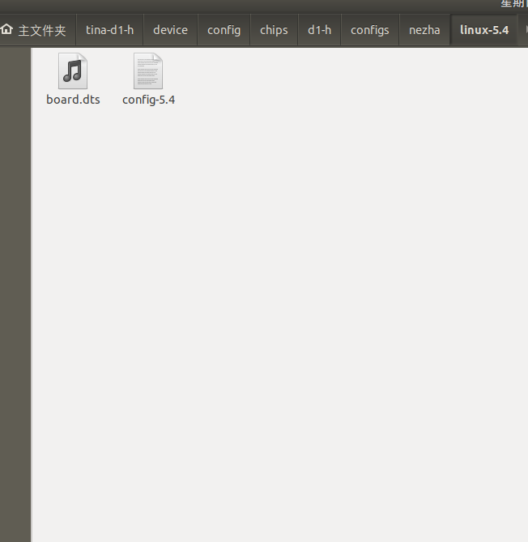

设备树在这个路径里面。这个时候我们需要对引脚进行修改。

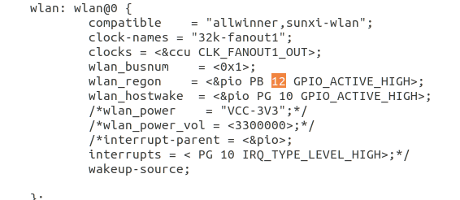

修改这个引脚设置之后，我们需要在 `make menuconfig` 中修改 XR829-40M 为 XR829 就能启动WIFI设备。

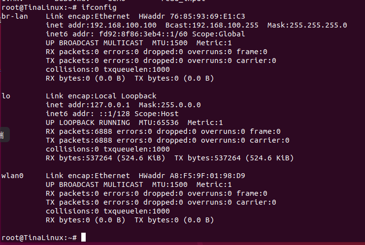

这个设备可以看到WIFI WLAN0，这个时候就可以证明我们配置成功了。

```sh
wifi_scan_results_test
wifi_connect_ap_test ESP8266 12345678
```

然后通过这两个指令就可以连接WIFI。

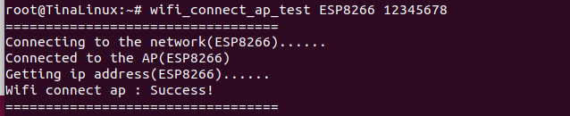

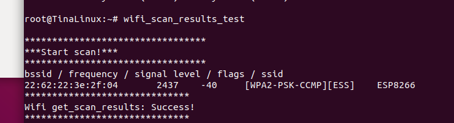

这样我们就能连接WIFI了。

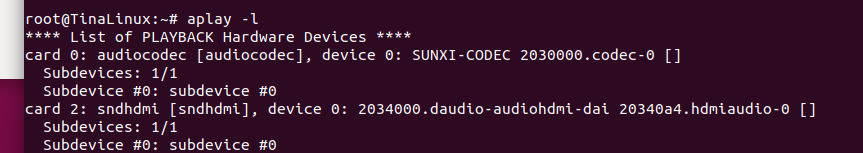

音乐播放我们可以采用 aplay 指令：

```sh
amixer -Dhw:audiocodec cset name='LINEOUT Switch' 1
```

指令我们可以用喇叭播放。

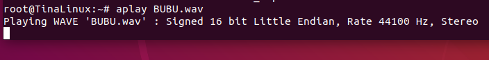

然后这样就能播放音乐了。

HDMI视频播放我们先进行HDMI显示：

```sh
cd /sys/kernel/debug/dispdbg && echo disp0 > name; echo switch1 > command;
echo 4 10 0 0 0x4 0x101 0 0 0 8 > param; echo 1 > start;
```

视频播放的格式采用的是 `.mkv`。

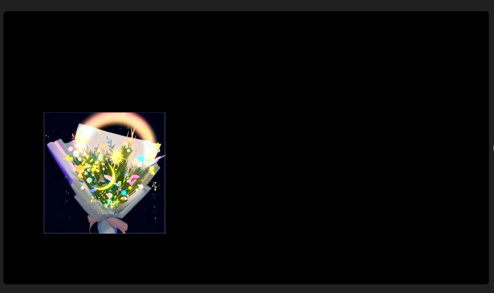

这个是启动的图片，我们是在UBOOT的开机图片里面设置。

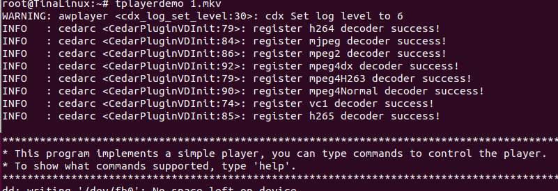

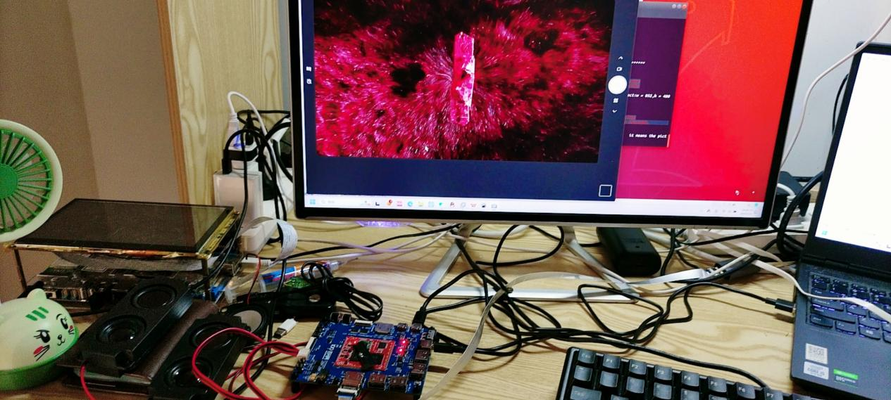

读取红外的遥控的按键值。

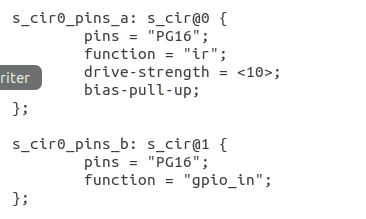

在设备树中启动红外接收引脚。读取红外按键值的示例代码如下：

```c
#include <stdio.h>
#include <stdlib.h>
#include <sys/types.h>
#include <sys/stat.h>
#include <fcntl.h>
#include <unistd.h>
#include <linux/input.h>

int main(int argc, char *argv[])
{
    struct input_event in_ev = {0};
    int fd = -1;

    /* 校验传参 */
    if (2 != argc) {
        fprintf(stderr, "usage: %s <input-dev>\n", argv[0]);
        exit(-1);
    }

    /* 打开文件 */
    if (0 > (fd = open(argv[1], O_RDONLY))) {
        perror("open error");
        exit(-1);
    }

    for ( ; ; ) {
        /* 循环读取数据 */
        if (sizeof(struct input_event) !=
            read(fd, &in_ev, sizeof(struct input_event))) {
            perror("read error");
            exit(-1);
        }
        printf("type:%d code:%d value:%d\n",
                in_ev.type, in_ev.code, in_ev.value);
    }
}
```

这个是一个读取红外按键值的函数。

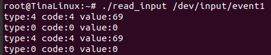

由图中可知，获取的红外的按键值是69。

在 LVGL 中使用红外控制的示例代码如下：

```c
#include "lvgl/lvgl.h"
#include "lvgl/demos/lv_demos.h"
#include "lv_drivers/display/fbdev.h"
#include "lv_drivers/indev/evdev.h"
#include <unistd.h>
#include <pthread.h>
#include <time.h>
#include <stdio.h>
#include <stdlib.h>
#include <sys/types.h>
#include <sys/stat.h>
#include <linux/input.h>
#include <fcntl.h>
#include <unistd.h>
#include <sys/time.h>

#define DISP_BUF_SIZE (600 * 1024)

LV_IMG_DECLARE(lvgl_img1);
LV_IMG_DECLARE(lvgl_img2);
LV_IMG_DECLARE(lvgl_img3);
LV_IMG_DECLARE(lvgl_img4);

int main(int argc, char *argv[])
{
    struct input_event in_ev = {0};
    int fd = -1;

    /* 校验传参 */
    if (2 != argc) {
        fprintf(stderr, "usage: %s <input-dev>\n", argv[0]);
        exit(-1);
    }

    /* 打开文件 */
    if (0 > (fd = open(argv[1], O_RDONLY))) {
        perror("open error");
        exit(-1);
    }

    /*LittlevGL init*/
    lv_init();

    /*Linux frame buffer device init*/
    fbdev_init();

    /*A small buffer for LittlevGL to draw the screen's content*/
    static lv_color_t buf1[DISP_BUF_SIZE];
    static lv_color_t buf2[DISP_BUF_SIZE];

    /*Initialize a descriptor for the buffer*/
    static lv_disp_draw_buf_t disp_buf;
    lv_disp_draw_buf_init(&disp_buf, buf1, buf2, DISP_BUF_SIZE);

    /*Initialize and register a display driver*/
    static lv_disp_drv_t disp_drv;
    lv_disp_drv_init(&disp_drv);

    disp_drv.draw_buf   = &disp_buf;
    disp_drv.flush_cb   = fbdev_flush;
    disp_drv.hor_res    = 250;
    disp_drv.ver_res    = 250;
    lv_disp_drv_register(&disp_drv);

    evdev_init();

    static lv_indev_drv_t indev_drv_1;
    lv_indev_drv_init(&indev_drv_1); /*Basic initialization*/

    indev_drv_1.type = LV_INDEV_TYPE_POINTER;

    /*This function will be called periodically (by the library) to get the mouse position and state*/
    indev_drv_1.read_cb = evdev_read;

    lv_indev_t *mouse_indev = lv_indev_drv_register(&indev_drv_1);

    /*Set a cursor for the mouse*/
    //LV_IMG_DECLARE(mouse_cursor_icon)
    //lv_obj_t * cursor_obj = lv_img_create(lv_scr_act()); /*Create an image object for the cursor */
    //lv_img_set_src(cursor_obj, &mouse_cursor_icon);           /*Set the image source*/
    //lv_indev_set_cursor(mouse_indev, cursor_obj);             /*Connect the image  object to the driver*/

    lv_obj_t *img;

    /*Create a Demo*/
    //lv_demo_widgets();

    img = lv_img_create(lv_scr_act());                 /* 创建图片部件 */
    lv_img_set_src(img, &lvgl_img1);                   /* 设置图片源 */
    lv_obj_align(img, LV_ALIGN_TOP_LEFT, 0, 0);        /* 设置图片位置 */
    lv_obj_update_layout(img);                         /* 更新图片参数 */

    img = lv_img_create(lv_scr_act());
    lv_img_set_src(img, &lvgl_img2);
    lv_obj_align(img, LV_ALIGN_TOP_LEFT, 0, 0);
    lv_obj_update_layout(img);

    img = lv_img_create(lv_scr_act());
    lv_img_set_src(img, &lvgl_img3);
    lv_obj_align(img, LV_ALIGN_TOP_LEFT, 0, 0);
    lv_obj_update_layout(img);

    img = lv_img_create(lv_scr_act());
    lv_img_set_src(img, &lvgl_img4);
    lv_obj_align(img, LV_ALIGN_TOP_LEFT, 0, 0);
    lv_obj_update_layout(img);                          /* 更新图片参数 */

    /*Handle LitlevGL tasks (tickless mode)*/
    while(1) {
        if (sizeof(struct input_event) !=
            read(fd, &in_ev, sizeof(struct input_event))) {
            perror("read error");
            exit(-1);
        }

        if(in_ev.type == 4 && in_ev.code == 4) {
            if(in_ev.value == 0x18) {
                img = lv_img_create(lv_scr_act());
                lv_img_set_src(img, &lvgl_img1);
                lv_obj_align(img, LV_ALIGN_TOP_LEFT, 0, 0);
                lv_obj_update_layout(img);
            }
            if(in_ev.value == 0x52) {
                img = lv_img_create(lv_scr_act());
                lv_img_set_src(img, &lvgl_img2);
                lv_obj_align(img, LV_ALIGN_TOP_LEFT, 0, 0);
                lv_obj_update_layout(img);
            }
            if(in_ev.value == 0x08) {
                img = lv_img_create(lv_scr_act());
                lv_img_set_src(img, &lvgl_img3);
                lv_obj_align(img, LV_ALIGN_TOP_LEFT, 0, 0);
                lv_obj_update_layout(img);
            }
            if(in_ev.value == 0x5a) {
                img = lv_img_create(lv_scr_act());
                lv_img_set_src(img, &lvgl_img4);
                lv_obj_align(img, LV_ALIGN_TOP_LEFT, 0, 0);
                lv_obj_update_layout(img);
            }
        }

        lv_timer_handler();
        usleep(5000);
    }

    return 0;
}

/*Set in lv_conf.h as `LV_TICK_CUSTOM_SYS_TIME_EXPR`*/
uint32_t custom_tick_get(void)
{
    static uint64_t start_ms = 0;

    if(start_ms == 0) {
        struct timeval tv_start;
        gettimeofday(&tv_start, NULL);
        start_ms = (tv_start.tv_sec * 1000000 + tv_start.tv_usec) / 1000;
    }

    struct timeval tv_now;
    gettimeofday(&tv_now, NULL);

    uint64_t now_ms;
    now_ms = (tv_now.tv_sec * 1000000 + tv_now.tv_usec) / 1000;

    uint32_t time_ms = now_ms - start_ms;
    return time_ms;
}
```

然后我们在LVGL函数中就可以用红外控制了。

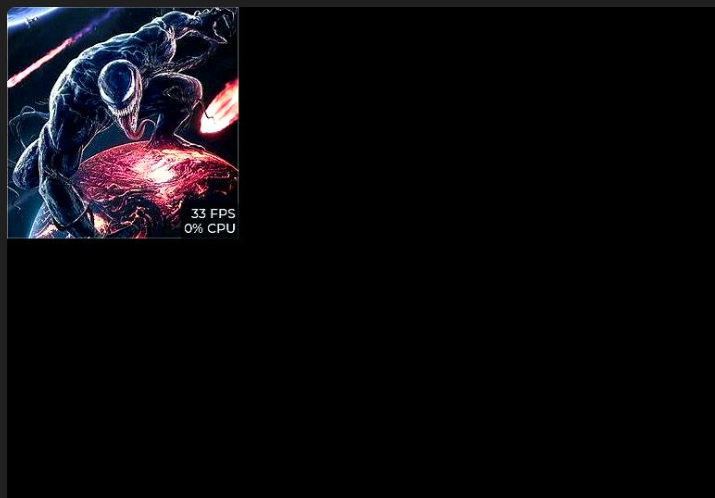


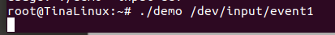
