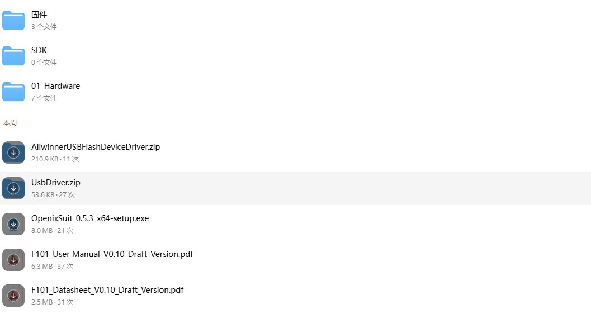

# 资料获取

固件、SDK、原理图和烧录工具都在 **QQ 群文件**。

## 按目标准备

| 你要做的事 | 需要 | 下一步 |
|:---|:---|:---|
| 烧录、体验板卡 | 群文件 **固件**、USB 驱动、OpenixSuit | [安装 USB 驱动](./03-FreeRTOS开发/02-系统烧录/01-UsbDriver.md) → [系统烧录](./03-FreeRTOS开发/02-系统烧录/02-FlashSystem.md) |
| 编译源码、二次开发 | 群文件 **SDK**（电脑看不到时用手机下） | [工程介绍](./03-FreeRTOS开发/00-工程介绍.md) → [环境搭建](./03-FreeRTOS开发/01-环境搭建/01-HostEnv.md) |
| 查阅原理图 | 群文件 **01_Hardware**，原理图 **V1.4** | [板卡介绍](./01-BoardIntroduction.md) |

不必一次下完全部资料。

## QQ 群文件

1. **联系客服**，说明要 F101 / YuzukiNeko 资料，请客服拉进 QQ 群。
2. 打开 **群文件**，对照下图下载。

| 群文件 | 用途 |
|:---|:---|
| **固件** | 已打包镜像，可直接烧录 |
| **SDK** | FreeRTOS 源码 |
| **01_Hardware** | 原理图等硬件资料（以 V1.4 为准） |
| `AllwinnerUSBFlashDeviceDriver.zip` / `UsbDriver.zip` | Windows USB 驱动（FEL 和 ADB，装法见 [安装 USB 驱动](./03-FreeRTOS开发/02-系统烧录/01-UsbDriver.md)）。ADB 驱动也可从 [Google USB Driver](https://developer.android.google.cn/studio/run/win-usb) 下载 |
| `OpenixSuit_*_x64-setup.exe` | 烧录工具，安装和用法见 [系统烧录](./03-FreeRTOS开发/02-系统烧录/02-FlashSystem.md) |
| `F101_User Manual_*.pdf` | 用户手册 |
| `F101_Datasheet_*.pdf` | 芯片规格书 |

:::warning SDK 在电脑上可能看不见

电脑 QQ 里 **SDK** 有时显示 0 个文件。请用 **手机 QQ** 打开同一群文件查看并下载。

:::

## SDK 压缩包

群文件里的 SDK 是一个压缩包，解压后根目录叫 `freertos-f101-v1.1/`。

| 项目 | 值 |
|:---|:---|
| 压缩包大小 | 大约 6 GB，**以群文件显示的大小为准**。下完后对照这个数字，避免传了一半 |
| lunch 工程名 | `f101s3_yuzukineko` |

解压后每个目录是什么、交叉编译器在哪、工程源码和入口在哪，见 [工程介绍](./03-FreeRTOS开发/00-工程介绍.md)；怎么拷到 Linux 盘、怎么解压，见 [环境搭建](./03-FreeRTOS开发/01-环境搭建/01-HostEnv.md)。
