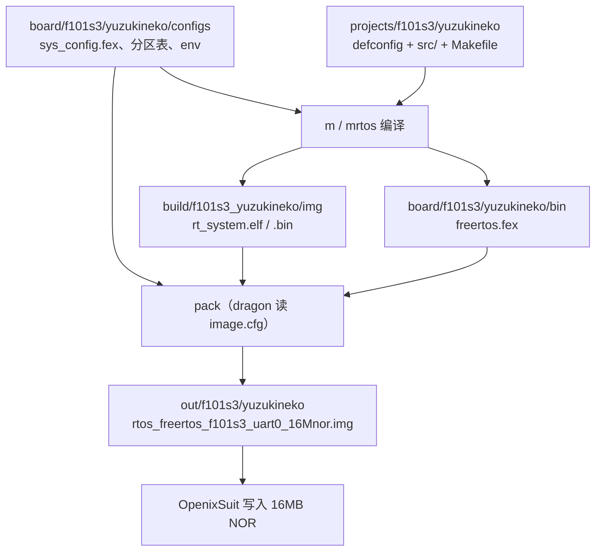

# 工程介绍

FreeRTOS SDK 解压后根目录叫 `freertos-f101-v1.1/`，主要目录如下：

```text
freertos-f101-v1.1/
├── envsetup.sh              → 软链接，指向 tools/scripts/envsetup.sh
├── board/                   # 板级配置：分区表、引脚、boot 文件
├── lichee/                  # 内核、驱动、组件、工程、工具链
├── tools/                   # 打包工具与脚本
└── out/                     # 构建产物（编译前不存在）
```

## 板级配置：`board/f101s3/yuzukineko/`

板子相关的、**不参与 Kconfig 的那些**配置都在这里。想改分区、改引脚、换 boot 文件，来这个目录。

| 路径 | 内容 |
|:---|:---|
| `configs/sys_config.fex` | **引脚复用和外设开关**。串口、SPI0、SDC0、LCD、触摸、Wi-Fi 都在这里 |
| `configs/sys_partition_nor.fex` | **16MB NOR 的分区表**（分区名、大小、下载哪个 fex） |
| `configs/env_nor.cfg` | U-Boot 环境变量默认值（`boot_partition`、`bootcmd` 等） |
| `configs/sys_partition_xip.fex` | XIP 方案用的分区表，当前默认方案不使用 |
| `configs/image_nor.cfg`<br/>`configs/image.cfg` | 打包描述文件，`pack` 时交给 `dragon` 读 |
| `configs/uboot-board.dts` | U-Boot 板级设备树 |
| `configs/BoardConfig.mk` | 指定本板使用的 brandy（boot0/U-Boot）defconfig |
| `configs/quick_build.json`<br/>`configs/quick_config.json` | 快捷编译/打包配置 |
| `bin/` | **现成的 boot 文件**：`boot0_spinor_sun252iw2p1.bin`、`u-boot-sun252iw2p1.bin`、`fes1_sun252iw2p1.bin`，以及编译产物 `freertos.fex` |
| `data/res/` `data/UDISK/` | 打包进 `res` 和 `UDISK` 分区的初始文件（可以放你自己的资源） |

同级的 `board/f101s3/` 下还有 `evb1`、`evb1_hal_v2`、`pro`、`qa`。YuzukiNeko 用 `yuzukineko` 这一套。

:::info 板级配置和内核配置是两套东西

`sys_config.fex` 这类 `.fex` 文件管的是**引脚怎么复用、外设开不开**；而内核里编什么驱动是 Kconfig 管的（见下一节）。同一个外设往往两边都要对：Kconfig 决定驱动编不编进去，`sys_config.fex` 决定它用哪几个脚。

:::

## 工程源码：`lichee/rtos/projects/f101s3/yuzukineko/`

这是 `lunch_rtos f101s3_yuzukineko` 选中的那个工程，**你自己的代码放这里**。

```text
lichee/rtos/projects/f101s3/yuzukineko/
├── Makefile                 # 决定哪些源文件参与编译（需要手动加）
├── defconfig                # 内核/组件的配置结果（mrtos_menuconfig 改的就是它）
├── min_defconfig            # 精简配置
├── normal_defconfig         # 常规配置
├── freertos.lds.S           # 链接脚本模板，编译时生成 freertos.lds
└── src/                     # 工程源码
    ├── main.c               # 应用入口 cpu0_app_entry() 在这里
    ├── hooks.c              # FreeRTOS 钩子：malloc 失败、栈溢出、空闲、tick
    ├── FreeRTOSConfig.h     # 内核裁剪：时钟频率、堆大小、优先级数等
    ├── assert.c             # 断言
    ├── alsa_config.c        # 音频配置（CONFIG_DRIVERS_SOUND_V2 打开时才编）
    └── card_v2_default.c    # 声卡默认参数（同上）
```

**入口不叫 `main()`。** 应用入口是 `src/main.c` 里的 `cpu0_app_entry()`。它会做 BSP 初始化：起 SPI NOR、挂 `/res` 和 `/data`、起控制台、起 CherryUSB（Host 和 ADB）、起声卡、起 SDMMC，最后 `vTaskDelete(NULL)` 把自己删掉。具体起哪些取决于 `defconfig`。

**源文件不会自动被扫描。** `Makefile` 里是一条条列出来的：

```make
obj-y += src/main.o
obj-y += src/assert.o
obj-y += src/hooks.o
```

所以新增 `src/hello.c` 之后，**必须在 Makefile 里补一行 `obj-y += src/hello.o`**，否则它不参与编译，而且不会有任何报错。加头文件搜索路径同理，用 `subdir-ccflags-y += -I <路径>`。

## 内核与组件：`lichee/` 下各目录

| 路径 | 内容 |
|:---|:---|
| `lichee/rtos/` | RTOS 内核、驱动、组件、工程目录，**构建系统的主体** |
| `lichee/rtos/projects/` | 所有工程，按芯片分目录 |
| `lichee/rtos/tools/` | **交叉工具链**（见下节） |
| `lichee/rtos-hal/` | 外设 HAL 层实现（`hal/source/` 下按外设分） |
| `lichee/hal_v2/` | 新版 HAL 层 |
| `lichee/rtos-components/` | 组件层：文件系统、网络、CherryUSB、音频等 |
| `lichee/brandy-2.0/` | **boot0 和 U-Boot 源码**（`pack` 用的 boot 文件由它编出） |
| `lichee/baremetal/` `lichee/melis/` | 其它运行形态的 SDK，本板 FreeRTOS 方案不使用 |

内核/组件配置的入口是 `lichee/rtos/.config`（由工程的 `defconfig` 生成），改它的命令是 `mrtos_menuconfig`。

## 交叉编译器：`lichee/rtos/tools/`

工具链**不在仓库里，是第一次 `lunch_rtos` 时才解压的**。

| 项目 | 位置 |
|:---|:---|
| 工具链目录 | `lichee/rtos/tools/Xuantie-900-gcc-elf-newlib-x86_64-V3.3.0/` |
| 可执行文件 | `.../bin/riscv64-unknown-elf-gcc`（实际二进制 `riscv64-unknown-elf-gcc-14.3.0`） |
| 压缩包 | `lichee/rtos/tools/Xuantie-900-gcc-elf-newlib-x86_64-V3.3.0.tar.gz` |
| 解压标志 | 工具链目录下的 `.time` 文件 |

几点说明：

- 解压由 `tools/scripts/envsetup.sh` 里的 `_uncompress_toolchain()` 完成，靠 `.time` 判断是否已解压。**想强制重新解压，删掉这个 `.time` 再 `lunch_rtos`。**
- `lunch_rtos` 成功之后，`.../bin/` 已经在 `PATH` 里了，直接敲 `riscv64-unknown-elf-gcc --version` 就能验证；同时导出了 `RTOS_BUILD_TOOLCHAIN`，值就是完整前缀 `.../bin/riscv64-unknown-elf-`，要单独编一个不依赖 SDK 的小程序时用得上。
- 工具链的**编译参数**来自 `lichee/rtos/.config`，经 `lichee/rtos/.config.mk` 转成 `CC_MACHFLAGS` 等变量：

| 配置项 | 值 | 含义 |
|:---|:---|:---|
| `CONFIG_TOOLCHAIN` | `tools/Xuantie-900-gcc-elf-newlib-x86_64-V3.3.0/bin/riscv64-unknown-elf-` | 工具链前缀 |
| `CONFIG_TOOLCHAIN_MACH_FLAGS` | `-mcmodel=medany -mcpu=c907fdv-rv32` | 按 32 位 RISC-V / C907 编 |
| `CONFIG_TOOLCHAIN_OPTIMISATION` | `-Os` | 优化级别 |
| `CONFIG_TOOLCHAIN_DEBUG_FLAGS` | `-g` | 调试信息 |
| `CONFIG_TOOLCHAIN_LD_FLAGS` | `-melf32lriscv` | 链接格式 |
| `CONFIG_TOOLCHAIN_WARNING` | `-Wall -Werror` | **警告即错误** |

:::warning 警告会导致编译失败

`CONFIG_TOOLCHAIN_WARNING` 是 `-Wall -Werror`。你自己写的代码里只要有任何一个警告（未使用变量、类型不匹配、有返回值没返回等），**编译会直接失败**，而报错信息看起来并不像"警告"。写新代码时先把它改干净。

:::

## 构建产物：`out/` 和 `lichee/rtos/build/`

| 产物 | 位置 |
|:---|:---|
| 编译中间件与 `rt_system.elf` / `rt_system.bin` | `lichee/rtos/build/f101s3_yuzukineko/img/` |
| 固件 fex（`m` 之后自动拷过去） | `board/f101s3/yuzukineko/bin/freertos.fex` |
| **可烧录镜像**（`pack` 之后） | `out/f101s3/yuzukineko/rtos_freertos_f101s3_uart0_16Mnor.img` |
| 打包中间文件 | `out/f101s3/yuzukineko/image/` |

## 整体流向



## 和 EVB 工程的差异

`yuzukineko` 板级里，TF 卡（SDC0）、排针 UART1、Type-C ADB 已按本板原理图配置。SDK 里 LCD 默认仍是打开的，不接屏时可以关掉以腾出 PD 脚：

| 现象 | 原因 | 去哪改 |
|:---|:---|:---|
| 排针 PD 脚当不了普通 GPIO | `lcd0` 默认打开，占满 PD | [排针 GPIO](./04-外设测试/04-GPIO.md) |
| `pack` 退出码是 1 | 缺少 `post-dragon` 钩子 | [编译与打包](./01-环境搭建/02-Build.md) |

编译命令见 [编译与打包](./01-环境搭建/02-Build.md)；烧录见 [系统烧录](./02-系统烧录/02-FlashSystem.md)。
