# 安装 USB 驱动

F101 通过 Type-C 和电脑通信，**同一根线在不同阶段是两个设备**，需要两套驱动：

| 阶段 | 设备 | 作用 | 没有驱动的后果 |
|:---|:---|:---|:---|
| 板子刚上电 / 在 FEL 模式 | FEL 烧录设备 | 让 OpenixSuit 把镜像写进 NOR | OpenixSuit 找不到设备 |
| 系统启动完成之后 | ADB 设备 | `adb shell` 进去操作 | 烧录正常，但 `adb devices` 是空的 |

设备管理器里显示的名称会随驱动和固件变化。先分清当前是在烧录，还是系统已经起来要进命令行，再装对应的那套驱动。

## 下载驱动

| 用途 | 从哪里拿 |
|:---|:---|
| FEL 烧录驱动 | QQ 群文件 `AllwinnerUSBFlashDeviceDriver.zip` / `UsbDriver.zip`（见 [资料获取](../../02-资料获取.md)） |
| ADB 驱动 | 群文件里的 ADB 驱动包，或 Google USB Driver：[说明页](https://developer.android.google.cn/studio/run/win-usb)、[驱动 ZIP](https://dl.google.com/android/repository/usb_driver_r13-windows.zip) |
| `adb` 命令 | [Android platform-tools](https://developer.android.google.cn/tools/releases/platform-tools)（Windows 包：[platform-tools-latest-windows.zip](https://dl.google.com/android/repository/platform-tools-latest-windows.zip)） |

macOS / Linux 一般不用单独装 USB 驱动，装 platform-tools 即可。

## 安装 FEL 烧录驱动

第一次烧录之前做一次即可。步骤与 [全志在线文档](https://docs.aw-ol.com/docs/soc/v881/software/tina-linux-build-env#windows-usb-%E9%A9%B1%E5%8A%A8%E5%AE%89%E8%A3%85) 相同。

1. 解压群文件里的烧录驱动到任意文件夹。

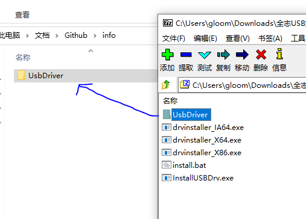

2. 右键 **此电脑** → **管理**，打开设备管理器。

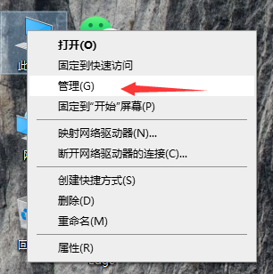

3. 用 Type-C 数据线连接开发板，按住 **FEL** 再重新上电（这块板没有复位键，拔掉 Type-C 再插上即可），进入下载模式。按键位置见 [系统烧录](./02-FlashSystem.md)。

4. 在设备管理器里找到新出现的未知设备（名称因系统和固件而异，下图仅作参考）。

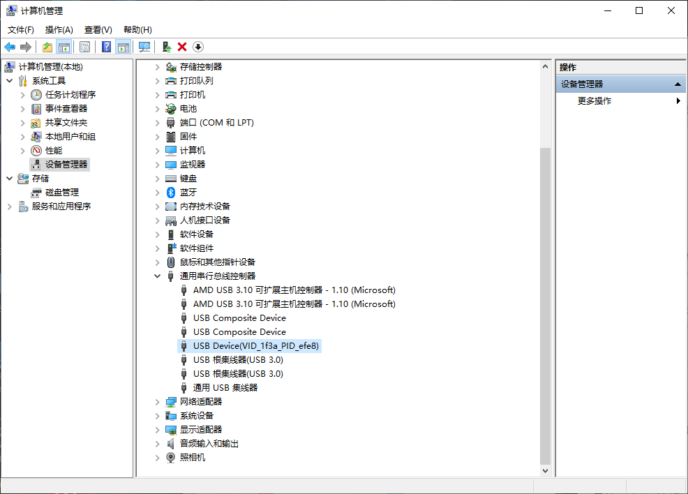

5. 右键该设备 → **更新驱动程序**。

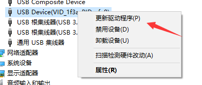

6. 选择 **浏览我的计算机以查找驱动程序**。

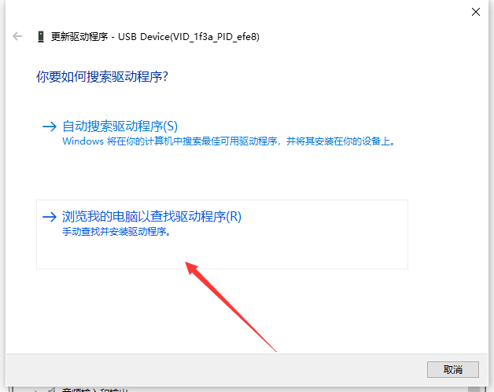

7. 选择 **让我从计算机上的可用驱动程序列表中选取**。

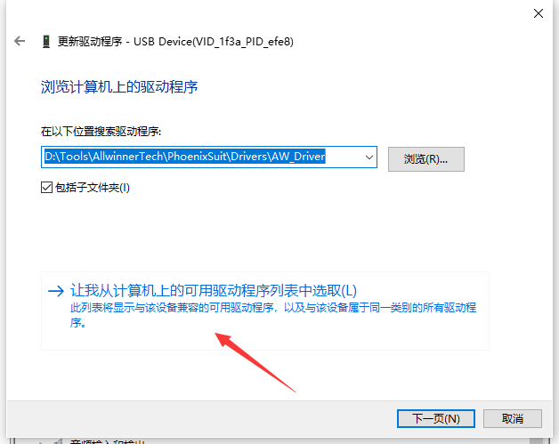

8. 点击 **从磁盘安装**。

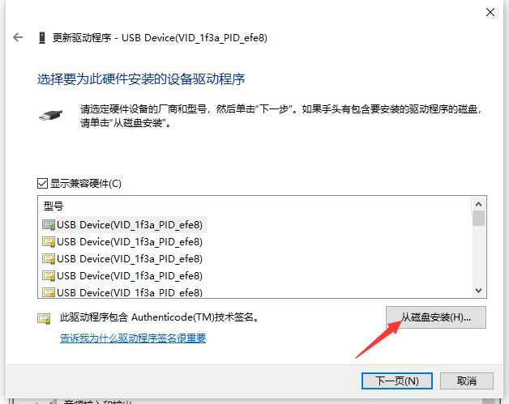

9. 点击 **浏览**，选解压目录里的 `.inf`（常见文件名是 `usbdrv.inf`）。

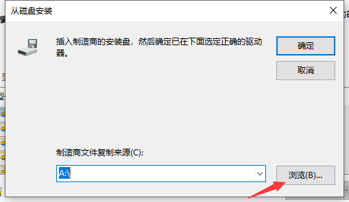

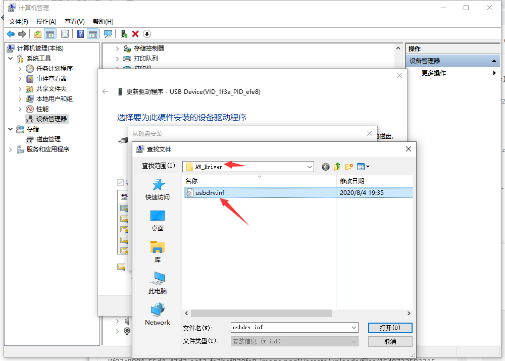

10. 点击 **确定** → **下一步**。

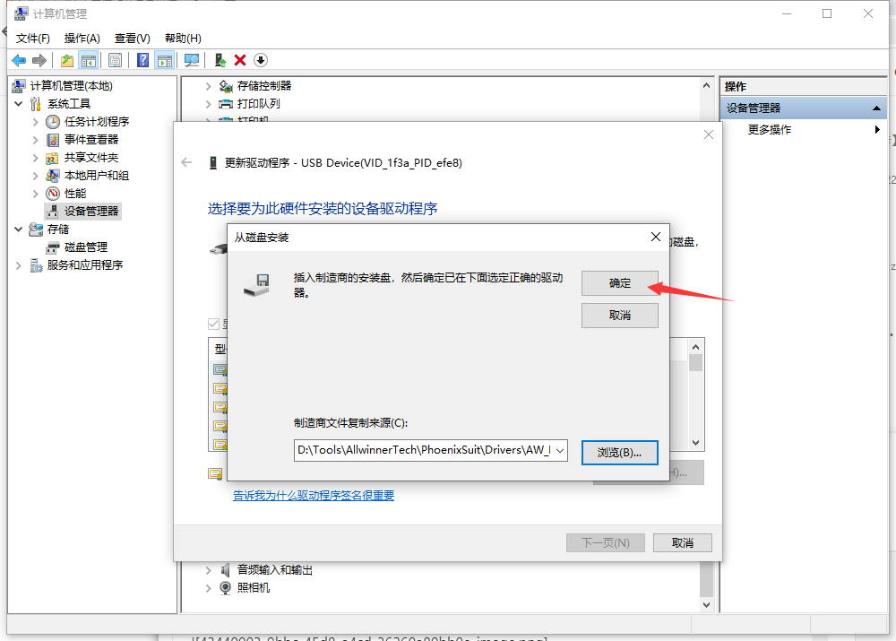

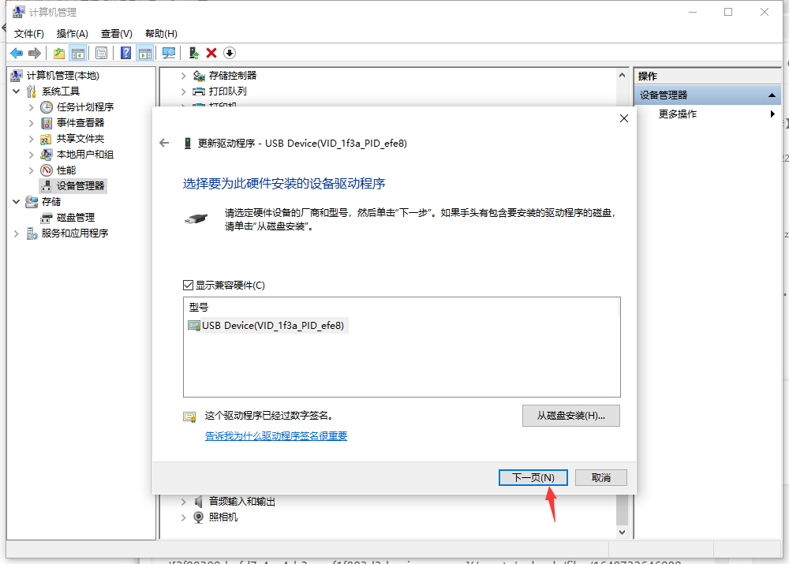

11. 安装完成，关闭窗口。设备管理器里感叹号消失，OpenixSuit 能识别到板子，即装好了。

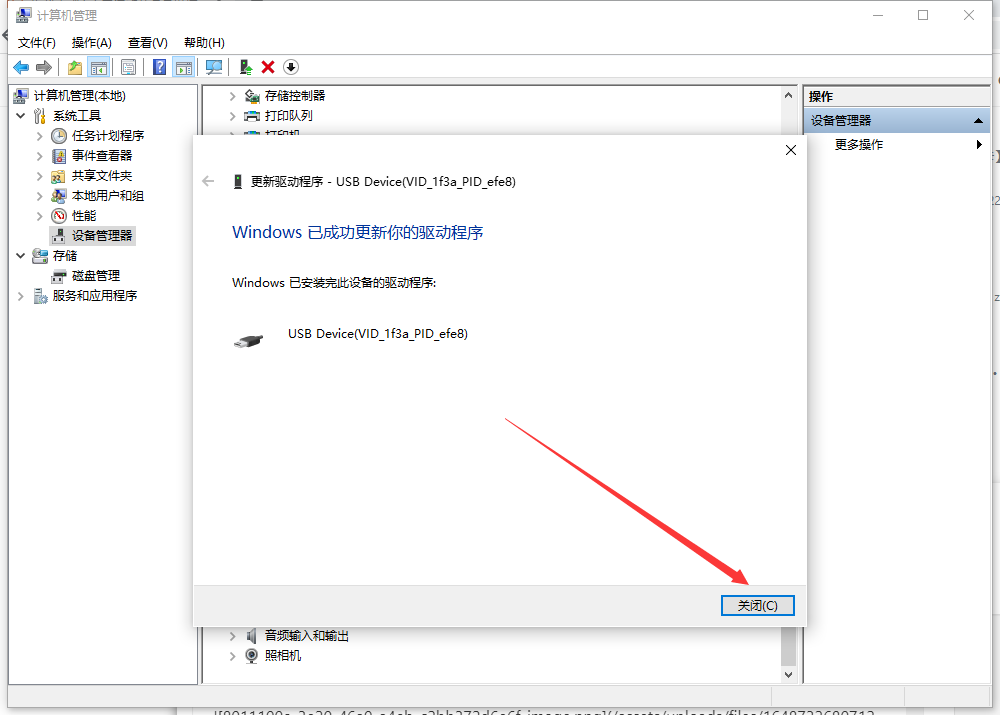

### Win10 / Win11 提示无法验证数字签名

全志这套 FEL 驱动通常没有微软 WHQL 签名。设备属性里如果是 **代码 52**，先临时禁用驱动签名再装：

1. 设置 → 系统 → 恢复 → **高级启动** → 立即重新启动。
2. 蓝色菜单：疑难解答 → 高级选项 → 启动设置 → 重启。
3. 按 **7** 选择「禁用驱动程序强制签名」。
4. 进入系统后再走上面的装驱动步骤。

这是临时设置，下次正常重启会恢复。需要重装时再走一遍。

### 设备管理器里出现两个 USB Device

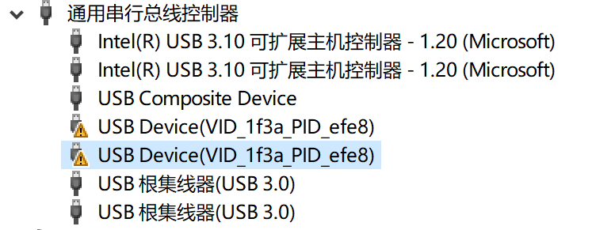

右键卸载多余的那一个，勾选 **删除此设备的驱动程序软件**，再按上面的步骤重装一次。

## 安装 ADB 驱动

系统烧录成功、板子正常启动之后，Type-C 上会再枚举出一个 ADB 设备，和 FEL 烧录设备不是同一个。Windows 上不给它装驱动，`adb devices` 会一直是空的。

1. 板子正常上电，等系统起来（大约几秒）。
2. 设备管理器里找到新出现的未知设备。
3. 同样：**更新驱动程序** → **浏览我的计算机** → **从磁盘安装**，指向 ADB 驱动目录里的 `.inf`。
   - 群文件驱动包里的 inf，或
   - Google USB Driver 解压后的 `android_winusb.inf`（[驱动 ZIP](https://dl.google.com/android/repository/usb_driver_r13-windows.zip)）

装好后：

```bash
adb devices -l
```

```text
List of devices attached
<序列号>                device
```

序列号每块板不一样。状态是 `device` 即连接成功。`adb` 命令本身从 [platform-tools](https://dl.google.com/android/repository/platform-tools-latest-windows.zip) 解压得到。接下来见 [启动开发板](../03-快速上手/01-QuickStart.md)。

## 常见失败对照

| 现象 | 原因 | 处理 |
|:---|:---|:---|
| 设备管理器有未知设备，属性「代码 28」 | 没装驱动 | 按上文装 FEL 或 ADB 驱动 |
| 属性「代码 52」 | 驱动签名校验失败 | 临时禁用驱动签名强制 |
| 插上完全没有任何新设备 | 线只能充电，或板子没进 FEL | 换数据线；重新进 FEL |
| 烧录能找到设备，烧完启动后 `adb devices` 空 | 只装了 FEL 驱动 | 补装 ADB 驱动 |
| `adb devices` 显示 `unauthorized` | 主机侧授权状态异常 | 换 USB 口/换线，断开重连 |
| 驱动装完没反应 | 系统没重新枚举设备 | 拔掉 Type-C 再插一次 |
| 之前能用，突然不行了 | 换过 USB 口或集线器 | 直连主机 USB 口 |

要烧录、卡在 FEL，装烧录驱动；烧完了、要进命令行，装 ADB 驱动。两套不是同一个。
