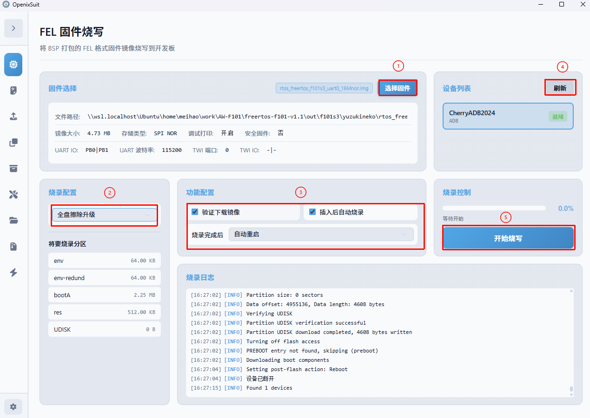
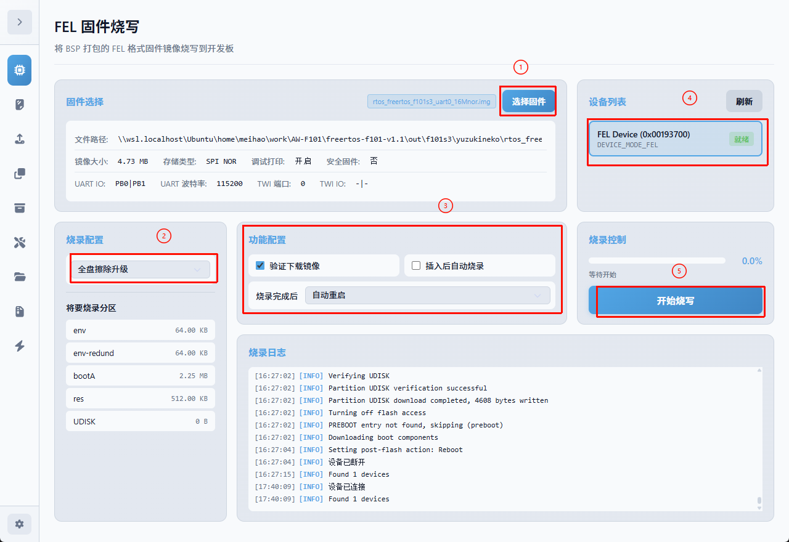

# 更新系统固件

把 `.img` 写入板载 SPI NOR。烧录工具使用 **OpenixSuit**。

| 项目 | 说明 |
|:---|:---|
| 存储 | 16MB SPI NOR |
| 镜像 | 群文件固件，或自己 `pack` 出的 16MB NOR `.img` |
| 工具 | OpenixSuit（QQ 群文件） |
| 接口 | USB Type-C |

:::danger 烧录会覆盖板载系统

完整烧录会覆盖 NOR 上的 boot、FreeRTOS 和用户分区。确认选择的是 YuzukiNeko 的 16MB NOR 镜像。

:::

## 准备工作

**硬件：**

- YuzukiNeko F101 开发板
- 支持数据传输的 USB Type-C 线

**软件：**

- OpenixSuit（QQ 群文件里的 `OpenixSuit_*_x64-setup.exe`）
- 全志 USB 烧录驱动（QQ 群文件），装法见 [安装 USB 驱动](./01-UsbDriver.md)
- 固件：群文件 **固件** 目录里的镜像，或自己 `pack` 出的  
  `out/f101s3/yuzukineko/rtos_freertos_f101s3_uart0_16Mnor.img`

从 WSL 拷到 Windows 示例：

```bash
cp ~/work/AW-F101/freertos-f101-v1.1/out/f101s3/yuzukineko/rtos_freertos_f101s3_uart0_16Mnor.img /mnt/d/100ask/work/AW-F101/
```

Windows 若提示缺少 WebView2，先安装 [Microsoft Edge WebView2](https://developer.microsoft.com/zh-cn/microsoft-edge/webview2/?form=MA13LH#download)。

## 用 OpenixSuit 烧写

打开 OpenixSuit，进入 **FEL 固件烧写**。板子上已经有系统、并且 ADB 能连上时，软件可以直接烧，不必按 FEL 键。新板、系统起不来、或 ADB 连不上时，再手动进 FEL。

### 已有系统、走 ADB

Type-C 插上，板子正常启动。设备列表里出现 ADB 设备且显示就绪后，对照下图：



1. **选择固件**：点「选择固件」，选群文件里的镜像，或自己 `pack` 出的 16MB NOR `.img`。
2. **烧录配置**：选「全盘擦除升级」。
3. **功能配置**：可勾选「验证下载镜像」「插入后自动烧录」，烧录完成后可选「自动重启」。
4. **设备列表**：点「刷新」，确认 ADB 设备就绪。
5. **开始烧写**：点「开始烧写」，等进度走完。

### 手动进入 FEL

这块板没有复位键。进 FEL 的做法是：

1. 用 Type-C 连接开发板和电脑。
2. 按住板上的 **FEL / 烧录键**，拔掉 Type-C 再插上（重新上电），然后松开 FEL。
3. 设备管理器里应出现烧录设备，且没有黄色感叹号。若仍是未知设备，先按 [安装 USB 驱动](./01-UsbDriver.md) 装好驱动。

进 FEL 后，设备列表显示的是 FEL 设备：



选固件、全盘擦除升级、开始烧写，与上一节相同。

进度完成且提示成功后，若没有勾选自动重启，拔掉 Type-C 再重新上电。

**通过判据**：进度条走完并提示成功；重新上电后 `adb devices` 能认到设备（前提是 ADB 驱动也装好了，见 [安装 USB 驱动](./01-UsbDriver.md)）。

## 烧录不成功怎么查

| 现象 | 可能原因 | 处理 |
|:---|:---|:---|
| OpenixSuit 找不到设备 | ADB 没连上，也没进 FEL；或驱动没装 | 能进系统就先确认 ADB；否则按住 FEL 再上电；见 [安装 USB 驱动](./01-UsbDriver.md) |
| 开始下载后中途失败 | 线材或供电不稳 | 换数据线，直连主机 USB 口，不要用 Hub |
| 提示成功但板子起不来 | 镜像不是本板型号 | 确认烧的是 YuzukiNeko 的 16MB NOR 镜像 |
| 提示成功但 `adb devices` 为空 | 只装了 FEL 驱动 | 补装 ADB 驱动 |

对镜像没把握的话，用自己 `pack` 出来的那份（见 [编译与打包](../01-环境搭建/02-Build.md)），路径是 `out/f101s3/yuzukineko/rtos_freertos_f101s3_uart0_16Mnor.img`。

接下来按 [启动开发板](../03-快速上手/01-QuickStart.md) 确认 ADB 和命令行。
