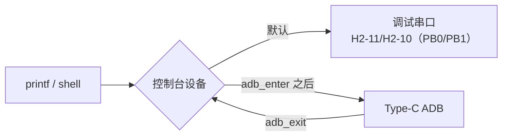

# USB 与 ADB 测试

YuzukiNeko 的 Type-C 在系统起来后会枚举为 ADB 设备。没有接 USB-TTL 时，日常看打印、敲命令用 ADB。

| 功能 | 通过判据 |
|:---|:---|
| 枚举 | `adb devices` 显示 `device` |
| 命令行 | `adb shell ls /` 能列出目录 |
| 传文件 | `adb push` / `adb pull` 成功，内容一致 |
| 看到打印输出 | 执行 `adb_enter` 后，板端 `printf` 出现在 ADB 里 |

## 前提

板子已上电，`adb devices` 能看到设备。第一次连接和确认的步骤在 [启动开发板](../03-快速上手/01-QuickStart.md)；设备认不到，看 [安装 USB 驱动](../02-系统烧录/01-UsbDriver.md)。

本页往后默认你已经能执行 `adb shell`。

## 打印输出默认在哪里

控制台默认走调试串口：排针 H2-11（PB0/TX）、H2-10（PB1/RX），115200。这两脚同时接到 Type-C 的 SBU，插着数据线时用 USB-TTL 可能有干扰。

没有接串口线时，把控制台切到 ADB：

| 命令 | 作用 |
|:---|:---|
| `adb_enter` | 把 shell 和 console 切到 ADB，此后打印走 Type-C |
| `adb_exit` | 切回调试串口 |



在 `adb shell` 里看不到自己写的打印时，先执行 `adb_enter`：

```bash
adb shell
adb_enter
```

之后的 `printf` 就会出现在这个 ADB 会话里。想切回去就执行 `adb_exit`。

验证自己写的 `printf` 时：烧录 → `adb shell` → `adb_enter`，再看输出。

## 传文件

```bash
echo 'F101 ADB test' > /tmp/f101-adb.txt
adb push /tmp/f101-adb.txt /data/
adb shell cat /data/f101-adb.txt
adb pull /data/f101-adb.txt /tmp/f101-adb-back.txt
```

板端打印相同文字，说明 USB 数据通路正常。

**掉电保留的验证方法**：往 `/data` 写一个文件后，把板子断电再上电，重新 `adb shell cat` 同一个文件，内容还在就说明用户分区可读写且掉电保留。

`/data` 对应 NOR 上的 `UDISK` 分区（littlefs 文件系统），`/res` 对应 `res` 分区（elmfat）。两个分区的布局见 [SPI NOR](./02-SPI-NOR.md)。

## USB Host

SDK 默认编进了 CherryUSB Host（`CONFIG_CHERRYUSB_HOST=y`）。一块 Type-C 口不能同时当 Device 和 Host：默认镜像按 **USB Device / ADB** 使用，插 U 盘能不能枚举取决于供电和口的角色。

Host 相关的命令：

| 命令 | 作用 |
|:---|:---|
| `lsusb` | 列出已枚举的 USB 设备 |
| `usbh_init` / `usbh_deinit` | 初始化 / 反初始化 USB Host |
| `usbh_serial` | USB 串口测试 |
| `cherryusb` | CherryUSB 自带的测试入口 |
| `cdc_acm_enter` / `cdc_acm_exit` | 切到 / 退出 CDC ACM 串口设备 |

先执行 `adb shell help` 看当前固件实际注册了哪些（固件裁剪不同，命令会不一样）：

```bash
adb shell help
adb shell help | grep usb
```

## 出问题怎么查

| 现象 | 可能原因 | 处理 |
|:---|:---|:---|
| `adb devices` 为空 | ADB 驱动没装 | 见 [安装 USB 驱动](../02-系统烧录/01-UsbDriver.md) |
| 显示 `unauthorized` | 主机侧连接状态异常 | 换 USB 口/换线，拔插重连，必要时重新上电 |
| 能 `adb shell` 但看不到打印 | 控制台还在调试串口上 | 执行 `adb_enter` |
| `adb push` 失败 | 目标路径不存在或分区满 | 先 `adb shell df` 看 `/data` 剩余空间 |
| 敲的命令提示找不到 | 该命令没编进当前固件 | `adb shell help` 查实际命令列表 |
