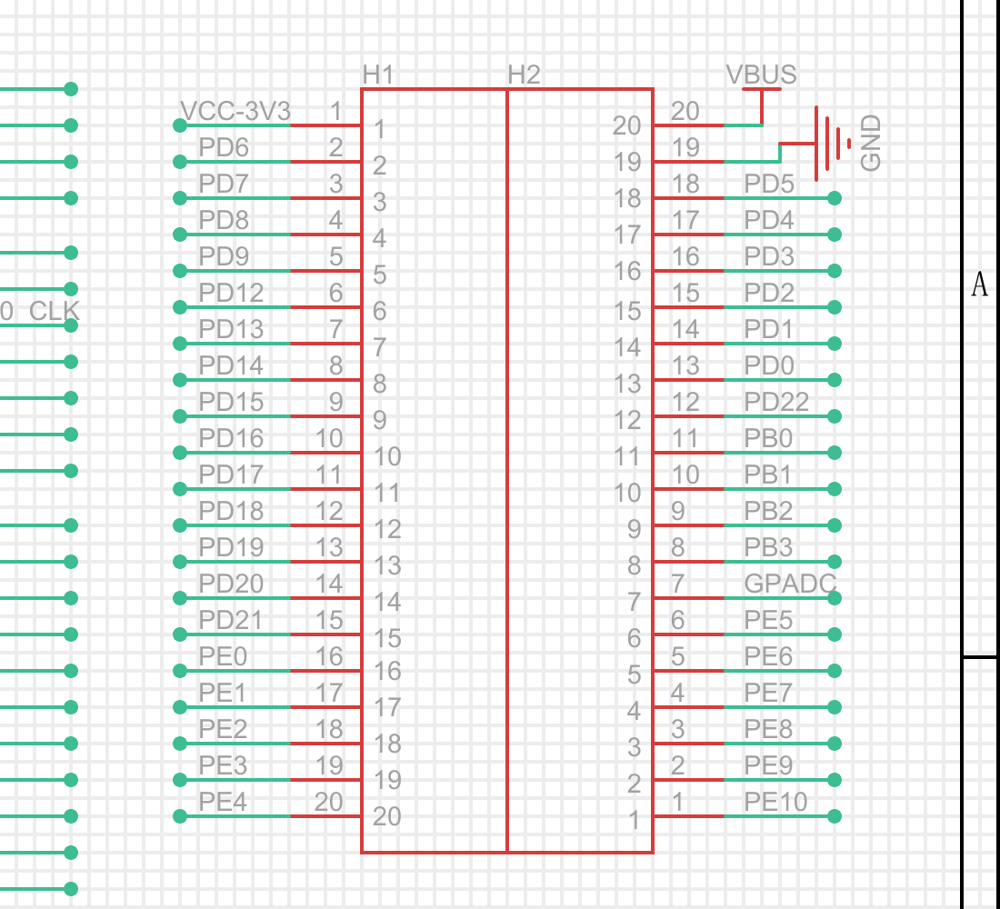

# 排针 GPIO

扩展座是 H1、H2 各 20 pin。写软件时**以 V1.4 网络名为准**。

| 验证项 | 通过判据 |
|:---|:---|
| 引脚识别 | 对照下图能定位目标脚的网络名 |
| 占用情况 | `hal_gpio_info` 能列出该脚被谁占用 |
| 实际使用 | 关掉占用它的外设并重新烧录后，该脚能当 GPIO 用 |

## 排针引脚（V1.4）



| 排针 | 引脚 | 网络名 |
|:---|:---|:---|
| H1 | 1 | VCC-3V3 |
| H1 | 2 ~ 5 | PD6、PD7、PD8、PD9 |
| H1 | 6 ~ 15 | PD12、PD13、PD14、PD15、PD16、PD17、PD18、PD19、PD20、PD21 |
| H1 | 16 ~ 20 | PE0、PE1、PE2、PE3、PE4 |
| H2 | 1 ~ 6 | PE10、PE9、PE8、PE7、PE6、PE5 |
| H2 | 7 | GPADC |
| H2 | 8 ~ 11 | PB3、PB2、PB1、PB0 |
| H2 | 12 ~ 18 | PD22、PD0、PD1、PD2、PD3、PD4、PD5 |
| H2 | 19 / 20 | GND / VBUS |

:::info V1.3 和 V1.4 的差别

F101 的 PD 脚是 **PD0–PD9，然后直接 PD12–PD22**，芯片上没有 PD10、PD11。V1.3 原理图把这之后的名字写偏了两号，V1.4 已纠正，**走线没变**：

| 排针 | V1.4 名称（用这个） | V1.3 旧名（不要用） |
|:---|:---|:---|
| H1-6 | PD12 | PD10 |
| H1-7 | PD13 | PD11 |
| H1-8 | PD14 | PD12 |
| H1-9 | PD15 | PD13 |
| H1-10 | PD16 | PD14 |
| H1-11 | PD17 | PD15 |
| H1-12 | PD18 | PD16 |
| H1-13 | PD19 | PD17 |
| H1-14 | PD20 | PD18 |
| H1-15 | PD21 | PD19 |
| H2-12 | PD22 | PD20 |

:::

## 先搞清楚引脚被谁占了

排针脚会不会空闲，取决于当前镜像里的 `sys_config.fex`。SDK 默认打开了 LCD，会占掉大部分 PD 脚：

`sys_config.fex` 的 `[lcd0]` 段里 `lcd_used = 1`，并且下面这些 `lcd_gpio_*` 全部有效：

| 配置项 | 占用引脚 |
|:---|:---|
| `lcd_gpio_0` ~ `lcd_gpio_9` | PD0 ~ PD9 |
| `lcd_gpio_10`、`lcd_gpio_11` | PE6、PE7 |
| `lcd_gpio_12` ~ `lcd_gpio_22` | PD12 ~ PD22 |

也就是说，默认配置下排针上的 PD 脚（H1-2~5、H1-6~15、H2-12~18）被 LCD 占着。触摸默认还会占 PD6/PD7。PB0/PB1（H2-11/H2-10）默认是调试 UART1。实际占用以这块板当前镜像为准，用下面的命令查：

固件里有命令可以查实际占用情况：

```bash
adb shell help | grep -i gpio
adb shell hal_gpio_info
```

## 腾出可用的 GPIO

知道是谁占的，就在 `sys_config.fex` 里关掉对应外设，再重新编译烧录。不接屏时可以关 LCD：

1. 打开 `board/f101s3/yuzukineko/configs/sys_config.fex`。
2. 在 `[lcd0]` 段里把 `lcd_used` 改成 `0`；不接触摸屏的话，顺手在 `[ctp_para]` 段里把 `ctp_used` 也改成 `0`。
3. 重新编译并打包：

```bash
m
pack
```

4. 烧录后重新执行 `hal_gpio_info`，确认目标脚不再被 LCD 占用。

其它外设占用的引脚同理：在 `sys_config.fex` 里找到声明该脚的那一行，把对应外设关掉。各配置项在哪个文件，见 [工程介绍](../00-工程介绍.md)。

:::warning 改了配置必须重新打包烧录

`sys_config.fex` 是**打进镜像**的，改完不 `pack`、不烧录是不会生效的。顺序是 `m` → `pack` → 用 OpenixSuit 烧录。

:::

## GPIO HAL 测试

固件里带了一个 GPIO HAL 接口的测试命令：

```bash
adb shell help | grep -i aw95xx
adb shell aw95xx_test
```

用于验证 GPIO HAL 层的读写是否正常，具体子命令不带参数执行一次就能看到用法。

:::tip 命令随固件裁剪

上面这些命令是否注册取决于当前 `defconfig`。**先用 `adb shell help` 确认**，再执行。

:::

## 出问题怎么查

| 现象 | 可能原因 | 处理 |
|:---|:---|:---|
| 引脚配成 GPIO 但读回值不变 | 该脚仍被别的外设复用 | `hal_gpio_info` 查占用者，关掉对应外设后重编 |
| 改了 `sys_config.fex` 没生效 | 没有重新打包烧录 | 必须 `m` → `pack` → 烧录 |
| 命令提示找不到 | 该功能没编进固件 | `adb shell help` 查实际命令列表 |
| 按 V1.4 接线但功能不对 | 用了 V1.3 的网络名 | 对照上面的 V1.3/V1.4 表，统一用 V1.4 |
