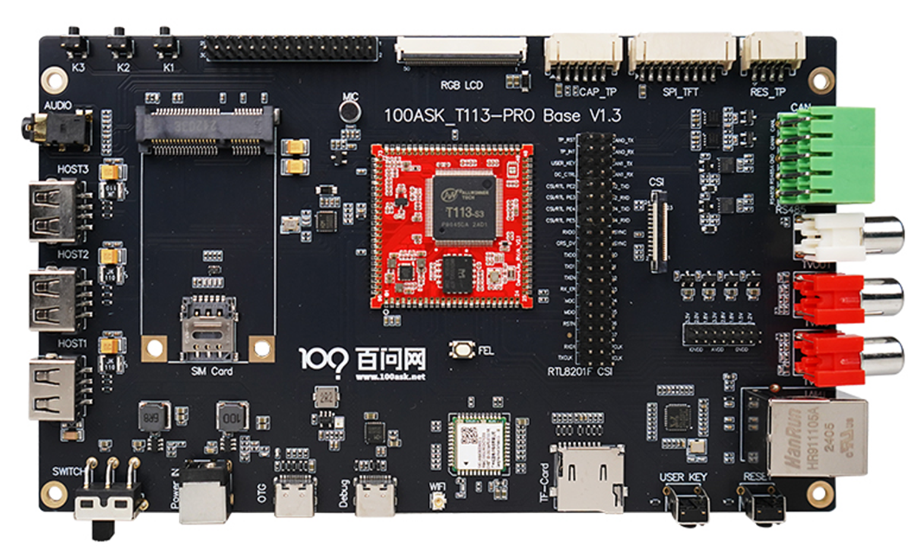

# T113s3-PRO 开发板介绍

> 百问网 T113s3-PRO 开发板，搭载全志 **T113s3** 主控（双核 Cortex-A7），**128MB DDR3** 内存，**SPI NAND Flash** 存储，支持 **Tina4 / Tina5 V1.0 SDK**。

> 💬 遇到问题？欢迎在 [百问网论坛](https://forums.100ask.net/c/aw/t113s3/19) 交流讨论！

---

## 🖼️ 开发板外观

---

## 💡 T113s3 芯片介绍

### 芯片特性

T113-S3 是一款专为汽车和工业控制市场设计的先进应用处理器，集成了双核 Cortex-A7 CPU 和单核 HiFi4 DSP，提供高效的计算能力。

| 项目 | 规格 |
|:---|:---|
| **CPU** | 双核 ARM Cortex-A7（1.2GHz） |
| **内存** | 128MB DDR3（片内集成） |
| **DSP** | HiFi4 DSP |
| **视频解码** | H.265 / H.264 / MPEG-1/2/4 / JPEG / VC1，最高 1080p@60fps |
| **视频编码** | JPEG / MJPEG，最高 1080p@60fps |
| **显示输出** | RGB LCD / Dual-link LVDS / 4-lane MIPI DSI / CVBS |
| **视频输入** | 8-bit 并行 CSI / CVBS IN |
| **音频** | 2 DAC + 3 ADC，I2S/PCM/DMIC/OWA |
| **连接性** | USB2.0 DRD + USB2.0 Host / SDIO 3.0 / SPI / UARTx6 / TWIx4 / PWM / GPADC / IR |
| **网络** | 10/100/1000M EMAC（RMII / RGMII） |
| **封装** | eLQFP128, 14mm x 14mm |

### 典型应用

T113s3 适用于：智慧城市、智能商显、智能家电、工业控制、教育科研等领域。

---

## 📦 板载资源

| 编号 | 资源名称 | 说明 |
|:---:|:---|:---|
| ① | OTG 烧录接口 | Type-C，用于系统烧录和 ADB 调试 |
| ② | 串口/供电接口 | Type-C，用于串口调试和 12V 电源输入 |
| ③ | 12V 电源接口 | DC 接口，接入 12V 电源适配器 |
| ④ | 电源开关 | 拨动开关，朝右拨动为开机 |
| ⑤ | FEL 按键 | 用于进入 FEL 烧录模式 |
| ⑥ | RESET 按键 | 复位按键 |
| ⑦ | TF 卡槽 | 用于 TF 卡烧录和扩展存储 |
| ⑧ | WiFi 模组 | 可选 WiFi4（XR829）/ WiFi6（AIC8800D80） |
| ⑨ | 以太网接口 | 百兆 RJ45（与 DVP 摄像头复用） |
| ⑩ | RS485/CAN 接口 | 双层接线端子 2x5 规格 |
| ⑪ | RGB LCD 接口 | PH2.0 接口，支持 SPI 显示屏+触摸 |
| ⑫ | DVP 摄像头接口 | 支持 OV5640 模组（与以太网复用） |
| ⑬ | CVBS IN 接口 | 支持 CVBS 流输入 |

---

## 🔌 配套模块

| 模块类型 | 说明 | 备注 |
|:---|:---|:---|
| **RGB 显示屏** | 7 寸 / 4 寸方屏 / 3.2 寸圆屏 | 直接接入 RGB 接口 |
| **MIPI 显示屏** | 4 寸 MIPI / 3.2 寸 MIPI | 需搭配 RGB 转 MIPI 转接板 |
| **SPI 显示屏** | SPI 接口显示屏 + 触摸 | 通过 PH2.0 接口连接 |
| **以太网模块** | 百兆 RJ45 网口 | 与 DVP 摄像头**二选一** |
| **DVP 摄像头** | OV5640 模组 | 与以太网**二选一** |
| **CVBS 摄像头** | CVBS 流输入摄像头 | 独立接口 |
| **4G 模组** | USB 4G 模块 | 插入 USB 即可使用 |
| **RS485 模块** | RS485 × 2 路 | 双层接线端子，与显示接口复用 |
| **CAN 模块** | CAN × 2 路 | 双层接线端子，与显示接口复用 |
| **TF 卡** | 系统烧录用 TF 卡 | 用于 TF 卡烧录 |
| **MIPI 转 HDMI** | MIPI 转 HDMI OUT 显示模块 | 用于 HDMI 显示输出 |

> ⚠️ **复用说明**：RS485/CAN 接口与触摸屏 IO、百兆 RJ45 网口、DVP 摄像头接口复用，同一时间只能使用其中一种功能。

---

## 📐 硬件规格

| 对比项 | 规格 |
|:---|:---|
| **主控芯片** | T113s3（双核 Cortex-A7） |
| **内存** | 128MB DDR3 |
| **存储** | SPI NAND Flash |
| **WiFi** | 可选 WiFi4（XR829）/ WiFi6（AIC8800D80） |
| **底板接口** | CVBS / CAN / RS485 / USB / 以太网 / RGB LCD / MIPI / HDMI 等 |
| **SDK 版本** | Tina4 / Tina5 V1.0 |

---

## 🚀 快速入门

### 方式一：OTG + ADB 登录

1. 将 Type-C 线一端连接开发板 **OTG 烧录接口**，另一端连接电脑 USB 接口
2. 开发板接通 OTG 电源线后自动上电启动
3. 打开 CMD 输入 `adb shell` 即可登录系统

### 方式二：串口登录

1. 将 Type-C 线一端连接开发板 **串口/供电接口**，另一端连接电脑 USB 接口
2. 板载红色电源灯亮起表示已通电
3. 使用 Putty 或 MobaXterm 串口工具连接（波特率 115200，流控 None）
4. 按下 Enter 键即可进入系统 Shell

> **提示**：系统默认自动登录，无需用户名和密码。

---

## 🛒 购买链接

* 韦东山天猫店购买地址：[https://detail.tmall.com/item.htm?id=731949856079](https://detail.tmall.com/item.htm?id=731949856079)
