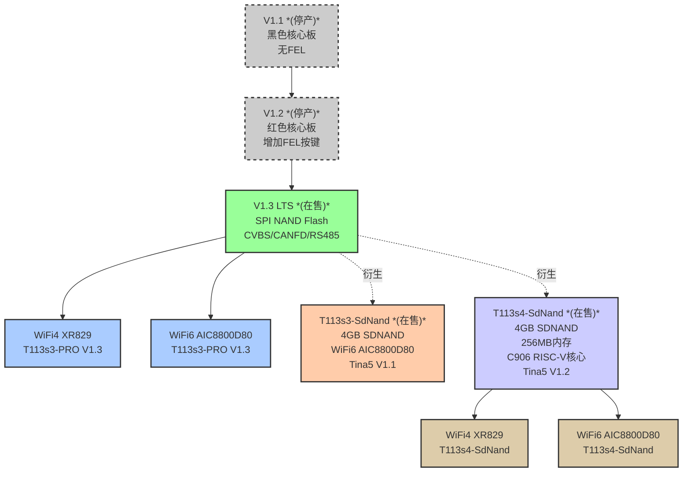
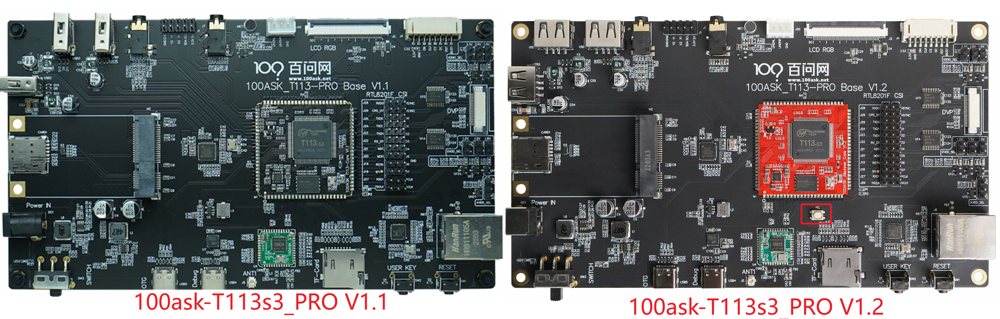
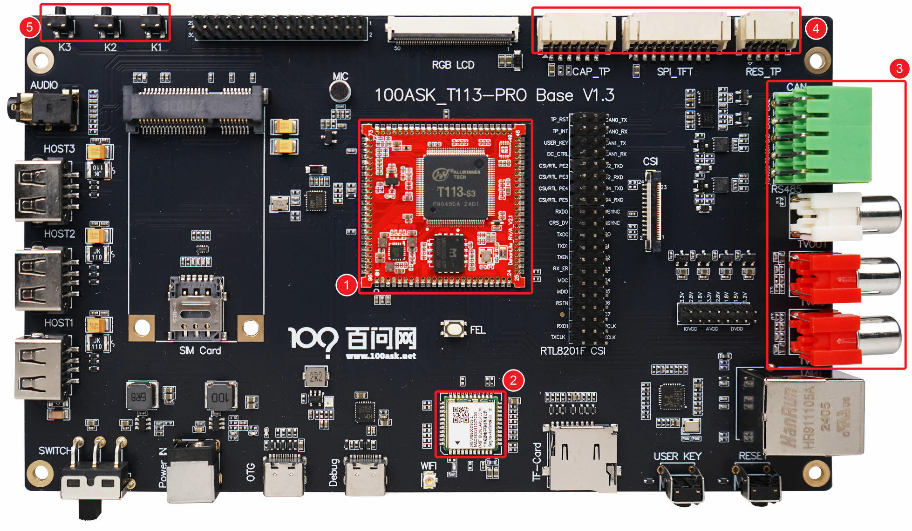
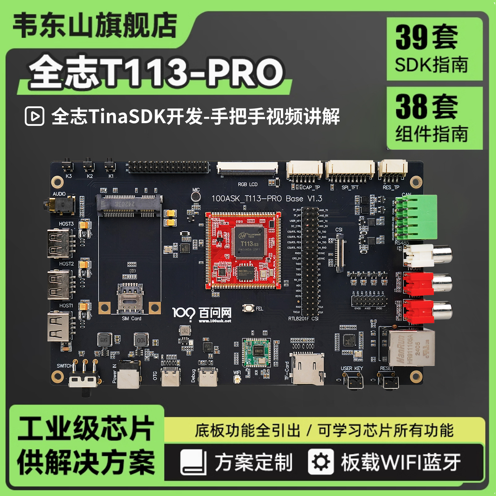
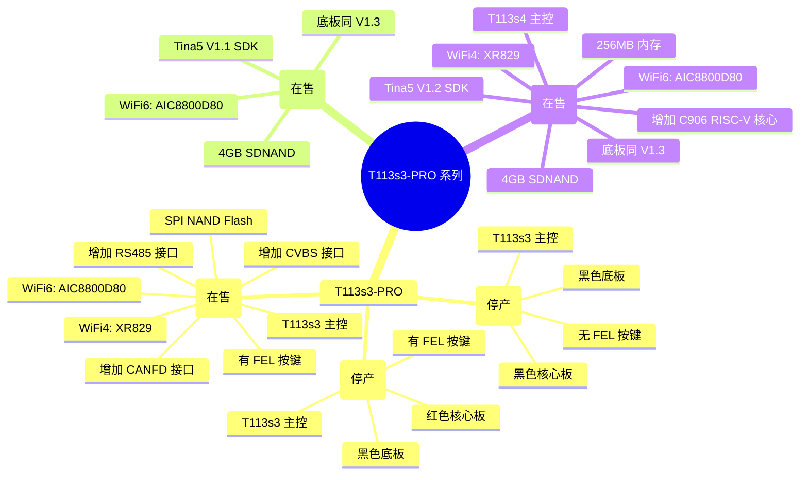

# T113s3-PRO 系列版本差异对比

> 本文档帮助你快速区分 T113s3-PRO 系列各版本的硬件差异，选择最适合你的开发板。

> ⚠️ **重要提示**：T113s3-PRO V1.1 / V1.2 已停产，目前在售版本为 **T113s3-PRO V1.3 LTS**（SPI NAND Flash）及后续衍生版本（SdNand 系列）。

---

## 一、在售产品一览

| 产品线 | 版本 | 存储类型 | 主控 | 销售状态 |
|:---|:---:|:---:|:---:|:---:|
| **T113s3-PRO V1.3 LTS** | 在售 | SPI NAND Flash | T113s3 | ✅ 在售（主力推荐） |
| **T113s3-SdNand** | 在售 | 4GB SDNAND | T113s3 | ✅ 在售 |
| **T113s4-SdNand** | 在售 | 4GB SDNAND | T113s4 | ✅ 在售 |

> ❌ **已停产**：T113s3-PRO V1.1、V1.2（仅供历史版本参考）

---

## 二、硬件规格对比

| 对比项 | T113s3-PRO V1.1 *(停产)* | T113s3-PRO V1.2 *(停产)* | T113s3-PRO V1.3 LTS | T113s3-SdNand | T113s4-SdNand |
|:---|:---:|:---:|:---:|:---:|:---:|
| **核心板颜色** | ⬛ 黑色 | 🔴 红色 | 🔴 红色 | 🔴 红色| 🔴 蓝色 |
| **底板颜色** | ⬛ 黑色 | ⬛ 黑色 | ⬛ 黑色 | ⬛ 黑色 | ⬛ 黑色 |
| **FEL 按键** | ❌ 无 | ✅ 有 | ✅ 有 | ✅ 有 | ✅ 有 |
| **主控芯片** | T113s3 | T113s3 | T113s3 | T113s3 | **T113s4** |
| **内存** | 128MB | 128MB | 128MB | 128MB | **256MB** |
| **C906 RISC-V 核心** | ❌ | ❌ | ❌ | ❌ | ✅ |
| **存储类型** | SPI NAND Flash | SPI NAND Flash | SPI NAND Flash | **4GB SDNAND** | **4GB SDNAND** |
| **WiFi 模组** | WiFi4 XR829 | WiFi4 XR829 | 可选 WiFi4/WiFi6 | WiFi6 AIC8800D80 | 可选 WiFi4/WiFi6 |
| **CVBS 接口** | ❌ | ❌ | ✅ | ✅ | ✅ |
| **CAN 接口** | ❌ | ❌ | ✅ | ✅ | ✅ |
| **RS485 接口** | ❌ | ❌ | ✅ | ✅ | ✅ |
| **SDK 版本** | Tina4 / Tina5 V1.0 *(停更)* | Tina4 / Tina5 V1.0 *(停更)* | Tina4 / Tina5 V1.0 | **Tina5 V1.1** | **Tina5 V1.2** |
| **SDK 资料** | 丰富资料 | 视频教程 + 丰富资料 | 视频教程 + 丰富资料 | 综合项目案例教程 | 付费视频 + 有教程 |
| **定位** | 初始版本 *(停产)* | 优化版本 *(停产)* | 最终稳定版 | SDNAND 版本 | 高性能异构版本 |

---

## 三、版本演进路线图

### T113s3-PRO 核心板迭代

---

## 🖼️ 实物外观

### T113s3 PRO v1.1 vs v1.2 *(已停产，仅供参考)*

### T113s3 PRO v1.3 *(在售主力)*

---

## 四、T113s3-SdNand

### 硬件规格

| 对比项 | 规格 |
|:---|:---|
| **存储类型** | 4GB SDNAND |
| **WiFi 模块** | AIC8800D80 (WiFi 6) |
| **底板规格** | 与 T113s3-PRO V1.3 一致 |
| **软件 SDK** | Tina5 V1.1 |
| **配套资料** | 综合项目案例教程 |

### 📸 实物图

*T113s3-SdNand：4GB SDNAND 存储，仅 WiFi6 版本*

---

## 五、T113s4-SdNand

### 硬件规格

| 对比项 | 规格 |
|:---|:---|
| **存储类型** | 4GB SDNAND |
| **主控芯片** | **T113s4**（区别于 T113s3） |
| **内存** | **256MB** |
| **异构核心** | **C906 RISC-V 核心** |
| **底板规格** | 与 T113s3-PRO V1.3 一致 |
| **软件 SDK** | Tina5 V1.2 |
| **配套资料** | 付费视频 + 教程 |

### WiFi 版本

| WiFi 版本 | 模组型号 |
|:---:|:---|
| **WiFi 4** | XR829 |
| **WiFi 6** | AIC8800D80 |

### 📸 实物图

*T113s4-SdNand：256MB 内存 + C906 RISC-V 异构核心*

---

## 六、WiFi 模块对比

| 对比项 | XR829 | AIC8800D80 |
|:---|:---:|:---:|
| **WiFi 标准** | WiFi 4 (802.11n) | WiFi 6 (802.11ax) |
| **最高速率** | 72.2 Mbps | 286 Mbps |
| **频段** | 2.4GHz | 2.4GHz / 5GHz |
| **可用产品** | T113s3-PRO V1.3、T113s4-SdNand | T113s3-PRO V1.3、T113s3-SdNand、T113s4-SdNand |

### 📸 模组图

*左：XR829 WiFi 4 模组 | 右：AIC8800D80 WiFi 6 模组*

---

## 七、存储类型对比

| 存储类型 | 容量 | 读写速度 | 可靠性 | 适用产品 |
|:---|:---:|:---:|:---:|:---|
| **SPI NAND Flash** | - | ⭐⭐⭐ | ⭐⭐ | T113s3-PRO V1.3 |
| **SDNAND** | 4GB | ⭐⭐⭐⭐ | ⭐⭐⭐⭐ | T113s3-SdNand、T113s4-SdNand |

---

## 八、软件 SDK 配套对比

### 8.1 SDK 版本概览

> ⚠️ **软件兼容性说明**：T113s3-PRO 的 Tina4 / Tina5 V1.0 SDK **仅兼容 SPI NAND Flash 存储的 T113s3-PRO V1.3 版本**，不兼容后续的 T113s3-SdNand 和 T113s4-SdNand 版本（SdNand 系列使用独立的 Tina5 SDK）。

| 产品线 | SDK 版本 | 构建系统 | 资料完整度 | 适用场景 |
|:---|:---:|:---:|:---:|:---|
| **T113s3-PRO V1.3** *(SPI NAND)* | Tina4 | 传统构建 | 📚 视频教程 + 丰富资料 | 入门学习、系统开发 |
| **T113s3-PRO V1.3** *(SPI NAND)* | Tina5 V1.0 | Buildroot | � 视频教程 + 丰富资料 | 使用新构建系统 |
| **T113s3-SdNand** *(4GB SDNAND)* | Tina5 V1.1 | Buildroot | 📖 综合项目案例教程 | 工业应用 |
| **T113s4-SdNand** *(4GB SDNAND)* | Tina5 V1.2 | Buildroot | 📖 付费视频 + 教程 | 异构开发、多媒体 |

### 8.2 功能模块支持对比

| 功能模块 | T113s3-PRO V1.3 (Tina4) | T113s3-PRO V1.3 (Tina5) | T113s3-SdNand | T113s4-SdNand |
|:---|:---:|:---:|:---:|:---:|
| **WiFi 联网** | ✅ XR829 | ✅ XR829/AIC8800 | ✅ AIC8800 | ✅ XR829/AIC8800 |
| **以太网通信** | ✅ | ✅ | ✅ | ✅ |
| **CAN 通信** | ✅ | ✅ | ✅ | ✅ |
| **RS485 通信** | ✅ | ✅ | ✅ | ✅ |
| **CVBS 摄像头采集** | ✅ | ✅ | ✅ | ✅ |
| **蓝牙配对** | ✅ | ✅ | - | - |
| **GPADC 按键** | ✅ | ✅ | ✅ | ✅ |
| **TFT/HDMI 显示** | ✅ RGB | ✅ RGB | ✅ RGB | ✅ RGB |
| **MIPI 转 HDMI** | ✅ | ✅ | - | - |
| **Qt 应用环境** | ✅ | ✅ | ✅ | ✅ |
| **LVGL v9** | ✅ | ✅ | ✅ | ✅ |
| **LVGL 多媒体播放器** | - | - | - | ✅ |
| **V4L2 摄像头** | - | - | ✅ | ✅ |
| **AIC8800 AP 模式** | - | - | ✅ | ✅ |
| **C906 RISC-V 开发** | ❌ | ❌ | ❌ | ✅ |
| **U-Boot 定制** | ✅ | ✅ | ✅ | ✅ |
| **Linux 内核定制** | ✅ | ✅ | ✅ | ✅ |

### 8.3 应用示例教程对比

| 教程主题 | T113s3-PRO V1.3 | T113s3-SdNand | T113s4-SdNand |
|:---|:---:|:---:|:---:|
| 快速入门 / 烧录系统 | ✅ | ✅ | ✅ |
| 开发环境搭建 | ✅ | ✅ | ✅ |
| WiFi 网络配置 | ✅ | ✅ | ✅ |
| 以太网通信 | - | ✅ | ✅ |
| RS485 通信 | - | ✅ | ✅ |
| CAN 通信 | - | ✅ | ✅ |
| GPADC 按键 | - | ✅ | ✅ |
| CVBS 摄像头采集 | - | ✅ | ✅ |
| V4L2 摄像头实现 | - | ✅ | ✅ |
| Qt 应用开发 | ✅ | ✅ | ✅ |
| LVGL UI 开发 | ✅ | ✅ | ✅ |
| LVGL 多媒体播放器 | - | - | ✅ |
| MIPI 屏幕适配 | ✅ | - | - |
| U-Boot 定制 | ✅ | ✅ | ✅ |
| Linux 内核开发 | ✅ | ✅ | ✅ |
| Buildroot 系统构建 | ❌ | ✅ | ✅ |
| C906 异构开发 | ❌ | ❌ | ✅ |

### 8.4 SDK 下载资源

| 产品线 | SDK 版本 | 存储兼容性 | 扩展补丁仓库 |
|:---|:---|:---:|:---|
| T113s3-PRO V1.3 | Tina4 | SPI NAND 专用 | [GitHub](https://github.com/DongshanPI/100ASK_T113-Pro_TinaSDK) |
| T113s3-PRO V1.3 | Tina5 V1.0 | SPI NAND 专用 | [GitHub](https://github.com/DongshanPI/100ASK_T113-PRO_TinaSDK5) |
| T113s3-SdNand | Tina5 V1.1 | SDNAND 专用 | [GitHub](https://github.com/DongshanPI/T113S3-PRO_TinaSDK5) |
| T113s4-SdNand | Tina5 V1.2 | SDNAND 专用 | [GitHub](https://github.com/DongshanPI/T113S3-PRO_TinaSDK5) |

> **Tina4 vs Tina5 区别**：简单来说，使用 Tina5 就可以用上 Buildroot 构建系统。
>
> **SDK 不互通说明**：T113s3-PRO V1.3（SPI NAND）的 SDK 与 T113s3-SdNand / T113s4-SdNand 的 SDK **互不兼容**，请根据硬件选择对应 SDK。

---

## 九、完整对比速查表

| 对比项 | T113s3-PRO V1.1 *(停产)* | T113s3-PRO V1.2 *(停产)* | T113s3-PRO V1.3 LTS | T113s3-SdNand | T113s4-SdNand |
|:---|:---:|:---:|:---:|:---:|:---:|
| **销售状态** | ❌ 已停产 | ❌ 已停产 | ✅ 在售 | ✅ 在售 | ✅ 在售 |
| **主控** | T113s3 | T113s3 | T113s3 | T113s3 | T113s4 |
| **核心板颜色** | 黑色 | 红色 | 红色 | - | - |
| **FEL 按键** | ❌ | ✅ | ✅ | ✅ | ✅ |
| **存储** | SPI NAND | SPI NAND | SPI NAND | 4GB SDNAND | 4GB SDNAND |
| **内存** | 128MB | 128MB | 128MB | 128MB | **256MB** |
| **C906 RISC-V** | ❌ | ❌ | ❌ | ❌ | ✅ |
| **WiFi** | WiFi4 | WiFi4 | 可选 | WiFi 6 | 可选 |
| **CVBS/CAN/RS485** | ❌ | ❌ | ✅ | ✅ | ✅ |
| **SDK** | Tina4/Tina5 V1.0 *(停更)* | Tina4/Tina5 V1.0 *(停更)* | Tina4/Tina5 V1.0 | Tina5 V1.1 | Tina5 V1.2 |
| **SDK 兼容性** | SPI NAND | SPI NAND | SPI NAND | SDNAND | SDNAND |
| **资料完整度** | 📚 丰富 | 📚 丰富 | 📚 丰富 | 📖 教程 | 📖 教程 |

---

## 十、版本选择建议

| 你的需求 | 推荐版本 | 理由 |
|:---|:---|:---|
| 🎯 **入门学习 / 教程最全** | T113s3-PRO V1.3 LTS | 在售主力，资料最完善，视频教程齐全 |
| 🛠️ **追求最新稳定，需要丰富接口** | T113s3-PRO V1.3 LTS | 最终版本，接口最丰富，资料最完善 |
| 📶 **需要 WiFi 6 高速无线** | T113s3-SdNand 或 T113s3-PRO V1.3 + AIC8800D80 | WiFi 6 模组支持 |
| 🏭 **工业应用，需要稳定存储** | T113s3-SdNand | SDNAND 可靠性高，配套 RS485/CAN 综合项目案例 |
| 💪 **需要大内存 + 异构核心** | T113s4-SdNand | 256MB 内存 + C906 RISC-V 核心 |
| 🎨 **多媒体 GUI 开发** | T113s4-SdNand | LVGL 多媒体播放器 + 完整显示支持 |

---

## 十一、版本演进思维导图

