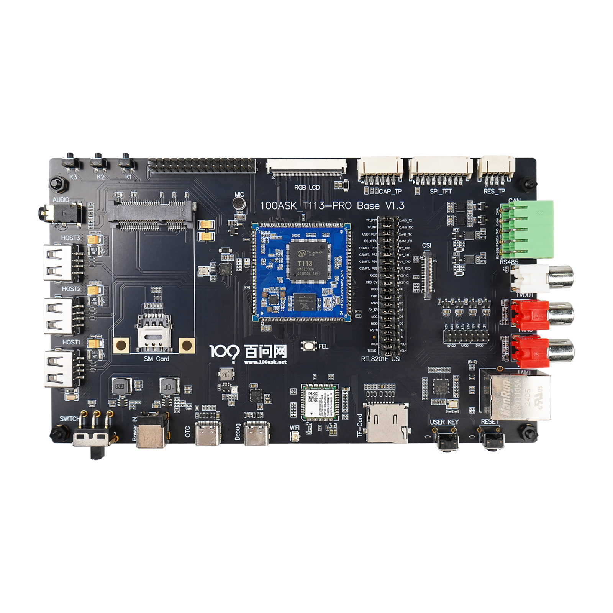

# T113s4-SdNand介绍

## T113s4 芯片介绍

### 芯片特性

T113s4 是基于全志科技 T113s3 的升级版本，在原有双核 Cortex-A7 的基础上**增加了一颗 C906 RISC-V 异构核心**，适合需要异构计算、大内存、多媒体应用的场景。

| 项目 | 规格 |
|:---|:---|
| **CPU** | 双核 ARM Cortex-A7（1.2GHz） + C906 RISC-V 核心 |
| **内存** | **256MB DDR3**（T113s3 为 128MB） |
| **DSP** | HiFi4 DSP |
| **视频解码** | H.265/H.264/MPEG-1/2/4/JPEG/VC1，最高 1080p@60fps |
| **视频编码** | JPEG/MJPEG 最高 1080p@60fps |
| **显示输出** | RGB LCD / Dual-link LVDS / 4-lane MIPI DSI / CVBS |
| **视频输入** | 8-bit 并行 CSI / CVBS IN |
| **音频** | 2 DAC + 3 ADC，I2S/PCM/DMIC/OWA |
| **连接性** | USB2.0 DRD + USB2.0 Host / SDIO 3.0 / SPI / UARTx6 / TWIx4 / PWM / GPADC / IR |
| **网络** | 10/100/1000M EMAC（RMII / RGMII） |
| **封装** | eLQFP128, 14mm x 14mm |

### 架构图



### 典型应用

T113s4 适用于：智慧城市、智能商显、智能家电、工业控制、教育科研等领域，特别适合需要 **异构计算**（ARM + RISC-V）和 **大内存** 的场景。

---

## 开发板介绍

百问网 T113s4-SdNand 开发板采用全志 T113s4 主控，集成 **256MB DDR3 内存** + **C906 RISC-V 异构核心**，板载 **4GB SDNAND** 存储，可选 **WiFi4（XR829）** 或 **WiFi6（AIC8800D80）** 模组。

底板规格与 T113s3-PRO V1.3 一致，支持 CVBS、CAN、RS485 等丰富接口。

软件系统使用 **Tina5 V1.2 SDK**（Buildroot 构建系统）。


### 接口说明


| 编号 | 接口名称 | 说明 |
|:---:|:---|:---|
| ① | OTG 烧录接口 | Type-C，用于系统烧录和 ADB 调试 |
| ② | 串口/供电接口 | Type-C，用于串口调试和 12V 电源输入 |
| ③ | 12V 电源接口 | DC 接口，接入 12V 电源适配器 |
| ④ | 电源开关 | 拨动开关，朝右拨动为开机 |
| ⑤ | FEL 按键 | 用于进入 FEL 烧录模式 |
| ⑥ | RESET 按键 | 复位按键 |

---

## 快速入门

### 方式一：OTG + ADB 登录

1. 将 Type-C 线一端连接开发板 `OTG 烧录接口`，另一端连接电脑 USB 接口
2. 开发板接通 OTG 电源线后自动上电启动
3. 参考《启动开发板》章节配置 Windows ADB 工具
4. 打开 CMD 输入 `adb shell` 即可登录系统

### 方式二：串口登录

1. 将 Type-C 线一端连接开发板 `串口/供电接口`，另一端连接电脑 USB 接口
2. 板载红色电源灯亮起表示已通电
3. Windows 设备管理器会多出一个以 `USB-Enhanced-SERIAL CH9102` 开头的串口设备
4. 使用 Putty 或 MobaXterm 串口工具连接（波特率 115200，流控 None）
5. 按下 Enter 键即可进入系统 Shell

> **提示**：系统默认自动登录，无需用户名和密码。

---

## 硬件规格

| 对比项 | 规格 |
|:---|:---|
| **主控芯片** | T113s4（双核 Cortex-A7 + C906 RISC-V） |
| **内存** | 256MB DDR3 |
| **存储** | 4GB SDNAND |
| **WiFi** | 可选 WiFi4（XR829）/ WiFi6（AIC8800D80） |
| **底板接口** | CVBS / CAN / RS485 / USB / 以太网 / RGB LCD / MIPI / HDMI 等 |
| **SDK 版本** | Tina5 V1.2 |


## T113s4-SdNand 开发文档

> 百问网 T113s4-SdNand 开发板，搭载全志 **T113s4** 主控（双核 Cortex-A7 + **C906 RISC-V 异构核心**），**256MB DDR3** 内存，**4GB SDNAND** 存储，使用 **Tina5 V1.2 SDK**（Buildroot）。

---

## 📚 文档导航

| 章节 | 内容 | 适用人群 |
|:---|:---|:---|
| [开发板介绍](./docs/T113s4-SdNand/01-BoardIntroduction) | 芯片特性、开发板接口、快速入门 | 所有用户 |
| [源码工具文档手册](./docs/T113s4-SdNand/02-SourceCodeToolDocumentationManual) | Tina5 SDK 编译、系统打包、固件烧录 | 系统开发者 |
| 基础使用 | WiFi 联网、RS485、CAN、GPADC、以太网、CVBS 摄像头 | 应用开发者 |
| 开发环境 | 主机环境配置、开发环境搭建 | 所有开发者 |
| 应用开发 | Qt 适配、LVGL 移植、LVGL 多媒体播放器 | GUI 开发者 |
| 网络与应用 | 网络配置、多媒体播放器、AIC8800 AP 模式 | 高级用户 |
| 系统开发 | U-Boot 概述、Linux 内核、Buildroot 系统构建、设备树 | 系统/驱动开发者 |

---

## 🗺️ 学习路线

### 🟢 我是新手（零基础）

如果你是嵌入式 Linux 零基础同学，建议按照以下顺序学习：

1. **学习使用 Ubuntu 系统**：[B站教程](https://www.bilibili.com/video/BV1dU4y1D7fz)
2. **学习 Git 工具**：[B站教程](https://www.bilibili.com/video/BV1CL4y1A7YG)
3. **学习 Linux C 编程**：参考小甲鱼课程
4. **学习嵌入式 Linux 基础知识**：[B站教程](https://www.bilibili.com/video/BV1VN4y137Tf)
5. **回到本文档**：从《开发板介绍》开始，完成快速入门 → WiFi 联网 → 基础外设操作

### 🟡 我懂一点 Linux

如果你熟悉 Linux 基本操作，可以直接：

1. **学习 Git 工具**：[B站教程](https://www.bilibili.com/video/BV1CL4y1A7LG)
2. **搭建开发环境**：参考《开发环境》章节
3. **编译 Tina5 SDK**：参考《源码工具文档手册》
4. **学习应用开发**：从外设通信（RS485/CAN/以太网）到 GUI 开发（Qt/LVGL）

### 🔴 我是嵌入式 Linux 老手

如果你已经熟悉嵌入式 Linux 开发，可以深入学习：

- **Tina5 SDK 开发**：Buildroot 系统构建、自定义系统开发
- **Linux 驱动开发**：内核定制、设备树修改
- **C906 RISC-V 异构开发**：利用 T113s4 独有的 RISC-V 核心进行异构编程
- **LVGL 多媒体播放器**：基于 LVGL + TPlayer 实现视频播放器
- **Qt 应用开发**：在嵌入式 Linux 上部署 Qt 应用程序

---

## 🎯 对应工作岗位

| 岗位方向 | 技能要求 | 学习重点 |
|:---|:---|:---|
| **嵌入式 Linux 应用开发** | C/C++ 编程、Linux API、多线程 | WiFi/网络编程、Qt、LVGL、多媒体播放器 |
| **嵌入式 Linux 驱动开发** | C 语言、内核模块、设备树 | Linux 内核定制、U-Boot 移植、设备树修改 |
| **嵌入式系统开发** | Buildroot、交叉编译、系统集成 | Tina5 SDK 构建、系统优化、自定义镜像 |
| **RISC-V 异构开发** | RISC-V 架构、AMP/双系统 | C906 核心编程、异构通信 |

---

## 🚀 快速开始

```
第一步：拿到开发板 → 连接串口/OTG → 登录系统（参考「开发板介绍」）
第二步：连接 WiFi → 测试网络（参考「基础使用 → WiFi联网」）
第三步：搭建开发环境 → 编译 SDK → 烧录固件（参考「开发环境」+「源码工具文档手册」）
第四步：选择方向 → 应用开发 / 驱动开发 / 系统开发 / 异构开发
```

