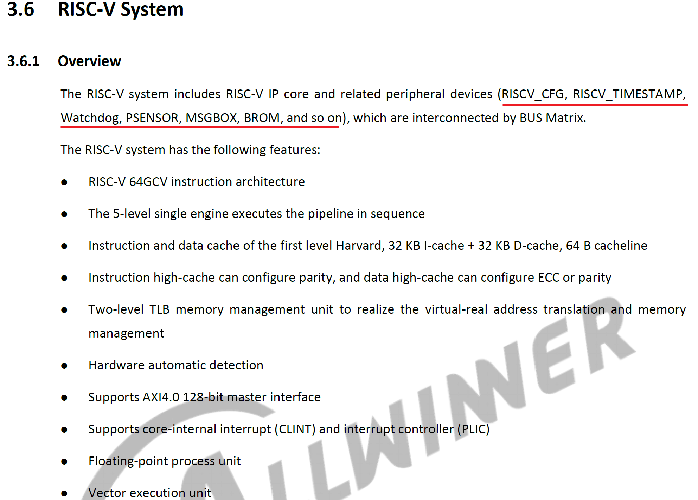
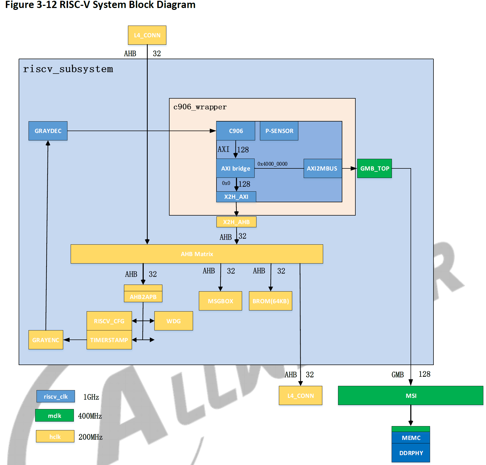
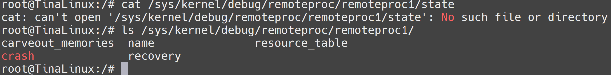
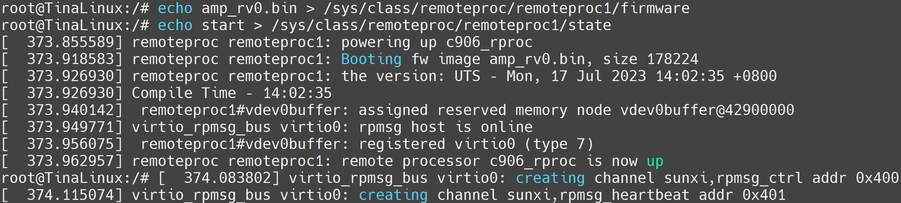
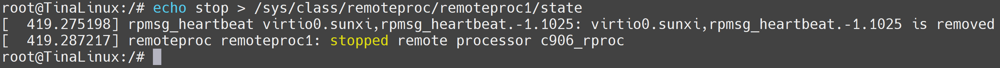
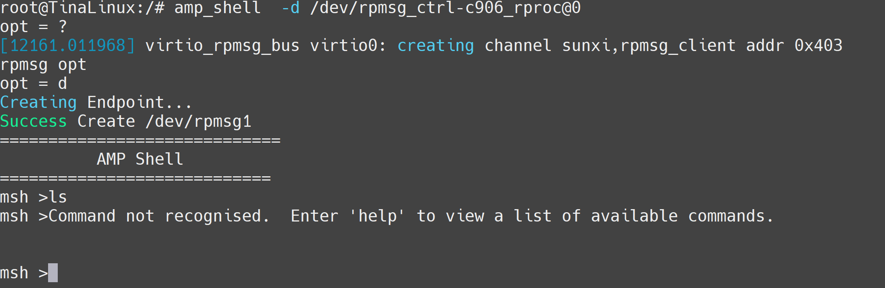
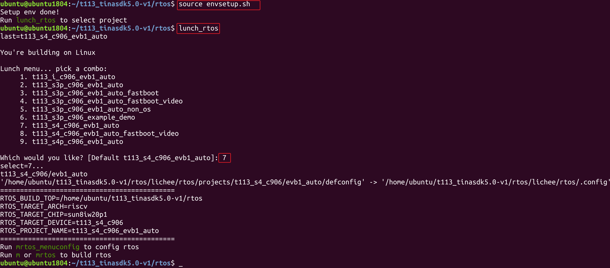

# T113异构简介

T113s4芯片包含四个CPU。两个主核心Arm A7 CPU，运行Tina Linux（全志自研Linux）系统，为芯片主系统；

一个是RISC-V C906辅助CPU，运行RTOS（全志自研RTOS）系统，主要功能是提供通用算力补充、实现实时控制、辅助 Linux 实现快起和低功耗管理等功能。

还有一个是 DSP HIFI4 核心，主要是用来处理音频算法部分，因为这部分编译器需要企业单独申请，所以无法进行开发使用。

## T113家族

> 如下内容摘自 T113x_Datasheet_V1.3.pdf 版本


## T113芯片框图


简单描述


## 异构子系统框架

> 参阅 T113x_User_Manual_V1.2.pdf





 相关内存分布


## MSGBOX 与AMP RPMSG

在 Tina Linux 中，提供 AMP 与 RPMsg 对接 C906

1. Linux remoteproc 管理控制 C907
2. RPMsg 与 C907 通讯

T113 的异构系统通讯在硬件上使用的是 MSGBOX，在软件层面上使用的是 AMP 与 RPMsg 通讯协议。其中 A7 上基于 Linux 标准的 RPMsg 驱动框架，C906基于 OpenAMP 异构通信框架。

T113 所带有的 A7 主核心与 C906 辅助核心是完全不同的两个核心，为了最大限度的发挥他们的性能，协同完成某一任务，所以在不同的核心上面运行的系统也各不相同。这些不同架构的核心以及他们上面所运行的软件组合在一起，就成了 AMP 系统 （Asymmetric Multiprocessing System, 异构多处理系统）。

由于两个核心存在的目的是协同的处理，因此在异构多处理系统中往往会形成 Master - Remote 结构。主核心启动后启动从核心。当两个核心上的系统都启动完成后，他们之间就通过 IPC（Inter Processor Communication）方式进行通信，而 RPMsg 就是 IPC 中的一种。

在AMP系统中，两个核心通过共享内存的方式进行通信。两个核心通过 AMP 中断来传递讯息。内存的管理由主核负责。


AMP 系统在每个通信方向上都有两个缓冲区，分别是 `USED` 和 `AVAIL`，这个缓冲区可以按照 RPMsg 中消息的格式分成一块一块链接形成一个环。


当主核需要和从核进行通信的时候可以分为四步：

（1）主核先从USED中取得一块内存（Allocate）

（2）将消息按照消息协议填充

（3）将该内存链接到 AVAIL 缓冲区中（Send）

（4）触发中断，通知辅助核有消息处理


反之，从核需要和主核通信的时候也类似：

（1）从核先从AVAIL中取得一块内存（Allocate）

（2）将消息按照消息协议填充

（3）将该内存链接到 USED 缓冲区中（Send）

（4）触发中断，通知主核有消息处理。


RPMSG 协议

既然 RPMsg 是一种信息交换的协议，与TCP/IP类似，RPMsg 协议也有分层，主要分为三层，分别是传输层、MAC层和物理层。


其中 MAC层 的 VirtIO 是一种I/O 半虚拟化解决方案，是一套通用 I/O 设备虚拟化的程序，是对半虚拟化 Hypervisor 中的一组通用 I/O 设备的抽象。 提供了一套上层应用与各 Hypervisor 虚拟化设备之间的通信框架和编程接口，减少跨平台所带来的兼容性问题，大大提高驱动程序开发效率。

RPMsg 总线上的消息都具有以下结构，包含消息头和数据两个固定的部分，该消息格式的定义位于`drivers/rpmsg/virtio_rpmsg_bus.c`中，具体定义如下：

```c
struct rpmsg_hdr {
    u32 src;
    u32 dst;
    u32 reserved;
    u16 len;
    u16 flags;
    u8 data[];
} __packed;
```

## 异构系统控制

在异构系统中，不止需要消息的传输，还需要相关控制。例如主核对辅助核心的开启，加载固件，关闭等等。这就需要用到 remoteproc 框架。

remoteproc 框架支持对不同平台，不同架构的处理器进行控制，可以监控辅助核心的运行情况。

对于 T113 来说，remoteproc 用于对 C906 进行生命周期管理，一般来说包含有加载固件、 检测远端处理器是否崩溃等功能。它在加载远端处理器的固件时，会根据固件中定义的 resource table 来申请资源，并创建 VirtIO 设备。

`remoteproc` 框架抽象出硬件差异，允许不同的平台/架构来控制（开机、加载固件、关机）这些远程处理器，此外，还为支持这种通信的远程处理器添加了 `rpmsg` `virtio` 设备。这样，特定平台的 `remoteproc` 驱动程序只需要提供一些低级处理程序，然后所有 `rpmsg` 驱动程序就可以正常工作。

作用：

- 从文件系统加载固件
- 准备远程处理器所需资源
- 注册一个 `rpmsg virtio` 设备
- 提供对要提供对远程处理器的生命周期进行管理


所以固件的加载流程大致如下：

```
1. 加载固件
   1. 调用 firmware 接口获取文件系统中的固件
   2. 解析固件的 resource_table 段，该段有如下内容
      1. 声明需要的内存（Linux 为其分配）
      2. 声明使用的 vdev（固定为一个）
      3. 声明使用的 vring（固定为两个）
   3. 将固件加载到指定地址
2. 注册 rpmsg virtio 设备
   1. 提供 vdev->ops（基于 virtio 接口实现的）
   2. 与 rpmsg_bus 驱动匹配，完成 rpmsg 初始化
3. 启动小核
   1. 调用 rproc->ops->start
```


## Linux内核配置

首先需要配置设备树，预留 C906 核心内存，`buffer` 内存，`vring` 内存等。并正确配置 `rproc` 与 `rpbuf`，也不要忘记配置 `firmware-name`，下面的配置是T113默认提供的示例 为测试固件所使用的地址。不同的固件地址可能不同。

``` bash
reserved-memory {
		#address-cells = <2>;
		#size-cells = <2>;
		ranges;

		/* c906 */
		c906_ddr: c906_ddr@42300000 {
			reg = <0x0 0x42300000 0x0 0x00600000>;
			no-map;
		};
		/*
		 * The name should be "vdev%dbuffer".
		 * Its size should be not less than
		 *     RPMSG_BUF_SIZE * (num of buffers in a vring) * 2
		 *   = 512 * (num of buffers in a vring) * 2
		 */
		rv_vdev0buffer: vdev0buffer@42900000 {
			compatible = "shared-dma-pool";
			reg = <0x0 0x42900000 0x0 0x40000>;
			no-map;
		};

		/*
		 * The name should be "vdev%dvring%d".
		 * The size of each should be not less than
		 *     PAGE_ALIGN(vring_size(num, align))
		 *   = PAGE_ALIGN(16 * num + 6 + 2 * num + (pads for align) + 6 + 8 * num)
		 *
		 * (Please refer to the vring layout in include/uapi/linux/virtio_ring.h)
		 */
		rv_vdev0vring0: vdev0vring0@42940000 {
			reg = <0x0 0x42940000 0x0 0x2000>;
			no-map;
		};
		rv_vdev0vring1: vdev0vring1@42942000 {
			reg = <0x0 0x42942000 0x0 0x2000>;
			no-map;
		};

		/* dsp0 */
		dsp0ddr: dsp0ddr@42000000 {
			reg = <0x0 0x42000000 0x0 0x00100000>;
			no-map;
		};

		dsp0_rpbuf_reserved: dsp0_rpbuf@42244000 {
			compatible = "shared-dma-pool";
			no-map;
			reg = <0x0 0x42244000 0x0 0x8000>;
		};

		/*
		 * The name should be "vdev%dbuffer".
		 * Its size should be not less than
		 *     RPMSG_BUF_SIZE * (num of buffers in a vring) * 2
		 *   = 512 * (num of buffers in a vring) * 2
		 */
		vdev0buffer: vdev0buffer@42200000 {
			compatible = "shared-dma-pool";
			reg = <0x0 0x42200000 0x0 0x40000>;
			no-map;
		};

		/*
		 * The name should be "vdev%dvring%d".
		 * The size of each should be not less than
		 *     PAGE_ALIGN(vring_size(num, align))
		 *   = PAGE_ALIGN(16 * num + 6 + 2 * num + (pads for align) + 6 + 8 * num)
		 *
		 * (Please refer to the vring layout in include/uapi/linux/virtio_ring.h)
		 */
		vdev0vring0: vdev0vring0@42240000 {
			reg = <0x0 0x42240000 0x0 0x2000>;
			no-map;
		};
		vdev0vring1: vdev0vring1@42242000 {
			reg = <0x0 0x42242000 0x0 0x2000>;
			no-map;
		};

		/*
		* dsp ram addr
		*/
		dsp0dram: dsp0dram@400000 {
			reg = <0x0 0x400000 0x0 0x10000>;
			no-map;
		};
		dsp0iram0: dsp0iram0@420000 {
			reg = <0x0 0x420000 0x0 0x8000>;
			no-map;
		};
		dsp0iram1: dsp0iram1@440000 {
			reg = <0x0 0x440000 0x0 0x8000>;
			no-map;
		};
	};

	mailbox_heartbeat: mailbox_heartbeat@0 {
		compatible = "mailbox-heartbeat";
		rproc-np = <&c906_rproc>;
		mboxes = <&msgbox 6>, <&msgbox 7>;
		mbox-names = "tx", "rx";
		status = "okay";
	};

	dsp0_rproc: dsp_rproc@0 {
		compatible = "allwinner,hifi4-rproc", "simple-bus";
		clock-frequency = <600000000>;
		clocks = <&ccu CLK_PLL_PERIPH0_2X>, <&ccu CLK_DSP>, <&ccu CLK_BUS_DSP_CFG>, <&r_ccu CLK_R_AHB>;
		clock-names = "pll", "mod", "cfg", "ahbs";
		resets = <&ccu RST_BUS_DSP>, <&ccu RST_BUS_DSP_CFG>, <&ccu RST_BUS_DSP_DBG>, <&ccu RST_BUS_MSGBOX1>;
		reset-names = "mod-rst", "cfg-rst", "dbg-rst", "msg-rst";
		reg = <0x0 0x03000008 0x0 0x04>,
		      <0x0 0x01700000 0x0 0x40>;
		reg-names = "sram-for-cpux", "hifi4-cfg";
		mboxes = <&msgbox 0>;
		mbox-names = "arm-kick";
		memory-region = <&dsp0ddr>, <&vdev0buffer>, <&vdev0vring0>, <&vdev0vring1>,
				<&dsp0dram>, <&dsp0iram0>, <&dsp0iram1>;
		memory-mappings =
			/* < DA		len		PA >	*/
			/* local SRAM via external bus */
			< 0x28000	0x20000		0x28000 >,
			/* local SRAM via internal bus */
			< 0x400000	0x10000		0x400000 >,
			< 0x420000	0x8000		0x420000 >,
			< 0x440000	0x8000		0x440000 >,
			/* DDR front 256MB */
			< 0x10000000	0x10000000	0x40000000 >,
			/* local SRAM via internal bus */
			< 0x20028000	0x10000		0x400000 >,
			< 0x20038000	0x8000		0x420000 >,
			< 0x20040000	0x8000		0x440000 >,
			/* DDR front 256MB */
			< 0x30000000	0x10000000	0x40000000 >,
			/* DDR front 1GB */
			< 0x40000000	0x40000000	0x40000000 >,
			/* DDR front 1GB */
			< 0x80000000	0x40000000	0x40000000 >,
			/* DDR front 1GB */
			< 0xC0000000	0x40000000	0x40000000 >;

		id = <0>;
		status = "okay";
	};

	rpbuf_controller0: rpbuf_controller@0 {
		compatible = "allwinner,rpbuf-controller";
		remoteproc = <&dsp0_rproc>;
		ctrl_id = <0>;	/* index of /dev/rpbuf_ctrl */
		//iommus = <&mmu_aw 5 1>;
		memory-region = <&dsp0_rpbuf_reserved>;
		status = "okay";
	};

	rpbuf_sample: rpbuf_sample@0 {
		compatible = "allwinner,rpbuf-sample";
		rpbuf = <&rpbuf_controller0>;
		status = "okay";
	};

	c906_rproc: c906_rproc@0 {
		compatible = "allwinner,c906-rproc";
		clock-frequency = <800000000>;
		clocks = <&ccu CLK_PLL_PERIPH0_800M>, <&ccu CLK_RISCV>, <&ccu CLK_BUS_RISCV_CFG>, <&ccu CLK_RISCV_RST>, <&ccu CLK_BUS_RISCV>;
		clock-names = "pll", "mod", "cfg", "riscv-rst", "riscv-gate";
		resets = <&ccu RST_BUS_RISCV_CFG>, <&ccu RST_BUS_MSGBOX2>;
		reset-names = "cfg-rst", "msg-rst";
		memory-region = <&c906_ddr>, <&rv_vdev0buffer>, <&rv_vdev0vring0>, <&rv_vdev0vring1>;
		reg = <0x0 0x06010000 0x0 0x1000>;
		reg-names = "c906-cfg";
		mboxes = <&msgbox 4>;
		mbox-names = "arm-kick";
		memory-mappings =
			/* DA 	         len         PA */
			/* DDR for c906  */
			< 0x40000000 0x10000000 0x40000000 >;
		firmware-name = "amp_rv0.bin";
		status = "okay";
	};
```

### 配置内核驱动

接下来需要配置 `kernel` 选项，配置驱动。

```c
./build.sh menuconfig
```

并勾选以下驱动：

``` c
> Device Drivers > Mailbox Hardware Support
	--- Mailbox Hardware Support
	< >   Platform MHU Mailbox
	< >   Altera Mailbox
	< >   Mailbox Test Client
	< >   Mailbox Heartbeat driver
	<*>   Allwinner mailbox support
	[ ]     Allwinner mailbox support txdone irq
```

```c
> Device Drivers > Remoteproc drivers
	[*] Support for Remote Processor subsystem
		<*>   Allwinner remoteproc support
		<*>   Allwinner remoteproc hifi4 boot
		<*>   Allwinner remoteproc c906 boot
```

``` c
> Device Drivers > Rpmsg drivers
		< > RPMSG device interface
		< > Qualcomm RPM Glink driver
		-*- sunxi amp msgbox driver
		< > support send dsp standby msg when suspend.
		<*> Virtio RPMSG bus driver
		< > Allwinner rpmsg notify driver
		<*> Allwinnertech RPMSG hearbeat driver
		<*> Allwinner RPMsg tty driver
		< > Allwinner RPMsg client sample
		<*> sunxi rpmsg ctrl driver
		< > Allwinner rpmsg openamp test driver
```


### 加载小核固件

测试固件下载地址： https://github.com/DongshanPI/T113M4-DevKit_TinaSDK5 

烧录启动系统后，可以在 `/sys/kernel/debug/remoteproc/` 节点找到 `remoteproc1`


我们可以使用 `cat` 命令检查小核目前的状况

```c
cat /sys/kernel/debug/remoteproc/remoteproc1/state
```



可以看到提示没有 state 这个节点信息，那么应该是没有默认加载 c906 小核固件。此时我们需要把准备好的固件放置到开发板的 `lib/firmware` 文件夹内。这里我们使用 `adb` 上传小核固件。

然后我们将 c906 固件置于 `firmware` 节点内，并启动固件。

```c
echo amp_rv0.bin > /sys/class/remoteproc/remoteproc1/firmware
echo start > /sys/class/remoteproc/remoteproc1/state
```

此时可以看到 `remoteproc remoteproc1: remote processor c906_rproc is now up`，同时查看状态也显示了 `running`



此时也可以用 `stop` 命令停止小核运行

```c
echo stop > /sys/class/remoteproc/remoteproc1/state
```




### AMP SHELL测试小核

 Linux端提供了进入从核控制台的功能也就是AMP SHELL，可以直接在Linux终端中，通过 amp_shell 命令进入 C906 异构核心。

首先确保C906 小核已经正常启动，之后使用如下命令进入小核 shell 终端。

``` shell
root@TinaLinux:~# amp_shell  -d /dev/rpmsg_ctrl-c906_rproc@0
```

便可以启动小核的固件




## RTOS系统介绍

### 系统架构

RTOS 系统是基于FreeRTOS 内核的软件开发包，包含了系统开发用到的内核源码、驱动、工具、组件与应用程序包。通过Makefile 脚本和Kconfig 配置文件，使得用户可以通过menuconfig 进行个性化裁减，编译出一个可以直接烧写到机器上运行的RTOS 系统软件。


RTOS 系统框图如上图，仅从软件的角度来看，从下至上分为内核层、组件层、应用层三个层次。各层次主要内容如下：

- Kernel：内核层包括FreeRTOS 核心系统、文件系统、网络系统、BSP 驱动等。
-  Component：组件层包括控制台、多媒体、功耗管理、OTA、音频系统、显示系统、图像采集等。
-  APP：应用层包括各种应用demo。

### 目录结构

``` bash
rtos
├── board # 包含各SoC板级配置目录
│ └── t113_s3p_c906 # t113_s3p_c906板级配置目录
│ └── t113_s4_c906 # t113_s4_c906板级配置目录
│ └── t113_s4p_c906 # t113_s4p_c906板级配置目录
│ └── XXX # XXX平台板级配置目录
├── envsetup.sh # SDK环境初始化脚本
├── lichee
│ ├── dsp # DSP FreeRTOS系统
│ ├── rtos # ARM/RISC‑V架构的FreeRTOS系统
│ ├── rtos‑components # FreeRTOS公共组件
│ └── rtos‑hal # BSP驱动
└── tools # 打包相关工具脚本目录
```

所使用RTOS SDK 目录结构如上所示，主要包括如下几个关键目录：

- board：板级配置目录，用于存放芯片方案的配置文件，主要包括系统配置文件sys_config.fex等。
-  lichee/dsp：存 放DSP FreeRTOS 系统、组件、应用。
-  lichee/rtos：存放ARM/RISC‑V 架构FreeRTOS 系统、组件、应用。
-  lichee/rtos‑components：公共组件目录，lichee/dsp 与lichee/rtos 都可以使用该组件。
-  lichee/rtos‑hal：BSP 驱动目录，用于存放各种驱动代码。对lichee/dsp 与lichee/rtos 通用。
-  tools：工具目录，用于存放编译打包相关的脚本、工具等。
- 下面对lichee/rtos、lichee/rtos‑hal 目录进行详细说明。lichee/dsp 目录与lichee/rtos 目录类似，此处不做介绍。

#### lichee/rtos 目录

``` bash
lichee/rtos
├── arch # 处理器架构相关
├── build # 编译临时文件输出目录
├── components # 组件
├── drivers # 驱动
├── include # 头文件
├── kernel # FreeRTOS 内核
├── projects # 方案工程
├── scripts
└── tools # 工具链
```

lichee/rtos 目录主要包括arch（架构相关）、components（组件）、drivers（驱动）、include （头文件）、kernel（内核）、projects（工程）、toos(工具链) 等目录，下面对常用重要目录分别进行介绍。

- arch 目录
  arch 目录主要放置跟SoC 架构相关的内容，每个SoC 单独目录管理，主要包括跟risc‑v 架构相关的ARCH 初始化、中断处理、异常处理、内存映射相关功能的实现。

``` bash
  lichee/rtos/arch/
  ├── common
  └── risc‑v
  ├── arch.mk
  ├── c906
  ├── common
  ├── e906
  ├── includes
  ├── Kconfig
  ├── Makefile
  ├── sun55iw3p1
  └── sun8iw20p1
```

- components 目录
  components 目录包含allwinner 和第三方的组件。

```bash
lichee/rtos/components/
├── aw
│ ├── blkpart
│ ├── bluetooth
│ ├── csi
│ ├── devfs
│ ├── healthd
│ ├── ......
│ ├── watchpoint
│ └── wireless_video
├── common ‑> ../../rtos‑components
└── thirdparty
├── common
├── console
├── cplusplus
├── elmfat
├── finsh_cli
├── ......
└── vfs
```

- drivers 目录
  drivers 目录包含所需的外设驱动，主要包括各外设控制器驱动的具体实现（hal 软连接）以及OSAL 层接口（osal）。

```bash
lichee/rtos/drivers/
├── drv
│ ├── cpufreq
│ ├── leds
│ ├── uart
│ ├── ......
│ └── wireless
├── hal ‑> ../../rtos‑hal/
└── osal
```

- include 目录
  include 目录统一管理各模块提供的数据结构定义及函数声明

```bash
lichee/rtos/include/
├── arch # 架构相关头文件
├── FreeRTOS_POSIX # POSIX头文件
├── ......
└── vsprintf.h
```

- kernel 目录
  kernel 目录主要包含FreeRTOS 的kernel 源码，全志实现的系统功能相关代码。

```bash
lichee/rtos/kernel/
├── FreeRTOS‑orig
│ └── Source
└── Posix
```

- projects 目录
  projects 目录下的每一个子目录代表一个project，实现main 入口，选择不同的project 编译出
  来的bin 具有不同功能，每个project 有独立的FreeRTOSConfig 配置。例如T113，其对应于
  t113_c906 子目录。

```bash
lichee/rtos/projects/
├── Kconfig
├── Makefile
└── t113_c906
├── evb
│ ├── freertos.lds.S
│ ├── ......
│ └── src
│ ├── main.c
│ ├── ......
│ └── FreeRTOSConfig.h
└── Makefile
```

- tools 目录
  - risc‑v 架构这个目录主要包含一些预编译好的交叉编译工具链，目前risc‑v 基于GCC 8.4.0 的交叉编译器。

```bash
xxx@xxx:lichee/rtos/tools$ ./riscv64‑elf‑x86_64‑20201104/bin/riscv64‑unknown‑elf‑gcc ‑‑version
riscv64‑unknown‑elf‑gcc (T‑HEAD RISCV Tools V1.10.2 B20201104) 8.4.0
Copyright (C) 2018 Free Software Foundation, Inc.
This is free software; see the source for copying conditions. There is NO
warranty; not even for MERCHANTABILITY or FITNESS FOR A PARTICULAR PURPOSE.
```

#### lichee/rtos‑hal 目录

> lichee/rtos‑hal 目录为BSP 驱动目录，用于存放各种驱动代码。

lichee/rtos/drivers 目录下的rtos‑hal 子目录软链接到该目录，下面对该目录进行介绍。

```bash
lichee/rtos‑hal
├── hal # BSP驱动代码
├── include # 驱动相关头文件
└── tools
```

lichee/rtos‑hal 目录主要包括hal（BSP 驱动代码）、include（驱动相关头文件）等目录，下面分别对其进行介绍。

- hal 目录
  hal 目录主要包含各外设驱动代码以及驱动测试代码，source 子目录为驱动代码，test 子目录为驱动测试代码。

```bash
lichee/rtos‑hal/hal
  ├── Makefile
  ├── source
  │ ├── ccmu
  │ ├── gpio
  │ ├── ......
  │ ├── uart
  │ └── watchdog
  └── test
  ├── ccmu
  ├── gpio
  ├── ......
  ├── uart
  └── watchdog
```


- include 目录
  include 目录主要包含驱动相关头文件以及系统相关接口头文件。

```bash
  lichee/rtos‑hal/include
  ├── hal
  │ ├── aw‑alsa‑lib
  │ ├── aw_common.h
  │ ├── ......
  │ ├── sunxi_hal_usb.h
  │ ├── sunxi_hal_watchdog.h
  │ └── video
  └── osal
  ├── hal_atomic.h
  ├── hal_cache.h
  ├── ......
  ├── hal_waitqueue.h
  └── hal_workqueue.h
```


## RTOS开发说明

RTOS 环境已集成到Tina Linux 开发环境，通过全志代码服务器对外发布。Tina Linux 开发环境下的rtos 子目录即为RTOS 环境。

Tina 集成了RTOS 的编译、打包功能，而且适用于openwrt、buildroot 等文件系统。这里以T113‑S4 作为例子进行阐述。

### 关联RTOS方案

在BoardConfig.mk 文件配置RTOS 方案名，关键字段为LICHEE_RTOS_PROJECT_NAME:=xxxxx。目前使用**t113_s4_c906_evb1_auto**的RTOS 方案。

开发者可以通过修改LICHEE_RTOS_PROJECT_NAME 字段，更改构建RTOS 方案。进入Tina 的rtos 目录(目录结构如下)，可以查看到支持RTOS 方案。


``` bash
├── board
├── envsetup.sh ‑> tools/scripts/source_envsetup.sh
├── lichee
├── out
└── tools
```

执行以下命令
`source envsetup.sh` # 配置环境变量
`lunch_rtos` # 选择编译方案
我们看到可以选择RTOS 方案，即是LICHEE_RTOS_PROJECT_NAME 字段可以配置的RTOS 方案。

``` bash
1. t113_i_c906_evb1_auto
2. t113_s3p_c906_evb1_auto
3. t113_s3p_c906_evb1_auto_fastboot
4. t113_s3p_c906_evb1_auto_fastboot_video
5. t113_s3p_c906_evb1_auto_non_os
6. t113_s3p_c906_example_demo
7. t113_s4_c906_evb1_auto
8. t113_s4_c906_evb1_auto_fastboot_video
9. t113_s4p_c906_evb1_auto
```



### 编译RTOS方案

重新打开一个终端，避免环境变量冲突，在Tina SDK 根目录中，先选择好整体平台方案。

####  buildroot 方案
1、首先使用如下命令选择整体平台方案
`./build.sh config`
2、然后RTOS 相关操作命令如下
`./build.sh rtos` #单独编译RTOS方案
`./build.sh rtos menuconfig` #修改RTOS配置文件
`./build.sh rtos clean` #清除RTOS编译中间文件

说明: 执行./build.sh 不会编译RTOS


####  openwrt 方案
1、首先使用如下命令选择整体平台方案
`source build/envsetup.sh` #生效环境变量
`lunch` #选择openwrt方案
2、执行`make` 会先编译RTOS，再编译Tina

### 编译快捷命令

在Tina 根目录下，执行了source build/envsetup.sh 后，可以使用RTOS 快捷命令

| 命令             | 命令有效目录        | 作用                  |
| ---------------- | ------------------- | --------------------- |
| mrtos            | Tina 环境下任意目录 | 单独编译RTOS 方案     |
| mrtos menuconfig | Tina 环境下任意目录 | 修改RTOS 配置文件     |
| mrtos clean      | Tina 环境下任意目录 | 清除RTOS 编译中间文件 |
| crtos            | Tina 环境下任意目录 | 进入RTOS 源码目录     |
| crtos‑hal        | Tina 环境下任意目录 | 进入RTOS‑HAL 源码目录 |

然后将Tina 环境重新编译和打包，确保RTOS 编译固件amp_rv0.bin 打包到根文件系统中。

说明 buildroot 需要执行`./build.sh && ./build.sh pack` 命令
说明 openwrt 需要执行`make && pack `命令

打包完成后，生产的固件位于tina5.0/out/t113_s4_linux_evb1_auto_uart0.img，可以使用PhoenixSuit 工具烧录到开发板上。

### RTOS 固件打包

编译完成后， 生成的镜像文件会自动拷贝到对应平台方案中， 并且rt_system.elf 重名为 amp_rv0.bin 。


