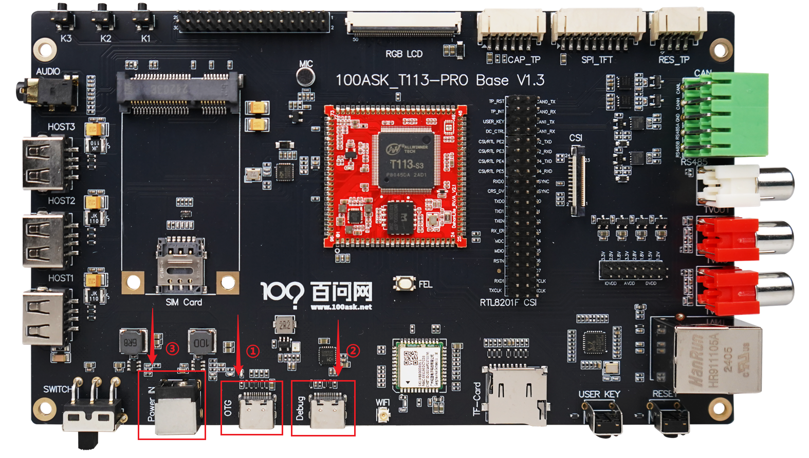
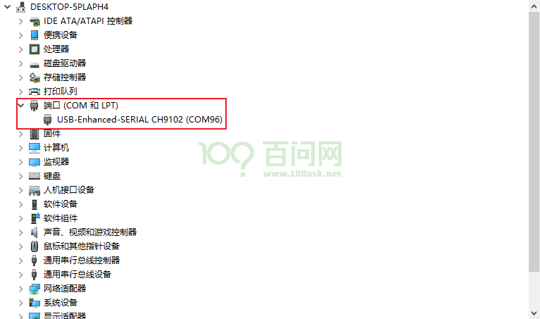
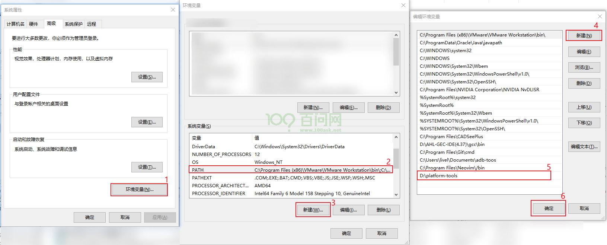

# 快速入门

本章节将指导你快速启动 T113s4-SdNand 开发板并登录系统。

---

## 接口说明



| 编号 | 接口名称 | 说明 |
|:---:|:---|:---|
| ① | OTG 烧录接口 | Type-C，用于系统烧录和 ADB 调试 |
| ② | 串口/供电接口 | Type-C，用于串口调试和 12V 电源输入 |
| ③ | 12V 电源接口 | DC 接口，接入 12V 电源适配器 |
| ④ | 电源开关 | 拨动开关，朝右拨动为开机 |
| ⑤ | FEL 按键 | 用于进入 FEL 烧录模式 |
| ⑥ | RESET 按键 | 复位按键 |

---

## 启动方式

### 方式一：OTG + ADB 登录（推荐）

1. 将 Type-C 线一端连接开发板 **OTG 烧录接口**，另一端连接电脑 USB 接口
2. 开发板接通 OTG 电源线后自动上电启动
3. 配置 Windows ADB 工具（见下方「ADB 工具配置」）
4. 打开 CMD 输入 `adb shell` 即可登录系统

```cmd
C:\Users\MeiHao>adb shell
# ls
THIS_IS_NOT_YOUR_ROOT_FILESYSTEM  opt
bin                               proc
dev                               root
...
```

**文件传输：**
```cmd
adb push badapple.mp4 /mnt/UDISK   # 上传文件到开发板
adb pull /mnt/UDISK/badapple.mp4   # 从开发板下载文件
```

### 方式二：串口登录

1. 将 Type-C 线一端连接开发板 **串口/供电接口**，另一端连接电脑 USB 接口
2. 板载红色电源灯亮起表示已通电
3. Windows 设备管理器会多出一个以 `USB-Enhanced-SERIAL CH9102` 开头的串口设备



4. 使用 Putty 或 MobaXterm 串口工具连接（波特率 115200，流控 None）
5. 按下 Enter 键即可进入系统 Shell

> **提示**：系统默认自动登录，无需用户名和密码。

---

## ADB 工具配置（Windows）

### 1. 下载 ADB 工具

[ADB.7z 下载](https://dl.100ask.net/Hardware/MPU/T113i-Industrial/Tools/ADB.7z)

### 2. 配置环境变量

1. 解压后找到 `platform-tools` 文件夹
2. 复制到任意目录（如 `D:\platform-tools`）
3. 将该路径添加到 Windows 系统环境变量 PATH 中



### 3. 验证安装

打开 CMD 输入 `adb`，能正常输出帮助信息表示配置成功。

---

## 更新系统固件

### 烧录方式一：OTG 烧录

1. 关闭开发板电源
2. 按住 **FEL 按键**不放
3. 打开电源开关，等待 2 秒后松开 FEL 按键
4. 此时开发板进入 FEL 烧录模式
5. 使用全志线刷工具（PhoenixSuit）进行烧录

**烧录工具下载：**
- 全志线刷工具：[AllwinnertechPhoeniSuit](https://dl.100ask.net/Hardware/MPU/T113i-Industrial/Tools/AllwinnertechPhoeniSuit.zip)
- USB 烧录驱动：[AllwinnerUSBFlashDeviceDriver](https://dl.100ask.net/Hardware/MPU/T113i-Industrial/Tools/AllwinnerUSBFlashDeviceDriver.zip)

### 烧录方式二：TF 卡烧录

1. 使用 PhoenixCard 工具将镜像烧录到 TF 卡
2. 插入 TF 卡到开发板
3. 打开电源自动烧录

---

## 下一步

成功登录系统后，你可以：

- 参考《WiFi 联网》章节连接无线网络
- 参考《源码工具文档手册》获取 SDK 并编译
- 参考《HelloWorld 快速入门》编写第一个应用程序
