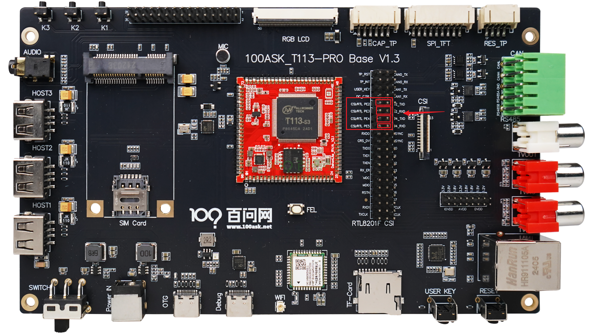

# 以太网测试

本章节将讲解如何在 T113s4-SdNand 开发板上测试以太网功能。

---

## 准备工作

**硬件：**
- T113s4-SdNand 开发板
- USB Type-C 线 ×1（串口/供电）
- 电源适配器（12V）
- 一根能访问外网的网线

**软件：**
- 串口终端工具（Putty、MobaXterm 等）

---

## 硬件连接

以太网引脚与 RS485 引脚共用，需要使用跳线帽切换到以太网模式。

| 跳线帽位置 | 功能 |
|:---:|:---|
| 左侧 | RS485 模式 |
| 右侧 | 以太网模式 |

进行以太网测试前，请确保跳线帽已切换到**右侧**（以太网模式）。



---

## 启用 eth0 接口

### 1. 登录串口终端

参考《快速入门》中的「启动开发板」章节。

### 2. 查看网络接口

```bash
ifconfig -a
```

确认存在 `eth0` 接口节点。

### 3. 启用 eth0 接口

```bash
ifconfig eth0 up
```

---

## 测试以太网

### 1. 连接网线

将网线插入开发板的以太网接口，串口终端会输出连接信息。

### 2. 获取 IP 地址

```bash
udhcpc -i eth0
```

获取成功示例：

```
udhcpc: started, v1.31.1
udhcpc: sending discover
udhcpc: sending select for 192.168.1.100
udhcpc: lease of 192.168.1.100 obtained, lease time 86400
```

### 3. 测试网络连通性

```bash
ping 192.168.1.1
```

如果网线能访问外网，可以直接 ping 百度：

```bash
ping www.baidu.com
```

能收到回复表示以太网接口工作正常。

---

## 常见问题

| 问题 | 解决方法 |
|:---|:---|
| eth0 不存在 | 检查跳线帽是否切换到以太网模式 |
| 获取不到 IP | 确认网线另一端连接的路由器 DHCP 已开启 |
| ping 不通 | 检查网线和网络连接 |
